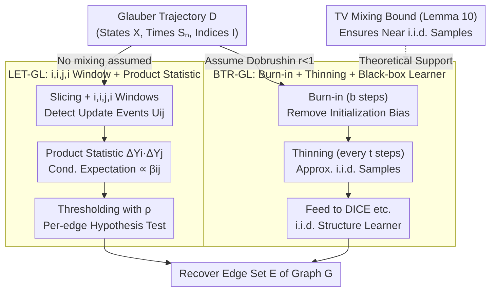

# Local and Mixing-Based Algorithms for Gaussian Graphical Model Selection from Glauber Dynamics

**Conference**: ICML 2026  
**arXiv**: [2412.18594](https://arxiv.org/abs/2412.18594)  
**Code**: Not yet released  
**Area**: Probabilistic Graphical Models / Structure Learning / Glauber Dynamics  
**Keywords**: Gaussian Graphical Model, Glauber Dynamics, Dobrushin Condition, Burn-in/Thinning, Total Variation Mixing

## TL;DR
The authors investigate the problem of learning Gaussian Graphical Model (GGM) structures from a single Gaussian Glauber dynamics trajectory for the first time. They propose two complementary algorithms: LET-GL (local edge detection based on $i,i,j,i$ windows, perfectly parallelizable) and BTR-GL (de-correlating the trajectory into approximate i.i.d. samples under the Dobrushin condition via burn-in/thinning for off-the-shelf i.i.d. learners). The paper provides finite-sample recovery guarantees, an information-theoretic lower bound, and an independently useful TV mixing upper bound for the random-scan Gaussian Gibbs sampler.

## Background & Motivation

**Background**: GGM structure learning has long assumed i.i.d. samples—penalized likelihood (GLASSO), neighborhood regression (Meinshausen-Bühlmann), and information-theoretically optimal DICE are all built on this assumption. However, many real-world datasets originate from dynamical processes: infectious diseases, coordination games, or intermediate MCMC outputs—where i.i.d. samples do not exist.

**Limitations of Prior Work**: (1) While Bresler 2014 pioneered learning Ising models from Glauber dynamics, Ising variables are bounded ($\{-1,+1\}$), preventing direct application to Gaussian settings; (2) An early version of this work (TRD25) used "$i,j,i$ three-step windows + ratio statistics," but it was pointed out that the numerator and denominator were not independent—the update of $i$ was not decoupled from preceding noise; (3) Existing tools lacked the ability to de-correlate trajectories into i.i.d. samples for high-dimensional TV bounds.

**Key Challenge**: Gaussian variables are unbounded in the real domain, rendering traditional Ising-style "sign flip probability" estimates invalid. Glauber trajectories are strongly correlated, and there was no high-dimensional TV bound (Wasserstein bounds via Kantorovich-Rubinstein cannot reach TV because Gaussian Gibbs kernels are not globally Lipschitz).

**Goal**: (i) Fix the dependency loophole in ratio estimators and provide a valid local edge detection algorithm; (ii) Prove that under the Dobrushin condition, trajectories after burn-in/thinning are close to i.i.d. Gaussian samples in joint TV, reducing dynamical structure learning to the i.i.d. setting; (iii) Prove information-theoretic lower bounds to locate the minimax position of the algorithms.

**Key Insight**: The authors replace the $i,j,i$ window with an $i,i,j,i$ window—inserting an extra $i$ update as a buffer to decouple the final $i$ change from previous noise. They also use a "product" rather than a "ratio" statistic, yielding a controllable estimate with conditional expectation $\beta_{ij}\theta_{jj}^{-1}$. Furthermore, they bridge Wasserstein contraction under the Dobrushin condition to a TV bound using a novel "thresholded Lipschitz" technique.

**Core Idea**: Two routes are equally important—"testify without mixing" (LET-GL) and "reduce to i.i.d. after mixing" (BTR-GL). They offer different trade-offs: the former requires no Dobrushin assumption but has higher sample complexity and perfect parallelism; the latter requires Dobrushin but approaches minimax optimal sample complexity.

## Method

### Overall Architecture
Observe a continuous-time Glauber trajectory $\{\mathbf{Y}^{(t)}\}_{t=0}^T$, where at each time $S_n$, a coordinate $I^{(n)} \in [p]$ is randomly selected and updated according to the conditional Gaussian $\mathcal{N}(\sum_{j\in N(i)} \beta_{ij}X_j^{(n-1)}, \sigma_{X_i|N(i)}^2)$. The dataset is $\mathcal{D} = \{(\mathbf{X}^{(n)}, S_n, I^{(n)})\}_{n=0}^N$. The Goal is to recover the edge set $E$ of the underlying graph $G$. The authors provide two dual routes for the same trajectory: LET-GL does not assume the chain has mixed and performs hypothesis testing for each candidate edge directly on the trajectory; BTR-GL assumes the Dobrushin condition holds, applies burn-in and thinning to obtain samples $\{\mathbf{Y}^{(s)}\}$, and feeds them into i.i.d. learners like DICE. The validity of the reduction route rests on the high-dimensional TV mixing upper bound in Lemma 10.

### Key Designs

**1. LET-GL: $i,i,j,i$ Window + Product Statistic (Local Edge Detection without Mixing)**

The first route performs hypothesis testing for each candidate edge without assuming the chain has mixed. Its time complexity is perfectly parallelizable to $\tilde{\mathcal{O}}(d^2 p)$ per core. The trajectory is sliced into blocks of length $\tau$, subdivided into four windows $W_1, W_2, W_3, W_4$. An update event $U_{ij}^k$ is defined (at least one $i$ update in $W_1, W_2$ without $j$; an update of $j$ without $i$ in $W_3$; and $i$ without $j$ in $W_4$). When $U_{ij}^k \cap Q_{ij}^k$ ("quiet neighbors") occurs, the product of two increments $\Delta Y_i^k \cdot \Delta Y_j^k$ is recorded. Lemma 1 shows its conditional expectation is $|E[\cdot]| \geq |\beta_{ij}|\theta_{jj}^{-1}$ when an edge exists and 0 otherwise. The statistic $T_{ij}=|\frac{1}{k_\max}\sum_k \mathbb{1}_{U_{ij}^k}\Delta Y_i^k \Delta Y_j^k|$ is then thresholded. The key fixes are: replacing $i,j,i$ with $i,i,j,i$ to serve as a buffer for conditional independence, and using products instead of ratios to avoid instability in unbounded domains.

**2. TV Mixing Bound for High-Dimensional Random-Scan Gaussian Gibbs (Lemma 10, Technical Core)**

The second route requires de-correlating the trajectory, which depends on a TV mixing bound. Under the Dobrushin radius $r=\max_i\sum_{j\neq i}|\beta_{ij}|<1$, the bound is $\|K^t(x,\cdot)-\pi\|_\mathrm{TV}\le\varepsilon$ provided

$$t\ge C\cdot\frac{p}{1-r}\log(p^{3/2}/\varepsilon)$$

steps. The mixing time is poly-logarithmic in $p$ when normalized and is independent of the spectral gap or the condition number of $\Theta$. The authors overcome the lack of global Lipschitzness in Gaussian Gibbs kernels by introducing a "thresholded (approximate) Lipschitz" property—where the kernel is Lipschitz on a high-probability set and failures are treated as additive defects.

**3. BTR-GL: Burn-in + Thinning + Black-box i.i.d. Learner**

With Lemma 10, BTR-GL reduces dynamical structure learning to the i.i.d. setting. It discards the first $\mathfrak{b}$ steps and keeps every $\mathfrak{t}$-th sample to obtain $\{\mathbf{Y}^{(s)}\}$. These are treated as approximately i.i.d. samples for learners like DICE. Lemma 10 guarantees that $(\mathbf{Y}^{(0)},\dots,\mathbf{Y}^{(m-1)})$ is $\varepsilon$-close to $\pi^{\otimes m}$ in TV, allowing the $1-\delta$ high-probability guarantees of DICE to carry over. The total observation time is $\mathcal{O}(dp\,\mathrm{polylog}(p/\delta)/(\kappa^2(1-r)))$, where $\kappa=\min_{\{i,j\}\in E}|\beta_{ij}\beta_{ji}|^{1/2}$. While BTR-GL requires the Dobrushin assumption and is serial, it approaches minimax optimality.

## Key Experimental Results

### Main Results (Synthetic d-regular GGM, fixed $\delta$)

| Algorithm | Observation Time Complexity | Dobrushin Req. | Computational Parallelism |
|-----------|-----------------------------|----------------|---------------------------|
| **LET-GL** | $\mathcal{O}(d^3 p\,\mathrm{polylog}\,p / \beta_\min^5)$ | No | Perfect, per-edge $\tilde{\mathcal{O}}(d^2 p)$ |
| **BTR-GL + DICE** | $\mathcal{O}(d p\,\mathrm{polylog}(p/\delta) / (\kappa^2(1-r)))$ | Yes | Inherits DICE $\mathcal{O}(p^{2d+1})$ |
| GLASSO | — | — | $\mathcal{O}(p^3)$ |
| PC algorithm | — | — | $\mathcal{O}(p^{d+2})$ |
| **Lower Bound (Ours)** | $\Omega(d^2 \log p)$ (when $\beta_\min = \Theta(1/d)$) | — | — |

### Key Findings
- **Product Statistics outperform Ratio Statistics**: The $i,i,j,i$ product form fixes dependency issues and is more stable than the ratios used in earlier work.
- **BTR-GL approaches Minimax under Dobrushin**: In the bounded $d$ and constant $1-r$ regime, BTR-GL matches the $\Omega(d^2 \log p)$ lower bound up to poly-log factors.
- **Unique Parallel Advantage of LET-GL**: Every candidate edge is tested independently, allowing for $\binom{p}{2}$ parallel tasks with per-core cost $\tilde{\mathcal{O}}(d^2 p)$, which is impossible for GLASSO/PC.
- **TV Mixing Bound Independence from Condition Number**: Traditional spectral-gap-based mixing times are hampered by $\kappa(\Theta)$; this transport-side approach bypasses it, benefiting high-dimensional sparse GGMs.

## Highlights & Insights
- **The "Buffer Idea" of $i,i,j,i$ Windows**: Using an extra update as an "insulation tape" for conditional independence is an elegant way to purify estimators through update schedule design.
- **Thresholded Lipschitz Innovation**: Formalizing Lipschitzness on high-probability sets with additive defects is a valuable contribution to transport theory for non-globally Lipschitz kernels.
- **Dual Nature of Algorithms**: The local/no-assumption vs. global/Dobrushin-required duality provides a clear roadmap for future dynamical structure learning research.

## Limitations & Future Work
- The sample complexity of LET-GL is quite high with respect to $\beta_\min$ ($5^{th}$ power), leading to long observation times for weak edges.
- BTR-GL relies on the Dobrushin condition $r < 1$, which may fail in dense or strongly coupled GGMs.
- Concrete guides for hyperparameters like burn-in $\mathfrak{b}$ and thinning $\mathfrak{t}$ are missing.
- Evaluation is limited to synthetic d-regular GGMs; real-world performance is yet to be verified.
- BTR-GL's base learner DICE is computationally expensive ($\mathcal{O}(p^{2d+1})$).

## Related Work & Insights
- **vs Bresler 2014**: This work is the Gaussian extension, handling the transition from bounded discrete variables to unbounded continuous variables.
- **vs SWMM26**: Both identified the $i,j,i$ loophole and used $i,i,j,i$ windows. SWMM26 used ratios with robust aggregation, while this work uses products with martingale concentration and provides the BTR-GL route.
- **vs DICE (Misra 2020)**: This work extends the capabilities of the information-theoretically optimal DICE to dynamical data.
- **vs Wang 2014/2017**: This work leverages their Wasserstein contraction results and successfully performs the reduction to TV bounds.

## Rating
- Novelty: ⭐⭐⭐⭐⭐ 
- Experimental Thoroughness: ⭐⭐⭐ 
- Writing Quality: ⭐⭐⭐⭐ 
- Value: ⭐⭐⭐⭐ 

<!-- RELATED:START -->

## Related Papers

- [\[ICLR 2026\] Distributed Algorithms for Euclidean Clustering](../../ICLR2026/others/distributed_algorithms_for_euclidean_clustering.md)
- [\[ICML 2025\] Optimal Sensor Scheduling and Selection for Continuous-Discrete Kalman Filtering with Auxiliary Dynamics](../../ICML2025/others/optimal_sensor_scheduling_and_selection_for_continuous-discrete_kalman_filtering.md)
- [\[AAAI 2026\] Reward Redistribution via Gaussian Process Likelihood Estimation](../../AAAI2026/others/reward_redistribution_via_gaussian_process_likelihood_estimation.md)
- [\[ICML 2026\] Learning Permutation-Invariant Macroscopic Dynamics](learning_permutation-invariant_macroscopic_dynamics.md)
- [\[CVPR 2026\] Dynamics: Language-Based Representation for Inferring Rigid-Body Dynamics From Videos](../../CVPR2026/others/dynamics_language-based_representation_for_inferring_rigid-body_dynamics_from_vi.md)

<!-- RELATED:END -->
