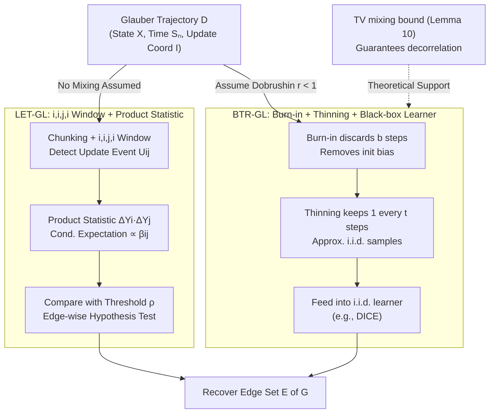

# Local and Mixing-Based Algorithms for Gaussian Graphical Model Selection from Glauber Dynamics

**Conference**: ICML 2026  
**arXiv**: [2412.18594](https://arxiv.org/abs/2412.18594)  
**Code**: Not yet released  
**Area**: Probabilistic Graphical Models / Structure Learning / Glauber Dynamics  
**Keywords**: Gaussian Graphical Model, Glauber Dynamics, Dobrushin Condition, Burn-in/Thinning, Total Variation Mixing

## TL;DR
The authors provide the first study on learning Gaussian Graphical Model (GGM) structures from a single Gaussian Glauber dynamics trajectory. They propose two complementary algorithms: LET-GL (local edge detection based on $i,i,j,i$ windows, perfectly parallelizable) and BTR-GL (decorrelating the trajectory into approximate i.i.d. samples via burn-in/thinning under the Dobrushin condition for consumption by off-the-shelf i.i.d. learners). The work provides finite-sample recovery guarantees, information-theoretic lower bounds, and an independently useful TV mixing upper bound for random-scan Gaussian Gibbs samplers.

## Background & Motivation

**Background**: GGM structure learning has long assumed independent and identically distributed (i.i.d.) samples—penalized likelihood (GLASSO), neighborhood regression (Meinshausen-Bühlmann), and information-theoretically optimal DICE are all built on this assumption. However, many real-world datasets originate from dynamical processes: epidemics, coordination games, or intermediate results of MCMC sampling—where i.i.d. samples simply do not exist.

**Limitations of Prior Work**: (1) Bresler (2014) pioneered learning Ising models from Glauber dynamics, but Ising variables are bounded ($\{-1,+1\}$), which does not directly translate to the Gaussian setting; (2) An earlier version of this work (TRD25) used an "$i,j,i$ three-step window + ratio statistic," but Mahbod Majid pointed out a dependency flaw where the numerator and denominator of the ratio were not independent—the update of $i$ was not decoupled from previous noise, requiring strong assumptions to hold; (3) Attempts to use existing i.i.d. learners (like DICE) lacked the tools to "decorrelate" trajectories into i.i.d. samples.

**Key Challenge**: Gaussian variables are unbounded on the real line, rendering conventional Ising-style "sign flip probability" estimation ineffective. Glauber trajectories are strongly correlated, and high-dimensional TV bounds to convert them to i.i.d. samples were missing (Wasserstein bounds via Kantorovich-Rubinstein fail to reach TV because Gaussian Gibbs transition kernels are not globally Lipschitz).

**Goal**: (i) Fix the dependency flaw in the ratio estimator and provide a truly viable local edge detection algorithm; (ii) Prove that under the Dobrushin condition, burn-in and thinning result in a joint TV closeness between the trajectory and i.i.d. Gaussian samples, thereby reducing dynamical structure learning to the i.i.d. case; (iii) Prove information-theoretic lower bounds to locate the minimax position of the algorithms.

**Key Insight**: The authors replace "$i,j,i$" with "$i,i,j,i$"—inserting an extra $i$ update as a buffer to decouple the subsequent changes in $i$ from the preceding noise. Simultaneously, they employ a "product" rather than a "ratio" statistic, obtaining a controllable estimator with a conditional expectation of $\beta_{ij}\theta_{jj}^{-1}$. Furthermore, they utilize the Wasserstein contraction of Gaussian Gibbs under the Dobrushin condition combined with a novel "thresholded Lipschitz" technique to elevate the Wasserstein bound to a TV bound.

**Core Idea**: Two equally important routes are explored—"testify without mixing" (LET-GL) and "mix first, then reduce to i.i.d." (BTR-GL). The trade-offs are distinct: the former requires no Dobrushin assumption but has higher sample complexity and is perfectly parallelizable; the latter requires Dobrushin but achieves near minimax-optimal sample complexity.

## Method

### Overall Architecture
The algorithm observes a continuous-time Glauber trajectory $\{\mathbf{Y}^{(t)}\}_{t=0}^T$, where at each time $S_n$, a coordinate $I^{(n)} \in [p]$ is randomly selected and updated according to the conditional Gaussian $\mathcal{N}(\sum_{j\in N(i)} \beta_{ij}X_j^{(n-1)}, \sigma_{X_i|N(i)}^2)$. The dataset is $\mathcal{D} = \{(\mathbf{X}^{(n)}, S_n, I^{(n)})\}_{n=0}^N$. The goal is to recover the edge set $E$ of the underlying graph $G$. Two dual routes are proposed for the same trajectory: LET-GL does not assume the chain has mixed and performs hypothesis testing for each candidate edge directly on the trajectory; BTR-GL assumes the Dobrushin condition holds and uses burn-in to discard the first $\mathfrak{b}$ steps and thinning to keep one sample every $\mathfrak{t}$ steps ($\mathbf{Y}^{(s)} := \mathbf{X}^{(\mathfrak{b}+s\mathfrak{t})}$). The "decorrelated" $\{\mathbf{Y}^{(s)}\}$ are then fed into i.i.d. structure learners like DICE. The validity of this reduction hinges on the high-dimensional TV mixing upper bound provided in Lemma 10.

### Key Designs

**1. LET-GL: $i,i,j,i$ Window + Product Statistic (Local Edge Detection Without Mixing)**

The first route bypasses mixing and performs hypothesis testing on each candidate edge, with time complexity perfectly parallelizable to $\tilde{\mathcal{O}}(d^2 p)$ per core, comparable to Meinshausen-Bühlmann. The trajectory is divided into $k_\max=\lfloor T/\tau\rfloor$ chunks of length $\tau$, each subdivided into $W_1, W_2, W_3, W_4$. An update event $U_{ij}^k$ is defined (at least one $i$ update in $W_1, W_2$ with no $j$, an update of $j$ in $W_3$ without $i$, and an update of $i$ in $W_4$ without $j$). When $U_{ij}^k\cap Q_{ij}^k$ ("quiet neighbors") occurs, the product of two increments $\Delta Y_i^k\cdot\Delta Y_j^k$ is recorded. Lemma 1 shows its conditional expectation satisfies $|E[\cdot]|\ge |\beta_{ij}|\theta_{jj}^{-1}$ if an edge exists, and 0 otherwise. Thus, the statistic $T_{ij}=|\frac{1}{k_\max}\sum_k \mathbb{1}_{U_{ij}^k}\Delta Y_i^k \Delta Y_j^k|$ is compared against threshold $\rho$. Two key improvements: replacing $i,j,i$ with $i,i,j,i$ provides a "buffer" so the final change in $i$ is conditionally independent of previous $i$ noise—fixing the prior dependency flaw. Using products instead of ratios prevents instability in the unbounded Gaussian domain.

**2. TV Mixing Bound for High-Dimensional Random-Scan Gaussian Gibbs (Lemma 10, Technical Core)**

The second route requires decorrelating the trajectory into i.i.d. samples, a step that relies on a TV mixing bound. The result states that under Dobrushin radius $r=\max_i\sum_{j\neq i}|\beta_{ij}|<1$, reaching $\|K^t(x,\cdot)-\pi\|_\mathrm{TV}\le\varepsilon$ requires:

$$t\ge C\cdot\frac{p}{1-r}\log(p^{3/2}/\varepsilon)$$

steps. The normalized mixing time is only poly-logarithmic in dimension $p$ and independent of the spectral gap or the condition number of $\Theta$. Since Gaussian Gibbs kernels are not globally Lipschitz, standard TV reduction fails. The authors introduce a "thresholded (approximate) Lipschitz" property—where the smoothed kernel is Lipschitz on a high-probability set, with the failure event appearing as an explicit additive defect. This, combined with burn-in/thinning decomposition and known Wasserstein contraction, yields the joint TV closeness between the subsampled trajectory and $\pi^{\otimes m}$.

**3. BTR-GL: Burn-in + Thinning + Black-box i.i.d. Learner**

Enabled by Lemma 10, BTR-GL reduces dynamical structure learning to the i.i.d. setting: discard the first $\mathfrak{b}$ steps to remove initialization bias, then retain a sample $\mathbf{Y}^{(s)}$ every $\mathfrak{t}$ steps. The resulting $\{\mathbf{Y}^{(s)}\}$ are treated as approximate i.i.d. Gaussian samples for learners like DICE. Lemma 10 guarantees $\varepsilon$-closeness in TV between $(\mathbf{Y}^{(0)},\dots,\mathbf{Y}^{(m-1)})$ and $\pi^{\otimes m}$, allowing the $1-\delta$ high-probability guarantees of DICE to carry over, with $\varepsilon$ added to the union bound. Using DICE, the total observation time is $\mathcal{O}(dp\,\mathrm{polylog}(p/\delta)/(\kappa^2(1-r)))$, where $\kappa=\min_{\{i,j\}\in E}|\beta_{ij}\beta_{ji}|^{1/2}$. This presents a sharp duality with LET-GL: BTR-GL requires Dobrushin and is serial but approaches the minimax lower bound; LET-GL is parallelizable and makes no mixing assumptions but has higher sample complexity.

### Loss & Training
This is a theoretical and algorithmic paper without traditional training. Key hyperparameters for LET-GL are $\tau$ (window length, balancing $\mathbb{P}[U_{ij}^k]$ and $\mathbb{P}[Q_{ij}^k]$) and $\rho$ (edge threshold). The algorithm introduces a high-probability bounded event $B_\delta = \{\max |Y_i^{(t)}| \leq y_\max\}$, where $y_\max = C_1 \sigma_\max\sqrt{\log(p/\delta)}$, ensuring the test statistics are almost surely bounded $|T_{ij}^k| \leq 4 y_\max^2$ under conditional probability, allowing the use of martingale concentration inequalities.

## Key Experimental Results

### Main Results (Synthetic d-regular GGM, fixed $\delta$)

| Algorithm | Observation Time Complexity | Dobrushin Needed | Parallelism |
|:---|:---|:---|:---|
| **LET-GL** | $\mathcal{O}(d^3 p\,\mathrm{polylog}\,p / \beta_\min^5)$ | No | Perfect, $\tilde{\mathcal{O}}(d^2 p)$ per edge |
| **BTR-GL + DICE** | $\mathcal{O}(d p\,\mathrm{polylog}(p/\delta) / (\kappa^2(1-r)))$ | Yes | Inherits DICE $\mathcal{O}(p^{2d+1})$ |
| GLASSO | — | — | $\mathcal{O}(p^3)$ |
| PC algorithm | — | — | $\mathcal{O}(p^{d+2})$ |
| Meinshausen neighborhood | — | — | Per-node parallel |
| **Lower Bound (Ours)** | $\Omega(\log(p-d)/\beta_\min^2)$; $\Omega(d^2 \log p)$ if $\beta_\min = \Theta(1/d)$ | — | — |

### Theoretical Comparisons

| Key Theorem | Content | Significance |
|:---|:---|:---|
| Theorem 1 | LET-GL recovers $E$ w.h.p. at $T = \mathcal{O}(d^3 p\,\mathrm{polylog}\,p / \beta_\min^5)$ | Provable guarantee without mixing |
| Lemma 10 | TV mixing time for random-scan Gaussian Gibbs is $\tilde{\mathcal{O}}(p/(1-r))$ | Indep. of condition number; MCMC value |
| BTR-GL Theorem | $T = \mathcal{O}(dp/(\kappa^2(1-r)))$ + polylog suffices | Near minimax optimal for specific cases |
| Info-theoretic Lower Bound | Any algorithm requires $T \geq \Omega(\log(p-d)/\beta_\min^2)$ | Defines the limits of the problem class |

### Key Findings
- **Product Statistics Outperform Ratio Statistics**: The $i,j,i$ ratio of early TRD25 failed due to dependency; the $i,i,j,i$ product form fixes the dependency and suits the unbounded Gaussian domain.
- **BTR-GL Approaches Minimax Under Dobrushin**: For bounded $d$ and constant $1-r$, BTR-GL's sample complexity matches the $\Omega(d^2\log p)$ lower bound up to polylog factors.
- **Unique Parallel Advantage of LET-GL**: Each candidate edge is independent; $\binom{p}{2}$ edges can be tested across $\binom{p}{2}$ cores with a per-core cost of $\tilde{\mathcal{O}}(d^2 p)$, which GLASSO or PC cannot achieve.
- **Condition-Number Independent TV Mixing**: Unlike spectral gap methods, this transport-side approach bypasses $\kappa(\Theta)$, making it particularly useful for high-dimensional sparse GGMs.

## Highlights & Insights
- **The "Buffer" Idea in $i,i,j,i$ Windows**: Inserting an extra update as an "insulating layer" to achieve conditional independence is an elegant way to purify estimators through update schedule design.
- **Thresholded Lipschitz as a Transport Innovation**: Formalizing Lipschitzness on a high-probability set with an additive defect provides a pathway for TV mixing analysis of non-globally Lipschitz kernels.
- **Local/Global Duality**: The contrast between "testify before mixing" (local, no assumptions, high complexity) and "reduce after mixing" (global, requires Dobrushin, low complexity) provides a valuable framework for dynamical structure learning.

## Limitations & Future Work
- LET-GL has a high polynomial dependence on $\beta_\min$ (power of 5), causing observation time to explode for weak edges.
- BTR-GL assumes Dobrushin $r < 1$, which fails in dense or strongly coupled GGMs; mixing analysis under weaker conditions is needed.
- The constant $C$ in the TV mixing bound is not explicitly given, requiring empirical tuning for burn-in and thinning.
- Lack of real-world dataset experiments; performance in finance or neuroscience remains to be verified.
- No treatment of mis-specification—behavior remains unknown if data is not generated by a Gaussian Glauber process.

## Related Work & Insights
- **vs. Bresler 2014 (Ising from Glauber)**: This work is the Gaussian extension, handling unbounded continuous variables via high-probability bounded events $B_\delta$ and martingale techniques.
- **vs. SWMM26 (Shen-Wu-Majid-Moitra concurrent work)**: Both identify the $i,j,i$ flaw and adopt $i,i,j,i$ windows. SWMM26 uses ratios and robust aggregation; this work uses products and provides the additional BTR-GL route under Dobrushin.
- **vs. DICE (Misra 2020)**: DICE is information-theoretically optimal for i.i.d. GGMs; this work extends DICE's utility to dynamical data.
- **vs. Meinshausen-Bühlmann**: While MB uses Lasso for per-node regression, LET-GL performs per-edge testing; both share parallel paradigms, but this work removes the i.i.d. requirement.

## Rating
- Novelty: ⭐⭐⭐⭐⭐ First GGM structure learning from Gaussian Glauber with lower bounds and a new TV mixing bound.
- Experimental Thoroughness: ⭐⭐⭐ Synthetic experiments validate theory, but lacks real-world data application.
- Writing Quality: ⭐⭐⭐⭐ Transparently addresses previous flaws and provides clear proof sketches.
- Value: ⭐⭐⭐⭐ Significant progress for the graphical model community with independently useful MCMC results.

<!-- RELATED:START -->

## Related Papers

- [\[ICLR 2026\] Distributed Algorithms for Euclidean Clustering](../../ICLR2026/others/distributed_algorithms_for_euclidean_clustering.md)
- [\[ICML 2025\] Optimal Sensor Scheduling and Selection for Continuous-Discrete Kalman Filtering with Auxiliary Dynamics](../../ICML2025/others/optimal_sensor_scheduling_and_selection_for_continuous-discrete_kalman_filtering.md)
- [\[AAAI 2026\] Reward Redistribution via Gaussian Process Likelihood Estimation](../../AAAI2026/others/reward_redistribution_via_gaussian_process_likelihood_estimation.md)
- [\[ICML 2026\] Learning Permutation-Invariant Macroscopic Dynamics](learning_permutation-invariant_macroscopic_dynamics.md)
- [\[ICML 2026\] Multi-Level Strategic Classification: Incentivizing Improvement Through Promotion and Relegation Dynamics](multi-level_strategic_classification_incentivizing_improvement_through_promotion.md)

<!-- RELATED:END -->
