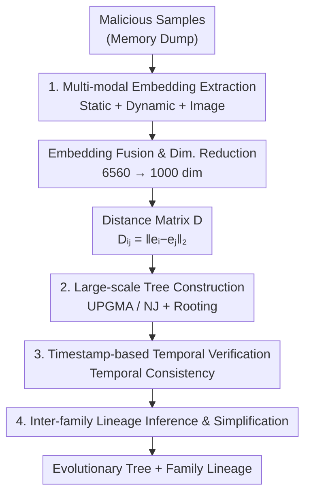

# MalTree: Tracing Malware Evolution from Embeddings at Scale

**Conference**: ICML2026  
**arXiv**: [2606.06570](https://arxiv.org/abs/2606.06570)  
**Code**: [github.com/AJ730/MalwareEvolution](https://github.com/AJ730/MalwareEvolution)  
**Area**: Security / Applications of Representation Learning  
**Keywords**: Malware Evolution, Phylogenetic Trees, Multi-modal Embeddings, Temporal Verification, Lineage Analysis

## TL;DR
MalTree transposes phylogenetic tree techniques from bioinformatics (UPGMA, Neighbor-Joining) to malware analysis. It extracts static, dynamic, and image-based tri-modal embeddings from memory dumps to reconstruct "evolutionary trees" for malware families at scale. Utilizing VirusTotal timestamps for the first temporal verification (achieving 87% temporal consistency), it demonstrates on 100k+ samples and 538 families that embedding distances approximate real evolutionary sequences, shifting malware analysis from "per-sample classification" toward "lineage-aware evolutionary modeling."

## Background & Motivation
**Background**: Malware detection, whether based on signatures, features, or deep learning, is essentially **reactive**. Models trained on known samples gradually fail and suffer performance decay (concept drift) once threats evolve via encryption, packing, obfuscation, or metamorphic recompilation. The emergence of LLM-generated evasive code (e.g., WormGPT) intensifies this arms race.

**Limitations of Prior Work**: The "per-sample" perspective ignores a critical fact: malware variants rarely appear out of vacuum. They inherit code from predecessors, share build toolkits, and form **lineages** through iterative modifications. Traditional reverse engineering requires months or years to reveal these relationships.

**Key Challenge**: Phylogenetics, a method for reconstructing ancestral relationships from measurable "divergence," is naturally isomorphic to the process of malware evolution through code reuse and modular propagation. However, it has been largely neglected in malware analysis. Prior attempts used limited modalities or small datasets for tree clustering, or used Minimum Spanning Trees as proxies **without temporal verification**. Consequently, the fundamental question remains: do inferred trees reflect real appearance timelines or merely capture feature similarity?

**Goal**: ① Automatically construct phylogenetic trees from malware samples at scale; ② Verify whether these trees reflect real evolutionary sequences; ③ Infer interpretable family-level evolutionary relationships.

**Core Idea**: Each sample is encoded as a vector using multi-modal embeddings and converted into a distance matrix. Phylogenetic trees are reconstructed using distance-based methods (UPGMA/NJ). VirusTotal first-submission timestamps serve as proxies for "appearance time" to define a **temporal consistency score**, testing whether the tree's directionality holds.

## Method

### Overall Architecture
MalTree consists of a four-stage pipeline: First, it extracts three complementary embeddings (pseudo-static, dynamic, and image) from the **memory dump** of each sample, fused and reduced to 1000 dimensions. Second, it calculates pairwise Euclidean distances to obtain a distance matrix $D$. Third, it reconstructs phylogenetic trees using UPGMA and Neighbor-Joining. Finally, it performs temporal verification using VirusTotal timestamps and infers evolutionary directions between families. Memory dumps are analyzed instead of raw binaries because original files are often packed/obfuscated, whereas memory contains decrypted code and runtime states.

### Key Designs

**1. Multi-modal Embeddings on Memory Dumps: Static + Dynamic + Image Features**

Single modalities (e.g., pure byte images) are sensitive to packing/compilation methods, where high reported accuracy often stems from dataset artifacts rather than semantics. MalTree executes samples in controlled VMs and extracts three complementary embeddings from **memory dumps**: ① **Pseudo-static** $e_s\in\mathbb{R}^{3512}$—27 types of features extracted via LIEF (byte histograms, entropy, strings, headers, sections, imports/exports, opcodes), serialized to JSON and processed by OpenAI's `text-embedding-3-large`. ② **Dynamic** $e_d\in\mathbb{R}^{1000}$—15 types of behavioral traces (files, commands, processes, registry, services, network, mutexes) from ANY.RUN and VirusTotal, processed by the same text embedding model. ③ **Image** $e_i\in\mathbb{R}^{2048}$—Memory dumps mapped to RGB via bin2png, with ResNet-50 trained in two stages (pre-trained on MalImg/MaleVis/MalNet, then fine-tuned). The fused 6560-dim vector is passed through a two-layer network to reduce dimensionality to 1000. $e_s$ encodes syntax, $e_d$ captures behavior, and $e_i$ reflects byte-level patterns.

**2. Large-scale Tree Construction: Reconstructing Lineages via UPGMA and Neighbor-Joining**

Character-based methods (maximum parsimony/likelihood) require sequence alignment and do not scale beyond thousands of samples. MalTree utilizes distance-based methods. With each sample represented as embedding $e_i$, the distance matrix $D_{ij}=\|e_i-e_j\|_2$ assumes that embedding distance approximates evolutionary divergence. **UPGMA** merges clusters with the closest average distance $d(C_i,C_j)=\frac{1}{|C_i||C_j|}\sum_{s_p\in C_i}\sum_{s_q\in C_j}D_{pq}$, producing an $O(n^2)$ rooted ultrametric tree, assuming a **molecular clock** (constant rate of evolution). **Neighbor-Joining (NJ)** relaxes this assumption, allowing heterogeneous rates. Starting from a star topology, it merges nodes based on the Q-matrix $Q_{ij}=(r-2)D_{ij}-\sum_k D_{ik}-\sum_k D_{jk}$. RapidNJ achieves near $O(n^2)$ complexity, producing unrooted trees requiring external rooting (e.g., using the earliest sample as an outgroup).

**3. Temporal Verification: Validating Evolutionary Order with VirusTotal Timestamps**

Standard bioinformatics bootstrap resampling assumes site independence, and molecular clock calibration requires known divergence dates—neither of which apply to malware embeddings. MalTree uses VirusTotal **first-submission timestamps** as proxies for appearance time. The core is a **path length hypothesis**: for siblings sharing a direct parent, if $L_i=d_T(s_i,a)<L_j$, then $s_i$ appeared earlier. This requires only **local consistency** within sibling pairs. The **temporal consistency score** is defined as the proportion of sibling pairs where the tree-inferred order matches the timestamp order (random chance is ~50%). For inter-family analysis, the median distance from family leaves to the root is used for comparison.

**4. Inter-family Lineage Inference: Deriving Family-level Evolutionary Directions**

MalTree infers evolutionary relationships between families by finding the shared MRCA for each family pair and calculating the median path distance. A **directed edge** is drawn from the family with the shorter distance (earlier divergence) to the family with the longer distance, with the weight representing the distance to the MRCA. The graph is simplified by keeping only the minimum-weight outgoing edge for each node. Additionally, **embedding drift analysis** is performed: if evolutionary rates were uniform, the min/max drift across years for different families would be consistent; high variance justifies using NJ over UPGMA.

## Key Experimental Results

### Embedding Quality (Family Classification, 10-fold CV)
A logistic regression linear probe measures embedding separability (essential for distance-based phylogenetics):

| Embedding | Accuracy (%) |
|-----------|--------------|
| Image $e_i$ | 94.91 ± 0.16 |
| Fusion $e$ | 93.69 ± 0.19 |
| Pseudo-static $e_s$ | 87.51 ± 0.48 |
| Dynamic $e_d$ | 87.23 ± 0.19 |
| Random Guess | 19.36 ± 0.17 |

Fused embeddings (93.69%) outperform individual static/dynamic ones, indicating the retention of complementary information. Image embeddings alone performed best (94.91%), showing high discriminative power of visual patterns.

### Tree Verification (Temporal Consistency, 103,883 samples)
Comparing two tree-building algorithms across three rooting strategies:

| Method | Default | Outgroup | Midpoint |
|--------|---------|----------|----------|
| NJ | 0.811 | **0.871** | 0.631 |
| UPGMA | **0.860** | 0.601 | 0.562 |

NJ with outgroup rooting achieved the highest temporal consistency (87.1%), confirming that timestamp metadata effectively roots the tree. UPGMA performed best in its default rooted configuration (86.0%). Midpoint rooting performed poorly for both. The 87% score significantly exceeds the 50% random baseline, proving that embedding distances approximate evolutionary divergence.

### Key Findings
- **Highly Non-uniform Evolutionary Rates**: Families like Bashlite and Syslogk show embedding drifts **over 10x higher** than others, violating the UPGMA molecular clock assumption—explaining why NJ outperforms UPGMA when correctly rooted.
- **Consistency is Not a Filtering Artifact**: Removing 5,385 intra-family outliers (from 103,883) only increased consistency from 87.1% to 88.5% (+1.4 points), suggesting the score is robust.
- **Mirai Case Study Alignment**: In the 100k+ sample tree, MalTree identified five Mirai descendants: Bashlite ($w=9.6$), Okiru ($w=10.0$), MooBot, Gafgyt, and RapperBot. This matches public threat intelligence and was cross-validated using Jaccard similarity of import/export symbols (Mirai–Okiru similarity reached 0.82).
- **Unprecedented Scale**: Tree construction for 103,883 samples and 538 families was completed in 11 hours (UPGMA) to 3 days (NJ) on a 20-core machine, representing the largest known malware phylogenetic analysis.

## Highlights & Insights
- **Shifting from "Per-sample" to "Lineage-aware"**: The core contribution is not the embedding itself, but the large-scale reconstruction and **verification** of evolutionary trees, shifting defense from reactive pursuit to proactive anticipation.
- **Temporal Consistency Score Fills the Validation Gap**: In the absence of ground-truth divergence dates or gene sequences, constructing a verifiable metric using timestamps and local sibling consistency is an ingenious adaptation of bioinformatics paradigms for discrete objects in embedding space.
- **Multi-modal Extraction from Memory Dumps**: Extracting features from decrypted runtime states rather than packed binaries bypasses obfuscation at the source.
- **Data-driven Algorithm Selection**: Using embedding drift variance to empirically test the molecular clock hypothesis makes the choice of tree algorithm a verifiable scientific decision.

## Limitations & Future Work
- The assumption that embedding distance approximates evolutionary divergence lacks code-level lineage ground truth. Temporal consistency (87%) relies on VirusTotal timestamps, which are proxies and may lag behind actual release dates.
- Heavy reliance on external services (VirusTotal, ANY.RUN, OpenAI) limits reproducibility and increases cost; dynamic features may fail against environment-aware samples.
- Family labels depend on VirusTotal vendor consensus, which contains noise and naming inconsistencies. Extreme family size imbalance (10 to 5000+) may affect tree topology.
- NJ requires 3 days for 100k samples; scalability for millions of samples and sensitivity to dimensionality reduction/distance metrics require further exploration.

## Related Work & Insights
- **vs. Karim et al. (2005)**: They introduced phylogenetics using sequence alignment but were limited to small samples. MalTree scales to 100k+ samples via embeddings and adds temporal verification.
- **vs. Cozzi et al. (2020)**: They used binary diffing and MST for IoT malware; MalTree constructs rooted phylogenetic trees and provides the first temporal verification.
- **vs. Li et al. (2025)**: They used source code for lineage inference, avoiding disassembly noise but limited to 6,032 GitHub samples. MalTree works directly on 103,883 deployed binaries and recovers lineages (e.g., Mirai/Bashlite) missing from source code corpora.

## Rating
- Novelty: ⭐⭐⭐⭐ First large-scale use of phylogenetic trees for malware with temporal verification.
- Experimental Thoroughness: ⭐⭐⭐⭐ 100k+ samples, multi-modal ablation, and cross-validation via Jaccard similarity.
- Writing Quality: ⭐⭐⭐⭐ Clear analogy between bioinformatics and security; well-structured diagrams.
- Value: ⭐⭐⭐⭐ Provides a framework for proactive, lineage-aware defense with open-source code.

<!-- RELATED:START -->

## Related Papers

- [\[NeurIPS 2025\] Private Evolution Converges](../../NeurIPS2025/others/private_evolution_converges.md)
- [\[ICML 2026\] New Bounds for Kernel Sums via Fast Spherical Embeddings](new_bounds_for_kernel_sums_via_fast_spherical_embeddings.md)
- [\[CVPR 2026\] MSPT: Efficient Large-Scale Physical Modeling via Parallelized Multi-Scale Attention](../../CVPR2026/others/mspt_efficient_large-scale_physical_modeling_via_parallelized_multi-scale_attent.md)
- [\[ICML 2026\] Torus Graphs for Large-Scale Neural Phase Analysis](torus_graphs_for_large_scale_neural_phase_analysis.md)
- [\[ICML 2026\] Polaris: Coupled Orbital Polar Embeddings for Hierarchical Concept Learning](polaris_coupled_orbital_polar_embeddings_for_hierarchical_concept_learning.md)

<!-- RELATED:END -->
