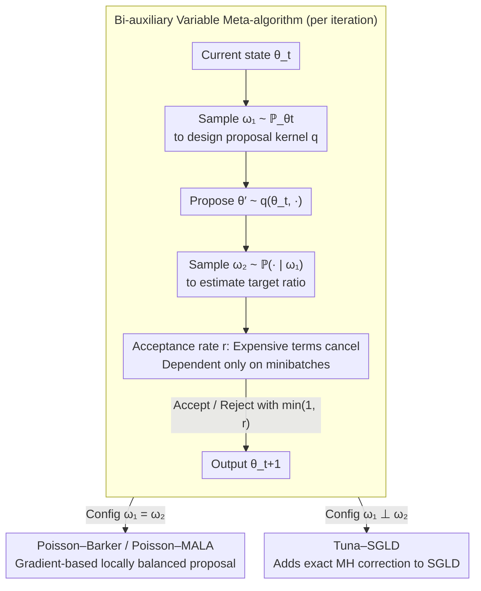

# Markov Chain Monte Carlo without Evaluating the Target: An Auxiliary Variable Approach

**Conference**: ICML 2026 Oral  
**arXiv**: [2406.05242](https://arxiv.org/abs/2406.05242)  
**Code**: https://github.com/ywwes26/Auxiliary-MCMC  
**Area**: Sampling / Bayesian Inference / MCMC  
**Keywords**: Auxiliary variables, minibatch MCMC, gradient-based proposals, doubly-intractable, Peskun ordering  

## TL;DR
The authors unify three categories of "target-free" MCMC—exchange, PoissonMH, and TunaMH—into a meta-algorithm using auxiliary variables. By introducing auxiliary randomness in both the proposal and the acceptance rate, they design gradient-based MCMC methods (Poisson–Barker, Poisson–MALA, Tuna–SGLD) that maintain exact stationary distributions under minibatch data, significantly outperforming baselines such as PoissonMH/TunaMH/SGLD.

## Background & Motivation

**Background**: Sampling from a Bayesian posterior $\pi(\theta\mid x)\propto\pi(\theta)\prod_{i=1}^N \mathsf{p}_\theta(x_i)$ becomes expensive in two scenarios: (1) doubly-intractable models, where the likelihood contains a $\theta$-dependent normalization constant $Z(\theta)$; (2) tall data, where $N$ is extremely large, requiring full data scans at each step. The Exchange algorithm (Murray 2006) handles the former, while PoissonMH (Zhang & De Sa 2019) and TunaMH (Zhang et al. 2020) utilize Poisson minibatches to address the latter.

**Limitations of Prior Work**: These three algorithms appear fragmented—one generates synthetic data to cancel $Z(\theta)$, another decomposes the likelihood into Poisson factors, and the third utilizes minorization tricks. However, they are all restricted to random walk proposals, leading to slow mixing in high dimensions. Conversely, gradient-based methods like MALA/HMC require full data scans, contradicting the goal of scalability. SGLD attempts to bypass the MH step via noisy SGD but suffers from persistent fixed step-size bias; "minibatch-based MH correction" has long been an open problem.

**Key Challenge**: To ensure an exact stationary distribution, traditional MH must compute the expensive ratio $\pi(\theta'\mid x)/\pi(\theta\mid x)$. To achieve scalability, it must only evaluate partial data or synthetic samples. Existing algorithms use tricks like variable swapping, Poisson thinning, or unbiased estimation to avoid the ratio, but each only solves half the problem (either the acceptance rate doesn't evaluate the target, or the proposal doesn't use gradients).

**Goal**: (i) Identify the common structure behind Exchange / PoissonMH / TunaMH; (ii) Extend this structure to allow auxiliary variables in proposals, enabling gradient-based proposals to maintain exact stationary distributions under minibatches; (iii) Establish theoretical frameworks to quantify the gap between the new framework and the "ideal full-data chain."

**Key Insight**: Explicitly decompose the randomness of each MH step into two auxiliary variables $\omega_1$ and $\omega_2$—where $\omega_1$ determines the proposal and $\omega_2$ estimates the target ratio—then unify the proof of detailed balance through the lens of involutive MCMC.

**Core Idea**: Use "cheap estimates" to simultaneously replace all expensive terms in both proposal design and acceptance rate calculation. As long as the joint distribution $\mathbb{P}_{\theta,\theta'}(\omega_1,\omega_2)$ matches the required rules in the acceptance ratio when indices are swapped, $\pi$ remains the invariant distribution.

## Method

### Overall Architecture

The authors first present a **common substructure** in Section 2: any MH step that uses auxiliary variables to replace $\pi(\theta'\mid x)/\pi(\theta\mid x)$ can be written as "sample $\omega\sim P_{\theta\to\theta'}$ → use $R_{\theta\to\theta'}(\omega)$ as the ratio estimate → accept with $\min\{1,r\}$." Proposition 1 provides the necessary and sufficient condition: if $R_{\theta\to\theta'}(\omega)\pi(\theta\mid x)P_{\theta\to\theta'}(\omega)=\pi(\theta'\mid x)P_{\theta'\to\theta}(\omega)$, then $R$ is unbiased relative to the true ratio, and the chain is reversible with respect to $\pi$. Exchange, PoissonMH, and TunaMH all satisfy this.

Section 3 extends this into a "**bi-auxiliary variable meta-algorithm**" (Algorithm 1):

1. Sample $\omega_1 \sim \mathbb{P}_{\theta_t}(\cdot)$ to determine the proposal kernel $q_{\omega_1}(\theta_t,\cdot)$;
2. Propose $\theta' \sim q_{\omega_1}(\theta_t,\cdot)$;
3. Sample $\omega_2 \sim \mathbb{P}_{\theta_t,\theta'}(\cdot \mid \omega_1)$ to estimate the target ratio;
4. Accept with rate $r = \dfrac{\pi(\theta' \mid x)\mathbb{P}_{\theta',\theta_t}(\omega_1,\omega_2)}{\pi(\theta_t \mid x)\mathbb{P}_{\theta_t,\theta'}(\omega_1,\omega_2)} \cdot \dfrac{q_{\omega_1}(\theta', \theta_t)}{q_{\omega_1}(\theta_t, \theta')}$.

Setting $\Omega_1$ or $\Omega_2$ to the singleton space $\mathsf{NULL}$ "disables" the corresponding auxiliary variable: (Null, Null) is standard MH; (Null, present) recovers the Section 2 framework; $\omega_1 = \omega_2$ is auxiliary MH from a Metropolis-within-Gibbs perspective (Titsias & Papaspiliopoulos 2018), corresponding to Poisson–Barker/MALA; $\omega_1 \perp \omega_2$ allows proposal design and ratio estimation to use independent minibatches, corresponding to Tuna–SGLD. Proposition 2 provides a unified proof of detailed balance by treating $(\theta, \omega_1, \theta', \omega_2)$ as an involution $(\theta', \omega_1, \theta, \omega_2)$ in involutive MCMC.

### Key Designs

**1. Bi-auxiliary Variable Meta-algorithm: Coexistence of Gradient Proposals and Minibatch Ratio Estimation**

Existing minibatch MCMC methods are "two-step"—either proposals use gradients but the acceptance rate scans full data, or the acceptance rate uses minibatches but the proposal is restricted to random walks. This paper explicitly writes all randomness as $(\omega_1, \theta', \omega_2)$: $\omega_1$ determines the proposal, $\omega_2$ estimates the target ratio, and they are integrated into an involution $f(\theta, \omega_1, \theta', \omega_2) = (\theta', \omega_1, \theta, \omega_2)$ (Jacobian is 1). The acceptance rate is:

$$r=\frac{\pi(\theta'\mid x)\,\mathbb{P}_{\theta',\theta_t}(\omega_1,\omega_2)}{\pi(\theta_t\mid x)\,\mathbb{P}_{\theta_t,\theta'}(\omega_1,\omega_2)}\cdot\frac{q_{\omega_1}(\theta',\theta_t)}{q_{\omega_1}(\theta_t,\theta')}$$

The key is that if the joint density of $\omega_1, \omega_2$ cancels expensive terms when $(\theta, \theta')$ are swapped—e.g., in PoissonMH, the likelihood part of $\mathbb{P}_\theta(\omega_1)$ is cancelled by $\pi(\theta \mid x)$—the entire $r$ depends only on minibatches.

**2. Poisson–Barker / Poisson–MALA: Implementing Gradient-based Locally Balanced Proposals**

PoissonMH can cancel normalization terms using Poisson minibatches, but its proposal is still a random walk. This corresponds to $\omega_1 = \omega_2$ in the meta-algorithm: sample $\omega_1 = (s_1, \dots, s_N) \sim \bigotimes_i \mathsf{Poi}(\lambda M_i / L + \phi_i(\theta; x))$ to form a minibatch $S = \{i \mid s_i > 0\}$. The proposal uses a one-dimensional decomposition:

$$q_{\omega_1,i}^{(g)}\propto g\big(e^{\partial_{\theta_i}\log(\pi(\theta\mid x)\mathbb{P}_\theta(\omega_1))(\theta_i'-\theta_i)}\big)\mu_i(\theta_i'-\theta_i)$$

$g(t)=t/(1+t)$ yields Poisson–Barker, and $g(t)=\sqrt{t}$ yields Poisson–MALA. The trick is that the proxy function $\pi(\theta \mid x) \cdot \mathbb{P}_\theta(\omega_1)$ depends only on the minibatch $S$. This allows the gradient to scan only a few thousand points, maintaining costs identical to PoissonMH.

**3. Tuna–SGLD: Exact MH Correction for SGLD via Auxiliary Variables**

SGLD performs noisy SGD to bypass MH but leaves an open problem regarding minibatch-based MH correction. This corresponds to the $\omega_1 \perp \omega_2$ case: the proposal is SGLD-style $q_{\omega_1}(\theta, \cdot) \sim \mathcal{N}(\theta - \tfrac{\epsilon^2}{2} \tfrac{N}{K} \sum_{i \in B} \nabla_\theta U_i(\theta; x), \epsilon^2 I)$, where $\omega_1 = B$ is a uniform minibatch of size $K$, while the Poisson minibatch $\omega_2$ from TunaMH estimates the ratio. Since the marginal of $\omega_1$ is independent of $\theta$, the $\omega_1$ terms in the acceptance rate cancel, resulting in:

$$r=\frac{\pi(\theta'\mid x)\,\mathbb{P}_{\theta',\theta_t}(\omega_2)}{\pi(\theta_t\mid x)\,\mathbb{P}_{\theta_t,\theta'}(\omega_2)}\cdot\frac{q_{\omega_1}(\theta',\theta_t)}{q_{\omega_1}(\theta_t,\theta')}$$

This is the first scheme to transform SGLD into an exact sampler for $\pi$ using only minibatch data.

### Loss & Training

There is no explicit loss function; all algorithms are iterative samplers. Hyperparameters include $\lambda$ for PoissonMH (controlling expected minibatch size, often $\lambda=0.0005L^2$ to $0.01L^2$), batch size $K$ and step size $\epsilon$ for Tuna–SGLD, and $g$ for locally balanced variants. Pilot runs tune step sizes to target acceptance rates of 0.25 / 0.4 / 0.55.

## Key Experimental Results

### Main Results

Experiments cover three tasks: (i) 20D heterogeneous truncated Gaussian ($N=10^5$, tempered posterior $\beta=10^{-5}$); (ii) 10D robust Student-$t$ linear regression ($N=10^5, \nu=4$); (iii) Bayesian logistic regression on MNIST. Metrics include MSE over time and min/median/max ESS/s.

| Task | Method | Best ESS/s (Min, Med, Max) |
|------|------|------|
| Heterogeneous Gaussian | MH | (0.05, 0.08, 0.47) |
| Heterogeneous Gaussian | MALA | (0.10, 0.19, 2.77) |
| Heterogeneous Gaussian | Barker | (0.12, 0.22, 1.53) |
| Heterogeneous Gaussian | PoissonMH | (0.40, 0.66, 4.67) |
| Heterogeneous Gaussian | Poisson–Barker | (0.91, 1.65, 12.16) |
| Heterogeneous Gaussian | Poisson–MALA | (0.84, 1.65, 23.84) |

Poisson–Barker improves by 1.37–7.12× over PoissonMH and up to 70× over random walk MH on the Gaussian task. Poisson–{MALA, Barker} show ~100× gains over full-data methods in robust linear regression. Tuna–SGLD converges fastest on MNIST without the bias plateau seen in SGLD.

### Ablation Study

| Configuration | Key Observation | Description |
|------|---------|------|
| Full Poisson–Barker | Best ESS/s | Benefits from both gradient proposal and minibatch ratio estimation. |
| No Gradient (= PoissonMH) | ESS/s drops 1.4–7× | Validates the contribution of locally balanced proposals. |
| No MH Correction (= SGLD) | Early MSE drop but biased | Confirms the bias issue in SGLD without auxiliary variables. |
| MALA vs Barker | Barker is more robust | MALA is sensitive to step size; Barker is more robust at low acceptance rates. |

### Key Findings

- The core contribution is the coupling of gradient proposals and minibatch ratio estimation.
- Poisson–Barker is the recommended default due to its robustness across acceptance rates.
- Tuna–SGLD provides a feasible solution for the open problem of correcting SGLD with minibatches.
- Peskun ordering $\mathbb{P}_{\mathsf{aux}}\prec\mathbb{P}_{\mathsf{MwG}}\prec\mathbb{P}_{\mathsf{ideal}}$ guarantees that the asymptotic variance of the ideal full-data chain is always the lower bound.

## Highlights & Insights

- **Unified Perspective**: Reduces seemingly unrelated algorithms (Exchange, PoissonMH, TunaMH) to a single detailed balance equation.
- **Involutive MCMC Lens**: Compresses the validity proof via an involution, leaving room for extensions with general acceptance functions or non-trivial involutions.
- **Proxy Function Trick**: Replacing $\partial_\theta\log\pi$ with $\partial_\theta\log(\pi\cdot\mathbb{P}_\theta(\omega_1))$ in Poisson–Barker is an elegant design that makes expensive calculations cheap.
- **Theoretical Byproducts**: Tightened spectral gap bounds for PoissonMH and TunaMH compared to original papers.

## Limitations & Future Work

- **Technical Assumptions**: Requires likelihoods amenable to Poisson thinning (e.g., bounded Lipschitz $U_i$).
- **Experimental Scale**: Evaluated on MNIST; lacks evaluation on deep BNNs or LLM-scale posteriors.
- **Gradient Variance**: Tuna–SGLD uses standard minibatch gradients; high variance may degrade acceptance rates.
- **Relative Bounds**: Spectral gap bounds are multiplicative constants relative to $\mathbb{P}_{\mathsf{ideal}}$; the ideal chain's own mixing still requires separate analysis.

## Related Work & Insights

- **vs Exchange / PoissonMH / TunaMH**: These are special cases where $\omega_1 = \mathsf{Null}$.
- **vs Pseudo-marginal MCMC**: Pseudo-marginal incorporates the estimator value into the state; this paper regenerates auxiliary variables at each step.
- **vs SGLD**: Tuna–SGLD provides an exact version of SGLD, answering the open question from Welling & Teh (2011).

## Rating
- Novelty: ⭐⭐⭐⭐⭐ (Unifies previously disparate MCMC lines).
- Experimental Thoroughness: ⭐⭐⭐⭐ (Solid baselines; lacks deep learning scale).
- Writing Quality: ⭐⭐⭐⭐⭐ (Framework mapping is very clear).
- Value: ⭐⭐⭐⭐⭐ (Both a conceptual unification and a source of practical algorithms).

<!-- RELATED:START -->

- **PoissonMH**: Zhang & De Sa, ICML 2019.
- **TunaMH**: Zhang et al., ICML 2020.
- **Involutive MCMC**: Neklyudov et al., 2020.

<!-- RELATED:END -->

## Related Papers

- [\[ICML 2026\] NonZero: Interaction-Guided Exploration for Multi-Agent Monte Carlo Tree Search](nonzero_interaction-guided_exploration_for_multi-agent_monte_carlo_tree_search.md)
- [\[AAAI 2026\] Extreme Value Monte Carlo Tree Search for Classical Planning](../../AAAI2026/others/extreme_value_monte_carlo_tree_search_for_classical_planning.md)
- [\[ICML 2026\] Target-Agnostic Calibration under Distribution Shift with Frequency-Aware Gradient Rectification](target-agnostic_calibration_under_distribution_shift_with_frequency-aware_gradie.md)
- [\[AAAI 2026\] Learning Network Dismantling Without Handcrafted Inputs](../../AAAI2026/others/learning_network_dismantling_without_handcrafted_inputs.md)
- [\[AAAI 2026\] Faster Certified Symmetry Breaking Using Orders With Auxiliary Variables](../../AAAI2026/others/faster_certified_symmetry_breaking_using_orders_with_auxiliary_variables.md)

<!-- RELATED:END -->
