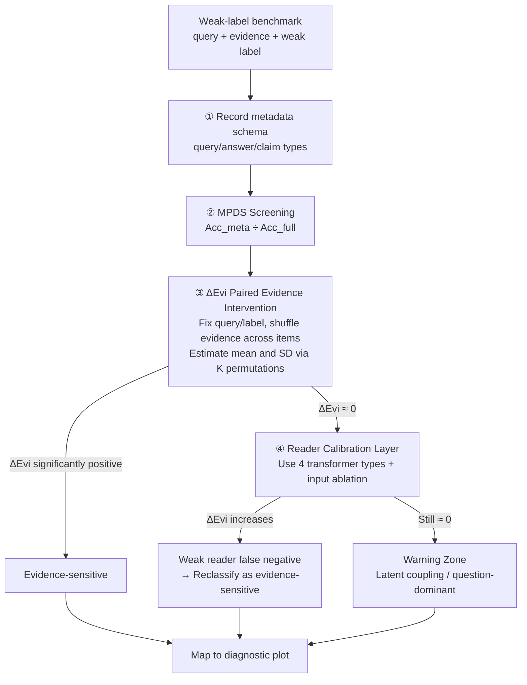

# Metadata Predictability Is Not Evidence Dependence: An Intervention-Based Audit for Weak-Label Benchmarks

**Conference**: ICML 2026 Workshop on Hypothesis Testing  
**arXiv**: [2605.23701](https://arxiv.org/abs/2605.23701)  
**Code**: TBD  
**Area**: Benchmark Auditing / Weak-Label Evaluation / Hypothesis Testing  
**Keywords**: MPDS, ΔEvi, shortcut detection, weak-label benchmark, reader calibration

## TL;DR
The authors point out that "output predictability from metadata" $\neq$ "output dependence on evidence." They propose a dual-statistic audit protocol: using MPDS to measure metadata predictability and evidence-shuffling $\Delta\text{Evi}$ to measure evidence sensitivity, supplemented by a stronger-reader calibration layer and input ablation, forming a reusable 4-step diagnostic scheme for weak-label benchmarks.

## Background & Motivation

**Background**: A large number of weak-label benchmarks (HotpotQA, SNLI, FEVER, etc.) are used for evaluation in NLP/QA/NLI. Traditional audits mostly run "metadata-only baselines"—checking accuracy using only metadata like question type or answer type—to reveal shortcuts. Work by Bowman & Dahl, Gururangan, and McCoy follows this approach.

**Limitations of Prior Work**: While high metadata-only accuracy exposes shortcuts, the **converse is not true**—moderate metadata-only accuracy does not prove a benchmark truly requires evidence. The problem is that metadata measures "whether output can be recovered from priors," whereas evidence-based evaluation asks "whether output depends on specific evidence." These are different hypotheses; conflating them allows protocols that "quietly bypass evidence" to pass undetected.

**Key Challenge**: Evaluation validity concerns whether a protocol does what it claims. Currently, there is no hypothesis-testing tool to directly test the null hypothesis that "protocol behavior is invariant to evidence identity." Furthermore, weak readers (e.g., TF-IDF+LR) can cause "evidence-insensitive" false negatives due to insufficient model capacity, further confusing the diagnosis.

**Goal**: To treat benchmark auditing as a structured hypothesis-testing task, outputting a diagnostic map that distinguishes between "direct coupling / latent coupling / evidence-sensitive / warning zones" rather than a binary pass/fail.

**Key Insight**: In addition to existing metadata-only statistics, the authors introduce a **paired intervention statistic** $\Delta\text{Evi}$. By keeping the query and label fixed while shuffling evidence across items, one can measure the drop in accuracy. This directly tests the null hypothesis that the protocol is invariant to evidence identity.

**Core Idea**: The audit is split into three layers—MPDS for metadata screening, $\Delta\text{Evi}$ for evidence intervention, and stronger-reader calibration. An audit packet must report all three layers along with input ablation to avoid "weak reader false negatives" and "false safety from metadata."

## Method

### Overall Architecture
Given an evidence-based weak-label benchmark, the audit follows a 4-step "detection packet": (1) Define the metadata schema used by the protocol (query/answer/claim types); (2) Train a metadata-majority predictor and calculate its accuracy $\mathrm{Acc}_\text{meta}$, then compute the ratio $\mathrm{MPDS}=\mathrm{Acc}_\text{meta}/\mathrm{Acc}_\text{full}$ as a metadata predictability screen; (3) Perform $K$ cross-item evidence shuffles (fixing query/label) to calculate the mean $\mathrm{Acc}_\text{shuf}$ and per-permutation population SD $\sigma_\text{shuf}$, yielding $\Delta\text{Evi}=\mathrm{Acc}_\text{full}-\mathrm{Acc}_\text{shuf}$ for the null $H_0:\mathrm{Acc}_\text{full}=\mathrm{Acc}_\text{shuf}$; (4) For cases where $\Delta\text{Evi} \approx 0$ on a lightweight reader (TF-IDF+LR), re-run with stronger transformer readers (BERT/DistilBERT/ELECTRA-small/SciBERT) and include input ablation to finalize the mapping on the diagnostic plot.

The output is a "regional classification": (direct coupling) high MPDS, $\Delta\text{Evi} \approx 0$; (latent coupling) moderate MPDS, $\Delta\text{Evi} \approx 0$—this is the most dangerous "warning zone"; (evidence-sensitive) significantly positive $\Delta\text{Evi}$.

### Key Designs

**1. MPDS as a Stratified Screen rather than Final Judgment**

As $\mathrm{MPDS}=\mathrm{Acc}_\text{meta}/\mathrm{Acc}_\text{full}$ approaches 1, the protocol behaves more like a metadata-only predictor, making it suitable for identifying cases of "direct coupling" where metadata alone explains most performance. However, it is insufficient on its own: this ratio conflates "metadata strength" with "task difficulty"—$(0.5, 0.5)$ and $(0.8, 0.8)$ both yield $\mathrm{MPDS}=1.0$. The critical counterexample is synthetic HotpotQA: MPDS=0.643 appears moderate, yet $\Delta\text{Evi}=0$ (evidence is irrelevant). This "latent coupling" is missed by metadata screening and must be exposed by $\Delta\text{Evi}$.

**2. Paired Evidence Intervention Statistic $\Delta\text{Evi}$**

While MPDS measures "recoverability from priors," the audit must ask if the output "depends on the given evidence." $\Delta\text{Evi}$ formalizes this via a clean paired intervention: keeping $(q_i, y_i)$ fixed, replace evidence $e_i$ with $e_{\pi(i)}$ from permutation $\pi$. Accuracy $\mathrm{Acc}_\text{shuf}$ is measured, and $\Delta\text{Evi}=\mathrm{Acc}_\text{full}-\mathrm{Acc}_\text{shuf}$ tests the null $H_0:\mathrm{Acc}_\text{full}=\mathrm{Acc}_\text{shuf}$. Because shuffled samples share the same query/label, accuracy differences must be explained by evidence identity. This paired design also significantly reduces statistical variance compared to independent comparisons.

**3. Reader-calibration Layer: Separating Capacity from Dependence**

A near-zero $\Delta\text{Evi}$ on lightweight readers (TF-IDF+LR) can stem from two causes: the protocol genuinely does not use evidence, or the reader lacks the capacity to learn it. This triggers calibration using four classes of transformer readers (BERT/DistilBERT/ELECTRA-small/SciBERT). If $\Delta\text{Evi}$ rises significantly under stronger readers, the original finding was a false negative. If it remains near zero, it is flagged as a "warning zone," followed by a check on question-only baselines. Input ablation (e.g., hypothesis-only on SNLI) distinguishes residual non-evidence signals.

### Loss & Training
This work does not train new models but treats auditing as a "statistical test on existing reader families." All transformer readers are fine-tuned on the benchmark; each family runs 8 independent evidence permutations to estimate mean and population SD. Reconstructed HotpotQA uses HuggingFace fullwiki (train=2000, eval=600), with labels generated via heuristics (query type + answer type + fact count).

## Key Experimental Results

### Main Results
The 4 typical diagnostic outcomes are summarized below:

| Benchmark | Lightweight (LR) ΔEvi | Transformer ΔEvi | MPDS / Notes | Diagnosis |
|-----------|-----------------------|------------------|-------------|------|
| HotpotQA (synthetic) | 0 | 0 | MPDS=0.643 | **Latent coupling case** |
| SNLI | 0 | 0.26–0.37 (BERT 0.3671±0.0036) | hypothesis-only=0.5975 | Calibration reversal |
| FEVER | 0.13 | 0.63–0.68 (BERT 0.6813±0.0022) | — | Evidence-sensitive (control) |
| HotpotQA (recon.) | — | ≤0.002 (BERT/DistilBERT/ELECTRA) | question-only=0.975, skewed labels | Question-dominant warning |

### Ablation Study

| Case | Phenomenon | Insight |
|------|------------|---------|
| SNLI LR vs Transformer | LR ΔEvi=0; Transformer ΔEvi=0.26–0.37 | Weak reader false negative; conclusion flips after calibration. |
| SNLI SciBERT Ablation | Full=0.5975; Premise-only=0.3365 | Significant hypothesis-side residual signal. |
| Recon HotpotQA | 578 full vs 22 conflict (96% majority); q-only=0.975 | ΔEvi≈0 due to question-side collapse, not true evidence independence. |
| MPDS-gated Filtering | Increases OOD gap on synthetic HotpotQA | Post-hoc filtering fails; shortcuts are protocol-level issues. |

### Key Findings
- **Moderate MPDS + $\Delta\text{Evi}=0$ is "latent coupling"**: Synthetic HotpotQA exposes the failure of metadata-only audits.
- **Weak readers produce false negatives**: SNLI is "evidence-insensitive" under LR but shows $\Delta\text{Evi}=0.26$–$0.37$ under BERT, proving calibration is essential.
- **$\Delta\text{Evi} \approx 0$ can result from question-dominance**: In reconstructed HotpotQA, label skew leads to $0.975$ q-only accuracy, which requires input ablation to categorize as a "warning zone."
- **Shortcuts cannot be fixed by deleting data**: MPDS-gated filtering on synthetic HotpotQA worsened the OOD gap, indicating shortcuts must be addressed during benchmark design.

## Highlights & Insights
- Framing benchmark auditing as "hypothesis testing with a null" integrates metadata-only baselines and evidence-shuffle tests into a unified reporting paradigm.
- The "paired intervention" for $\Delta\text{Evi}$ is clean: variance is reduced, and results are attributable solely to evidence identity.
- The reader-calibration layer fixes a long-overlooked audit bug: mistaking reader weakness for benchmark cleanliness. This phenomenon was likely prevalent in NLP evaluations over the last decade.

## Limitations & Future Work
- Computational budget: Only 4 transformer families and $K=8$ shuffles were used; $K \ge 20$ is recommended for production audits.
- Metadata features are handcrafted; high-order or implicit coupling may escape MPDS.
- $\Delta\text{Evi} \approx 0$ only tests "evidence identity sensitivity"—it does not verify the quality of semantic reasoning. A protocol can have a high $\Delta\text{Evi}$ while still relying on spurious lexical cues.

## Related Work & Insights
- **vs Gururangan et al. 2018 / McCoy et al. 2019**: Prior work focuses on "dataset-artifacts" (data cues) or "model-shortcuts" (model behavior). This work adds a layer for the **protocol itself**: whether the protocol's evaluation logic inherently rewards shortcuts.
- **vs Bowman & Dahl 2021**: While both concern validity, this work provides an actionable "two-statistic, four-step" detection packet.

## Rating
- Novelty: ⭐⭐⭐⭐ The individual components aren't unique, but the standardized "dual-statistic + calibration" packet is a significant methodological contribution.
- Experimental Thoroughness: ⭐⭐⭐ Covers main cases with synthetic and real benchmarks, though $K=8$ is small.
- Writing Quality: ⭐⭐⭐⭐ Clear structure and rigorous definitions.
- Value: ⭐⭐⭐⭐ Provides a defaults checklist for benchmark creators to ensure evaluation integrity.

<!-- RELATED:START -->

## Related Papers

- [\[CVPR 2026\] Prototype-based Causal Intervention for Multi-Label Image Classification](../../CVPR2026/others/prototype-based_causal_intervention_for_multi-label_image_classification.md)
- [\[AAAI 2026\] Measuring Model Performance in the Presence of an Intervention](../../AAAI2026/others/measuring_model_performance_in_the_presence_of_an_intervention.md)
- [\[ICML 2026\] Position: Age Estimation Models Do Not Process Biometric Data](position_age_estimation_models_do_not_process_biometric_data.md)
- [\[ICML 2025\] Revisiting the Predictability of Performative, Social Events](../../ICML2025/others/revisiting_the_predictability_of_performative_social_events.md)
- [\[ACL 2025\] A Measure of the System Dependence of Automated Metrics](../../ACL2025/others/a_measure_of_the_system_dependence_of_automated_metrics.md)

<!-- RELATED:END -->
