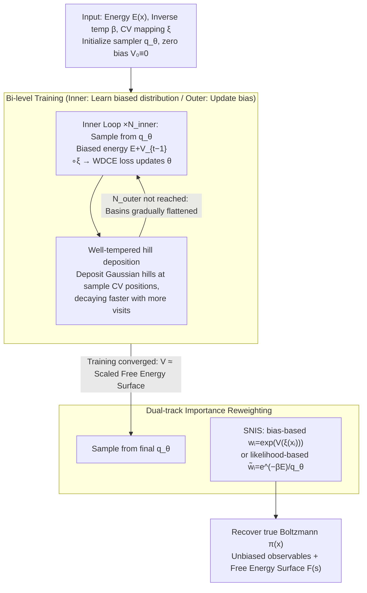

# MetaDNS: Enhancing Exploration in Discrete Neural Samplers via Well-Tempered Metadynamics

**Conference**: ICML 2026  
**arXiv**: [2605.21722](https://arxiv.org/abs/2605.21722)  
**Code**: https://github.com/xiaochendu/metadns  
**Area**: Statistical Physics / Neural Samplers / Enhanced Sampling  
**Keywords**: Discrete Diffusion, Metadynamics, Mode Collapse, Free Energy Reconstruction, Boltzmann Sampling

## TL;DR
This work adapts "well-tempered metadynamics" from molecular dynamics into discrete neural samplers. By accumulating a history-dependent bias potential $V_t(s)$ along low-dimensional collective variables to flatten visited energy basins, it forces MDNS-like models to cross energy barriers and cover multimodal Boltzmann distributions, while preserving unbiased estimation through importance reweighting.

## Background & Motivation

**Background**: In materials science and statistical physics, predicting alloy order/disorder phase transitions and magnetic order parameters requires sampling from discrete Boltzmann distributions $\pi(x)\propto e^{-\beta E(x)}$. Traditional methods include MCMC (Metropolis–Hastings, Glauber, Swendsen–Wang). Recently, "discrete neural samplers" (MDNS, PDNS, LEAPS, DNFS, etc.) have emerged, using CTMC or any-order autoregressive models to learn samplers from energy functions, claiming to scale to high dimensions.

**Limitations of Prior Work**: Discrete neural samplers trained with reverse KL suffer from severe "mode collapse" at low temperatures—probability mass concentrates on a single energy basin discovered early in training, failing to sample high-energy regions required to cross barriers. This leads to two critical problems: (i) missing other modes, resulting in biased estimates of equilibrium observables; (ii) a lack of barrier-crossing configurations, making it impossible to calculate the free energy surface $F(s)$. MDNS cannot solve this even by doubling training steps or using warm-starting at high temperatures; PDNS mitigates this with proximal points but still lacks an explicit exploration mechanism.

**Key Challenge**: Existing methods rely on natural convergence from "initial prior $\to$ target distribution" or fixed annealing paths for exploration. **There is no mechanism to encourage the generator to actively leave visited regions.** Furthermore, $E(x)$ evaluations in material systems are extremely expensive (DFT takes minutes to hours; MLFF is also costly). Wasting energy evaluations on known low-energy regions means missing opportunities to discover new phases.

**Goal**: Enable discrete neural samplers to actively cross energy barriers and cover all modes without relying on MCMC chains or destroying Boltzmann asymptotic correctness, while reconstructing the free energy surface.

**Key Insight**: Well-tempered metadynamics (WT-MetaD) in continuous-space molecular dynamics is a classic tool for this purpose—it accumulates Gaussian-shaped "bias hills" along Collective Variables (CVs) that grow with visits to flatten the energy landscape. However, WT-MetaD is a sequential MCMC paradigm limited by chain autocorrelation. If this biasing mechanism is grafted onto neural samplers capable of parallel independent sample generation, one could theoretically achieve the best of both worlds.

**Core Idea**: Maintain a bias potential $V_t(s)$ along low-dimensional CVs $s=\xi(x)$. Train the neural sampler on the "biased Boltzmann" $\pi_{V_t}(x)\propto e^{-\beta[E(x)+V_t(\xi(x))]}$. At the outer level, add Gaussian hills to $V_t$ at a well-tempered rate based on the current CV distribution of samples. During inference, use $w_i=\exp(V(\xi(x_i)))$ for self-normalized importance sampling (SNIS) to recover the true Boltzmann distribution.

## Method

### Overall Architecture
MetaDNS decomposes training into nested bi-level loops. Given the energy $E(x)$, inverse temperature $\beta$, and a manually selected CV mapping $\xi:\mathcal{X}\to\mathcal{S}$ (e.g., spin-up ratio for Ising, occupancy fractions for Potts, Au atomic fraction for Cu-Au), initialize the neural sampler $q_\theta$ and a zero bias $V_0\equiv 0$.

In each outer loop: (1) The inner loop fixes $V_{t-1}$, samples $M_\text{inner}$ configurations from $q_\theta$, calculates MDNS-style losses such as WDCE based on the biased energy $E_\text{biased}(x)=E(x)+V_{t-1}(\xi(x))$, and performs gradient updates on $\theta$ for $N_\text{inner}$ steps. (2) The outer loop then samples $M_\text{outer}$ configurations from the updated $q_\theta$ and "deposits hills" onto $V_t$ using their CV positions. By the end of training, $V_{N_\text{outer}}$ has flattened the energy basins, and $q_\theta$ has learned the flattened distribution. In the inference stage, samples are drawn directly from $q_\theta$ and reweighted back to the true Boltzmann using $w_i=\exp(V(\xi(x_i)))$.

This design is agnostic to the base sampler: CTMC-based discrete diffusion (MDNS, LEAPS, DNFS) and any-order autoregressive models can be directly applied by replacing $E$ with $E_\text{biased}$ in the loss function.

### Key Designs

**1. Well-tempered hill deposition: Reconstruct the free energy surface by depositing history-dependent Gaussian bumps.**

To flatten visited basins without the bias growing indefinitely, the deposition rule is critical. In round $t$, each CV bin $s$ is updated as $V_t(s)\leftarrow V_{t-1}(s)+\sum_j h\,\exp(-V_{t-1}(s)/(\gamma k_B T))\,K(s,\xi(x_j))$, where $h$ is the hill height, $K$ is a discrete Gaussian kernel, and $\gamma > 1$ is the bias factor. The exponential factor ensures that the higher $V$ is, the smaller the next added hill will be, asymptotically satisfying $V^\star(s)\approx -(1-1/\gamma)F(s)+c$. Thus, $V$ itself becomes the (scaled) free energy surface. Compared to indiscriminate hill stacking, this well-tempered form ensures convergence and fits $F(s)$ "for free."

**2. Bi-level training for discrete neural metadynamics: Transforming the WT-MetaD loop into "inner biased learning / outer bias update."**

Classic WT-MetaD is a sequential MCMC where each bias update requires re-burning in a long chain. This work transforms it into a nested bi-level loop: the inner loop drives $q_\theta$ toward the biased Boltzmann $\pi_{V_{t-1}}$ using path-measure alignment losses (like WDCE in MDNS); the outer loop performs a single forward sampling pass to update $V$. Since neural samplers generate independent samples (unlike autocorrelated MCMC chains), each hill deposition stage in the outer loop is more informative, allowing the process to advance after amortizing training steps under the same $V$. This is the fundamental advantage over MCMC-based WT-MetaD.

**3. Dual-track importance reweighting: Restoring the true Boltzmann distribution from the biased sampler.**

Configurations sampled from the flattened $q_\theta$ must be restored to $\pi(x)$ for physical significance. Two weight types are provided: Bias-based weights $w_i=\exp(V(\xi(x_i)))$ are applicable to all samplers, depend only on low-dimensional CVs, have low variance, and require no extra energy evaluations, but are sensitive to sampler error. Likelihood-based weights $\tilde w_i=\exp(-\beta E(x_i))/q_\theta(x_i)$ are asymptotically unbiased but require the sampler to compute likelihoods—supported naturally by autoregressive models and computable for MDNS via path-likelihood decomposition $\log q_\theta(x_T)=\sum_t\log p_\theta(X_t\mid X_{<t})$, costing one extra energy evaluation per sample.

### Loss & Training
The inner loop uses the original Weighted Denoising Cross-Entropy (WDCE) from MDNS, replacing $E$ with $E_\text{biased}=E+V_{t-1}\circ\xi$. Hyperparameters include bias factor $\gamma$, initial hill height $h$, Gaussian kernel width $\sigma$, $N_\text{inner}/N_\text{outer}$, and batch size. CV selection is manual: $x_\uparrow$ for Ising, occupancy fractions for Potts (2D CV), and $x_\text{Au}$ for Cu-Au.

## Key Experimental Results

### Main Results
The authors evaluated Ising, Potts, and Cu-Au systems against MDNS (SOTA neural sampler) and MCMC-based WT-MetaD (gold standard), using Swendsen–Wang (SW) or long MCMC as ground truth. Representative data ($L=16$ Ising, $x_\uparrow$ JS divergence, lower is better):

| Setting ($L=16$ Ising) | MDNS | MDNS warm-start | **MetaDNS** | SW ground truth |
|----------------------|------|-----------------|-------------|------------------|
| High Temp $\beta=0.28$, $x_\uparrow$ JS↓ | 1.7e-2 | — | 1.7e-2 | — |
| Critical $\beta=0.4407$, $x_\uparrow$ JS↓ | 3.6e-2 | — | 4.2e-2 | — |
| Low Temp $\beta=0.60$, $x_\uparrow$ JS↓ | **2.2e-1 (Collapsed)** | 4.8e-3 | **4.6e-2** | — |
| Low Temp $\beta=0.60$, Magnetization | 0.974 | 0.972 | 0.974 | 0.973 |

At low temperatures, MetaDNS achieved an $x_\uparrow$ JS divergence ~5x lower than vanilla MDNS, while magnetization and two-point correlations matched SW. MDNS's seemingly higher Magnetization (0.979) was merely due to collapse into a narrow peak. For Potts ($q=3, L=16$), MetaDNS required 50k / 14k / 40k bias deposition steps at low/critical/high temperatures to reach $1\,k_BT$ RMSE free energy accuracy, compared to 94.5k / 36k / 107k for MCMC-based WT-MetaD (a ~2x speedup). In the Cu-Au $4\times4\times4$ supercell at 500K, MDNS missed the Cu$_3$Au phase, while MetaDNS reduced JS divergences significantly.

### Ablation Study

| Dimension | MDNS | MetaDNS | MCMC WT-MetaD |
|------|------|---------|---------------|
| Low-temp mode coverage (Ising/Potts/Cu-Au) | Collapsed | Full Modes | Full Modes |
| Potts: Bias steps to convergence | — | 14k–50k | 36k–107k |
| Cu-Au: Training wall-time (A100) | — | 1.5 h | 1.75 h |
| Potts: Training wall-time (A100) | — | 20 h | 1 h |
| 10k Sample Generation Time | — | < 1 min | ≈30–40 min (chain re-mixing) |

### Key Findings
- Mode collapse only manifests when $L\ge 8$ and $\beta>\beta_\text{crit}$; it is not visible at $L=4$, explaining why earlier MDNS papers did not expose this issue.
- Warm-starting MDNS partially improves $x_\uparrow$ JS but worsens two-point correlations and energy JS, suggesting it is a compromise rather than a solution.
- Training wall-time is determined by $E(x)$ evaluation costs: Potts energy is extremely cheap, favoring WT-MetaD; Cu-Au evaluations (cluster expansion) are expensive, favoring MetaDNS in both training and inference.
- Inference in MetaDNS is amortized—generating 10k samples takes seconds, whereas WT-MetaD still requires long chains even with converged bias, leading to >30–40x inference speedup.

## Highlights & Insights
- Successfully ported the "memory-based bias potential" from molecular dynamics to discrete neural samplers. This is a "conceptual migration" rather than a mere modular stack.
- $V^\star(s)\approx-(1-1/\gamma)F(s)+c$ turns the training byproduct into a free energy surface, completing the "sampling to thermodynamic analysis" pipeline.
- Comparing "neural sampler independent samples" against "MCMC autocorrelation limitations" using a "resource unit" (per energy evaluation) is highly persuasive.
- Introducing the Cu-Au binary alloy benchmark connects ML sampling to real-world materials science, moving beyond toy Ising/Potts models.

## Limitations & Future Work
- CVs still require manual design. Future work should explore auto-CV discovery (e.g., from sampler visit statistics or representation learning).
- Bias dimensionality is constrained by the exponential growth of CV bins; processing more than 2–3 CVs simultaneously is difficult.
- If $q_\theta$ is non-ergodic, bias-based reweighting becomes biased; the paper provides empirical mitigations, but formal proofs are lacking.
- For systems with cheap energy evaluations (like Potts), neural training wall-time is 20x higher than WT-MetaD; the method is most beneficial for "expensive energy" regimes.

## Related Work & Insights
- **vs MDNS / PDNS / LEAPS / DNFS**: These methods rely on implicit exploration driven by KL/path-measure alignment. MetaDNS provides an orthogonal enhancement with an explicit anti-revisit mechanism.
- **vs Boltzmann Generators / WT-ASBS (Nam et al. 2026)**: While WT-ASBS operates in continuous space, this work is its discrete dual, requiring new CTMC training objectives and CV discretization.
- **vs Classical WT-MetaD (Laio & Parrinello 2002)**: Inherits the well-tempered hill rules but replaces MCMC/MD with neural samplers, reducing bias deposition steps by ~2x through batched neural training rather than sequential chains.

## Rating
- Novelty: ⭐⭐⭐⭐
- Experimental Thoroughness: ⭐⭐⭐⭐⭐
- Writing Quality: ⭐⭐⭐⭐
- Value: ⭐⭐⭐⭐

<!-- RELATED:START -->

## Related Papers

- [\[ICML 2025\] Discrete Neural Algorithmic Reasoning](../../ICML2025/others/discrete_neural_algorithmic_reasoning.md)
- [\[ICML 2025\] Improved Exploration in GFlowNets via Enhanced Epistemic Neural Networks](../../ICML2025/others/improved_exploration_in_gflownets_via_enhanced_epistemic_neural_networks.md)
- [\[ICML 2026\] NonZero: Interaction-Guided Exploration for Multi-Agent Monte Carlo Tree Search](nonzero_interaction-guided_exploration_for_multi-agent_monte_carlo_tree_search.md)
- [\[ICML 2026\] On the Epistemic Uncertainty of Overparametrized Neural Networks](on_the_epistemic_uncertainty_of_overparametrized_neural_networks.md)
- [\[NeurIPS 2025\] Rethinking Losses for Diffusion Bridge Samplers](../../NeurIPS2025/others/rethinking_losses_for_diffusion_bridge_samplers.md)

<!-- RELATED:END -->
