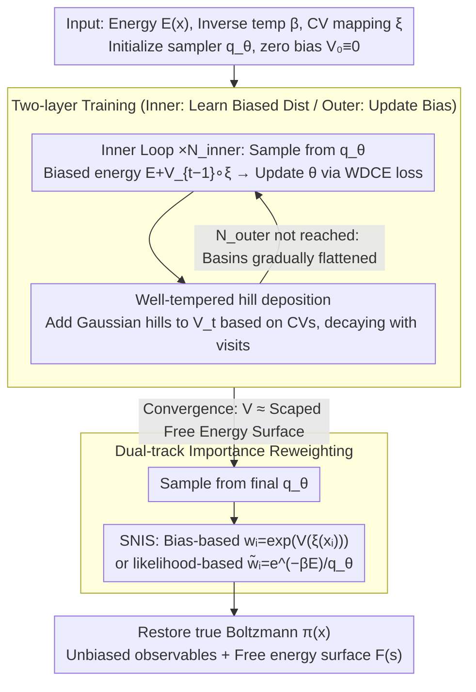

# MetaDNS: Enhancing Exploration in Discrete Neural Samplers via Well-Tempered Metadynamics

**Conference**: ICML 2026  
**arXiv**: [2605.21722](https://arxiv.org/abs/2605.21722)  
**Code**: https://github.com/xiaochendu/metadns  
**Area**: Statistical Physics / Neural Samplers / Enhanced Sampling  
**Keywords**: Discrete Diffusion, Metadynamics, Mode Collapse, Free Energy Reconstruction, Boltzmann Sampling

## TL;DR
This work integrates "well-tempered metadynamics" from molecular dynamics into discrete neural samplers. By utilizing a history-dependent bias potential $V_t(s)$ accumulated along low-dimensional collective variables to flatten visited energy basins, it forces MDNS-like models to cross energy barriers and cover multimodal Boltzmann distributions, while preserving unbiased estimation through importance reweighting.

## Background & Motivation

**Background**: In materials science and statistical physics, predicting phenomena such as ordered/disordered phase transitions in alloys or magnetic order parameters requires sampling from the discrete Boltzmann distribution $\pi(x)\propto e^{-\beta E(x)}$. Traditional methods include MCMC (Metropolis–Hastings, Glauber, Swendsen–Wang). Recently, "discrete neural samplers" (MDNS, PDNS, LEAPS, DNFS, etc.) have emerged, using CTMC or any-order autoregressive models to learn samplers from energy functions, claiming scalability to high dimensions.

**Limitations of Prior Work**: Discrete neural samplers trained with reverse KL suffer from severe "mode collapse" at low temperatures—probability mass concentrates on a single energy basin discovered early in training, failing to sample high-energy regions required to cross barriers. This leads to two critical issues: (i) missing other modes, resulting in biased estimates of equilibrium observables; (ii) a lack of barrier-crossing configurations, making it impossible to calculate the free energy surface $F(s)$. MDNS cannot solve this even with doubled training steps or high-temperature warm-starts; PDNS mitigates this using proximal points but still lacks an explicit exploration mechanism.

**Key Challenge**: Existing methods rely on natural convergence from "initial prior $\to$ target distribution" or fixed annealing paths for exploration, but **lack a mechanism to encourage the generator to actively leave visited regions**. Simultaneously, evaluating $E(x)$ in material systems is extremely expensive (DFT takes minutes to hours; MLFF is also costly). Wasting energy evaluations on known low-energy regions means missing opportunities to discover new phases.

**Goal**: To enable discrete neural samplers to actively cross energy barriers and cover all modes without relying on MCMC chains or compromising Boltzmann asymptotic correctness, while reconstructing the free energy surface as a byproduct.

**Key Insight**: Well-tempered metadynamics (WT-MetaD) in continuous-space molecular dynamics is a classic tool for this purpose—it deposits Gaussian-shaped "bias hills" along Collective Variables (CVs) that grow with visits to flatten the energy landscape. However, WT-MetaD is a sequential MCMC paradigm limited by chain autocorrelation. If this biasing mechanism can be grafted onto neural samplers capable of parallel independent sample generation, one could theoretically achieve the best of both worlds.

**Core Idea**: Maintain a bias potential $V_t(s)$ along low-dimensional CVs $s=\xi(x)$. Train the neural sampler on a "biased Boltzmann" distribution $\pi_{V_t}(x)\propto e^{-\beta[E(x)+V_t(\xi(x))]}$. In the outer loop, add Gaussian hills to $V_t$ at a well-tempered rate based on the current sample's CV distribution. During inference, use $w_i=\exp(V(\xi(x_i)))$ for self-normalized importance sampling to restore the true Boltzmann distribution.

## Method

### Overall Architecture
MetaDNS deconstructs training into a nested two-layer loop. Given an energy function $E(x)$, inverse temperature $\beta$, and a manually selected CV mapping $\xi:\mathcal{X}\to\mathcal{S}$ (e.g., spin-up ratio for Ising, occupancy fractions for Potts, Au atomic fraction for Cu-Au), it initializes a neural sampler $q_\theta$ and a zero bias $V_0\equiv 0$.

In each outer loop iteration: (1) The inner loop fixes $V_{t-1}$, samples $M_\text{inner}$ configurations from $q_\theta$, and calculates MDNS-style losses (like WDCE) based on the biased energy $E_\text{biased}(x)=E(x)+V_{t-1}(\xi(x))$ to update $\theta$ for $N_\text{inner}$ steps. (2) The outer loop then samples $M_\text{outer}$ configurations from the updated $q_\theta$ and deposits "hills" onto $V_t$ based on their CV positions. By the end of training, $V_{N_\text{outer}}$ has flattened the energy basins, and $q_\theta$ has learned the flattened distribution. During inference, samples are drawn from $q_\theta$ and reweighted to the true Boltzmann distribution using $w_i=\exp(V(\xi(x_i)))$.

The design is sampler-agnostic: CTMC-based discrete diffusion (MDNS, LEAPS, DNFS) and any-order autoregressive models can be directly applied by replacing $E$ with $E_\text{biased}$ in their loss functions.

### Key Designs

**1. Well-tempered hill deposition: Applying history-dependent Gaussian bumps to the bias potential to flatten basins and reconstruct the free energy surface.**

To flatten visited basins without allowing the bias to grow infinitely, the deposition rule is critical. At iteration $t$, each CV bin $s$ is updated: $V_t(s)\leftarrow V_{t-1}(s)+\sum_j h\,\exp(-V_{t-1}(s)/(\gamma k_B T))\,K(s,\xi(x_j))$, where $h$ is the hill height, $K$ is a discrete Gaussian kernel, and $\gamma>1$ is the bias factor. The exponential factor ensures that as $V$ increases, subsequent hills become smaller, satisfying the asymptotic relation $V^\star(s)\approx-(1-1/\gamma)F(s)+c$. This means $V$ itself serves as the (scaled) free energy surface. Compared to uniform deposition, this well-tempered form ensures convergence and fits $F(s)$ for "free."

**2. Two-layer training for discrete neural metadynamics: Transforming the "sample-bias-resample" cycle of WT-MetaD into "Inner: learn biased distribution / Outer: update bias."**

Classical WT-MetaD is a sequential MCMC where long chains must be re-burned-in after each bias update. This work re-engineers it into nested loops: the inner loop pushes $q_\theta$ toward the biased Boltzmann $\pi_{V_{t-1}}$ using path-measure alignment losses; the outer loop performs a single forward sampling pass to update $V$. Since neural samplers generate independent samples (unlike autocorrelated MCMC chains), each hill deposition in the outer loop is more informative. This is the fundamental advantage: MCMC requires re-mixing long chains, while MetaDNS requires only forward inference.

**3. Dual-track importance reweighting: Restoring the biased distribution to the true Boltzmann distribution post-training using two SNIS weight variants.**

Configurations sampled from the flattened $q_\theta$ must be reweighted to $\pi(x)$ for physical relevance. Two weighting schemes are provided: Bias-based weights $w_i=\exp(V(\xi(x_i)))$ are applicable to any sampler, depend only on low-dimensional CVs, have low variance, and require no extra energy evaluations, but are sensitive to sampler error. Likelihood-based weights $\tilde w_i=\exp(-\beta E(x_i))/q_\theta(x_i)$ are asymptotically unbiased but require the sampler to compute likelihoods (natively supported by autoregressive models and computable via path-likelihood decomposition in MDNS). This dual approach allows MetaDNS to use bias-based weights for global observables and likelihood-based weights for detailed correlations.

### Loss & Training
The inner loop utilizes the original MDNS Weighted Denoising Cross-Entropy (WDCE), substituting the target energy $E$ with $E_\text{biased}=E+V_{t-1}\circ\xi$. Hyperparameters include bias factor $\gamma$, initial hill height $h$, Gaussian kernel width $\sigma$, $N_\text{inner}/N_\text{outer}$, and batch size. CV selection is manual: $x_\uparrow$ for Ising, occupancy fractions for Potts, and $x_\text{Au}$ for Cu-Au.

## Key Experimental Results

### Main Results
The authors evaluated Ising, Potts, and Cu-Au systems against MDNS and MCMC-based WT-MetaD, using Swendsen–Wang or long MCMC as ground truth. (Metric: $x_\uparrow$ JS divergence for $L=16$ Ising, lower is better):

| Setting ($L=16$ Ising) | MDNS | MDNS warm-start | **MetaDNS** | SW ground truth |
|----------------------|------|-----------------|-------------|------------------|
| High Temp $\beta=0.28$, $x_\uparrow$ JS↓ | 1.7e-2 | — | 1.7e-2 | — |
| Critical $\beta=0.4407$, $x_\uparrow$ JS↓ | 3.6e-2 | — | 4.2e-2 | — |
| Low Temp $\beta=0.60$, $x_\uparrow$ JS↓ | **2.2e-1 (Collapse)** | 4.8e-3 | **4.6e-2** | — |
| Low Temp $\beta=0.60$, Mag. | 0.974 | 0.972 | 0.974 | 0.973 |

At low temperatures, MetaDNS achieves $x_\uparrow$ JS divergence ~5× lower than vanilla MDNS. For Potts ($q=3, L=16$), MetaDNS reaches $1 k_BT$ RMSE free energy accuracy in 14k–50k bias steps, whereas MCMC-based WT-MetaD requires 36k–107k steps (~2× acceleration). For Cu-Au, MDNS misses the Cu$_3$Au phase entirely, while MetaDNS reduces JS divergence and achieves $<0.3 k_BT$ RMSE in 16k steps vs 33.8k for MCMC.

### Ablation Study

| Dimension | MDNS | MetaDNS | MCMC WT-MetaD |
|------|------|---------|---------------|
| Low-temp mode coverage | Collapse | Full Modes | Full Modes |
| Potts convergence bias steps | — | 14k–50k | 36k–107k |
| Cu-Au training wall-time (A100) | — | 1.5 h | 1.75 h |
| Potts training wall-time (A100) | — | 20 h | 1 h |
| 10k Sample generation time | — | <1 min | ≈30–40 min (Requires mixing) |

### Key Findings
- Mode collapse only manifests when $L\ge 8$ and $\beta>\beta_\text{crit}$; $L=4$ hides the problem.
- Warm-starting MDNS partially improves $x_\uparrow$ JS but degrades energy JS, indicating it is a compromise rather than a solution.
- Wall-time depends entirely on $E(x)$ evaluation cost: for cheap energy (Potts), MCMC is faster; for expensive energy (Cu-Au), MetaDNS wins on both training and inference.
- Inference in MetaDNS is amortized: generating 10k samples takes seconds, whereas WT-MetaD still requires long chains even with a converged bias, resulting in >30–40× inference speedup.

## Highlights & Insights
- First complete integration of "memory-based bias potentials" into discrete neural samplers. This is a "conceptual migration" rather than a mere module addition.
- The byproduct $V^\star(s)\approx-(1-1/\gamma)F(s)+c$ naturally provides the free energy surface, bridge the gap between sampling and thermodynamic analysis.
- Comparing independent neural samples against autocorrelated MCMC chains using "energy evaluations" as a resource unit is a convincing metric.
- Introducing the Cu-Au alloy benchmark to the ML community connects ML sampling with real-world materials science.

## Limitations & Future Work
- CVs still require manual design; future work should explore auto-CV discovery from sampler statistics or representation learning.
- The dimensionality of the bias is capped by the CV dimensions (hard to handle > 2-3 dimensions).
- If $q_\theta$ is non-ergodic, bias-based reweighting is biased; theoretical convergence guarantees remain open.
- On Potts systems, neural training wall-time is 20× higher than WT-MetaD—this method only wins on wall-clock time when $E$ evaluations are significantly expensive.

## Related Work & Insights
- **vs MDNS / PDNS / LEAPS / DNFS**: These rely on implicit exploration via KL/path-measure alignment; MetaDNS provides an orthogonal enhancement via explicit history-dependent biasing.
- **vs Classical WT-MetaD**: Adopts well-tempered hill deposition but replaces MCMC/MD with a neural sampler, changing "sequential bias deposition" into batched training to reduce steps by ~2×.

## Rating
- Novelty: ⭐⭐⭐⭐ Significant cross-disciplinary migration; the first combination of discrete neural samplers and WT-MetaD.
- Experimental Thoroughness: ⭐⭐⭐⭐⭐ Coverage of three systems, multiple temperatures, and comparison against SOTA neural samplers and gold-standard MCMC.
- Writing Quality: ⭐⭐⭐⭐ Clear motivation-method-experiment chain, though technical choices for weights could be more detailed.
- Value: ⭐⭐⭐⭐ Solves the critical mode collapse problem in discrete neural samplers and provides practical value for computational materials science.

<!-- RELATED:START -->

<!-- RELATED:END -->

## Related Papers

- [\[ICML 2025\] Discrete Neural Algorithmic Reasoning](../../ICML2025/others/discrete_neural_algorithmic_reasoning.md)
- [\[ICML 2025\] Improved Exploration in GFlowNets via Enhanced Epistemic Neural Networks](../../ICML2025/others/improved_exploration_in_gflownets_via_enhanced_epistemic_neural_networks.md)
- [\[CVPR 2026\] Advancing Image Classification with Discrete Diffusion Classification Modeling](../../CVPR2026/others/advancing_image_classification_with_discrete_diffusion_classification_modeling.md)
- [\[ICML 2026\] NonZero: Interaction-Guided Exploration for Multi-Agent Monte Carlo Tree Search](nonzero_interaction-guided_exploration_for_multi-agent_monte_carlo_tree_search.md)
- [\[ICML 2026\] On the Epistemic Uncertainty of Overparametrized Neural Networks](on_the_epistemic_uncertainty_of_overparametrized_neural_networks.md)

<!-- RELATED:END -->
