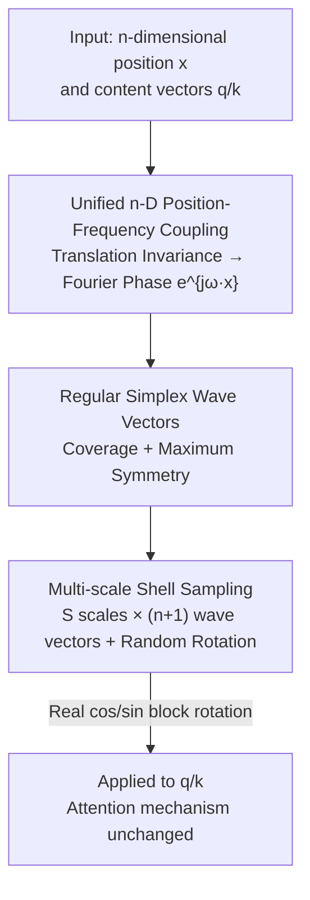

# nD-RoPE: A Generalized RoPE for n-Dimensional Position Embedding

**Conference**: ICML 2026  
**arXiv**: [2606.12146](https://arxiv.org/abs/2606.12146)  
**Code**: To be confirmed  
**Area**: Transformer Architecture / Position Embedding  
**Keywords**: Rotary Position Embedding, Isotropy, Regular Simplex, Multi-scale Frequency, Resolution Extrapolation

## TL;DR
The method evolves RoPE from "axis-wise splitting" to "encoding positions and frequencies as holistic n-dimensional vectors via a single inner product rotation $e^{j\boldsymbol{\omega}^\top\mathbf{x}}$." By employing regular simplex wave vectors to ensure isotropy, it achieves consistent accuracy gains and superior resolution/density extrapolation across images, videos, and point clouds.

## Background & Motivation

**Background**: RoPE has achieved immense success in 1D language modeling by applying position-dependent rotations to query/key pairs, ensuring the attention inner product depends only on relative displacement. To adapt it for 2D images, 3D point clouds, or spatio-temporal videos, the standard approach is "Axial RoPE"—decomposing the position vector into $x,y,z$ components, performing 1D rotations **independently** along each axis, and concatenating them.

**Limitations of Prior Work**: Axis-wise decomposition relies on the unexamined assumption that multi-dimensional displacement can be losslessly decomposed into independent 1D components. However, a diagonal displacement is a **holistic** geometric transformation; splitting it into "horizontal rotation × vertical rotation" fragments the coherent displacement, destroys cross-dimensional interactions, and introduces direction-dependent relative phases in attention. Diagnostics using Non-Uniform Fourier Transform (NUFT) to reconstruct impulse signals reveal that axial encoding produces grid-like artifacts along coordinate axes, indicating that diagonal frequencies are poorly covered. While learnable schemes like RoPE-Mixed treat coordinates holistically, their frequency parameters tend to **collapse** into irregular low-frequency clusters during optimization, leading to unstable generalization.

**Key Challenge**: An effective multi-dimensional position encoding must simultaneously encode relative positions along **non-axis-aligned** directions while ensuring **uniform coverage** (isotropy) across all directions. Axial schemes fail the former, while learnable schemes cannot guarantee the latter. A unified framework with theoretically grounded frequency selection has been missing.

**Goal**: To provide a "decomposition-free" n-dimensional generalization of RoPE that remains consistent across 1D/2D/3D and utilizes a deterministic, geometrically symmetric wave vector construction to eliminate directional bias.

**Core Idea**: Starting from translation-invariant attention in a continuous Hilbert space, it is proven that positions must enter the rotation as **holistic n-dimensional vectors** coupled with frequencies in the form $e^{j\boldsymbol{\omega}^\top\mathbf{x}}$. **Regular simplices** are then used to select wave vectors to achieve maximum symmetry with minimal redundancy.

## Method

### Overall Architecture

nD-RoPE modifies only the phase term of the position encoding without changing the attention mechanism. It replaces the 1D phase $\omega x$ in standard RoPE with a multi-dimensional phase $\boldsymbol{\omega}^\top\mathbf{x}$, where position $\mathbf{x}\in\mathbb{R}^n$ and wave vector $\boldsymbol{\omega}\in\mathbb{R}^n$ are **holistic n-dimensional vectors without axis-wise splitting**. The logic follows three steps: deriving the $e^{j\boldsymbol{\omega}^\top\mathbf{x}}$ Fourier form from "translation invariance + relative position" assumptions; identifying the regular simplex as the optimal set of limited wave vectors based on coverage and symmetry; and stacking multiple scales to form concentric spherical shells for multi-scale displacement coverage.

### Key Designs

**1. Unified n-D Position–Frequency Coupling: Deriving Holistic Rotation from Translation Invariance**

This addressing the fundamental flaw of axial splitting. Following RoPE's assumptions: query/key are position-dependent functions $\mathbf{q}_{\mathbf{x}_1}=f(q,\mathbf{x}_1)$, and the attention kernel depends only on relative displacement $\mathbf{d}=\mathbf{x}_1-\mathbf{x}_2$. By lifting the content $q$ to a square-integrable function $\gamma(q,\cdot)$ on $L^2(\mathbb{R}^n)$ and utilizing the Parseval equality, the inner product becomes $\langle f(q,\mathbf{x}_1),f(k,\mathbf{x}_2)\rangle=\int e^{j\boldsymbol{\omega}^\top\mathbf{d}}\,\Gamma(q,\boldsymbol{\omega})\Gamma(k,\boldsymbol{\omega})^*\,d\boldsymbol{\omega}$. The phase factor $e^{j\boldsymbol{\omega}^\top\mathbf{d}}$ captures relative position dependency. Applying the Riesz representation theorem and inverse Fourier transform yields the decomposed form $\gamma(q,\mathbf{x})=q^\top\phi(\mathbf{x})$, leading to the finite frequency approximation $f(q,\mathbf{x})\approx (Wq)\odot\varphi(\mathbf{x})$, where $\varphi(\mathbf{x})=[e^{j\boldsymbol{\omega}_1^\top\mathbf{x}},\dots,e^{j\boldsymbol{\omega}_M^\top\mathbf{x}}]^\top$. The key conclusion is that $\boldsymbol{\omega}$ and $\mathbf{x}$ naturally appear as **holistic n-dimensional vectors** in the derivation; axial splitting is merely a degenerate case that restricts frequencies to the coordinate axes.

**2. Coverage + Maximum Symmetry: Constraining Wave Vector Selection to the Regular Simplex**

With the Fourier form established, the remaining design freedom is the set of wave vectors $\Omega=\{\boldsymbol{\omega}_i\}$. Two structural conditions are proposed. **Coverage**: If $\mathrm{rank}(\Omega)<n$, a direction $v$ exists such that $\Omega v=0$, rendering the system unable to distinguish between $x$ and $x+tv$. Thus, $\mathrm{rank}(\Omega)=n$ is required. **Maximum Symmetry**: $n$ orthogonal wave vectors satisfy second-order balance $\sum_i\boldsymbol{\omega}_i\boldsymbol{\omega}_i^\top\propto I_n$, but each frequency remains tied to a coordinate axis, preserving axial bias. By increasing the number of wave vectors to the minimal redundancy $M=n+1$, every wave vector is treated equally. The resulting configuration is a **centered regular simplex**: $\sum_{i=1}^{n+1}\boldsymbol{\omega}_i=0$, $\|\boldsymbol{\omega}_i\|=r$, and $\langle\boldsymbol{\omega}_i,\boldsymbol{\omega}_j\rangle=-r^2/n\;(i\neq j)$. This ensures that every spatial direction has equal second-order directional energy $\sum_{i=1}^{n+1}\boldsymbol{\omega}_i\boldsymbol{\omega}_i^\top=\frac{n+1}{n}r^2 I_n$, achieving **isotropy**.

**3. Multi-scale Shells + Random Rotation: Avoiding Frequency Collapse and Covering Multi-scale Displacements**

A single-scale simplex covers only one frequency radius. To handle the large range of multi-dimensional relative displacements, **Ours** stacks $S$ scales. Each scale uses a set of $n+1$ simplex wave vectors with an added random rotation, encoded as $f(q,\mathbf{x})=q\odot[z^{(1)}(\mathbf{x})\,\|\cdots\|\,z^{(S)}(\mathbf{x})]^\top$. These form **multi-scale concentric spherical shells** in the frequency domain, providing uniform coverage. Unlike RoPE-Mixed, which collapses into anisotropic low-frequency clusters, nD-RoPE remains geometrically regular. Implementation-wise, each $e^{j\boldsymbol{\omega}^\top\mathbf{x}}$ is realized as a real-valued $(\cos(\boldsymbol{\omega}^\top\mathbf{x}),\sin(\boldsymbol{\omega}^\top\mathbf{x}))$ pair, making it compatible with existing frequency scaling techniques like YaRN.

### An Illustrative Example: The 2D Hexagonal Grid

In 2D, using two orthogonal wave vectors (axial) induces a **square grid** in real space, tying phases to horizontal/vertical directions. Using three wave vectors at $120^\circ$ angles (a 2D regular simplex) creates a **hexagonal grid** via interference. This configuration is highly symmetric and has no preferred axes, demonstrating how the "count + angular arrangement" of wave vectors determines directional balance.

## Key Experimental Results

### Main Results

| Task / Backbone | Setting | nD-RoPE | RoPE-Axial | RoPE-Mixed |
|------|------|---------|-----------|-----------|
| ImageNet-1K Res. Extrap. (DeiT-S, Train@224) | 224 (In-domain) | 81.07 | 80.89 | 80.90 |
| Same as above | 1024 (No YaRN) | **35.51** | 20.64 | 16.63 |
| Same as above | 1024 (+YaRN) | **68.46** | 48.02 | 43.48* |
| Kinetics-400 Video (TimeSformer, Train@224) | 224 (In-domain) | 75.85 | 73.23 | 73.12 |
| Same as above | 1024 (+YaRN) | **59.23** | 57.94 | 44.16* |
| ModelNet40 Density Extrap. (Point Transformer, Train 2048 pts) | 2048 (In-domain) | **85.97** | 80.98 | 81.40 |
| Same as above | 256 pts | **55.37** | 48.22 | 40.41 |

\*RoPE-Mixed values at 1024 represent RoPE-Mixed+APE+YaRN.

### Ablation Study

| Phenomenon | Observation | Description |
|------|------|------|
| NUFT Impulse Recon. | nD-RoPE is isotropic; no axial artifacts | Axial schemes show grid artifacts; diagonal frequencies wasted |
| Spectrum Distribution | nD-RoPE forms multi-scale concentric shells | RoPE-Mixed frequencies collapse into anisotropic clusters |
| Pt. Cloud Attn. Form | Vector attention (85.97) > Std Dot-product (85.07) | nD-RoPE outperforms axial baselines in both attention types |
| SemanticKITTI Seg. | 0.05 Grid in-domain 71.91 vs Axial 70.25 | Superior performance in cross-grid resolution extrapolation |

### Key Findings
- **In-domain parity, out-of-domain explosion**: While nD-RoPE leads slightly at training resolutions, the gap widens drastically during extrapolation (e.g., gain of ~19-25 points at ImageNet 1024), proving that isotropy is crucial for generalization.
- **Axial schemes fail drastically in extrapolation**: RoPE-Axial's performance drop at high resolutions validates the diagnostic that directional bias causes diagonal frequency failure.
- **Plug-and-play**: By maintaining the real-valued block rotation of standard RoPE, techniques like YaRN can be directly integrated for further gains (35.51 → 68.46).

## Highlights & Insights
- **Holistic Position Principle**: The principle that "positions should not be split" is elevated from intuition to a derivable spectral condition. Translational invariance necessarily leads to n-dimensionally coupled Fourier phases.
- **Deterministic Simplex Construction**: Using the regular simplex ($M=n+1$) provides the minimal wave vector set required for non-axis-aligned coverage. The zero-centroid and equidistant properties ensure full-rank coverage and maximum symmetry, avoiding the instability of learnable frequencies.
- **Zero-Invasion Transferability**: By replacing the phase term while keeping the attention mechanism unchanged, nD-RoPE can be integrated into any existing Transformer codebase with minimal effort.

## Limitations & Future Work
- The current wave vector set is fixed (with random rotation); future work could explore if $M \gg n+1$ provides better angular density despite increased redundancy. Hyperparameters like the number of scales $S$ and radii $r$ require more systematic study.
- Evaluation was limited to vision and point clouds; the efficacy of n-D coupling in its original domain—long-context language modeling—remains to be verified.
- Potential loss of inductive bias for tasks with natural axis-aligned structures was not deeply discussed.

## Related Work & Insights
- **vs Axial RoPE**: Axial RoPE rotates coordinates independently and favors axis-aligned dependencies. **Ours** utilizes n-D inner product rotation to preserve cross-dimensional geometry.
- **vs RoPE-Mixed**: While both attempt holistic modeling, RoPE-Mixed relies on learnable frequencies that often collapse. **Ours** provides a rigorous construction via a regular simplex and multi-scale shells for better stability.
- **vs FoPE / RFF**: FoPE focuses on spectral correction for 1D length extrapolation. Random Fourier Features lack uniform coverage guarantees, whereas **Ours** provides a deterministic, geometrically symmetric solution.

## Rating
- Novelty: ⭐⭐⭐⭐⭐ Elegant derivation of RoPE generalization using regular simplices.
- Experimental Thoroughness: ⭐⭐⭐⭐ Strong multi-modal results, though language modeling is missing.
- Writing Quality: ⭐⭐⭐⭐ Clear theoretical derivation supported by diagnostic experiments.
- Value: ⭐⭐⭐⭐⭐ High potential for multi-modal models due to its plug-and-play nature and extrapolation gains.

<!-- RELATED:START -->

## Related Papers

- [\[ICML 2026\] Amortized Simulation-Based Inference in Generalized Bayes via Neural Posterior Estimation](amortized_simulation-based_inference_in_generalized_bayes_via_neural_posterior_e.md)
- [\[ICML 2026\] Position: Age Estimation Models Do Not Process Biometric Data](position_age_estimation_models_do_not_process_biometric_data.md)
- [\[ICML 2026\] Position: Evaluation of ML Resource Utilization Requires Model Life Cycle Assessment](evaluation_of_ml_resource_utilization_requires_model_life_cycle_assessment.md)
- [\[ICML 2026\] GOTabPFN: From Feature Ordering to Compact Tokenization for Tabular Foundation Models on High-Dimensional Data](gotabpfn_from_feature_ordering_to_compact_tokenization_for_tabular_foundation_mo.md)
- [\[ICML 2026\] Rectified LpJEPA: Joint-Embedding Predictive Architectures with Sparse and Maximum-Entropy Representations](rectified_lpjepa_joint-embedding_predictive_architectures_with_sparse_and_maximu.md)

<!-- RELATED:END -->
