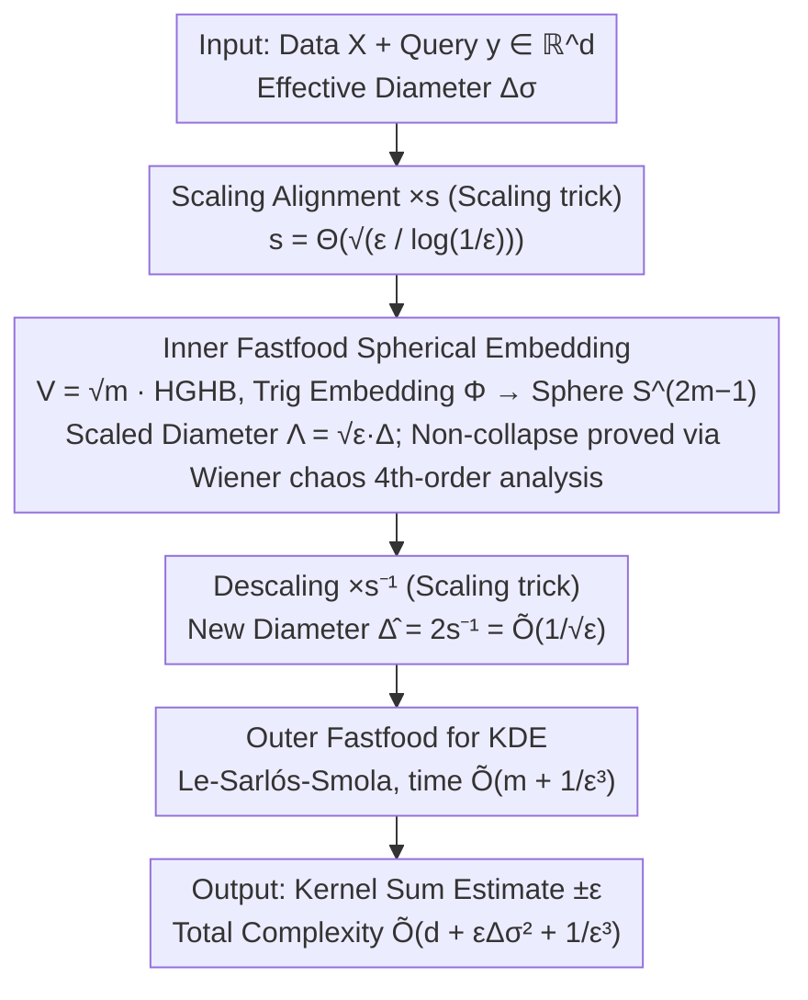

# New Bounds for Kernel Sums via Fast Spherical Embeddings

**Conference**: ICML 2026  
**arXiv**: [2605.01263](https://arxiv.org/abs/2605.01263)  
**Code**: None  
**Area**: Algorithm Theory / Kernel Density Estimation / Random Projection  
**Keywords**: KDE, Gaussian kernel, Fastfood, Randomized Hadamard Transform, Wiener chaos

## TL;DR
A fast version of the "randomized Nash device" spherical embedding theorem from Bartal-Recht-Schulman 2011 is developed using iterative Fastfood transforms (time $\widetilde{O}(d + \Lambda^2 + \varepsilon^{-2})$). By integrating this as a preprocessing step for Gaussian KDE to compress the diameter to $\widetilde{O}(1/\sqrt{\varepsilon})$, a new query time bound of $\widetilde{O}(d + \varepsilon \Delta_\sigma^2 + 1/\varepsilon^3)$ is derived. This bound outperforms RFF / FJLT+RFF / Fastfood in the regime of small $\varepsilon$ and medium diameter.

## Background & Motivation

**Background**: Kernel Density Estimation (KDE) is a fundamental tool in ML. The goal is to estimate $\frac{1}{|X|} \sum_{x \in X} \mathbf{k}(x, y)$ for a query $y$ with precision $\pm \varepsilon$ (with high probability). Query times for high-dimensional Gaussian KDE have been optimized via three primary methods: (i) RFF $O(d/\varepsilon^2)$, (ii) FJLT + RFF $\widetilde{O}(d + 1/\varepsilon^4)$, and (iii) Fastfood $\widetilde{O}(d + \Delta_\sigma^2/\varepsilon^2)$. These methods are mutually incomparable, depending on the dimension $d$, error $\varepsilon$, and effective diameter $\Delta_\sigma = \Delta/\sigma$.

**Limitations of Prior Work**: Each method has "uncovered" parameter intervals. Fastfood is optimal for small diameters, but the term $\Delta_\sigma^2 / \varepsilon^2$ places the diameter in the numerator (worsening as diameter increases). RFF/FJLT do not depend on diameter but have a heavy dependence on $\varepsilon$. The question is whether a bound can be constructed where the diameter appears in a "friendlier" manner (e.g., $\varepsilon \Delta_\sigma^2$, where smaller $\varepsilon$ is beneficial).

**Key Challenge**: The bottleneck of Fastfood is the output dimension $d' = O(\Delta_\sigma^2 / \varepsilon^2)$, which is determined by the diameter of the data region. If a "diameter compression" preprocessing can be applied before Fastfood to reduce the effective diameter, the overall complexity can be improved. However, this preprocessing must be fast and must not distort distances in a way that affects kernel estimation accuracy.

**Goal**: Construct a "fast spherical embedding" with time complexity $\widetilde{O}(d + \Lambda^2 + \varepsilon^{-2})$ that maps points to a unit sphere, preserves "small" distances $\leq \sqrt{\varepsilon}$ within $(1 \pm \varepsilon)$, and prevents "large" distances from collapsing below $\Omega(\sqrt{\varepsilon})$, thereby compressing the diameter to $1/\sqrt{\varepsilon}$.

**Key Insight**: For Gaussian KDE, $e^{-\|x-y\|^2} \leq \varepsilon$ when distance $\geq \sqrt{\log(1/\varepsilon)}$. Thus, these "large" distances do not require precise preservation as long as they do not collapse below $\sqrt{\log(1/\varepsilon)}$. This requirement matches the spherical embedding theorem introduced by BRS 2011, but their implementation used full Gaussian matrices with $O(d/\varepsilon^2)$ complexity, which is not efficient.

**Core Idea**: Utilize iterative Fastfood $\psi(H D_2 H D_1 x)$ (two layers of randomized Hadamard transforms) as a "fast version of BRS spherical embedding." It is proved to satisfy the three properties of spherical embedding, then cascaded as a preprocessing step for Gaussian KDE, resulting in a dual-layer Fastfood: $\psi(H D_4 H D_3 \cdot s^{-1} \psi(H D_2 H D_1 (s x)))$.

## Method

### Overall Architecture
A two-stage embedding process is used. Stage 1 involves **Fast Spherical Embedding** $\Phi: \mathbb{R}^d \to \mathbb{S}^m$ with $m = \widetilde{O}(d + \Lambda^2 + \varepsilon^{-2})$. Data and queries are scaled by $s = \Theta(\sqrt{\varepsilon / \log(1/\varepsilon)})$ and passed through the **inner Fastfood**, resulting in outputs on $\mathbb{S}^{2m-1}$ with a scaled diameter $\Lambda = s\Delta = \widetilde{O}(\sqrt{\varepsilon} \Delta)$. Stage 2 involves **Descaling + Outer Fastfood** for KDE. After descaling, points are on a sphere of radius $s^{-1}$ with a new diameter $\widehat{\Delta} = 2 s^{-1} = \widetilde{O}(1/\sqrt{\varepsilon})$. Standard Fastfood (Le-Sarlós-Smola 2013) is then applied for KDE approximation with complexity $\widetilde{O}(m + \widehat{\Delta}^2/\varepsilon^2) = \widetilde{O}(m + 1/\varepsilon^3)$. The combined complexity is $\widetilde{O}(d + \varepsilon \Delta_\sigma^2 + 1/\varepsilon^3)$.

### Key Designs

**1. Fastfood as Fast Spherical Embedding: Replacing Full Gaussian with Structured Matrices**

BRS 2011 provided a "spherical embedding" tool to map points to a unit sphere while preserving small distances and preventing large distances from collapsing. However, their use of full Gaussian matrices $W$ results in $O(d/\varepsilon^2)$ time. This work replaces it with iterative Fastfood: the mapping $\Phi$ takes $x\in\mathbb{R}^m$ through a Fastfood matrix $V=\sqrt{m}\cdot HGHB$ ($H$ is normalized Hadamard, $G=\text{diag}(g)$ is Gaussian diagonal, $B$ is Rademacher sign diagonal) and then into a trigonometric embedding:
$$\Phi(x)_{2j-2}=\tfrac{1}{\sqrt m}\cos((Vx)_j),\quad \Phi(x)_{2j-1}=\tfrac{1}{\sqrt m}\sin((Vx)_j)$$
The output lies on $\mathbb{S}^{2m-1}$. $Vx$ is computed in $O(m\log m)$ via Walsh-Hadamard Transforms. The RHT serves as a sparse approximation of Gaussian matrices while retaining the required statistical properties (Theorem 1.3).

**2. Fourth-order Wiener Chaos Analysis for Distance Contraction: Technical Control**

Proving that $\Phi$ does not contract small distances by more than $(1-\varepsilon)$ (Theorem 1.3, item 2) requires more than second-moment analysis. Starting from the Taylor lower bound $1-\cos(\theta)\ge\tfrac12\theta^2-\tfrac{1}{24}\theta^4$, one obtains:
$$\|\Phi(x)-\Phi(y)\|^2 \ge Q(z)-\tfrac{1}{12}W(z),\quad Q(z)=\tfrac1m\|Vz\|^2,\ W(z)=\tfrac1m\sum_j (Vz)_j^4$$
The second-order term $Q(z)$ is bound via Bernstein's inequality. The fourth-order term $W(z)$ is a Gaussian chaos function. It is decomposed using the identity $t^4-3=6h_2(t)+h_4(t)$ into 2nd and 4th order Wiener chaos, controlled via Bernstein and Wiener chaos hypercontractivity (Theorem 3.6). This technical innovation is necessary because second-order bounds used in prior Fastfood analysis cannot bound the variance of $(Vz)_j^4$.

**3. Scaling Trick to Align Small Distance Thresholds**

BRS embeddings precisely preserve distances $\le\sqrt{\varepsilon}$, but the effective threshold for Gaussian KDE is $\sqrt{\log(1/\varepsilon)}$. These scales are aligned by scaling the input by $s=\Theta(\sqrt{\varepsilon/\log(1/\varepsilon)})$ before embedding and scaling back by $s^{-1}$ after. Consequently, point pairs with original distances $\le\sqrt{\log(1/\varepsilon)}$ are preserved, while those $\ge\sqrt{\log(1/\varepsilon)}$ remain at $\Omega(\sqrt{\log(1/\varepsilon)})$. The resulting new diameter $\widehat\Delta=2s^{-1}=\widetilde O(1/\sqrt\varepsilon)$ allows the outer Fastfood to achieve $\widetilde O(1/\varepsilon^3)$ complexity, making the diameter term multiplicative with $\varepsilon$.

### Loss & Training
This is a theoretical work; there is no training or optimization. All parameters (dimension $m$, scaling $s$, Hadamard order) are determined explicitly by theoretical analysis.

## Key Experimental Results
This is a theoretical paper; it contains no experimental tables. Complexity comparisons are visualized in Table 1 and Figure 1.

### Main Results

| Method | Query Time | Optimal Regime |
|------|----------|----------|
| RFF | $O(d / \varepsilon^2)$ | $d \lesssim \varepsilon^{-2}$ and $\Delta_\sigma \gtrsim \sqrt{d} \varepsilon^{-1.5}$ |
| FJLT + RFF | $\widetilde{O}(d + 1/\varepsilon^4)$ | $d \gtrsim \varepsilon^{-2}$ and $\Delta_\sigma \gtrsim \varepsilon^{-2.5}$ |
| Fastfood | $\widetilde{O}(d + \Delta_\sigma^2/\varepsilon^2)$ | $\Delta_\sigma \lesssim \min\{\sqrt{d}, \varepsilon^{-0.5}\}$ |
| **Ours (Theorem 1.2)** | $\widetilde{O}(d + \varepsilon \Delta_\sigma^2 + 1/\varepsilon^3)$ | $\varepsilon^{-0.5} \lesssim \Delta_\sigma \lesssim \min\{\sqrt{d} \varepsilon^{-1.5}, \varepsilon^{-2.5}\}$ |

The four methods are incomparable; each is optimal within its own parameter regime. The new method occupies the "medium diameter + small $\varepsilon$" regime, which was previously uncovered by efficient bounds.

### Ablation Study

| Extension | Kernel | Query Time |
|------|------|----------|
| Theorem 1.4 | Inverse Multi-Quadratic $\mathbf{k}_\beta^{\text{IMQ}}(x,y) = (1 + \|x-y\|^2/\sigma^2)^{-\beta}$ | $\widetilde{O}(d + \varepsilon (\beta \Delta_\sigma)^2 + 1/\varepsilon^3)$ |
| Theorem 1.5 | Gaussian + Differential Privacy (function release) | Same as Theorem 1.2, provided $|X| \geq \widetilde{O}(1/(\varepsilon^2 \varepsilon_{\text{DP}}))$ |

Two extensions demonstrate that the fast spherical embedding is not limited to Gaussian KDE. IMQ is handled via function approximation, and DP is achieved by controlling probabilistic dependencies between RHT output coordinates.

### Key Findings
- The $\varepsilon$ term in the diameter-related part $\varepsilon \Delta_\sigma^2$ is **multiplicative** rather than **divisive**—implying that smaller $\varepsilon$ reduces the impact of the diameter, a reversal of Fastfood's $\Delta_\sigma^2/\varepsilon^2$.
- Fourth-order chaos control is vital: while Bernstein's inequality handles distance expansion (upper bound), proving distance contraction (lower bound) requires bounding the variance of $(Vz)_j^4$, which necessitates hypercontractivity.
- The dual-Fastfood structure mirrors heuristic approaches like SORF (2017) and 3-layer RHT in LSH, but this work provides the first theoretical guarantee for a double-layered version.
- The spherical embedding theorem (Theorem 1.3) has potential applications beyond KDE where "small distance precision and large distance non-collapse" is required.

## Highlights & Insights
- The algorithmic strategy of "compressing diameter via fast embedding before cascading Fastfood" is highly efficient—it re-composes existing blocks with careful scale alignment to yield a new bound.
- Wiener chaos decomposition and hypercontractivity for RHT 4th-order control is a powerful theoretical tool rarely seen in random projection literature; it provides a paradigm for analyzing structured sketches.
- Translating the conceptual "randomized Nash device" from BRS 2011 into a fast version bridges metric embedding theory with kernel approximation.

## Limitations & Future Work
- The upper bound is optimal only in a specific $\Delta_\sigma$ interval ($\varepsilon^{-0.5} \lesssim \Delta_\sigma \lesssim \varepsilon^{-2.5}$).
- There are no empirical tests to determine the size of constant factors; the logarithmic factors hidden in $\widetilde{O}$ from Wiener chaos analysis could be significant.
- The work focuses on additive error KDE; extending the embedding to relative error KDE requires further research.

## Related Work & Insights
- **vs RFF / FJLT + RFF**: These are diameter-independent; Ours depends on $\Delta_\sigma$ but in a friendlier $\varepsilon \Delta_\sigma^2$ form.
- **vs Fastfood**: Ours behaves like Fastfood nested within Fastfood, where the first layer performs compression.
- **vs SORF / Multi-layer RHT LSH**: These use multiple RHTs based on heuristics; this work provides the first theoretical guarantee for a 2-layer RHT chain.
- Insight: Spherical embeddings and Wiener chaos might be applicable to attention sketching or KV-cache compression in Transformers where kernel-like operations require similar distance preservation properties.

## Rating
- Novelty: ⭐⭐⭐⭐ (Algorithmic re-composition with new Wiener chaos tools)
- Experimental Thoroughness: ⭐⭐ (Strictly theoretical, lacks constant factor measurement)
- Writing Quality: ⭐⭐⭐⭐⭐ (Excellent use of diagrams and regime analysis)
- Value: ⭐⭐⭐⭐ (Fills a theoretical gap in kernel approximation and provides a standalone embedding theorem)

<!-- RELATED:START -->

## Related Papers

- [\[ICLR 2026\] Probabilistic Kernel Function for Fast Angle Testing](../../ICLR2026/others/probabilistic_kernel_function_for_fast_angle_testing.md)
- [\[ICML 2026\] Polaris: Coupled Orbital Polar Embeddings for Hierarchical Concept Learning](polaris_coupled_orbital_polar_embeddings_for_hierarchical_concept_learning.md)
- [\[ICML 2025\] K²IE: Kernel Method-based Kernel Intensity Estimators for Inhomogeneous Poisson Processes](../../ICML2025/others/k2ie_kernel_method-based_kernel_intensity_estimators_for_inhomogeneous_poisson_p.md)
- [\[AAAI 2026\] A New Strategy for Verifying Reach-Avoid Specifications in Neural Feedback Systems](../../AAAI2026/others/a_new_strategy_for_verifying_reach-avoid_specifications_in_neural_feedback_syste.md)
- [\[ICLR 2026\] Characterizing and Optimizing the Spatial Kernel of Multi Resolution Hash Encodings](../../ICLR2026/others/characterizing_and_optimizing_the_spatial_kernel_of_multi_resolution_hash_encodi.md)

<!-- RELATED:END -->
