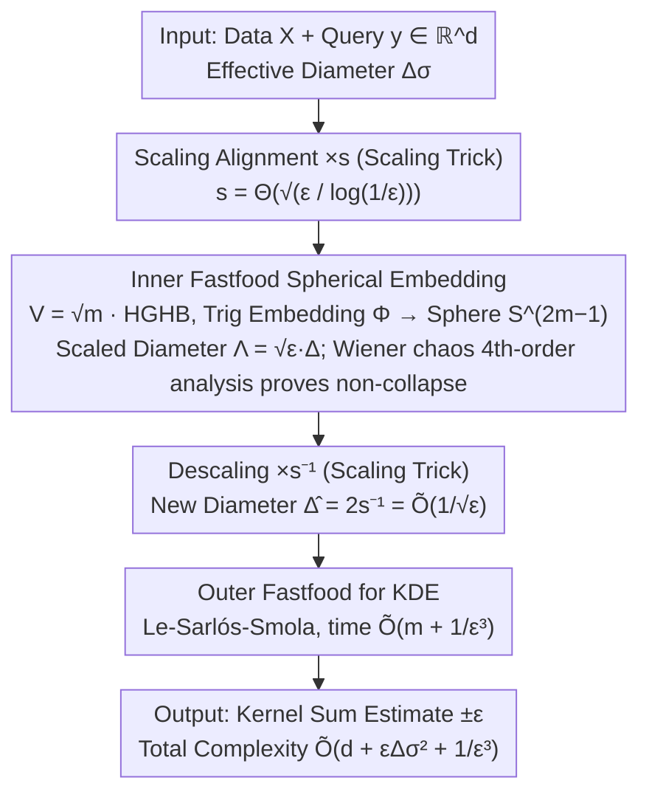

# New Bounds for Kernel Sums via Fast Spherical Embeddings

**Conference**: ICML 2026  
**arXiv**: [2605.01263](https://arxiv.org/abs/2605.01263)  
**Code**: None  
**Area**: Algorithm Theory / Kernel Density Estimation / Random Projections  
**Keywords**: KDE, Gaussian kernel, Fastfood, Randomized Hadamard Transform, Wiener chaos

## TL;DR
The authors accelerate the "randomized Nash device" spherical embedding theorem of Bartal-Recht-Schulman 2011 using iterative Fastfood transforms (time $\widetilde{O}(d + \Lambda^2 + \varepsilon^{-2})$). This serves as a preprocessing step for Gaussian KDE to compress the effective diameter to $\widetilde{O}(1/\sqrt{\varepsilon})$, yielding a new Gaussian KDE query time bound of $\widetilde{O}(d + \varepsilon \Delta_\sigma^2 + 1/\varepsilon^3)$, which outperforms RFF / FJLT+RFF / Fastfood in the regime of small $\varepsilon$ and medium diameter.

## Background & Motivation

**Background**: Kernel Density Estimation (KDE) is a fundamental ML tool aiming to estimate $\frac{1}{|X|} \sum_{x \in X} \mathbf{k}(x, y)$ for a query $y$ within $\pm \varepsilon$ precision (with high probability). Over the past decade, high-dimensional Gaussian KDE query times have been dominated by three methods: (i) RFF $O(d/\varepsilon^2)$, (ii) FJLT + RFF $\widetilde{O}(d + 1/\varepsilon^4)$, and (iii) Fastfood $\widetilde{O}(d + \Delta_\sigma^2/\varepsilon^2)$. These are incomparable and depend on the specific values of dimension $d$, error $\varepsilon$, and effective diameter $\Delta_\sigma = \Delta/\sigma$.

**Limitations of Prior Work**: Each method has "uncovered" parameter intervals. Fastfood is optimal for small diameters, but $\Delta_\sigma^2 / \varepsilon^2$ places the diameter in the numerator (worsening as diameter increases); RFF/FJLT are diameter-independent but carry a heavy dependence on $\varepsilon$. Is it possible to construct a bound where the diameter appears in a "friendlier" manner (e.g., $\varepsilon \Delta_\sigma^2$, where smaller $\varepsilon$ is beneficial)?

**Key Challenge**: The bottleneck of Fastfood is the output dimension $d' = O(\Delta_\sigma^2 / \varepsilon^2)$, which is necessitated by the diameter of the data region. If a "diameter-compressing" preprocessing could be performed before Fastfood to reduce the effective diameter, the overall complexity would improve. However, this preprocessing must be fast and must not distort distances in a way that affects kernel estimation accuracy.

**Goal**: Construct a "fast spherical embedding" with $\widetilde{O}(d + \Lambda^2 + \varepsilon^{-2})$ complexity that maps points to the unit sphere, preserves "small" distances $\leq \sqrt{\varepsilon}$ to $(1 \pm \varepsilon)$, and prevents "large" distances from collapsing below $\Omega(\sqrt{\varepsilon})$, thereby compressing the diameter to $1/\sqrt{\varepsilon}$. Then, stack Fastfood on top for KDE.

**Key Insight**: For Gaussian KDE, when distance $\geq \sqrt{\log(1/\varepsilon)}$, $e^{-\|x-y\|^2} \leq \varepsilon$. Thus, "large" distances do not require precise preservation as long as they do not collapse below $\sqrt{\log(1/\varepsilon)}$. This requirement exactly matches the spherical embedding theorem introduced by BRS 2011, but their implementation used full Gaussian matrices ($O(d/\varepsilon^2)$), which is too slow.

**Core Idea**: Use iterative Fastfood $\psi(H D_2 H D_1 x)$ (two layers of randomized Hadamard transforms) as a "fast version of BRS spherical embedding." The authors prove it satisfies the three properties of spherical embeddings and chain it as a preprocessing step before a second layer of Fastfood for KDE: $\psi(H D_4 H D_3 \cdot s^{-1} \psi(H D_2 H D_1 (s x)))$.

## Method

### Overall Architecture
A two-stage embedding. Stage 1: **Fast Spherical Embedding** $\Phi: \mathbb{R}^d \to \mathbb{S}^m$ with $m = \widetilde{O}(d + \Lambda^2 + \varepsilon^{-2})$. Data and queries are scaled by $s = \Theta(\sqrt{\varepsilon / \log(1/\varepsilon)})$ and passed through the **inner Fastfood**, outputting to $\mathbb{S}^{2m-1}$ with scaled diameter $\Lambda = s\Delta = \widetilde{O}(\sqrt{\varepsilon} \Delta)$. Stage 2: **Descaling + Outer Fastfood** for KDE. After descaling, points lie on a sphere of radius $s^{-1}$ with a new diameter $\widehat{\Delta} = 2 s^{-1} = \widetilde{O}(1/\sqrt{\varepsilon})$. Standard Fastfood (Le-Sarlós-Smola 2013) is then applied for KDE approximation with complexity $\widetilde{O}(m + \widehat{\Delta}^2/\varepsilon^2) = \widetilde{O}(m + 1/\varepsilon^3)$. The total complexity is $\widetilde{O}(d + \varepsilon \Delta_\sigma^2 + 1/\varepsilon^3)$. The pipeline is a cascaded "Scaling Alignment → Inner Fastfood Spherical Embedding (Diameter Compression) → Descaling → Outer Fastfood KDE."

### Key Designs

**1. Fastfood as Fast Spherical Embedding: Replacing Gaussian Matrices with Structured ones**

BRS 2011 provided a "spherical embedding" tool to map points to a unit sphere, precisely preserving small distances while preventing large ones from collapsing. This fits the Gaussian KDE requirement ("accurate for near, non-collapsing for far"). However, their use of full Gaussian matrices $W$ results in $O(d/\varepsilon^2)$ time. This paper replaces $W$ with iterative Fastfood. The mapping $\Phi$ takes $x\in\mathbb{R}^m$ via Fastfood matrix $V=\sqrt{m}\cdot HGHB$ ($H$ normalized Hadamard, $G=\text{diag}(g)$ Gaussian diagonal, $B$ Rademacher sign diagonal) into a trigonometric embedding:

$$\Phi(x)_{2j-2}=\tfrac{1}{\sqrt m}\cos((Vx)_j),\quad \Phi(x)_{2j-1}=\tfrac{1}{\sqrt m}\sin((Vx)_j),$$

where the output lies on $\mathbb{S}^{2m-1}$ naturally due to $\sin^2+\cos^2=1$. $Vx$ is computed in $O(m\log m)$ via Walsh-Hadamard Transform, reducing spherical embedding time from $O(d/\varepsilon^2)$ to $O(m\log m)$, while RHT acts as a Gaussian approximation to preserve statistical properties (Theorem 1.3).

**2. Fourth-Order Wiener Chaos Analysis for Distance Contraction: Hardcore Proof for Non-Collapse**

To prove $\Phi$ does not contract small distances by more than $(1-\varepsilon)$ (Theorem 1.3, item 2), second-moment analysis is insufficient. Starting from the Taylor lower bound $1-\cos(\theta)\ge\tfrac12\theta^2-\tfrac{1}{24}\theta^4$, the authors derive:

$$\|\Phi(x)-\Phi(y)\|^2 \ge Q(z)-\tfrac{1}{12}W(z),\quad Q(z)=\tfrac1m\|Vz\|^2,\ W(z)=\tfrac1m\sum_j (Vz)_j^4.$$

While the second-order term $Q(z)$ is handled by Bernstein's inequality, the fourth-order term $W(z)$—a Gaussian chaos function—is decomposed into 2nd and 4th order Wiener chaos using $t^4-3=6h_2(t)+h_4(t)$. These are controlled via Bernstein and Wiener chaos hypercontractivity (Theorem 3.6). This is the core technical innovation: Le-Sarlós-Smola 2013 used Lipschitz Gaussian concentration for second moments, whereas proving the collapse lower bound requires the variance of $(Vz)_j^4$, necessitating chaos decomposition.

**3. Scaling Trick to Align "Small Distance Thresholds" with Gaussian KDE**

BRS embeddings precisely preserve small distances $\le\sqrt{\varepsilon}$, but Gaussian KDE cares about the threshold $\sqrt{\log(1/\varepsilon)}$. The authors align these scales using a clean trick: inputs are scaled by $s=\Theta(\sqrt{\varepsilon/\log(1/\varepsilon)})$ before embedding and descaled by $s^{-1}$ after. Thus, original distances $\le\sqrt{\log(1/\varepsilon)}$ are preserved, while those $\ge\sqrt{\log(1/\varepsilon)}$ remain $\ge \Omega(\sqrt{\log(1/\varepsilon)})$, ensuring their Gaussian terms stay below $\varepsilon$. After descaling, the new diameter $\widehat\Delta=2s^{-1}=\widetilde O(1/\sqrt\varepsilon)$ allows the outer Fastfood to achieve $\widetilde O(1/\varepsilon^3)$, which is why the diameter term in the new bound is multiplied by $\varepsilon$ rather than divided by it.

### Loss & Training
This work is purely theoretical. All "parameters" (embedding dimension $m$, scaling factor $s$, Hadamard order) are explicitly determined by theoretical analysis.

## Key Experimental Results
This is a theoretical paper without experimental tables. Complexity comparisons are visualized in Table 1 and Figure 1.

### Main Results

| Method | Query Time | Optimal Regime |
|------|----------|----------|
| RFF | $O(d / \varepsilon^2)$ | $d \lesssim \varepsilon^{-2}$ and $\Delta_\sigma \gtrsim \sqrt{d} \varepsilon^{-1.5}$ |
| FJLT + RFF | $\widetilde{O}(d + 1/\varepsilon^4)$ | $d \gtrsim \varepsilon^{-2}$ and $\Delta_\sigma \gtrsim \varepsilon^{-2.5}$ |
| Fastfood | $\widetilde{O}(d + \Delta_\sigma^2/\varepsilon^2)$ | $\Delta_\sigma \lesssim \min\{\sqrt{d}, \varepsilon^{-0.5}\}$ |
| **Ours (Theorem 1.2)** | $\widetilde{O}(d + \varepsilon \Delta_\sigma^2 + 1/\varepsilon^3)$ | $\varepsilon^{-0.5} \lesssim \Delta_\sigma \lesssim \min\{\sqrt{d} \varepsilon^{-1.5}, \varepsilon^{-2.5}\}$ |

The four methods are incomparable; each is optimal in its own parameter space. The proposed method occupies the "medium diameter + small $\varepsilon$" regime, which was previously uncovered.

### Ablation Study

| Extension | Kernel | Query Time |
|------|------|----------|
| Theorem 1.4 | Inverse Multi-Quadratic $\mathbf{k}_\beta^{\text{IMQ}}(x,y) = (1 + \|x-y\|^2/\sigma^2)^{-\beta}$ | $\widetilde{O}(d + \varepsilon (\beta \Delta_\sigma)^2 + 1/\varepsilon^3)$ |
| Theorem 1.5 | Gaussian + Differential Privacy (Function Release) | Same as Thm 1.2, given $|X| \geq \widetilde{O}(1/(\varepsilon^2 \varepsilon_{\text{DP}}))$ |

Two extensions verify the core technology (fast spherical embedding): IMQ uses function approximation from Cherapanamjeri-Silwal-Woodruff 2024; DP is achieved by controlling probabilistic dependence between RHT output coordinates.

### Key Findings
- In the new bound, $\varepsilon$ **multiplies** the diameter term $\varepsilon \Delta_\sigma^2$ rather than dividing it—meaning a smaller $\varepsilon$ actually reduces the diameter's impact, a polarity reversal from original Fastfood.
- Fourth-order chaos control is critical: Bernstein's analysis only provides upper bounds (distance expansion). Proving distance contraction requires the variance of $(Vz)_j^4$, which is a fourth-order Wiener chaos quantity requiring hypercontractivity.
- The dual-layer Fastfood structure resonates with heuristic 3-layer RHT approaches in SORF (2017) and Andoni et al. (2015), but this work provides the first theoretical guarantee for a dual-layer version.
- Theorem 1.3 (Fast Spherical Embedding) may have independent applications beyond KDE for any task requiring "accurate near-distances, non-collapsing far-distances."

## Highlights & Insights
- The algorithmic re-composition of "compress diameter via fast embedding, then cascade Fastfood" is highly efficient—it reuses existing blocks with precise scale alignment to achieve new bounds.
- Wiener chaos decomposition + hypercontractivity for RHT fourth-order control is a powerful technical tool that the ML community should note; such Gaussian polynomial tools are rare in random projection literature but essential for analyzing structured sketches.
- Translating the conceptual "randomized Nash device" (BRS 2011) into a fast version bridges metric embedding theory with kernel approximation.

## Limitations & Future Work
- The upper bound is only optimal in a specific $\Delta_\sigma$ interval ($\varepsilon^{-0.5} \lesssim \Delta_\sigma \lesssim \varepsilon^{-2.5}$); outside this range, previous bounds dominate.
- Constant factors are not experimentally verified; log factors hidden in $\widetilde{O}$ (especially from Wiener chaos) could be large in practice.
- Primarily targets additive error KDE; applying this embedding to relative error KDE would require significant additional work.
- The spherical embedding theorem itself might have independent applications (e.g., Lipschitz extension) not explored here.

## Related Work & Insights
- **vs RFF / FJLT + RFF**: These are diameter-independent; ours explicitly depends on $\Delta_\sigma$ but in a friendlier $\varepsilon \Delta_\sigma^2$ form.
- **vs Fastfood**: Our method effectively nests Fastfood within Fastfood—one for compression, one for KDE.
- **vs Importance Sampling (Charikar-Siminelakis 2017)**: That line provides relative error but with higher polynomial complexity; this work focuses on additive error.
- **vs SORF (Yu et al. 2016)**: SORF uses multiple RHTs based on empirical heuristics; this work provides the first theoretical guarantee for a dual-layer RHT via Wiener chaos.
- **Insight**: Spherical embeddings and Wiener chaos tools might be applicable to ML systems like attention sketching or KV-cache compression, where kernel-like operations similarly require distance-sensitive approximations.

## Rating
- Novelty: ⭐⭐⭐⭐ Algorithmically an elegant re-composition; introduce Wiener chaos as a new analysis tool.
- Experimental Thoroughness: ⭐⭐ Purely theoretical; lacks empirical constant factor comparison.
- Writing Quality: ⭐⭐⭐⭐⭐ Clear conceptual diagrams, tables, and complexity analysis.
- Value: ⭐⭐⭐⭐ Fills a gap in kernel approximation theory for specific parameter regimes; Theorem 1.3 has high potential for independent use.

<!-- RELATED:START -->

## Related Papers

- [\[ICLR 2026\] Probabilistic Kernel Function for Fast Angle Testing](../../ICLR2026/others/probabilistic_kernel_function_for_fast_angle_testing.md)
- [\[ICML 2026\] Polaris: Coupled Orbital Polar Embeddings for Hierarchical Concept Learning](polaris_coupled_orbital_polar_embeddings_for_hierarchical_concept_learning.md)
- [\[ICML 2026\] MalTree: Tracing Malware Evolution from Embeddings at Scale](maltree_tracing_malware_evolution_from_embeddings_at_scale.md)
- [\[ICLR 2026\] QUEST: A Robust Attention Formulation Using Query-Modulated Spherical Attention](../../ICLR2026/others/quest_a_robust_attention_formulation_using_query-modulated_spherical_attention.md)
- [\[ICML 2025\] K²IE: Kernel Method-based Kernel Intensity Estimators for Inhomogeneous Poisson Processes](../../ICML2025/others/k2ie_kernel_method-based_kernel_intensity_estimators_for_inhomogeneous_poisson_p.md)

<!-- RELATED:END -->
