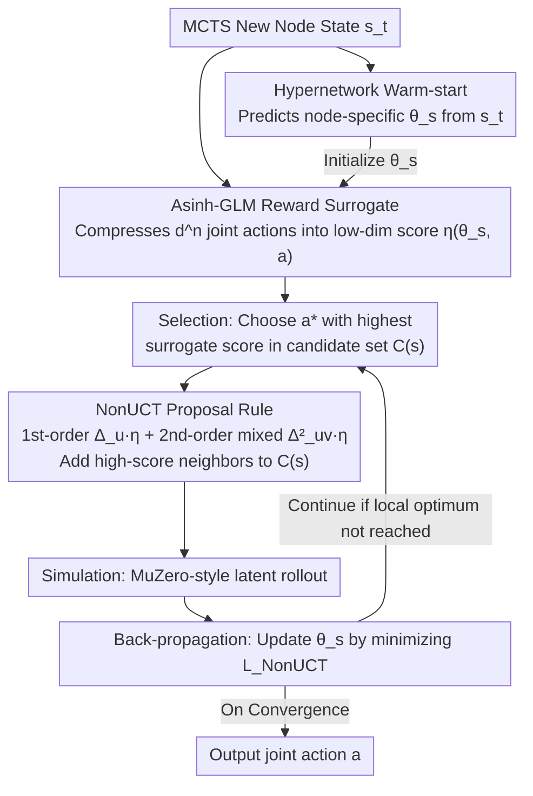

# NonZero: Interaction-Guided Exploration for Multi-Agent Monte Carlo Tree Search

**Conference**: ICML 2026 Spotlight  
**arXiv**: [2605.00751](https://arxiv.org/abs/2605.00751)  
**Code**: None  
**Area**: Multi-Agent Reinforcement Learning / Monte Carlo Tree Search / Non-linear Bandit  
**Keywords**: MCTS, joint action explosion, second-order difference interaction, curvature-aware exploration, asinh-GLM

## TL;DR
Ours compresses the multi-agent MCTS joint-action space $d^n$ into a low-dim non-linear bandit using an asinh-linked GLM surrogate. It implements the NonUCT proposal rule based on "first-order difference + second-order mixed difference" to maintain a small candidate set $\mathcal{C}(s)$ at each node. Theoretical analysis proves a local regret of $\widetilde{O}(T^{3/4})$ (independent of $d^n$). Experimental results on MatGame, SMAC, and SMACv2 demonstrate superior sample efficiency and final performance over strong baselines like MAZero.

## Background & Motivation

**Background**: MCTS combined with UCT serves as an industrial-standard solution for single-agent decision-making (e.g., AlphaZero, MuZero) by balancing exploration vs. exploitation via confidence interval terms. However, extending this to multi-agent cooperative tasks (e.g., SMAC, SMACv2, MatGame) immediately encounters the joint-action explosion: with $n$ agents each having $d$ actions, the joint set size is $|\mathcal{A}| = d^n$. MAZero addresses this through distributed model learning, MALinZero reduces search via linear reward structure assumptions, and VDN/QMIX utilize value decomposition.

**Limitations of Prior Work**: (1) Random sampling in Sampled MuZero/MAZero-type models depends heavily on the quality of the proposal $\beta$, often failing to capture critical combinations in high-dimensional sparse optimal joint-action scenarios. (2) MALinZero assumes that rewards are a linear superposition of individual agent contributions, failing in "coordination traps" where a single agent's deviation decreases reward while simultaneous deviations by two agents increase it. (3) The additivity/monotonicity assumptions in VDN/QMIX do not support "uncertainty-aware action expansion" and are incompatible with tree search.

**Key Challenge**: To achieve sample-efficient multi-agent planning, the method must both cover coordinated actions (avoiding purely marginal gains of single agents) and avoid enumerating $d^n$ joint actions, which is statistically intractable as it requires $\Omega(d^n)$ samples for global optimality.

**Goal**: To maintain a candidate set $\mathcal{C}(s)$ of size $K$ at each tree node and incrementally add new candidates using a proposal rule capable of sensing "two-agent coordination gains," while providing a sublinear regret guarantee to prove the protocol's sufficiency.

**Key Insight**: The objective is relaxed from "global optimality" to "graph-local optimality" (i.e., no 1-agent or 2-agent deviation can improve the joint action). Under this relaxed objective, one only needs to examine the "neighbors" (first-order difference $\Delta_u \eta$) and "neighbors of neighbors" (mixed second-order difference $\Delta_{u,v}^2 \eta$) of each candidate to identify coordination opportunities. Reward modeling utilizes an asinh-GLM $\eta(\theta, a) = c \cdot \text{asinh}(\alpha \langle w(\theta), \psi(a)\rangle)$ to ensure polynomial derivative decay (vs. the exponential saturation of sigmoids), supporting curvature-aware optimization.

**Core Idea**: By using a "low-dimensional non-linear GLM surrogate + first/second-order discrete differences as bandit proposal signals," the $d^n$ joint action exploration is reduced to an action-dimension-free curvature-aware local search problem.

## Method

### Overall Architecture
NonZero follows the MuZero trio of (i) representation, (ii) dynamics, and (iii) prediction, adding a fourth component: (iv) a hypernetwork that outputs initial GLM parameters $\theta_s$ specific to each node based on the node state. The MCTS process is modified into four steps. **Selection**: Pick $a^* = \arg\max_{a \in \mathcal{C}(s)} \eta(\theta_s, a)$ within the candidate set $\mathcal{C}(s)$ using surrogate scores instead of UCB. **Expansion**: When adding a node, propose new candidates via NonUCT — sampling direction $u = (i \leftarrow j)$ (agent $i$ changing to action $j$) and an independent $v = (k \leftarrow \ell)$, then calculating $\Delta_u \eta = \eta(\theta, a^{(u)}) - \eta(\theta, a)$ and mixed $\Delta_{u,v}^2 \eta = \eta(\theta, a^{(u,v)}) - \eta(\theta, a^{(u)}) - \eta(\theta, a^{(v)}) + \eta(\theta, a)$ to select high-scoring neighbors. **Simulation**: MuZero-style latent rollout. **Back-propagation**: Use environmental rewards and model reward heads to calculate first/second-order difference targets, minimizing $\mathcal{L}_{\text{NonUCT}}$ to update $\theta_s$. The hypernetwork provides cross-node warm-starts, predicting initial $\theta$ from the root state, which facilitates statistical strength sharing across tree nodes and allows fitting $\theta_s$ with few updates.

### Key Designs

**1. Asinh-GLM Reward Surrogate: Compressing $d^n$ joint actions into a low-dimensional parameter space via a globally smooth link function**

The joint action space $d^n$ is too large to enumerate. The first step involves building a low-dimensional surrogate for rewards. For each joint action $a\in\{0,1\}^{nd}$, a score $z=\langle w,\psi\rangle$ is calculated via feature map $\psi(a)$ and parameters $w(\theta)\in\mathbb{R}^{nd}$, followed by an asinh link $\eta(\theta,a)=c\cdot\text{asinh}(\alpha z)$. The choice of asinh over sigmoid/ReLU is theoretically motivated: it is strictly monotonic, unbounded, and infinitely differentiable. Its derivative $g'(z)=c\alpha/\sqrt{1+(\alpha z)^2}$ decays polynomially, avoiding the exponential saturation of sigmoid or the lack of high-order smoothness in ReLU. Use of this smoothness satisfies the discrete smoothness in Assumption 3.2, enabling the regret analysis in Theorem 3.5. Furthermore, asinh-GLM is invex in the sense of Kalai-Sastry (2009), meaning approximate local maxima are equivalent to global optimism, allowing the relaxation to local objectives without significant solution loss.

**2. NonUCT Proposal Rule via First and Second-order Mixed Differences: Capturing coordination gains through curvature signals**

Linear additivity assumptions like those in MALinZero fail in "coordination traps"—where single agent deviations are worse, but dual agent deviations are better. NonZero decomposes the "dual deviation gain" using an identity: $\eta(a^{(u,v)})-\eta(a)=\Delta_u\eta+\Delta_v\eta+\Delta_{u,v}^2\eta$, where the mixed difference

$$\Delta_{u,v}^2\eta = \eta(a^{(u,v)}) - \eta(a^{(u)}) - \eta(a^{(v)}) + \eta(a)$$

serves as a pure signal for coordination gain. When two single deviations yield no gain but their combination does, this second-order term becomes significantly positive. The NonUCT rule samples directions $u$ and $v$, selecting the best $u$ or $(u,v)$ based on predicted scores to add to the candidate set $\mathcal{C}(s)$. All counter-factual evaluations are performed by the learned reward model without additional environment interaction. This is efficient because UCB-style global optimism requires $\widetilde{O}(d^n)$ samples, whereas using $\Delta_{u,v}^2$ as a curvature signal requires only a finite number of directions (independent of $d^n$), achieving action-dimension-free exploration.

**3. Hypernetwork for Cross-node Warm-starting of $\theta_s$: Injecting global experience into initial values of new nodes**

The validity of the first two points depends on fitting the GLM parameters $\theta_s$ accurately at each node. However, with limited samples in a single MCTS rollout, fitting from scratch does not converge. A fourth network head is added: when a new node $s$ is added to the tree, the hypernetwork predicts an initial value $\theta_s=\text{HyperNetwork}(s_t)$, which is then fine-tuned via $\mathcal{L}_{\text{NonUCT}}$ in subsequent iterations. The hypernetwork is learned end-to-end in the main training loop. This shares statistical strength across the tree, injecting "global experience" as a prior into each new node, allowing local convergence to $\theta^*$ in just a few gradient steps.

### Loss & Training
The loss performs regression on four quantities (Eq. 7): $\mathcal{L}_{\text{NonUCT}} = \min_\theta \mathbb{E}_{a,u,v} \frac{1}{4} [(\eta(\theta, a) - \eta(\theta^*, a))^2 + (\eta(\theta, a^{(u)}) - \eta(\theta^*, a^{(u)}))^2 + (\Delta_u \eta(\theta, a) - \Delta_u \eta(\theta^*, a))^2 + (\Delta_{u,v}^2 \eta(\theta, a) - \Delta_{u,v}^2 \eta(\theta^*, a))^2]$. The supervision signal $\theta^*$ comes from the model-side reward head; environment rewards are collected once per selected joint action. Theorem 3.5 gives $\mathbb{E}[\text{Regret}_T] \leq (1 + C_1 \sqrt{4 T R_T}) \cdot \mathcal{K}(\epsilon)$ where $\mathcal{K}(\epsilon) = \max(4\zeta_h \epsilon^{-2}, \sqrt{\zeta_{3rd}} \epsilon^{-3/2})$, and Corollary 3.6 gives $\widetilde{O}(T^{3/4})$. Theorem 3.7 demonstrates a separation from standard UCB: $\zeta_{\text{sep}} \geq \exp(c \cdot nd) / \text{poly}(nd, \epsilon^{-1})$, representing exponential acceleration.

## Key Experimental Results

### Main Results
On the MatGame benchmark with varying numbers of agents, actions, and reward types, NonZero was compared against MAZero, MAZero-NP, MA-AlphaZero, MAPPO, and QMIX:

| Agent × Action | Type | Steps | MAZero | QMIX | **NonZero** |
|----------------|------|-------|--------|------|-------------|
| 2×3 | Linear | 1000 | 57.8 | 54.3 | **59.8** |
| 2×3 | Non-Linear | 1000 | 47.6 | 49.1 | **49.9** |
| 4×5 | Non-Linear | 2000 | 195.4 | 190.3 | **199.1** |
| 6×8 | Non-Linear | 2000 | 443.9 | 431.7 | **457.2** |
| 8×10 | Linear | 2000 | 692.7 | 679.4 | **712.4** |
| 8×10 | Non-Linear | 2000 | 672.3 | 648.2 | **697.1** |

The performance gap widens with complexity—at 8 agents and 10 actions ($10^8$ joint action space), NonZero improves by approximately 14% over the strongest baseline, with more pronounced advantages in non-linear reward scenarios.

### Ablation Study

| Configuration | MatGame Performance | Description |
|---------------|---------------------|-------------|
| Full NonZero | High | Includes hypernetwork + curvature |
| w/o Curvature | Medium-Low | Reverts to 1st-order gradient, removes mixed 2nd-order term |
| w/o Mixing Net| Slightly Lower | Removes hypernetwork initialization |
| w/o Both | Lowest | Coordination Failure |

Both components are necessary, but removing curvature results in a larger loss than removing the mixing net, confirming that the "second-order difference signal" is the primary driver of NonZero's performance.

### Key Findings
- "Coordination traps" are perfectly captured by $\Delta_{u,v}^2$: when single agent deviations are negative but simultaneous deviations are positive, traditional single-agent UCB fails to find these actions, whereas the mixed difference signal amplifies them.
- The performance gap expands as the action space dimension increases, empirically validating the action-dimension-free theoretical guarantee.
- The warm-start provided by the hypernetwork makes $\theta_s$ optimization highly efficient within a single MCTS rollout, allowing significant gains over MAZero even with a simulation budget as low as 100.
- The separation in Theorem 3.7 (exponential vs. polynomial) corresponds to the observed trend where NonZero's advantage grows with the action space size.

## Highlights & Insights
- Explicitly modeling "coordination"—a core MARL difficulty—as a mixed second-order difference $\Delta_{u,v}^2$ is a clean abstraction. While VDN/QMIX hide coordination implicitly within a mixing function, ours extracts it explicitly as a controllable and sample-efficient score.
- Choosing the asinh link over sigmoid/ReLU is a non-trivial decision. It is not just an engineering preference but allows the curvature analysis (Wiener chaos style) to proceed. This idea of "exchanging activation function smoothness for theoretical guarantees" is insightful for Deep RL algorithm design.
- Relaxing the multi-agent MCTS explore-exploit from global UCB (infeasible) to graph-local optimism is a critical conceptual shift: local optimum is equivalent to global optimism under an invex landscape.
- The use of a hypernetwork to share $\theta$ initials across nodes leverages meta-learning ideas, injecting "experience priors" into MCTS to make single-rollout statistical estimation feasible.

## Limitations & Future Work
- Theoretical analysis is restricted to non-linear bandits with deterministic rewards; real agents often face partial observability and stochastic transitions, leaving a theoretical gap.
- $\widetilde{O}(T^{3/4})$ is slower than the standard bandit rate of $\widetilde{O}(\sqrt{T})$, which the authors acknowledge as the cost for action-dimension-free properties.
- Mixed difference $\Delta_{u,v}^2$ only considers dual-agent coordination. Higher-order coordination involving more than two agents lacks a mechanism, which might miss nuances in tasks like 5v5 SMAC.
- Candidate set size $K$ is a fixed hyperparameter and does not adapt; optimal $K$ may vary significantly across nodes.
- Hypernetwork training depends on the global training loop; during the cold-start phase, its outputs are unreliable, potentially slowing local $\theta_s$ convergence.

## Related Work & Insights
- **vs Sampled MuZero / MAZero**: Both utilize candidate sets and importance sampling for large action spaces, but proposals are based on policy prior sampling. NonZero actively constructs proposals using surrogate curvature, making them far more targeted.
- **vs MALinZero**: Both use surrogate-guided MARL MCTS, but MALinZero assumes a linear additive structure. NonZero uses asinh-GLM to support non-additive interactions, covering "coordination trap" scenarios.
- **vs VDN / QMIX / NDQ**: These use value decomposition but only support evaluation at decision time, lacking tree-search uncertainty-aware expansion. NonZero is search-native.
- **vs LinUCB / Neural UCB**: These are contextual bandit frameworks. NonZero customizes NonUCT for joint action discrete structures, replacing the "feature space" of contextual bandits with a "neighbor graph."

## Rating
- Novelty: ⭐⭐⭐⭐ Mixed second-order difference as a MARL exploration signal is a clear contribution.
- Experimental Thoroughness: ⭐⭐⭐⭐ Covered MatGame, SMAC, and SMACv2 with 2 to 8 agents; clear ablations.
- Writing Quality: ⭐⭐⭐⭐ Theory and algorithm boxes are well-provided; notation is dense but traceable.
- Value: ⭐⭐⭐⭐ Meaningful for large-scale multi-agent planning with both theoretical and empirical support.

<!-- RELATED:START -->

## Related Papers

- [\[AAAI 2026\] Extreme Value Monte Carlo Tree Search for Classical Planning](../../AAAI2026/others/extreme_value_monte_carlo_tree_search_for_classical_planning.md)
- [\[ICML 2026\] Markov Chain Monte Carlo without Evaluating the Target: An Auxiliary Variable Approach](markov_chain_monte_carlo_without_evaluating_the_target_an_auxiliary_variable_app.md)
- [\[ICML 2026\] Structure-Induced Information for Rerooting Levin Tree Search](structure-induced_information_for_rerooting_levin_tree_search.md)
- [\[ICML 2026\] Mapping Human Anti-collusion Mechanisms to Multi-agent AI Systems](mapping_human_anti-collusion_mechanisms_to_multi-agent_ai_systems.md)
- [\[ICML 2026\] Decision Tree Learning on Product Spaces](decision_tree_learning_on_product_spaces.md)

<!-- RELATED:END -->
