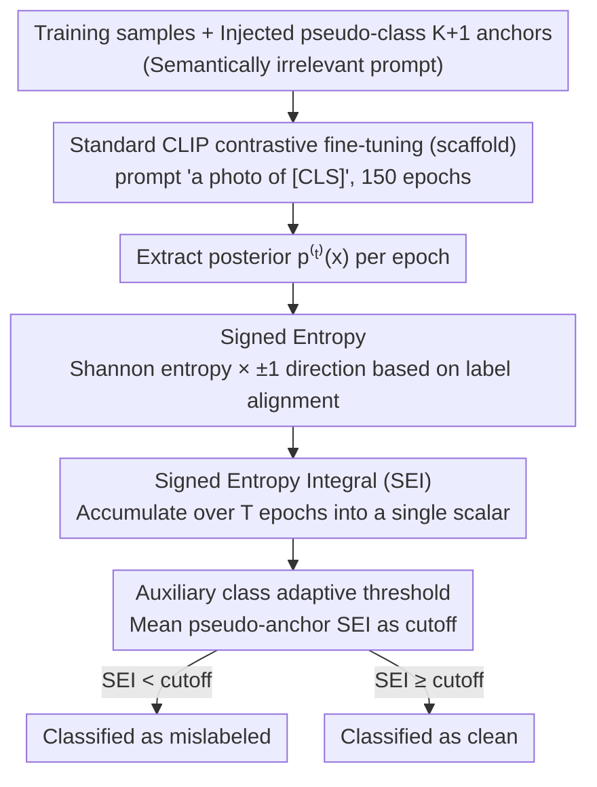

# On Revisiting Entropy for Identifying Mislabeled Images

**Conference**: ICML 2026  
**arXiv**: [2605.31090](https://arxiv.org/abs/2605.31090)  
**Code**: https://github.com/MedAITech/SEI  
**Area**: Noisy Labels / Robust Learning / Representation Learning / Training Dynamics  
**Keywords**: Mislabeled Image Detection, Training Dynamics, Signed Entropy, CLIP, Medical Imaging

## TL;DR
It is observed that the phenomenon where "mislabeled samples maintain high predictive entropy throughout training" is insufficient to distinguish them from hard clean samples. This work introduces **signed entropy** by multiplying entropy with a sign bit indicating "whether the prediction aligns with the given label." By accumulating this over training epochs into the **SEI** statistic, the method achieves a new SOTA in mislabeled detection (up to 11%+ improvement) on medical datasets (ISIC/DeepDRiD/PANDA/CheXpert) and CIFAR-100N in a plug-and-play manner.

## Background & Motivation

**Background**: Mislabeled sample detection primarily follows two paths. First, **loss-based** methods (O2U-Net, CORES, AUM), where mislabeled samples exhibit higher loss. Second, **prediction-statistics-based** methods (Confident Learning, SIMIFEAT, DEFT, LEMoN), which rely on pre-trained models to perform kNN or clustering in feature or vision-language alignment spaces. These methods either require modifying the training pipeline (multi-stage, special losses, memory modules) or rely heavily on the generalization of generic pre-trained models.

**Limitations of Prior Work**: In **medical imaging**, where images are highly similar and even experts make labeling errors, the discriminative power of generic CLIP models significantly diminishes, causing feature-based methods (DEFT, LEMoN) to fail. Furthermore, loss/confidence-based methods are sensitive to training fluctuations, and signals captured in a single epoch are unstable. Most critically, **hard clean samples and mislabeled samples are nearly indistinguishable via entropy or loss alone**—both cause model uncertainty, leading to the false rejection of hard samples when using simple entropy thresholds.

**Key Challenge**: Entropy only characterizes "distribution uncertainty," which is a **non-directional** quantity; it does not indicate "whether the model believes the provided label." The essential difference between mislabeled and hard clean samples is not the degree of uncertainty, but the **direction of consistency** between the model's prediction and the given label.

**Goal**: To design a **plug-and-play, single-scalar** mislabeled detection metric that: (a) does not alter the training process; (b) utilizes both the magnitude and direction of entropy; (c) accumulates across epochs to resist noise; and (d) does not depend on the zero-shot transfer performance of generic pre-trained models in the target domain.

**Key Insight**: Training dynamics are decomposed into two signals: the **trajectory of entropy evolution** and the **trajectory of consistency between predictions and labels**. Observations show that easy clean samples align with labels most of the time with monotonically decreasing entropy; hard clean samples are misaligned early and aligned later with entropy peaking then dropping; whereas mislabeled samples remain misaligned and maintain high entropy throughout. This allows for the injection of "consistency" as an additional signal into the entropy measure.

**Core Idea**: Shannon entropy is multiplied by a sign bit $(-1)^{\mathbb{1}[y=\arg\max p]}$ determined by whether the predicted argmax equals the given label, resulting in **signed entropy**. Accumulating this over training epochs yields the SEI—mislabeled samples receive strong negative integrals, while clean samples receive positive results, allowing a single parameter to rank all samples.

## Method

### Overall Architecture
SEI does not modify the training process but attaches a "statistical probe" to a standard pipeline. Using CLIP, class names are converted into prompts `"a photo of [CLS]"`, and standard contrastive fine-tuning is performed based on cosine similarity. At the end of each epoch, a directional entropy value is recorded for each sample. After 150 epochs, this trajectory is integrated along $t$ into a single scalar SEI. A self-calibrating threshold is then used to identify low-scoring samples as mislabeled. In essence, it **fuses the "magnitude of entropy" and "alignment consistency" into a single rankable score**, where mislabeled samples naturally fall at one end of the spectrum.

### Key Designs

**1. Signed Entropy: Adding a ±1 Direction to Directionless Entropy**

Shannon entropy measures distribution uncertainty as a non-negative, directionless quantity. Both mislabeled and hard clean samples exhibit high entropy, making them indistinguishable. The proposed approach multiplies entropy by a sign bit based on whether the current prediction's argmax matches the given label: for the posterior $\bm{p}(\bm{x})$ at a given epoch, let $\mathcal{H}(\bm{p}(\bm{x}), y) = (-1)^{\mathbb{1}[y=\arg\max_k p_k(\bm{x})]} \sum_k p_k(\bm{x})\log p_k(\bm{x})$. Alignment corresponds to a **positive sign**, while misalignment corresponds to a **negative sign**, with the unsigned magnitude $-\sum p\log p\ge 0$ serving as the amplitude. Consequently, mislabeled samples (consistently misaligned) and hard clean samples (initially misaligned, finally aligned) produce trajectories in **opposite directions**, ensuring separability during integration.

**2. Signed Entropy Integral: Integrating Training Trajectories to Reduce Noise**

Prediction or loss values in a single epoch are noisy and sensitive to hyperparameters. SEI compresses the signed entropy curve of length $T$ for each sample into a single scalar by summing over training: $\mathrm{SEI}(\bm{x},y) = \sum_{t=1}^T \mathcal{H}(\bm{p}^{(t)}(\bm{x}), y)$. Samples naturally cluster into three segments: easy clean samples (consistently aligned, large positive integral), hard clean samples (sign changes, **canceling out** in the middle), and mislabeled samples (consistently misaligned, large negative integral). Integration acts as a "natural averaging" of the trajectory. Ablations (Table 4) show that single-epoch slices (SE@T or SE@T/2) perform 8–15 F1 points worse than SEI, while SEI outperforms unsigned integration (EI) by 10+ points on average.

**3. Auxiliary Class Adaptive Threshold: Self-calibration with Pseudo-class Anchors**

Fixed thresholds fail across different datasets or noise rates, and relying on clean hold-out sets violates the "no clean data" assumption. This work injects **guaranteed mislabeled** anchor samples by randomly selecting $N/(K+1)$ images and assigning them to a non-existent pseudo-class $K+1$. Using a semantically irrelevant prompt (e.g., "a dermoscopic image showing other lesions"), these samples serve as proxies for real mislabeled data. The mean SEI of these anchors defines the cutoff threshold. This approach draws inspiration from AUM's "anchor" strategy but utilizes CLIP-friendly pseudo-class prompts rather than random label flipping.

### Loss & Training
SEI does not introduce new loss functions. Training follows the standard CLIP image-text contrastive loss (aligning images with $K$ class text embeddings using the prompt `"a photo of [CLS]"`). Detection is performed offline after forwarding to obtain $\bm{p}^{(t)}(\bm{x})$. Implementation: SGD with momentum 0.9, weight decay $1\times 10^{-4}$, batch size 128, initial lr $1\times 10^{-3}$, 150 epochs, with 10× decay at epochs 75 and 115. Images are resized to $224\times 224$.

## Key Experimental Results

### Main Results
Evaluation on three medical datasets (ISIC, DeepDRiD, PANDA) plus CIFAR-100N under symmetric and confusion-calibrated noise at rates $\eta\in\{0.1...0.5\}$. Comparison against 10 baselines (AUM, CORES, CL, SIMIFEAT, DEFT, LEMoN, etc.) using F1 score.

| Dataset | Noise | $\eta$ | SEI | Second Best | Gain |
|--------|------|--------|------|---------|------|
| ISIC | symmetric | 0.5 | **83.93** | CORES 82.67 | +1.26 |
| ISIC | confusion | 0.4 | **74.98** | AUM 64.54 | **+10.44** |
| DeepDRiD | symmetric | 0.5 | **78.19** | AUM 75.75 | +2.44 |
| DeepDRiD | confusion | 0.5 | **73.04** | LEMoN 66.82 | +6.22 |
| PANDA | symmetric | 0.3 | **81.46** | AUM 75.95 | +5.51 |
| PANDA | confusion | 0.1 | **73.17** | AUM 61.30 | **+11.87** |
| CheXpert (Clinical) | — | — | **83.59** | AUM 80.34 | +3.25 |

SEI shows a much larger advantage under confusion-calibrated noise, indicating robustness to samples confused with neighboring classes—the primary form of mislabeling in clinical settings.

### Ablation Study

| Configuration | ISIC@0.4 | DeepDRiD@0.4 | PANDA@0.4 | Description |
|------|----------|--------------|-----------|------|
| EI (No sign) | 60.77 | 59.28 | 67.26 | Degenerates to unsigned integral |
| SE@T (Single epoch) | 57.89 | 57.93 | 62.91 | Final epoch slice |
| SE@T/2 (Mid-training) | 63.72 | 62.84 | 66.26 | Middle epoch slice |
| **SEI (Full)** | **74.98** | **68.35** | **81.96** | Both sign and accumulation |

### Key Findings
- **Sign bit contribution > Temporal integration**: Removing the sign bit (EI) drops F1 by over 10 points. Both designs are necessary, but the sign bit is more critical, validating the insight that entropy direction is more informative than magnitude.
- **Architecture Agnostic**: SEI improves across ResNet-50 and ViT-B/16, though CLIP achieves the best results due to vision-language alignment aiding pseudo-class calibration.
- **Superiority in Confusion Noise**: On harder confusion noise, SEI's lead over baselines is more pronounced. Methods relying on feature-space proximity (SIMIFEAT/DEFT) are misled by semantically close mislabeled samples, whereas SEI relies on directional consistency.
- **Real-world Clinical utility**: On CheXpert (majority vote clean labels vs. report-extracted noisy labels), SEI achieves 83.59 F1, outperforming AUM by 3.25, proving effectiveness in non-synthetic scenarios.

## Highlights & Insights
- **"Directional Entropy" is a simple yet vital operation**: The innovation lies in the $(-1)^{\mathbb{1}[y=\arg\max p]}$ bit. It fills a fundamental blind spot where entropy failed to distinguish mislabeled from hard clean samples. This shifts noisy label detection from a distribution-only perspective to a "distribution + direction" perspective.
- **Auxiliary class calibration is more elegant** than AUM's strategy: Injecting a "semantically irrelevant" pseudo-class via CLIP prompts provides a reasonable anchor without polluting the original labels. This trick is transferable to any CLIP-based uncertainty calibration task.
- **Dual signals in training dynamics**: Combining entropy magnitude with label alignment provides a new view of what can be learned from training history. This "Magnitude × Direction" decomposition is generalizable to other sample selection tasks like curriculum learning or coreset selection.

## Limitations & Future Work
- The auxiliary class threshold is **heuristic**; pseudo-class prompts affect the results, and systematic sensitivity analysis is missing.
- Obtaining the full SEI trajectory requires **150 training epochs**, which is more expensive than single-forward methods. The impact of early stopping on SEI performance is not discussed.
- Evaluation is focused on medical and CIFAR-100N datasets; performance on large-scale natural image benchmarks (e.g., Clothing1M, WebVision) remains untested.
- While CLIP is used as the backbone, the impact of using domain-specific models (e.g., BiomedCLIP) remains to be explored.
- Detection is only followed by **discarding** samples; re-labeling or weight adjustment strategies to further utilize detected noise were not implemented.

## Related Work & Insights
- **vs. AUM (Pleiss et al., 2020)**: AUM uses "logit margin" accumulation with known flipped samples as anchors. SEI uses "signed entropy" with pseudo-classes. SEI excels by fusing magnitude and direction within a single scalar.
- **vs. O2U-Net / CORES (loss-based)**: These rely on loss magnitude, which confuses hard clean samples with noise. SEI's sign bit naturally separates them.
- **vs. SIMIFEAT / DEFT / LEMoN (statistics-based)**: These rely on frozen pre-trained features. They struggle in specialized domains (e.g., medical) where generic representations are weak. SEI uses CLIP as a fine-tunable backbone and leverages the full fine-tuning trajectory.

## Rating
- Novelty: ⭐⭐⭐⭐ Not a paradigm shift, but the "signed entropy" approach precisely addresses a fundamental blind spot.
- Experimental Thoroughness: ⭐⭐⭐⭐ Extensive medical testing across multiple noise types/rates and CIFAR-100N, though natural image benchmarks are missing.
- Writing Quality: ⭐⭐⭐⭐ Motivation is logically progressed, and figures clearly illustrate the separation of the three sample types.
- Value: ⭐⭐⭐⭐ Plug-and-play, no additional components, SOTA performance, and open source. Offers a significant "signed dynamics" perspective to the field.

<!-- RELATED:START -->

## Related Papers

- [\[ICML 2026\] Rectified LpJEPA: Joint-Embedding Predictive Architectures with Sparse and Maximum-Entropy Representations](rectified_lpjepa_joint-embedding_predictive_architectures_with_sparse_and_maximu.md)
- [\[ECCV 2024\] HiEI: A Universal Framework for Generating High-quality Emerging Images from Natural Images](../../ECCV2024/others/hiei_a_universal_framework_for_generating_high-quality_emerging_images_from_natu.md)
- [\[ICML 2025\] Revisiting the Predictability of Performative, Social Events](../../ICML2025/others/revisiting_the_predictability_of_performative_social_events.md)
- [\[ICLR 2026\] Revisiting Sharpness-Aware Minimization: A More Faithful and Effective Implementation](../../ICLR2026/others/revisiting_sharpness-aware_minimization_a_more_faithful_and_effective_implementa.md)
- [\[CVPR 2026\] Revisiting F-measure Optimization in Multi-Label Classification: A Sampling-based Approach](../../CVPR2026/others/revisiting_f-measure_optimization_in_multi-label_classification_a_sampling-based.md)

<!-- RELATED:END -->
