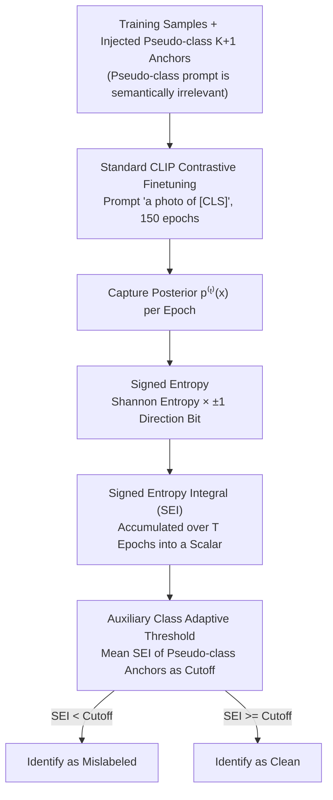

# On Revisiting Entropy for Identifying Mislabeled Images

**Conference**: ICML 2026  
**arXiv**: [2605.31090](https://arxiv.org/abs/2605.31090)  
**Code**: https://github.com/MedAITech/SEI  
**Area**: Noisy Labels / Robust Learning / Representation Learning / Training Dynamics  
**Keywords**: Mislabeled Image Detection, Training Dynamics, Signed Entropy, CLIP, Medical Imaging

## TL;DR
The authors discover that the phenomenon of "the prediction entropy of mislabeled samples remains consistently high throughout training" is insufficient to distinguish mislabeled samples from hard clean samples. Consequently, they multiply entropy by a "prediction-label alignment" sign bit to derive **signed entropy**, which is accumulated over training epochs into the **SEI** statistic. This plug-and-play approach sets a new SOTA in mislabeled detection (leading by up to 11%+) across multiple medical datasets (ISIC/DeepDRiD/PANDA/CheXpert) and CIFAR-100N.

## Background & Motivation

**Background**: Mislabeled sample detection primarily follows two paths. The first is **loss-based** methods (O2U-Net, CORES, AUM), where mislabeled samples exhibit higher losses. The second is **prediction statistics-based** methods (Confident Learning, SIMIFEAT, DEFT, LEMoN), which rely on pre-trained models to perform kNN or clustering in feature or vision-language alignment spaces. These methods either require modifying the training pipeline (multi-stage, special losses, memory modules) or heavily depend on the generalization capability of generic pre-trained models.

**Limitations of Prior Work**: In fields like **medical imaging**, where "images look very similar and even experts might mislabel," the discriminative power of generic CLIP drops significantly, causing feature-based methods (DEFT, LEMoN) to underperform. Meanwhile, loss/confidence-based methods are extremely sensitive to training jitter, as signals captured from a single epoch are unstable. The most critical pain point is that **hard clean samples and mislabeled samples are nearly indistinguishable via entropy or loss**—both cause high uncertainty in the model. Simple entropy-based thresholding inevitably penalizes hard clean samples.

**Key Challenge**: Entropy only characterizes "distribution uncertainty" and is a **directionless** quantity; it cannot indicate whether the model "believes" the provided label. The fundamental difference between mislabeled and hard clean samples is not the "degree of uncertainty," but the "direction of consistency between model prediction and the given label."

**Goal**: Design a **plug-and-play, single-scalar** mislabeled detection metric that: (a) does not modify the training pipeline; (b) utilizes both the magnitude and direction of entropy; (c) accumulates across epochs to resist jitter; (d) does not rely on the transfer performance of generic pre-trained models in the target domain.

**Key Insight**: The authors decompose training dynamics into two signals—**the trajectory of entropy evolution** and **the trajectory of prediction-label consistency**. They observe a clean fact: easy clean samples align with labels most of the time with monotonically decreasing entropy; hard clean samples take time to align (wrong early, correct later) with entropy peaking then falling; mislabeled samples almost never align with the label, and their entropy remains high. This naturally injects the "consistency" signal into entropy.

**Core Idea**: Multiply Shannon entropy by a sign bit $(-1)^{\mathbb{1}[y=\arg\max p]}$ determined by whether the prediction aligns with the given label, forming **signed entropy**. Accumulating this over training epochs yields SEI—mislabeled samples receive strong negative integrals, while clean samples receive positive integrals, allowing a single parameter to rank all samples.

## Method

### Overall Architecture
SEI does not modify training; it attaches a "statistical probe" to the standard pipeline. Using CLIP, class names are converted into prompts like `"a photo of [CLS]"`, followed by standard contrastive fine-tuning. At the end of each epoch, a directional entropy value for each sample is recorded. After 150 epochs, this trajectory is integrated over $t$ into a single scalar SEI. Finally, an adaptive threshold identifies low-scoring samples as mislabeled. In essence, it **fuses the magnitude of entropy and the label alignment signal into a rankable score**.

### Key Designs

**1. Signed Entropy: Adding a ±1 Direction to Directionless Entropy**

Shannon entropy is a non-negative, directionless quantity. Because both mislabeled and hard clean samples exhibit high entropy, they cannot be separated by entropy alone. The authors multiply entropy by a sign bit: for the posterior $\bm{p}(\bm{x})$ at a given epoch, they define $\mathcal{H}(\bm{p}(\bm{x}), y) = (-1)^{\mathbb{1}[y=\arg\max_k p_k(\bm{x})]} \sum_k p_k(\bm{x})\log p_k(\bm{x})$. Alignment equals a positive sign, non-alignment equals a negative sign, and the magnitude is the entropy. Consequently, mislabeled samples (persistent non-alignment) and hard clean samples (early non-alignment, late alignment) follow **completely opposite directions** across training.

**2. Signed Entropy Integral: Integrating Trajectories to Mitigate Jitter**

Predictions and loss values from a single epoch are noisy and sensitive to hyperparameters. SEI compresses the signed entropy curve of length $T$ into a single scalar: $\mathrm{SEI}(\bm{x},y) = \sum_{t=1}^T \mathcal{H}(\bm{p}^{(t)}(\bm{x}), y)$. Samples naturally fall into three segments on the number line: easy clean samples accumulate large positive values; hard clean samples oscillate and **cancel out** towards the middle; mislabeled samples accumulate strong negative values. Ablations (Table 4) show that SEI outperforms single-epoch slices by 8–15 F1 points and is 10+ points higher than unsigned entropy integrals (EI).

**3. Auxiliary Class Adaptive Threshold: Self-calibration via Pseudo-class Anchors**

To establish a cutoff, the authors inject a set of **guaranteed mislabeled** anchor samples. By randomly sampling $N/(K+1)$ images and assigning them to a non-existent pseudo-class $K+1$ (with a semantically irrelevant prompt like `"a dermoscopic image showing other lesions"`), their behavior acts as a proxy for real mislabels. the threshold is set as the mean SEI of these anchors. This approach draws inspiration from AUM’s anchor samples but utilizes CLIP-friendly pseudo-class prompts instead of random label flipping.

### Loss & Training
SEI introduces no new loss functions. Training uses standard CLIP image-text contrastive loss (aligning images with $K$ class embeddings using the prompt `"a photo of [CLS]"`). Detection is performed offline using the forwarded $\bm{p}^{(t)}(\bm{x})$. Implementation: SGD with momentum 0.9, weight decay $1\times 10^{-4}$, batch size 128, initial lr $1\times 10^{-3}$, 150 epochs, with 10x decay at 75 and 115 epochs. Images are resized to $224\times 224$.

## Key Experimental Results

### Main Results
Evaluation on three medical datasets (ISIC, DeepDRiD, PANDA) under two noise types (symmetric / confusion-calibrated) across 5 noise rates $\eta\in\{0.1...0.5\}$, compared against 10 baselines (INCV, AUM, CORES, CL, SIMIFEAT, DEFT, LEMoN, etc.) using F1 score.

| Dataset | Noise | $\eta$ | SEI | Runner-up | Gain |
|--------|------|--------|------|---------|------|
| ISIC | symmetric | 0.5 | **83.93** | CORES 82.67 | +1.26 |
| ISIC | confusion | 0.4 | **74.98** | AUM 64.54 | **+10.44** |
| DeepDRiD | symmetric | 0.5 | **78.19** | AUM 75.75 | +2.44 |
| DeepDRiD | confusion | 0.5 | **73.04** | LEMoN 66.82 | +6.22 |
| PANDA | symmetric | 0.3 | **81.46** | AUM 75.95 | +5.51 |
| PANDA | confusion | 0.1 | **73.17** | AUM 61.30 | **+11.87** |
| CheXpert (Real Noise) | — | — | **83.59** | AUM 80.34 | +3.25 |

The advantage of SEI is significantly larger under confusion-calibrated noise, indicating robustness against samples "easily confused by the model"—the predominant form of real-world clinical mislabeling.

### Ablation Study
| Config | ISIC@0.4 | DeepDRiD@0.4 | PANDA@0.4 | Description |
|------|----------|--------------|-----------|------|
| EI (w/o Sign) | 60.77 | 59.28 | 67.26 | Unsigned entropy integral |
| SE@T (Single Epoch) | 57.89 | 57.93 | 62.91 | Last epoch slice |
| **SEI (Full)** | **74.98** | **68.35** | **81.96** | Sign + Integration |

### Key Findings
- **Sign Bit Contribution > Timing**: Removing the sign bit (EI) drops F1 by 10+ points; removing temporal integration (SE@T) drops it by 8-15 points. Both are necessary, but the **sign bit is more critical**.
- **Architecture Agnostic**: SEI also improves performance on ResNet-50 and ViT-B/16, though CLIP provides the best results due to effective pseudo-class calibration.
- **Confusion Noise Advantage**: In difficult confusion noise settings, SEI’s lead over baselines is amplified. Feature-space kNN methods (SIMIFEAT) fail here, while SEI remains robust by looking at "directional consistency across the whole trajectory."
- **Real-world Clinical utility**: On CheXpert (radiologist labels), SEI achieves an F1 of 83.59, outperforming AUM by 3.25, proving effectiveness in non-synthetic scenarios.

## Highlights & Insights
- **"Adding Direction to Entropy" is minimal yet surgical**: The core innovation is a simple sign bit $(-1)^{\mathbb{1}[y=\arg\max p]}$. By addressing the blind spot where entropy cannot distinguish mislabeled from hard clean samples, it elevates noise detection from "distribution-level" to "distribution + direction."
- **Auxiliary class calibration** is superior to AUM’s random flipping. Injecting a "semantically irrelevant" pseudo-class in CLIP provides a natural anchor for thresholding without polluting existing classes.
- **Dual-signal perspective of training dynamics**: Magnitude + Alignment. Losses and entropy are 1D signals; prediction-label alignment is a complementary binary sequence. Combining them separates easy, hard, and mislabeled samples effectively.

## Limitations & Future Work
- The auxiliary class threshold is **heuristic**; results depend on the specific pseudo-class prompt phrasing.
- Achieving a full SEI trajectory requires **completing 150 epochs**, which is computationally more expensive than one-pass feature-based methods.
- Testing is limited to medical and CIFAR-100N; performance on large-scale natural image benchmarks (e.g., Clothing1M) remains unverified.
- Only **performs detection (discarding labels)** without investigating re-labeling or sample re-weighting strategies.

## Related Work & Insights
- **vs AUM (Pleiss et al., 2020)**: Both use accumulated signals and anchors. SEI's advantage lies in fusing "entropy magnitude × label direction" whereas AUM only considers logit margins.
- **vs O2U-Net / CORES (Loss-based)**: These identify mislabels via high loss but fail on hard clean samples. SEI's sign bit naturally differentiates the two.
- **vs SIMIFEAT / DEFT / LEMoN (Pre-trained)**: These rely on frozen representations. They excel in general domains but fail in specialized medical domains where generic CLIP representations are weak. SEI succeeds by fine-tuning the model and observing its dynamics.

## Rating
- **Novelty**: ⭐⭐⭐⭐ Simple but fundamentally effective insight regarding entropy directionality.
- **Experimental Thoroughness**: ⭐⭐⭐⭐ Comprehensive medical datasets and noise types, though lacks large-scale natural image benchmarks.
- **Writing Quality**: ⭐⭐⭐⭐ Logical flow with clear visualization of sample separation.
- **Value**: ⭐⭐⭐⭐ Plug-and-play, SOTA performance, and open-source; provides a high-value tool for medical data cleaning.

<!-- RELATED:START -->

## Related Papers

- [\[ICML 2026\] Rectified LpJEPA: Joint-Embedding Predictive Architectures with Sparse and Maximum-Entropy Representations](rectified_lpjepa_joint-embedding_predictive_architectures_with_sparse_and_maximu.md)
- [\[ECCV 2024\] HiEI: A Universal Framework for Generating High-quality Emerging Images from Natural Images](../../ECCV2024/others/hiei_a_universal_framework_for_generating_high-quality_emerging_images_from_natu.md)
- [\[ACL 2025\] Entropy-UID: A Method for Optimizing Information Density](../../ACL2025/others/entropy-uid_a_method_for_optimizing_information_density.md)
- [\[ICML 2025\] Revisiting the Predictability of Performative, Social Events](../../ICML2025/others/revisiting_the_predictability_of_performative_social_events.md)
- [\[CVPR 2026\] A Difference-in-Difference Approach to Detecting AI-Generated Images](../../CVPR2026/others/a_difference-in-difference_approach_to_detecting_ai-generated_images.md)

<!-- RELATED:END -->
