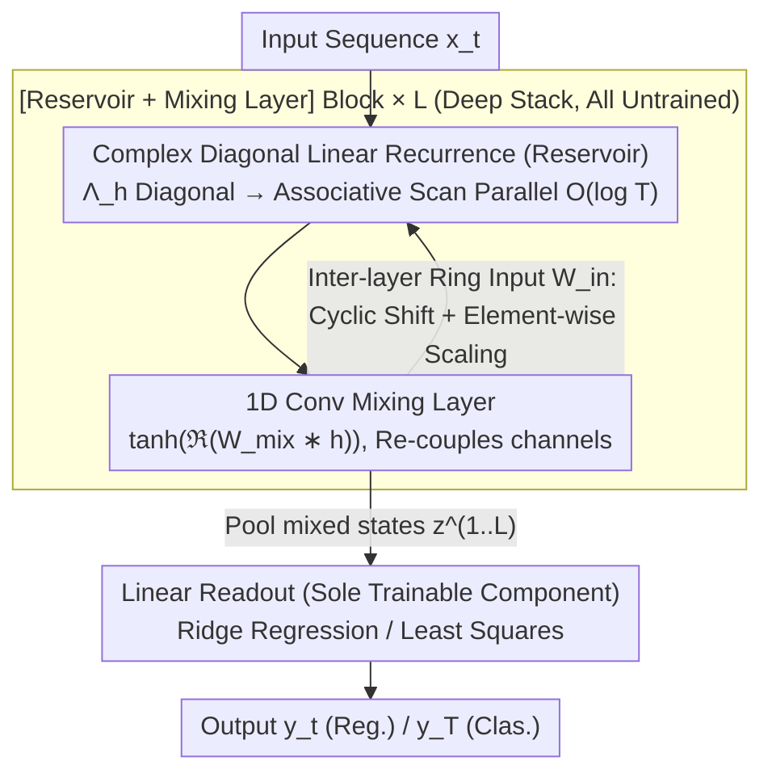

# ParalESN: Enabling Parallel Information Processing in Reservoir Computing

**Conference**: ICML2026  
**arXiv**: [2601.22296](https://arxiv.org/abs/2601.22296)  
**Code**: https://github.com/nennomp/paralesn (Available)  
**Area**: Sequence Modeling / Reservoir Computing / State Space Models  
**Keywords**: Echo State Network, Linear Recurrence, Parallel Scan, Diagonal Complex Matrix, Fading Memory

## TL;DR
ParalESN injects LRU-style complex diagonal linear recurrences into the "untrained reservoir" of Echo State Networks, allowing traditional RC to achieve temporal parallelization and scale to $10^5$ dimensions while strictly maintaining the Echo State Property and universal approximation properties of fading memory filters.

## Background & Motivation

**Background**: Reservoir Computing (RC) utilizes a frozen high-dimensional random nonlinear recurrent system where only the linear readout is trained, serving as a lightweight solution for temporal signal processing. Its representative model, the Echo State Network (ESN), relies on a state transition matrix $W_h$. By constraining the spectral radius below 1 during initialization, the Echo State Property (ESP) is triggered, ensuring the state is uniquely determined by the input.

**Limitations of Prior Work**: Traditional RC faces two critical bottlenecks. First is **sequentiality**: the state update $h_t = (1-\tau)h_{t-1} + \tau\sigma(W_h h_{t-1} + W_{in} x_t)$ must proceed step-by-step, precluding parallelization on modern accelerators and making training time scale linearly with sequence length. Second is **memory explosion**: the dense $W_h \in \mathbb{R}^{N_h \times N_h}$ causes Out-of-Memory (OOM) errors when the reservoir size $N_h$ reaches $10^5$, despite RC’s performance being highly dependent on reservoir dimensionality.

**Key Challenge**: The "dynamical richness" of RC stems from the composition of $W_h$ and nonlinear activations, whereas "parallelizability and memory efficiency" require recurrences to be reduced to structured linear forms suitable for associative scans. These objectives are contradictory in the classical ESN framework—removing $\sigma$ appears to eliminate nonlinear expressivity.

**Goal**: The paper addresses three sub-problems: (i) designing a structured linear recurrence compatible with parallel associative scans; (ii) proving this linear reservoir satisfies ESP and is equivalent to any linear ESN; and (iii) reducing training costs by orders of magnitude without sacrificing accuracy.

**Key Insight**: The authors observe that deep State Space Models (S4, S5, Mamba) and Linear Recurrent Units (LRU) have demonstrated that **complex-domain diagonal linear recurrences + nonlinear readouts** can match or exceed traditional RNNs/Transformers. Furthermore, the fading memory filter theory of Grigoryeva and Ortega guarantees that as long as the readout layer is sufficiently expressive, linear recurrence ESNs remain universal approximators. Combining these suggests that the "untrained high-dimensional recurrence" of an ESN can be replaced with an LRU-style complex linear form, leaving nonlinearity to a shared lightweight mixing layer.

**Core Idea**: Reconstruct the untrained reservoir using complex diagonal linear recurrences, ring input matrices, and 1D convolutional mixing layers. This allows for parallel scan recurrences and memory usage that scales linearly with $N_h$ rather than quadratically, with theoretical proofs for ESP and ESN equivalence.

## Method

### Overall Architecture

ParalESN decomposes a block into two segments: (i) **Reservoir**—a complex-domain linear recurrence, untrained; (ii) **Mixing Layer**—a 1D convolutional nonlinearity, untrained; followed by a **Linear Readout** as the sole trainable component. The deep version (ParalESN deep) stacks multiple [Reservoir + Mixing Layer] blocks, with each layer receiving the mixed real-valued state from the previous layer via a ring-topology input matrix. The entire chain is trained using ridge regression/least squares closed-form solution at the final layer.

Formally, the recurrence for the $\ell$-th layer at step $t$ is:

$h^{(\ell)}_t = (1-\tau^{(\ell)}) h^{(\ell)}_{t-1} + \tau^{(\ell)}\left(\Lambda^{(\ell)}_h h^{(\ell)}_{t-1} + W^{(\ell)}_{in} z^{(\ell-1)}_t + b^{(\ell)}\right)$

Where $\Lambda^{(\ell)}_h \in \mathbb{C}^{N_h \times N_h}$ is a **diagonal complex transition matrix**, $h^{(\ell)}_t \in \mathbb{C}^{N_h}$, and the mixed state is $z^{(\ell)}_t \in \mathbb{R}^{N_h}$. Since the recurrence is linear, the leaking rate can be absorbed into an equivalent transition matrix $\bar{\Lambda}^{(\ell)}_h = (1-\tau^{(\ell)})I + \tau^{(\ell)}\Lambda^{(\ell)}_h$. The update can be written as a first-order linear recurrence, satisfying the algebraic requirements for associative scans, reducing time complexity from $O(T)$ to $O(\log T)$.

### Key Designs

**1. Complex Diagonal Transition Matrix + LRU-style Initialization: Parallelism and Memory Efficiency**

The pain points of traditional ESN reside in the dense random $W_h$. ParalESN replaces it with a diagonal matrix $\bar{\Lambda}_h = \text{diag}(\lambda_1, \dots, \lambda_{N_h})$. Each eigenvalue $\lambda_i = \rho_i e^{i\theta_i}$ is initialized by sampling magnitude $\rho_i \sim \mathcal{U}[\rho_{min}, \rho_{max}]$ and phase $\theta_i \sim \mathcal{U}[\theta_{min}, \theta_{max}]$. This ensures the spectral radius is simply $\max_i |\lambda_i|$, making the ESP condition $|\lambda_i| < 1$, $\forall i$. This allows the sequence to be processed in $O(\log T)$ time with only $N_h$ parameters.

**2. Ring Topology Input Matrix + Conv Mixing Layer: Channel Coupling without VRAM Explosion**

Diagonal recurrences evolve channels independently. ParalESN uses two sparse structures to maintain coupling and efficiency: the inter-layer input matrix $W^{(\ell>1)}_{in}$ adopts a ring structure (cyclic shift + scaling), requiring only $N_h$ coefficients. The mixing layer $f_{mix}$ utilizes a shared 1D convolutional kernel $W^{(\ell)}_{mix} \in \mathbb{C}^k$ ($k \ll N_h$) sliding across the hidden dimension to apply $\tanh$, keeping parameters independent of sequence length.

**3. ESP and Universality Guarantees**

The paper addresses concerns regarding expressivity loss: Theorem 4.1 provides the ESP condition $|\lambda_i| < 1$; Proposition 4.2 proves that any $W_h \in \mathbb{C}^{N_h \times N_h}$ can be represented by a ParalESN via diagonalization; finally, drawing on Grigoryeva–Ortega conclusions, universal approximation is extended to ParalESN.

### Loss & Training

Only the readout layer is trained. For classification, the final state $y = f_{readout}(z^{(1)}_T, \dots, z^{(L)}_T)$ is solved via ridge regression. For regression, $y_t$ is output at each step. There is no backpropagation or gradients; the model is trained via a single forward pass and a closed-form solution.

## Key Experimental Results

### Main Results

| Task Type | Dataset | ParalESN | Trad. ESN/SOTA | Note |
|----------|--------|----------|--------------|------|
| Time-series Reg. | MemCap / ctXOR / Mackey-Glass | Comparable or Superior | Same tier | Efficiency is the differentiator |
| Seq. Classification | sMNIST ($N_h=10^5$) | Normal Convergence | Trad. ESN OOM | ParalESN fits in VRAM |
| Long Sequence | Long Range Arena (LRA) | Competitive | — | See Appendix G |
| Complexity | seq len $4^4 \to 4^8$ (128 units, 5 layers) | Grows with $\log T$ | Trad. ESN grows linearly | Orders of magnitude faster |

### Ablation Study

| Configuration | Reservoir Size | VRAM Performance | Key Finding |
|------|------------|----------|----------|
| Trad. ESN | $10^5$ Neurons | OOM | Dense $W_h$ causes explosion |
| ParalESN | $10^5$ Neurons | Normal | Diagonal + Ring maintains linearity |
| ParalESN (Shallow) | — | — | Significantly better than shallow ESN |
| ParalESN (Deep) | — | — | Matches Deep ESN performance; speed matches single-layer |

### Key Findings
- **Logarithmic vs Linear**: With 5 layers and 128 neurons, as sequence length increases from $4^4$ to $4^8$, ParalESN's recurrence time scales at nearly $\log T$.
- **OOM Boundary**: On sMNIST, scaling to $10^5$ neurons causes traditional ESNs to OOM, while ParalESN remains functional, pushing RC scalability by an order of magnitude.
- **Deep Version "For Free"**: Deep ParalESN matches Deep ESN performance but matches the speed of a single-layer RC, removing linear latency penalties for depth.

## Highlights & Insights
- **Theoretical Bridge**: Connects "Classical RC/ESN" and "Modern SSM/LRU" within a unified framework, showing they can share architectural tools.
- **Untrained + Parallel**: Combines the "zero training cost" of RC with "associative scan acceleration," achieving a rare combination of gradient-free training and GPU friendliness.
- **Transferable Design**: The ring-topology input and shared convolutional mixing layer are strategy motifs applicable to any model seeking high hidden dimensionality (e.g., long-context SSMs).

## Limitations & Future Work
- The mixing layer currently uses a fixed random kernel; more complex coupling (gates, attention) remains unexplored and may explain the performance gap on the most difficult tasks.
- Experiments focus on small-to-medium scale sequences; validation on large-scale foundation model scales (Text/Speech) is missing.
- The impact of complex-domain parameterization on engineering deployment (quantization, edge hardware) requires further analysis.

## Related Work & Insights
- **vs Traditional ESN / Deep ESN**: These use dense nonlinear recurrences but suffer from serial training and quadratic memory; ParalESN achieves equivalent expressivity with parallel/linear scaling.
- **vs LRU / S4 / S5 / Mamba**: These share the diagonal linear recurrence philosophy but require BPTT and complex initializations (HiPPO); ParalESN applies this to the "untrained + closed-form" RC paradigm.
- **vs Structured RC**: Early structured RC used Hadamard or ring structures for $W_h$ but remained real-valued and serial; ParalESN is the first structured RC to leverage complex diagonalization for parallelism.

## Rating
- Novelty: ⭐⭐⭐⭐ (Clean cross-domain integration of LRU and RC)
- Experimental Thoroughness: ⭐⭐⭐⭐ (Covers Reg/Clas/LRA and OOM boundaries)
- Writing Quality: ⭐⭐⭐⭐ (Clear motivation and hierarchical analysis)
- Value: ⭐⭐⭐⭐ (Provides a scalable path for RC in the modern deep learning landscape)

<!-- RELATED:START -->

## Related Papers

- [\[ICML 2026\] Coupled Training with Privileged Information and Unlabeled Data](coupled_training_with_privileged_information_and_unlabeled_data.md)
- [\[ICLR 2026\] Accelerated Parallel Tempering via Neural Transports](../../ICLR2026/others/accelerated_parallel_tempering_via_neural_transports.md)
- [\[ICML 2026\] Networked Information Aggregation for Binary Classification](networked_information_aggregation_for_binary_classification.md)
- [\[ICML 2026\] Structure-Induced Information for Rerooting Levin Tree Search](structure-induced_information_for_rerooting_levin_tree_search.md)
- [\[ICLR 2026\] Beyond Linear Processing: Dendritic Bilinear Integration in Spiking Neural Networks](../../ICLR2026/others/beyond_linear_processing_dendritic_bilinear_integration_in_spiking_neural_networ.md)

<!-- RELATED:END -->
