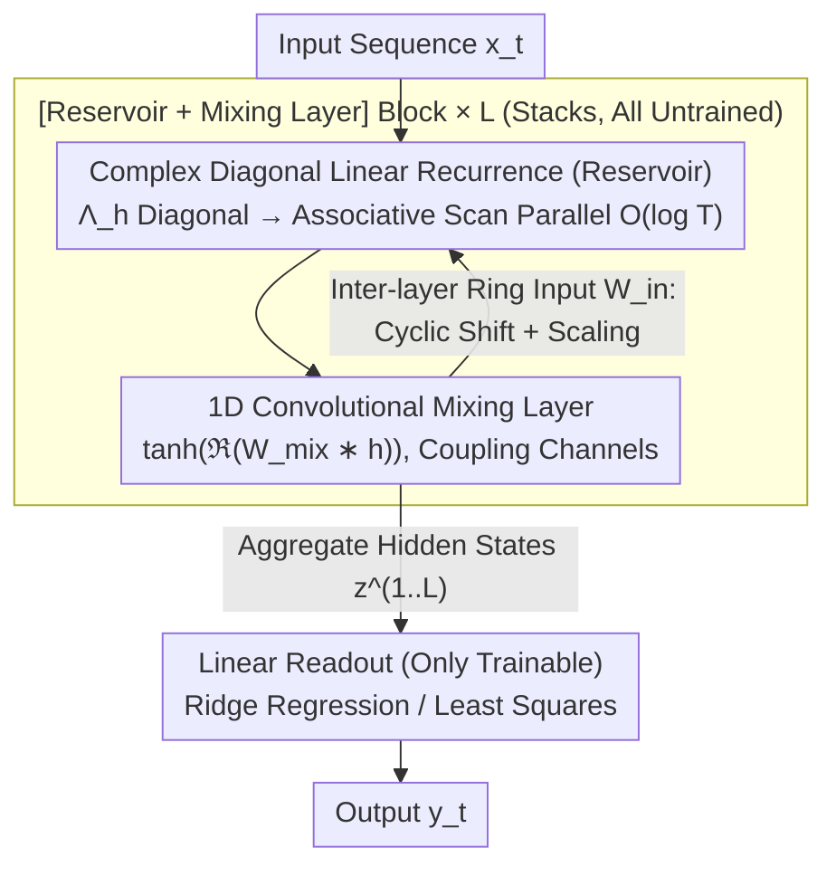

# ParalESN: Enabling Parallel Information Processing in Reservoir Computing

**Conference**: ICML2026  
**arXiv**: [2601.22296](https://arxiv.org/abs/2601.22296)  
**Code**: https://github.com/nennomp/paralesn (Available)  
**Area**: Sequence Modeling / Reservoir Computing / State Space Models  
**Keywords**: Echo State Networks, Linear Recurrence, Parallel Scan, Diagonal Complex Matrix, Fading Memory

## TL;DR
By injecting LRU-style complex diagonal linear recurrence into the "untrained reservoir" of an Echo State Network, the sequential processing of traditional RC is parallelized and its dimensionality can scale to $10^5$, while strictly maintaining the Echo State Property and the universal approximation properties of fading memory filters.

## Background & Motivation

**Background**: Reservoir Computing (RC) avoids the vanishing/exploding gradient problems in RNN training by freezing a high-dimensional random nonlinear recurrent system and only training a linear readout. Its representative architecture, the Echo State Network (ESN), relies on a state transition matrix $W_h$, where the Echo State Property (ESP) is triggered by keeping the spectral radius below 1, ensuring the state depends only on the input.

**Limitations of Prior Work**: Traditional RC faces two critical bottlenecks. First is **seriality**: the state update $h_t = (1-\tau)h_{t-1} + \tau\sigma(W_h h_{t-1} + W_{in} x_t)$ must proceed step-by-step along the time dimension, preventing parallelization on modern accelerators and making training time scale linearly with sequence length. Second is **memory explosion**: a dense $W_h \in \mathbb{R}^{N_h \times N_h}$ causes Out-Of-Memory (OOM) issues when the reservoir size $N_h$ reaches $10^5$, yet RC performance is highly dependent on reservoir dimensionality.

**Key Challenge**: The "dynamical richness" of RC originates from the composition of $W_h$ and nonlinear activations, whereas "parallelism + memory efficiency" requires degrading recurrence into a structured linear form suitable for associative scan. These two objectives are contradictory in the classical ESN framework—removing $\sigma$ seems to eliminate nonlinear expressivity.

**Goal**: Decomposed into three sub-problems: (i) design a structured linear recurrence compatible with associative scan; (ii) prove that this linear reservoir still satisfies ESP and is equivalent to any linear ESN in expression; (iii) reduce training costs by several orders of magnitude without sacrificing accuracy.

**Key Insight**: The authors note that deep State Space Models (S4, S5, Mamba) and Linear Recurrent Units (LRU) have proven that **complex diagonal linear recurrence + nonlinear readout** can match or exceed traditional RNNs/Transformers. Simultaneously, fading memory filter theory guarantees that as long as the readout layer is expressive enough, a linear recurrence ESN is a universal approximator. Combining these suggests that the "untrained high-dimensional recurrence" of an ESN can be replaced with an LRU-style diagonal complex linear form, leaving nonlinearity to a shared lightweight mixing layer.

**Core Idea**: Reconstructing the untrained reservoir with complex diagonal linear recurrence + ring input matrix + 1-D convolutional mixing layer. This enables parallel scanning, reduces memory growth from $O(N_h^2)$ to $O(N_h)$, and provides theoretical proof of ESP and expressivity equivalence to classical ESNs.

## Method

### Overall Architecture

ParalESN splits a block into two segments: (i) **Reservoir**—complex linear recurrence, untrained; (ii) **Mixing layer**—1D convolutional nonlinearity, untrained; followed by a **linear readout** as the only trainable component. The deep version (ParalESN deep) stacks multiple [Reservoir + Mixing layer] blocks, where each layer receives real-valued states from the previous layer via a ring-topology input matrix. The entire chain is solved via ridge regression/least squares in a closed-form solution at the final layer.

Formally, the recurrence at step $t$ for layer $\ell$ is:

$$h^{(\ell)}_t = (1-\tau^{(\ell)}) h^{(\ell)}_{t-1} + \tau^{(\ell)}\left(\Lambda^{(\ell)}_h h^{(\ell)}_{t-1} + W^{(\ell)}_{in} z^{(\ell-1)}_t + b^{(\ell)}\right)$$

Where $\Lambda^{(\ell)}_h \in \mathbb{C}^{N_h \times N_h}$ is a **diagonal complex transition matrix**, $h^{(\ell)}_t \in \mathbb{C}^{N_h}$, and $z^{(\ell)}_t \in \mathbb{R}^{N_h}$ after mixing. Since the recurrence is linear, the leakage coefficient can be absorbed into an equivalent transition matrix $\bar{\Lambda}^{(\ell)}_h = (1-\tau^{(\ell)})I + \tau^{(\ell)}\Lambda^{(\ell)}_h$. The update becomes a first-order linear recurrence compatible with associative scan, reducing time complexity from $O(T)$ to $O(\log T)$.

### Key Designs

**1. Complex Diagonal Transition Matrix + LRU-style Initialization: Design Motivation Parallelism and Memory Efficiency**

Traditional ESN bottlenecks stem from the dense random $W_h$, forcing serial updates and $O(N_h^2)$ memory. ParalESN replaces it with a diagonal matrix $\bar{\Lambda}_h = \text{diag}(\lambda_1, \dots, \lambda_{N_h})$, where each eigenvalue $\lambda_i = \rho_i e^{i\theta_i}$ is initialized by sampling magnitude $\rho_i \sim \mathcal{U}[\rho_{min}, \rho_{max}]$ and phase $\theta_i \sim \mathcal{U}[\theta_{min}, \theta_{max}]$. This ensures the ESP condition simplifies to $|\lambda_i| < 1$ for all $i$. The diagonal form allows the recurrence to decompose into $N_h$ independent scalar first-order recurrences, enabling $O(\log T)$ time via associative scans and reducing parameters to $O(N_h)$.

**2. Ring Topology Input Matrix + Convolutional Mixing Layer: Recoupling without Memory Bloat**

Diagonal recurrence results in independent channel evolution. ParalESN handles coupling via two sparse structures: the inter-layer input matrix $W^{(\ell>1)}_{in}$ uses a ring structure (cyclic shift + scaling), requiring only $N_h$ coefficients. The mixing layer $f_{mix}$ uses a shared 1D convolutional kernel $W^{(\ell)}_{mix} \in \mathbb{C}^k$ ($k \ll N_h$) sliding across the hidden dimension, followed by the real part and a $\tanh$ activation. This allows the reservoir to scale to $10^5$ dimensions.

**3. ESP and Universal Approximation Proofs: Novelty**

The paper provides three theoretical foundations: Theorem 4.1 establishes the necessary and sufficient condition for ESP as $|\lambda_i| < 1$; Proposition 4.2 proves that any $W_h$ can be represented by a ParalESN via diagonalization; and it extends the Grigoryeva–Ortega universal approximation conclusions to ParalESN. Thus, diagonal constraints offer efficiency without losing expressivity.

### Loss & Training
Only the readout layer is trainable. Classification tasks use the final state $y = f_{readout}(z^{(1)}_T, \dots, z^{(L)}_T)$ solved via ridge regression; regression tasks output $y_t$ at each step. No backpropagation or gradients are used; the model is trained with one forward pass and a closed-form solution.

## Key Experimental Results

### Main Results

| Task Type | Dataset | ParalESN | Prev. SOTA / ESN | Remarks |
|----------|--------|----------|--------------|------|
| Time-series Regr. | MemCap / Mackey-Glass | Comparable or better | Same tier | Key gap in efficiency |
| Seq. Classification | sMNIST ($N_h=10^5$) | Normal Convergence | Trad. ESN OOM | ParalESN fits in VRAM |
| Long Sequences | Long Range Arena (LRA) | Competitive | — | See Appendix G |
| Complexity | seq len $4^4 \to 4^8$ | $O(\log T)$ growth | $O(T)$ linear growth | Order of magnitude gain |

### Ablation Study

| Configuration | Reservoir Size | Memory Performance | Key Finding |
|------|------------|----------|----------|
| Traditional ESN | $10^5$ neurons | OOM | Dense $W_h$ explodes |
| ParalESN | $10^5$ neurons | Runs normally | Diagonal + ring keeps memory linear |
| ParalESN (Shallow) | — | — | Significantly better than shallow ESN |
| ParalESN (Deep) | — | — | Matches Deep ESN performance |

### Key Findings
- **Logarithmic vs Linear**: In a 5-layer 128-neuron setup, as sequence length grows to $4^8$, traditional ESN time grows linearly, while ParalESN follows $\log T$.
- **OOM Boundary**: On sMNIST, ParalESN scales to $10^5$ neurons where traditional ESNs fail, pushing the scalability of RC by an order of magnitude.
- **Efficient Depth**: Deep ParalESN matches Deep ESN performance while maintaining recurrence speed close to a single-layer model.

## Highlights & Insights
- **Theoretical Bridge**: Connects "Classical ESN" and "Modern SSM/LRU" into one framework, showing they can share architectural components.
- **Untrained + Parallel**: Combines the zero-gradient training of RC with associative scan acceleration, resulting in a rare combination of zero-gradient training and GPU-friendliness.
- **Value**: The ring-topology input and shared convolutional mixing offer a strategy to scale recurrent layers to massive hidden dimensions without memory exhaustion.

## Limitations & Future Work
- The mixing layer currently uses a fixed random kernel; more complex mechanisms (gating or attention) are not yet explored.
- Experiments focus on small-to-medium datasets; validation on large-scale text/speech foundation models is missing.
- Implementation impacts of complex-domain parameterization on engineering deployment (quantization, Inference hardware) require further analysis.

## Related Work & Insights
- **vs. Traditional ESN**: Replaces dense serial recurrence with "diagonal linear + convolutional mixing" for parallel efficiency.
- **vs. SSM / LRU**: Shares the diagonal linear recurrence philosophy but utilizes the RC paradigm (untrained + closed-form solution) instead of backpropagation.
- **vs. Structured RC**: Unlike earlier structured RC using Hadamard or ring matrices, ParalESN uses complex diagonalization to enable parallelism for the first time.

## Rating
- Novelty: ⭐⭐⭐⭐ Connects LRU recurrence with the RC paradigm.
- Experimental Thoroughness: ⭐⭐⭐⭐ Covers regression/classification and complexity scaling.
- Writing Quality: ⭐⭐⭐⭐ Clear motivation, architecture, and complexity analysis.
- Value: ⭐⭐⭐⭐ Provides a scalable path for RC into modern deep learning.

<!-- RELATED:START -->

## Related Papers

- [\[ICML 2026\] Coupled Training with Privileged Information and Unlabeled Data](coupled_training_with_privileged_information_and_unlabeled_data.md)
- [\[ICML 2026\] Networked Information Aggregation for Binary Classification](networked_information_aggregation_for_binary_classification.md)
- [\[ICML 2026\] Structure-Induced Information for Rerooting Levin Tree Search](structure-induced_information_for_rerooting_levin_tree_search.md)
- [\[CVPR 2026\] MV-Fashion: Towards Enabling Virtual Try-On and Size Estimation with Multi-View Paired Data](../../CVPR2026/others/mv-fashion_towards_enabling_virtual_try-on_and_size_estimation_with_multi-view_p.md)
- [\[AAAI 2026\] ParaRevSNN: A Parallel Reversible Spiking Neural Network for Efficient Training and Inference](../../AAAI2026/others/pararevsnn_a_parallel_reversible_spiking_neural_network_for_efficient_training_a.md)

<!-- RELATED:END -->
