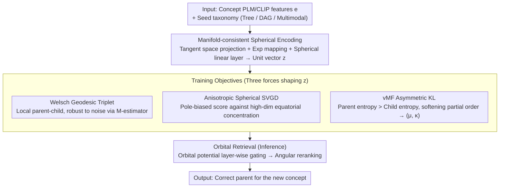

# Polaris: Coupled Orbital Polar Embeddings for Hierarchical Concept Learning

**Conference**: ICML 2026  
**arXiv**: [2605.00265](https://arxiv.org/abs/2605.00265)  
**Code**: None  
**Area**: Representation Learning / Hierarchical Concept Learning / Taxonomy Expansion / Spherical Embeddings  
**Keywords**: Polar Embeddings, Unit Hypersphere, vMF Distribution, Stein Variational Gradient, taxonomy expansion

## TL;DR
Polaris decouples concept representations into two signals—"direction (semantics) + orbital potential (hierarchy)"—all learned on the unit hypersphere. It employs tangent space projection and exponential mapping to ensure manifold closure, uses anisotropic spherical SVGD to prevent equatorial concentration, and utilizes vMF KL divergence to implement asymmetric "parent-higher-entropy-than-child" constraints. On taxonomy expansion tasks, it improves top-K recall by up to 19 points and reduces mean rank by 60%.

## Background & Motivation
**Background**: Taxonomy expansion (attaching new concepts to the correct parent in an existing tree/DAG) is a core problem in knowledge graphs, recommendation, commodity classification, and medical ontologies. Mainstream approaches fall into three categories: (1) Euclidean embeddings + symmetric similarity (TransE, TaxoExpan); (2) Hyperbolic embeddings leveraging exponential volume growth to alleviate tree crowding (Poincaré, HyperExpan); (3) Container embeddings like cone/box to explicitly encode "child contained by parent" (ConE, Box, Gumbel Box).

**Limitations of Prior Work**: Euclidean methods cannot express naturally asymmetric parent-child relationships. Hyperbolic methods are sensitive to optimization and numerical precision. While container methods express partial orders, they suffer when jointly optimizing "semantic similarity" and "hierarchical position" under noisy or non-tree (DAG) structures; entanglement often amplifies small semantic errors into large placement errors. **Polar embeddings** (encoding semantics via direction and hierarchy via radius/angle) can decouple these signals, but previous polar methods required ad-hoc stability tricks: modulo operations for angles, sector-specific losses, or sigmoid rescaling. These break manifold continuity and lead to severe angular drift in high dimensions under weak supervision.

**Key Challenge**: Expressing "semantic direction independent of hierarchical position" requires polar geometry. However, conventional polar parameterization (directly learning $(\theta,\psi)$ and applying mod $2\pi$) implicitly models the sphere as a flat cylinder with zero curvature, which is topologically inconsistent with a true constant-curvature sphere, leading to unstable optimization.

**Goal**: (1) Perform manifold-consistent polar learning on unit hyperspheres without hacks like wrap/mod/sigmoid; (2) Decouple semantic direction from hierarchical position; (3) Stably learn partial-order structures under weak supervision or noisy semantics; (4) Efficiently reduce retrieval space using structural priors.

**Key Insight**: The authors observe that since a sphere is a manifold of constant curvature, one should avoid singular angular parameterization. Instead, learn unit-norm vectors in Cartesian coordinates (via tangent space projection and exponential mapping) using dot products as angular surrogates. "Separate" the hierarchy signal into an orbital potential derived from the existing hierarchy, rather than cramming it into the same angular coordinates.

**Core Idea**: Learn direction-encoded semantics on $\mathbb{S}^{d-1}$, encode "depth" separately using an orbital potential derived from the known hierarchy, and explicitly build a "wider parent, narrower child" constraint into the loss using vMF distributions and asymmetric KL divergence.

## Method

### Overall Architecture
Polaris addresses taxonomy expansion: given a seed taxonomy (tree/DAG/multimodal) and PLM/CLIP features $\mathbf{e}\in\mathbb{R}^{d_\text{plm}}$ for new concepts, find the correct parent node for each. The approach decouples concept representations into two signals—direction encoding semantics and orbital potential encoding hierarchy—all mapped to the unit hypersphere $\mathbb{S}^{d-1}$. Specifically, Euclidean features $\mathbf{e}$ are lifted to the sphere as unit vectors $\mathbf{z}$ via "manifold-consistent encoding." The model is trained using a composite objective: a geometric triplet loss (local parent-child relationships), anisotropic spherical SVGD (preventing equatorial collapse), and vMF probabilistic constraints (making parent distributions broader than child distributions). During inference, the hierarchy-derived orbital potential performs coarse layer-wise gating, followed by angular reranking to output $\mathbf{z}$ and vMF parameters $(\boldsymbol\mu,\kappa)$ for each concept.

### Key Designs

**1. Manifold-consistent Spherical Encoding: Strictly mapping Euclidean features to the sphere**

A common failure in prior polar methods is modeling angles via $\theta\leftarrow\theta\bmod 2\pi$, which treats a constant-curvature sphere as a zero-curvature cylinder. This results in discontinuous gradients at boundaries. Polaris adopts standard Riemannian geometry: it projects onto the tangent space of the North Pole $\mathbf{p}_N$ as $\mathbf{v}=\mathbf{e}-\langle\mathbf{e},\mathbf{p}_N\rangle\mathbf{p}_N$, then uses the exponential map $\mathbf{z}_0=\exp_{\mathbf{p}_N}(\mathbf{v})=\cos(\|\mathbf{v}\|)\mathbf{p}_N+\sin(\|\mathbf{v}\|)\mathbf{v}/\|\mathbf{v}\|$ to lift features along the geodesic. All subsequent "spherical linear layers" maintain manifold closure: weight vectors $\mathbf{w}_i$ are forced to $\|\mathbf{w}_i\|_2=1$ after updates, biases are removed to avoid breaking symmetry, and outputs are re-projected $\mathbf{y}=\mathbf{W}\mathbf{x}/\|\mathbf{W}\mathbf{x}\|_2$. Theorem 2.2 proves that the subsequent Welsch loss is $\mathsf{SO}(d)$ invariant, meaning it depends only on relative geometry rather than specific axes.

**2. Welsch Geodesic Triplet: Stable local parent-child learning via bounded M-estimator**

Local relationships are learned via a triplet loss based on the geodesic angle $\theta_{ij}=\arccos\langle\mathbf{z}_i,\mathbf{z}_j\rangle$. To mitigate the impact of outliers in noisy taxonomies, the angle is wrapped in a bounded Welsch M-estimator $\mathcal{W}(\theta)=1-\exp(-\theta^2/(2c^2))$, yielding $\mathcal{L}_\text{geom}=\max(0,\gamma_\text{geom}+\mathcal{W}(\theta_{cp})-\mathcal{W}(\theta_{cn}))$. This pushes the child toward the parent and away from negatives. The boundedness of Welsch prevents individual semantic outliers from generating excessive gradients that could derail optimization.

**3. Anisotropic Spherical SVGD: Injecting "anti-equatorial" forces to combat high-dimensional concentration**

Rotation-invariant angular losses alone are insufficient: Theorem 2.3 shows that random unit vectors in high dimensions concentrate exponentially at the equator. Polaris introduces anisotropic spherical SVGD to inject an "anti-equatorial" force. Treating embeddings as particles, the velocity field $\phi(\mathbf{z})=\mathbb{E}_{\mathbf{z}'}[k(\mathbf{z}',\mathbf{z})\nabla\log p(\mathbf{z}')+\nabla k(\mathbf{z}',\mathbf{z})]$ uses a vMF kernel. The target score includes a structural term $\nabla\log p_\text{struct}=[0,\dots,0,z_d/(1-z_d^2)]^\top$, which pushes particles from the equator toward the poles, and an alignment term to keep embeddings within their anchors' attraction zones. This ensures the hierarchical structure is stretched between the poles rather than flattened by measure concentration.

**4. vMF Asymmetric KL: Softening partial orders via distribution "width"**

Point distances cannot distinguish "Dog" from "Mammal"—the latter has larger semantic volume but may be equally close in angular distance. Polaris models each concept as a vMF distribution where $\kappa_i = \text{Softplus}(\mathbf{w}_\kappa^\top\mathbf{z}_i+b_\kappa)$. The concentration $1/\kappa$ serves as a proxy for "semantic volume." An asymmetric KL divergence constraint $D_\text{KL}(\text{vMF}_c\|\text{vMF}_p)$ is applied, which essentially requires $\kappa_p < \kappa_c$ (parent distribution is "wider") and alignment between $\boldsymbol\mu_p$ and $\boldsymbol\mu_c$. This softens the hard containment of cone/box methods into a probabilistic hierarchy more robust to noise.

**5. Orbital Retrieval: Efficient coarse-to-fine inference via orbital potential**

To avoid expensive $\arg\max$ over hundreds of thousands of nodes, Polaris utilizes hierarchy-derived orbital potentials during inference. It applies dynamic cosine thresholds to perform layer-wise gating, filtering candidate parents by "orbit" before reranking by angle. This reduces the search space significantly while incorporating hierarchical structural priors, improving both speed and accuracy.

### Loss & Training
The total loss is $\mathcal{L}=\mathcal{L}_\text{geom}+\lambda_\text{SVGD}\mathcal{L}_\text{SVGD}+\lambda_\text{vMF}\mathcal{L}_\text{vMF}$. Each term targets a specific challenge: local parent-child learning, global spherical coverage, and asymmetric probabilistic constraints. Optimization is performed using Riemannian Adam.

## Key Experimental Results

### Main Results
Polaris was compared against 14 baselines on single-parent trees (Science, WordNet, Environment). It achieved consistent improvements of up to ~19 points in top-K retrieval and up to a ~60% reduction in mean rank.

| Dataset | Metric | Prev. SOTA (STEAM) | Polaris Magnitude | Gain |
| :--- | :--- | :--- | :--- | :--- |
| Science | R@1 / R@5 / MR↓ | 34.8 / 59.7 / 31.7 | ~44 / ~70 / ~13 | Top-K +~9-10 pts, MR -~60% |
| WordNet | R@1 / R@5 / MR↓ | 24.9 / 54.5 / 61.1 | ~31 / ~60 / ~25 | Top-K +~6 pts |
| Environment | R@1 / R@5 / MR↓ | 34.7 / 51.1 / 28.7 | ~39 / ~55 / ~15 | Top-K +~4 pts |

### Ablation Study

| Configuration | Key Change | Explanation |
| :--- | :--- | :--- |
| Full Polaris | Spherical encoding + SVGD + vMF + Orbital retrieval | Full model performance |
| w/o SVGD | Remove anisotropic spherical SVGD | Embeddings drift to equator; hierarchy is suppressed |
| w/o vMF | Replace probabilistic triplet with point triplet | Loss of asymmetric "width" signals; partial order degrades |
| w/o orbital retrieval | Use full-set $\arg\max$ for inference | Lower speed and accuracy due to lack of structural priors |
| Welsch → Squared Dist | Remove M-estimator | Outliers amplify error; significant degradation in noisy settings |

### Key Findings
- **SVGD Counteracts Measure Concentration**: Theorem 2.3 explains that high-dimensional vectors concentrate exponentially at the equator. Anisotropic SVGD is essential to preserve hierarchical structure.
- **vMF KL Softens Partial Orders**: Hard containment (cones/boxes) often collapses under noise; vMF KL models hierarchy as entropy differences, which is more robust.
- **Manifold Consistency vs. Angular Hacks**: Manifold-consistent encoders prevent the optimization oscillations seen in wrap-based polar methods.

## Highlights & Insights
- **Decoupling achieved through geometry**: By using $\mathbf{z}\in\mathbb{S}^{d-1}$ for direction and orbital potential for hierarchy, Polaris fulfills the promise of polar decoupling more strictly than prior container-based methods.
- **SVGD as a Manifold Regularizer**: Applying SVGD to the hypersphere to combat measure concentration is a novel and effective use case that can be transferred to other spherical representation tasks (e.g., contrastive learning, ArcFace).
- **Asymmetry as Entropy**: Modeling "parent as higher entropy" via vMF distributions naturally aligns with medical and product taxonomies where parent concepts are inherently more vague.

## Limitations & Future Work
- **Dependency on seed hierarchy**: Currently requires an existing hierarchy to derive orbital potentials; future work could utilize LLMs to bootstrap a skeleton.
- **Numerical stability of Bessel ratios**: $\mathcal{A}_d(\kappa)$ can be unstable in high dimensions with large $\kappa$; robust approximations are used but could be refined.
- **Static geometry**: The hypersphere assumes uniform curvature; exploring mixed-curvature (Spherical $\times$ Hyperbolic) spaces remains a future direction.

## Related Work & Insights
- **vs. Poincaré / HyperExpan**: Polaris avoids the numerical difficulties of hyperbolic space by explicitly encoding depth in orbital potentials rather than relying on geometric volume growth.
- **vs. ConE / Box**: Polaris replaces hard containment constraints with soft probabilistic entropy differences, which proves more robust in single-parent benchmarks.
- **vs. HAKE**: While HAKE uses modulus for hierarchy, Polaris fixes the norm to 1 and shifts depth information to the orbital potential, avoiding modulus-angle coupling issues.

## Rating
- **Novelty**: ⭐⭐⭐⭐ The combination of spherical embeddings, SVGD, and vMF asymmetric KL is a refined solution to classic polar learning problems.
- **Experimental Thoroughness**: ⭐⭐⭐⭐ Extensive testing across levels of hierarchy type (Tree/DAG/Multimodal) with 14 baselines.
- **Writing Quality**: ⭐⭐⭐⭐ Clear geometric motivation and theoretical grounding (Theorems 2.2-2.4).
- **Value**: ⭐⭐⭐⭐ Provides a reusable template for manifold-consistent representation learning in hierarchical domains.

<!-- RELATED:START -->

## Related Papers

- [\[ACL 2025\] Partial Colexifications Improve Concept Embeddings](../../ACL2025/others/partial_colexifications_improve_concept_embeddings.md)
- [\[ICML 2026\] New Bounds for Kernel Sums via Fast Spherical Embeddings](new_bounds_for_kernel_sums_via_fast_spherical_embeddings.md)
- [\[ICML 2026\] Coupled Training with Privileged Information and Unlabeled Data](coupled_training_with_privileged_information_and_unlabeled_data.md)
- [\[AAAI 2026\] Forget Less by Learning from Parents Through Hierarchical Relationships](../../AAAI2026/others/forget_less_by_learning_from_parents_through_hierarchical_relationships.md)
- [\[AAAI 2026\] On the Variability of Concept Activation Vectors](../../AAAI2026/others/on_the_variability_of_concept_activation_vectors.md)

<!-- RELATED:END -->
