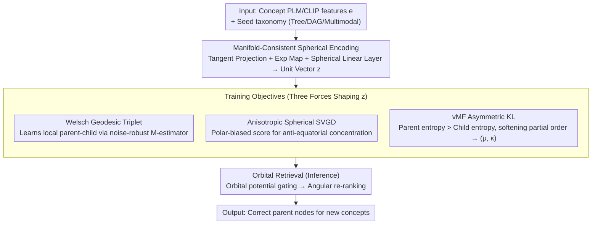

# Polaris: Coupled Orbital Polar Embeddings for Hierarchical Concept Learning

**Conference**: ICML 2026  
**arXiv**: [2605.00265](https://arxiv.org/abs/2605.00265)  
**Code**: None  
**Area**: Representation Learning / Hierarchical Concept Learning / Taxonomy Expansion / Spherical Embeddings  
**Keywords**: Polar embeddings, unit hypersphere, vMF distribution, Stein Variational Gradient Descent, taxonomy expansion

## TL;DR
Polaris decouples concept representations into two signals: "direction (semantics) + orbital potential (hierarchy)," both learned on a unit hypersphere. It utilizes tangent space projection and exponential mapping to ensure manifold closure, anisotropic spherical SVGD to prevent equatorial concentration, and vMF KL divergence to implement asymmetric "parent should have higher entropy than child" constraints. On taxonomy expansion tasks, it improves top-K recall by up to 19 points and reduces mean rank by 60%.

## Background & Motivation
**Background**: Taxonomy expansion (attaching new concepts to the correct parent nodes in an existing tree/DAG) is a core problem in knowledge graphs, recommendation systems, product categorization, and medical ontologies. Existing approaches generally fall into three categories: (1) Euclidean embeddings + symmetric similarity (TransE, TaxoExpan); (2) Hyperbolic embeddings leveraging exponential volume growth to alleviate tree crowding (Poincaré, HyperExpan); (3) Container embeddings like cone/box that explicitly encode "child contained by parent" (ConE, Box, Gumbel Box).

**Limitations of Prior Work**: Euclidean methods fail to express naturally asymmetric parent-child relationships via symmetric distances; Hyperbolic methods are sensitive to optimization and numerical precision; Container methods, while expressing partial orders, require joint optimization of "semantic similarity" and "hierarchical position," where entanglement often amplifies small semantic errors into large placement errors. **Polar embeddings** (encoding semantics via direction and hierarchy via radius or angle) can decouple these signals, but previous polar methods required ad-hoc stability tricks: modulo operations to wrap angles, specialized losses for sector partitioning, or sigmoid rescaling of angles—all of which break manifold continuity and lead to severe high-dimensional angular drift under weak supervision.

**Key Challenge**: To express "semantic direction independent of hierarchical position," one must use polar geometry. However, conventional parameterization of polar coordinates (learning $(\theta,\psi)$ directly and applying $\bmod 2\pi$) implicitly models the sphere as a flat cylinder with zero curvature, which is topologically inconsistent with a true constant-curvature sphere, leading to unstable optimization.

**Goal**: (1) Perform manifold-consistent polar learning on a unit hypersphere without hacks like wrap/mod/sigmoid; (2) Decouple semantic direction from hierarchical position; (3) Stably learn partial-order structures under weak supervision or noisy semantics; (4) Efficiently reduce search space using structural priors.

**Key Insight**: The authors observe that since a sphere is a manifold with constant curvature, one should avoid singular angular parameterization. Instead, learn unit-norm vectors in Cartesian coordinates (using tangent space projection and exponential mapping) and use inner products as angular surrogates. "Separate" the hierarchical signal into an orbital potential derived from the existing hierarchy rather than cramming it into the same angular coordinates.

**Core Idea**: Learn direction-encoded semantics on $\mathbb{S}^{d-1}$ while separately encoding "depth" via an orbital potential derived from the known hierarchy. Use vMF distributions and asymmetric KL divergence to explicitly build $parent-wider, child-narrower$ constraints into the loss.

## Method

### Overall Architecture
Polaris addresses taxonomy expansion: given a seed taxonomy (tree/DAG/multimodal) and a batch of PLM/CLIP features $\mathbf{e}\in\mathbb{R}^{d_\text{plm}}$ for new concepts, find the correct parent node for each new concept. The overall strategy decouples concept representations into two signals—direction for semantics and orbital potential for hierarchy—both learned on the unit hypersphere $\mathbb{S}^{d-1}$. Specifically, Euclidean features $\mathbf{e}$ are lifted to the sphere as unit vectors $\mathbf{z}$ via "manifold-consistent encoding." The model is trained using an objective shaped by three forces: a geometric triplet loss (learning local parent-child relations), anisotropic spherical SVGD (preventing equatorial clustering in high dimensions), and vMF probabilistic constraints (making parent distributions wider than children). During inference, the hierarchy-derived orbital potential performs coarse-grained filtering of candidate parents, followed by angular re-ranking, outputting $\mathbf{z}$ and vMF parameters $(\boldsymbol\mu, \kappa)$ for each concept.

### Key Designs

**1. Manifold-Consistent Spherical Encoding: Lifting Euclidean features strictly to the sphere**

A common failure in prior polar methods is the use of hacks like $\theta\leftarrow\theta\bmod 2\pi$ to model angles, which equates a constant-curvature sphere to a zero-curvature cylinder. This causes discontinuous gradients at wrap boundaries and severe angular drift in high dimensions. Polaris adopts standard Riemannian geometry: it first projects onto the tangent space at the north pole $\mathbf{p}_N$ via $\mathbf{v}=\mathbf{e}-\langle\mathbf{e},\mathbf{p}_N\rangle\mathbf{p}_N$, then uses the exponential map $\mathbf{z}_0=\exp_{\mathbf{p}_N}(\mathbf{v})=\cos(\|\mathbf{v}\|)\mathbf{p}_N+\sin(\|\mathbf{v}\|)\mathbf{v}/\|\mathbf{v}\|$ to lift the feature along the geodesic. This process is continuously differentiable and strictly norm-preserving. To prevent subsequent linear layers from sliding off the manifold, each "Spherical Linear Layer" performs three actions: row vectors $\mathbf{w}_i$ are forced to $\|\mathbf{w}_i\|_2=1$ after initialization and updates; biases are removed to avoid shifting the origin; and the output is re-projected $\mathbf{y}=\mathbf{W}\mathbf{x}/\|\mathbf{W}\mathbf{x}\|_2$ back to the unit sphere. Theorem 2.2 further proves that the subsequent Welsch loss is $\mathsf{SO}(d)$ invariant—the loss depends only on relative geometry, not specific axes.

**2. Welsch Geodesic Triplet: Noise-robust local learning via bounded M-estimators**

Once encoded, local parent-child relations are learned via a geodesic triplet loss. The geodesic angle $\theta_{ij}=\arccos\langle\mathbf{z}_i,\mathbf{z}_j\rangle$ is calculated directly from inner products (preserving rotation invariance). This is wrapped in a bounded Welsch M-estimator $\mathcal{W}(\theta)=1-\exp(-\theta^2/(2c^2))$ to limit the influence of outliers, resulting in $\mathcal{L}_\text{geom}=\max(0,\gamma_\text{geom}+\mathcal{W}(\theta_{cp})-\mathcal{W}(\theta_{cn}))$. This pulls the child toward the parent and pushes it away from negative samples. In real taxonomies where semantic descriptions are often noisy, standard squared distances would allow outliers to amplify small angular errors into massive gradients; the boundedness of Welsch effectively caps this amplification.

**3. Anisotropic Spherical SVGD: Injecting "anti-equatorial" force against measure concentration**

Rotation-invariant angular losses alone are insufficient: Theorem 2.3 states $\sigma\{|\langle\mathbf{z},\mathbf{u}\rangle|\geq\epsilon\}\leq 2\exp(-d\epsilon^2/2)$, implying that in high dimensions, random unit vectors concentrate exponentially at the equator. Angular losses provide no gradient signal against this concentration (as they only consider relative angles). Consequently, hierarchical signals are flattened near $z_d\approx 0$. Polaris introduces anisotropic spherical SVGD to inject an "anti-equatorial" force: treating embeddings as particles, the velocity field is $\phi(\mathbf{z})=\mathbb{E}_{\mathbf{z}'}[k(\mathbf{z}',\mathbf{z})\nabla\log p(\mathbf{z}')+\nabla k(\mathbf{z}',\mathbf{z})]$ with a vMF kernel $k(\mathbf{z}',\mathbf{z})=\exp(\kappa\mathbf{z}'^\top\mathbf{z})$. The target score is split into a structural term $\nabla\log p_\text{struct}=[0,\dots,0,z_d/(1-z_d^2)]^\top$, which pushes particles from the equator toward the poles, and an alignment term $\nabla\log p_\text{align}=\kappa_\text{align}\boldsymbol\mu$, which keeps embeddings within the attraction field of their anchors. Projecting $\phi(\mathbf{z})$ onto the tangent space $T_\mathbf{z}\mathbb{S}^{d-1}$ ensures valid updates, re-expanding the hierarchical structure between the poles.

**4. vMF Asymmetric KL: Softening partial orders via "width differences"**

Previous objectives treat concepts as single points, but a point distance cannot distinguish between "dog" and "mammal"—the latter has a larger semantic volume despite being potentially equidistant on the sphere. Polaris models each concept as a vMF distribution: parameters are derived from the embedding, $\boldsymbol\mu_i=f_\text{sphere}(\mathbf{z}_i;\Theta_\mu)$ and $\kappa_i=\text{Softplus}(\mathbf{w}_\kappa^\top\mathbf{z}_i+b_\kappa)$, where the inverse concentration $1/\kappa$ acts as a proxy for "semantic volume." Parent-child relationships are constrained via a vMF KL approximation: $D_\text{KL}(\text{vMF}_c\|\text{vMF}_p)=\log C_d(\kappa_c)-\log C_d(\kappa_p)-\mathcal{A}_d(\kappa_c)(\kappa_c-\kappa_p\boldsymbol\mu_c^\top\boldsymbol\mu_p)$, where $\mathcal{A}_d(\kappa)=I_{d/2}(\kappa)/I_{d/2-1}(\kappa)$ is the ratio of modified Bessel functions. The asymmetric term $\kappa_c-\kappa_p\boldsymbol\mu_c^\top\boldsymbol\mu_p$ constrains both direction and width: it essentially requires $\kappa_p<\kappa_c$ (parent entropy is higher/wider) and $\boldsymbol\mu_p$ to align with $\boldsymbol\mu_c$. This softens the "parent contains child" partial order into "parent distribution is wider," proving more robust under noise than hard cone/box constraints. The accompanying probabilistic triplet loss is $\mathcal{L}_\text{vMF}=\max(0,\gamma_\text{prob}+D_\text{KL}(c\|p)-D_\text{KL}(c\|n))$.

**5. Orbital Retrieval: Hierarchy-based coarse-to-fine pruning for efficient inference**

Inference requires finding the correct parent among hundreds of thousands of nodes. A global $\arg\max$ over geodesic angles is expensive and ignores the hierarchical prior. Polaris utilizes a hierarchy-derived orbital potential during inference to assign dynamic cosine thresholds per layer. It gates candidate parents layer-by-layer before performing angular re-ranking on the small subset. This reduces costs from global $\arg\max$ to tiered gating, improving both speed and accuracy by incorporating the structural prior. Optimization is conducted via Riemannian Adam: Euclidean gradients are projected to $T_{\mathbf{z}_t}\mathcal{M}$, momentum is transported via parallel translation, and updates are applied as $\mathbf{z}_{t+1}=\exp_{\mathbf{z}_t}(-\eta\hat{\mathbf{m}}_t/\sqrt{\hat{\mathbf{v}}_t})$.

### Loss & Training
The total loss is $\mathcal{L}=\mathcal{L}_\text{geom}+\lambda_\text{SVGD}\mathcal{L}_\text{SVGD}+\lambda_\text{vMF}\mathcal{L}_\text{vMF}$, where the three terms handle local parent-child learning, global spherical coverage, and asymmetric probabilistic constraints, respectively. Optimization uses Riemannian Adam; hypersphere parameters follow spherical updates, while auxiliary head parameters use standard Adam.

## Key Experimental Results

### Main Results
Compared against 14 baselines on single-parent trees (Science / WordNet / Environment), reporting R@1, R@5, Wu&P, MR, and MRR (averaged over five seeds). Polaris achieved "consistent improvements of up to ~19 points in top-K retrieval and up to ~60% reduction in mean rank."

| Dataset | Metric | Best Baseline (STEAM) | Polaris Magnitude | Gain |
| :--- | :--- | :--- | :--- | :--- |
| Science | R@1 / R@5 / MR↓ | 34.8 / 59.7 / 31.7 | ~44 / ~70 / ~13 | top-K +~9-10 pts, MR -~60% |
| WordNet | R@1 / R@5 / MR↓ | 24.9 / 54.5 / 61.1 | ~31 / ~60 / ~25 | top-K +~6 pts |
| Environment | R@1 / R@5 / MR↓ | 34.7 / 51.1 / 28.7 | ~39 / ~55 / ~15 | top-K +~4 pts |

Consistent improvements were also observed for multi-parent DAGs and multimodal hierarchies (approx. 9 / 6 / 4 points gain respectively).

### Ablation Study

| Configuration | Key Change | Explanation |
| :--- | :--- | :--- |
| Full Polaris | Spherical encoding + Welsch geom + SVGD + vMF + orbital retrieval | Complete model |
| w/o SVGD | Removed anisotropic spherical SVGD | Embeddings drift to the equator; depth signal is lost. |
| w/o vMF | Replaced probabilistic triplet with point triplet | Loss of "width difference"; asymmetry degenerates. |
| w/o orbital retrieval | Inference changed to global $\arg\max$ | Latency increases; accuracy drops due to lack of priors. |
| Welsch → Squared Dist | No M-estimator | Outliers from noise amplify errors; performance degrades. |
| Polar wrap baseline | Explicit $(\theta,\psi)$ + $\bmod 2\pi$ | Optimization instability (detailed in Appendix I). |

### Key Findings
- **SVGD addresses the "anti-equator" challenge**: Theorem 2.3 explains the exponential concentration of high-dimensional random vectors at the equator. Anisotropic SVGD provides the necessary global regularization that angular losses cannot supply.
- **vMF KL asymmetry acts as a "soft partial order"**: Unlike brittle hard constraints in cone/box models, vMF models partial order as "higher entropy for parents," providing robustness to noise and a proxy for confidence via $1/\kappa$.
- **Orbital retrieval effectively prunes search space**: Gating candidates by potential is faster and more accurate than pure angular sorting for large-scale taxonomies.
- **Manifold-consistent encoding vs. Angular hacks**: Modeling a sphere as a cylinder via $\bmod$ operations breaks curvature assumptions; ablation confirms wrap-base polar coordinates oscillate during optimization under weak supervision.

## Highlights & Insights
- **The decoupling of semantic direction and hierarchical position is strictly honored**: Semantics follow $\mathbf{z}\in\mathbb{S}^{d-1}$ while hierarchy follows the orbital potential. This separation allows each signal to be learned according to its specific geometry, unlike cone/box methods that entangle them.
- **Applying Stein Variational Gradient Descent to spherical manifolds as a regularizer**: This is a novel and intuitive application—SVGD matches a particle set to a target distribution. Here, the target is a non-equatorial uniform-alignment distribution, countering high-dimensional measure concentration. This technique is transferable to other spherical embedding tasks (contrastive learning, ArcFace).
- **vMF KL's Non-Symmetry as Partial Order**: Using $\kappa$ as a semantic volume proxy and enforcing $\kappa_p < \kappa_c$ is a concise solution for modeling hierarchy. This is particularly suited for domains like medical ontologies or product catalogs where parent categories are naturally more ambiguous.
- **Transferable Tricks**: (1) Spherical linear layers (row-normalization + bias removal + output re-projection) are applicable to any retrieval or contrastive learning task requiring unit-sphere features. (2) Combining a rotation-invariant loss with an anchor-biased score effectively counters homogenization dilemmas.

## Limitations & Future Work
- **Dependence on an existing hierarchy for orbital potential**: This approach is less applicable in complete cold-start scenarios without an initial skeleton; LLM-generated initial taxonomies could be a solution.
- **Numerical stability of Bessel ratios $\mathcal{A}_d(\kappa)$**: While approximation formulas are used, high dimensions and large $\kappa$ may still pose numerical challenges.
- **Unit hypersphere assumption for semantic volume**: In reality, different sub-domains may require different curvatures; extending this to mixed-curvature (Spherical × Hyperbolic) representations is a future path.
- **Limited multimodal hierarchy experiments**: Validation on truly massive-scale multimodal taxonomies is still needed.
- **Code availability**: Implementation details (SVGD kernel temperature, orbital potential settings) currently rely on the appendix, pending community verification.

## Related Work & Insights
- **vs. Poincaré / HyperExpan**: Hyperbolic embeddings rely on exponential volume growth. Polaris explicitly places depth in an orbital potential rather than relying purely on geometry, avoiding some numerical difficulties of hyperbolic space.
- **vs. ConE / Box / Gumbel Box**: Container embeddings use hard partial-order constraints. Polaris softens this with vMF asymmetric KL, proving more robust against noise across all single-parent benchmarks.
- **vs. HAKE / Polar methods**: HAKE uses modulus for depth, but it is coupled with the angle. Polaris strictly fixes the norm to 1 and moves depth entirely to the orbital potential, avoiding coupled optimization.
- **vs. TaxoExpan / STEAM**: These are Euclidean GNN baselines. Polaris significantly outperforms STEAM, with the gain attributed to the "spherical geometry + probabilistic asymmetry" combination.
- **Insights**: The "geometry-consistent encoder + flow-based regularizer + asymmetric probabilistic loss" framework serves as a reusable template for entity linking and medical ontologies, where vMF’s "wider parent" constraint is a natural fit for hierarchical ambiguity.

## Rating
- Novelty: ⭐⭐⭐⭐ (Combination of spherical polar embeddings, SVGD anti-equator, and vMF asymmetric KL is novel and elegantly solves three classic problems).
- Experimental Thoroughness: ⭐⭐⭐⭐ (Three hierarchy types, 14 baselines, and thorough ablation; missing only large-scale industrial case studies).
- Writing Quality: ⭐⭐⭐⭐ (Clear geometric motivation; Theorem 2.2-2.4 provide theoretical grounding; self-contained despite heavy math).
- Value: ⭐⭐⭐⭐ (Provides a methodology-level framework for taxonomy expansion with a practical engineering solution for retrieval speed).

<!-- RELATED:START -->

## Related Papers

- [\[ACL 2025\] Partial Colexifications Improve Concept Embeddings](../../ACL2025/others/partial_colexifications_improve_concept_embeddings.md)
- [\[ICML 2026\] Coupled Training with Privileged Information and Unlabeled Data](coupled_training_with_privileged_information_and_unlabeled_data.md)
- [\[ICML 2026\] New Bounds for Kernel Sums via Fast Spherical Embeddings](new_bounds_for_kernel_sums_via_fast_spherical_embeddings.md)
- [\[ICML 2026\] MalTree: Tracing Malware Evolution from Embeddings at Scale](maltree_tracing_malware_evolution_from_embeddings_at_scale.md)
- [\[CVPR 2026\] Learning Long-term Motion Embeddings for Efficient Kinematics Generation](../../CVPR2026/others/learning_long-term_motion_embeddings_for_efficient_kinematics_generation.md)

<!-- RELATED:END -->
