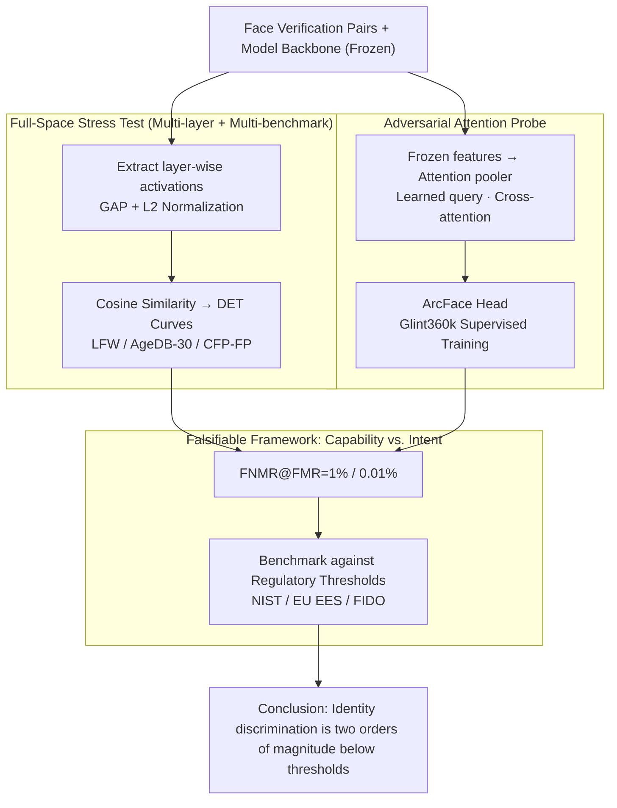

# Position: Age Estimation Models Do Not Process Biometric Data

**Conference**: ICML 2026  
**arXiv**: [2605.17347](https://arxiv.org/abs/2605.17347)  
**Code**: None  
**Area**: AI Safety / AI Governance / Face Analysis  
**Keywords**: Biometric Data, Age Estimation, GDPR, Face Verification, AI Regulation  

## TL;DR
This position paper provides empirical evidence using 14 models × 3 face verification benchmarks to demonstrate that the identity discrimination capabilities of facial age estimation models are two orders of magnitude lower than regulatory thresholds. Therefore, they should not be automatically categorized as "biometric data processing" under GDPR, BIPA, or the EU AI Act.

## Background & Motivation

**Background**: When a neural network estimates age from a face photo, does it "process" biometric data? This is not merely a philosophical question—it directly determines whether operators must obtain explicit consent under GDPR Article 9, whether they face $1,000–$5,000 in statutory damages per violation under Illinois BIPA, or whether they are classified as "high-risk AI" under the EU AI Act. GDPR Article 4(14) defines biometric data as data "allowing or confirming" the unique identification of a natural person, while Article 9 adds a "for the purpose of uniquely identifying" restriction. BIPA follows a capability-based approach (extracting facial geometry counts), whereas the EU AI Act introduces a different set of definitions altogether.

**Limitations of Prior Work**: Regulators have not provided a unified answer. The UK ICO stated in the Yoti sandbox that facial age estimation does not constitute "special category data," yet its 2024 guidance acknowledges that "it might count if identification is possible, even if it is not your intention." The EDPB’s 2019 video guidance created an exemption for systems that "only perform classification without generating identification templates," but the 2022 facial recognition guidance narrowed this opening. The legal criteria used are inconsistent, leaving the engineering community caught in a debate between "functional capability" and "intent of use."

**Key Challenge**: Intermediate representations are indeed generated during the forward pass. These representations exist instantaneously, are not output, and are not stored, but they could theoretically "encode identity discrimination information." If interpreted through a capability lens, any system where intermediate tensors "might encode identity" becomes biometric processing. If interpreted through an intent lens, age estimation is fully exempt because its purpose is not identification. Both sides are logical, but both lack data.

**Goal**: To answer empirically whether age estimation models possess functional unique identification capabilities, thereby decoupling empirically measurable components from legal debates.

**Key Insight**: The authors cite the ICO’s precise phrasing—"unique identification requires singling out someone with accuracy"—and point out that this accuracy is quantifiable. Thus, they transform the "biometric or not" question into "whether the FNMR@FMR on face verification benchmarks reaches regulatory thresholds."

**Core Idea**: The study evaluates the verification performance of 14 models (4 true age estimators + several other attribute models + 1 ArcFace baseline + 3 general vision models) on LFW / AgeDB-30 / CFP-FP. The results are compared against three sets of regulatory thresholds: NIST SP 800-63-4, EU EES, and FIDO. An "adversarial" secondary experiment is also included—using an attention probe to retrain a face recognition head on frozen features to extract latent identification power from the representations.

## Method

### Overall Architecture

Each model $M$ under test is treated as a feature extractor. Activation is extracted from an intermediate layer for a facial image $x$, followed by global average pooling and L2 normalization to obtain an embedding $e(x)$. For a verification pair $(x_a, x_b)$, the cosine similarity $s = \langle e(x_a), e(x_b) \rangle$ is calculated. DET curves are plotted for 6,000 evaluation pairs, reporting the False Non-Match Rate ($\text{FNMR}$) at a fixed False Match Rate ($\text{FMR}$). The primary report uses $\text{FNMR}@\text{FMR}=1\%$ (statistically reliable), while the auxiliary report uses $\text{FNMR}@\text{FMR}=0.01\%$ (regulatory reference). All evaluations are run for every layer of every model to plot "FNMR vs. Network Depth" curves, proving that "no layer is sufficient," which counters the argument that earlier or later layers might encode identity.

The evaluation is divided into two complementary branches: ① **Readout Experiment**—uses the standard average pooling described above to measure "off-the-shelf" identity leakage in features; ② **Adversarial Probe**—retrains an attention pooler + ArcFace head on frozen features to force out the "theoretical upper bound" of identity information. The $\text{FNMR}@\text{FMR}$ from both branches is finally compared against NIST / EU EES / FIDO thresholds to determine if it reaches "usable identification" levels.

### Key Designs

**1. Falsifiable Framework for Capability vs. Intent: Translating binary legal questions into continuous FNMR@FMR quantification**  
Regulatory debates often stall on binary, untestable questions like "whether intermediate representations *might* identify." The first step here is to translate this into a measurable continuous variable. Referencing ISO/IEC 19795 1:1 verification terminology—where FMR is the rate at which different people are incorrectly matched (security) and FNMR is the rate at which the same person is incorrectly rejected (usability)—the study aligns three regulatory thresholds: NIST SP 800-63-4 IAL2 ($\text{FMR}\le 0.01\%$, $\text{FNMR}<5\%$), EU EES ($\text{FMR}=0.05\%$, $\text{FNMR}<1\%$), and FIDO ($\text{FMR}\le 0.01\%$, $\text{FNMR}<5\%$). The proposition becomes falsifiable: if a model performs two orders of magnitude worse than these thresholds even on LFW (the simplest in-the-wild benchmark), usable identification capability can be excluded. This aligns the test goal with the regulators' concern of "singling out someone with precision."

**2. "Full-Space" Stress Test: Blocking counter-arguments regarding specific layers or benchmarks**  
To prevent the critique that "tests were insufficient," this study covers 4–N intermediate layers rather than just the final layer, using "FNMR vs. Depth" curves to show that no layer is effective. Furthermore, three benchmarks of varying difficulty are used: LFW (easy, in-the-wild), AgeDB-30 (30-year temporal span for the same person), and CFP-FP (frontal vs. profile). AgeDB-30 is a critical design choice—if age estimation models "accidentally" learned identity, cross-age recognition should be their potential strength. In reality, age estimation models perform worst on AgeDB-30 (96–98% FNMR), suggesting age features are nearly orthogonal to identity features rather than implicitly leaking them.

**3. Attention Probe: Adversarial upper-bound estimation**  
Readout experiments (average pooling) only show practical leakage. Opponents might argue that identity information exists but is "hidden" or flattened by pooling. To address this, the study adds an adversarial probe: the backbone's final layer features are frozen, and an attention pooler (using a learned query to aggregate feature tokens via cross-attention) and an ArcFace head are trained on Glint360k. This is no longer the original age estimator, but a system built specifically for identification using age features as input. If even this fails to identify well, the features themselves lack extractable identity information. Results show that while FNMR on LFW for commercial estimators drops from 27% to 2% (seemingly significant), it remains at 67% for AgeDB-30 and 28% for CFP-FP, far behind ArcFace's 2.4% / 1.2%.

### Loss & Training

The unsupervised evaluation uses no loss. The attention probe uses the ArcFace loss $$\mathcal{L} = -\log \frac{e^{s\cos(\theta_y+m)}}{e^{s\cos(\theta_y+m)} + \sum_{j\ne y}e^{s\cos\theta_j}}$$ to fine-tune the pooler and projection heads on Glint360k with the backbone fully frozen. Evaluated models report $\text{FNMR}@\text{FMR}=1\%$ and $\text{FNMR}@\text{FMR}=0.01\%$.

## Key Experimental Results

### Main Results: Verification Capability of 14 Models on LFW

Using the LFW dataset (ImageNet-style crops), the main report focuses on $\text{FNMR}@\text{FMR}=1\%$. Representative models are extracted below:

| Model | Type | LFW @1% (%) | LFW @.01% (%) | Gap vs. ArcFace |
| :--- | :--- | :--- | :--- | :--- |
| ArcFace (ResNet-100) | True Recognition | 0.23 | 0.3 | 1× |
| Commercial age estimator | Age Estimation | 26.8 | 63.7 | ~100× |
| FairFace age+gender+race | Attribute Est. | 57.4 | 85.8 | ~250× |
| Age+gender ViT | Attribute Est. | 67.3 | 87.5 | ~290× |
| Age estimation PyTorch | Age Estimation | 94.6 | 99.7 | ~410× |
| SSR-Net | Compact Age Est. | 95.0 | 99.4 | ~410× |
| DINOv3 (Gen. Vision) | Self-supervised | 37.5 | 70.7 | Reference |

The 27% FNMR of the strongest commercial age estimator is already over 5x higher than the 5% FNMR requirement of FIDO/NIST. At the regulatory FMR=0.01%, all age estimation models show FNMR between 64%–99%.

### Key Findings

- **Age Estimation $\ne$ Residual Identity**: Estimation models perform worst on the cross-age AgeDB-30 (96–98% FNMR), suggesting age-optimized features are essentially orthogonal to identity features rather than leaking them.
- **No Layer Meets Standards**: The FNMR vs. depth curves show all age estimation models start at ~95% FNMR in early layers and slowly drop to 27–95% at the final layer, leaving a two-magnitude gap from the NIST 5% threshold.
- **Adversarial Probes Do Not Save It**: Even with Glint360k identity supervision, age estimation models still show 67% FNMR on AgeDB-30. At FMR=0.01%, the strongest probe still hits 17/91/68% on LFW/AgeDB-30/CFP-FP, failing to match regulatory recognition systems.
- **General Vision Models Outperform Age Estimators**: DINOv3 and Perception Encoder achieve 21–37% FNMR on LFW @1%, proving closer to recognition than some age estimators. This highlights the difference in identity retention between "self-supervised general representations" and "task-specific age representations."

## Highlights & Insights
- **Translating Legal Uncertainty into Falsifiable ML Propositions**: Position papers often remain purely speculative. This paper uses ISO 19795 quantitative metrics + a 14×3 grid experiment to treat "functional capability" as a repeatable experiment, serving as a paradigm for future AI governance research.
- **AgeDB-30 as a Clever Inverse Proof**: Intuitively, cross-age verification for the same person should be the "home turf" for an age estimation model if it had learned identity as a side effect. The fact that it performs worst here is a powerful counter-evidence.
- **Attention Probe as "Upper Bound Detection"**: This two-layered structure (readout for current leakage + probe for theoretical upper bound) strengthens the conclusion from "it doesn’t work now" to "it is theoretically difficult."

## Limitations & Future Work
- **Transparency of Stakeholder Affiliation**: The authors are from Sumsub, whose commercial age estimator is among the 14 tested (and was the strongest). Despite the disclaimer that views are personal, readers should be mindful of potential bias.
- **Architecture Limitations**: The 14 models are mostly standard backbones. There is no guarantee that future, larger, or multi-modal age estimators will yield the same conclusions, especially if large vision-language models retain general identity capabilities after fine-tuning.
- **Legal Context is Empirical Input Only**: The authors state they are not solving the legal problem. BIPA’s "extraction of facial geometry triggers capture" route might ignore "functional non-recognition," meaning age estimation could still be regulated in BIPA jurisdictions regardless of empirical data.
- **Benchmark Bias**: Benchmarks like LFW are skewed toward Anglosphere public figures. Demographic biases might understate identification risks for certain minority groups.

## Related Work & Insights
- **vs. ICO Yoti Sandbox (2022)**: The ICO answered that the *purpose* is not identification, but left the Article 4(14) definition of "biometric data" open. This paper addresses that gap with quantitative testing under the ICO’s own "accuracy and precision" standards.
- **vs. Clearview AI Cases**: These cases confirmed that stored facial embeddings are biometric data. This paper distinguishes "transient intermediate representations" that are "not stored and lack recognition capability" from "stored identification templates," arguing for a separate category of "transient processing."
- **vs. EDPB Guidelines 3/2019**: The EDPB granted exemptions for attribute classification in principle. This paper provides the ML-verifiable criteria to maintain that exemption even as 2022 facial recognition guidelines tighten.

<!-- RELATED:START -->

## Related Papers

- [\[ACL 2025\] Do not Abstain! Identify and Solve the Uncertainty](../../ACL2025/others/do_not_abstain_identify_and_solve_the_uncertainty.md)
- [\[AAAI 2026\] Reward Redistribution via Gaussian Process Likelihood Estimation](../../AAAI2026/others/reward_redistribution_via_gaussian_process_likelihood_estimation.md)
- [\[ICML 2026\] Amortized Simulation-Based Inference in Generalized Bayes via Neural Posterior Estimation](amortized_simulation-based_inference_in_generalized_bayes_via_neural_posterior_e.md)
- [\[ICML 2026\] Cascaded Flow Matching for Heterogeneous Tabular Data with Mixed-Type Features](cascaded_flow_matching_for_heterogeneous_tabular_data_with_mixed-type_features.md)
- [\[ICML 2026\] AMDP: Asynchronous Multi-Directional Pipeline Parallelism for Large-Scale Models Training](amdp_asynchronous_multi-directional_pipeline_parallelism_for_large-scale_models_.md)

<!-- RELATED:END -->
