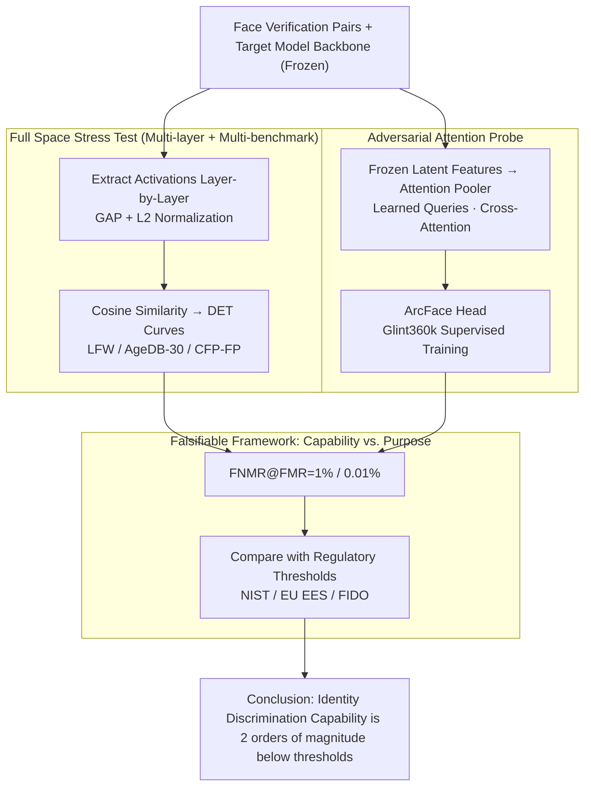

# Position: Age Estimation Models Do Not Process Biometric Data

**Conference**: ICML 2026  
**arXiv**: [2605.17347](https://arxiv.org/abs/2605.17347)  
**Code**: None  
**Area**: AI Safety / AI Governance / Face Analysis  
**Keywords**: Biometric Data, Age Estimation, GDPR, Face Verification, AI Regulation  

## TL;DR
This is a position paper providing empirical evidence across 14 models and 3 face verification benchmarks to argue that face age estimation models possess identity discrimination capabilities two orders of magnitude lower than regulatory thresholds. Therefore, they should not be automatically classified as "processing of biometric data" under GDPR, BIPA, or the EU AI Act.

## Background & Motivation

**Background**: When a neural network estimates age from a face photo, does it "process" biometric data? This is not merely a philosophical question—it determines whether operators must obtain explicit consent under GDPR Article 9, whether they face statutory damages of $\$1,000–\$5,000$ per violation under Illinois BIPA, or if the system is classified as "High-Risk AI" under the EU AI Act. GDPR Article 4(14) defines biometric data as data that "allows or confirms" the unique identification of a natural person, while Article 9 adds the restriction of "for the purpose of uniquely identifying." BIPA follows a capability-based approach (extracting facial geometry counts), while the EU AI Act introduces its own set of definitions.

**Limitations of Prior Work**: Regulatory bodies have not provided a unified answer. The UK ICO stated in the Yoti sandbox that facial age estimation does not constitute "special category data," yet its 2024 guidance acknowledges that "it may count if identification is possible, even if not the intent." The EDPB 2019 video guidance created an exemption for systems that "only perform classification without generating identification templates," but the 2022 facial recognition guidance narrowed this gap. The legal thresholds lack uniformity, and the engineering community faces a conflict between "capability" and "purpose."

**Key Challenge**: Intermediate representations are indeed generated during forward propagation. While these representations exist momentarily and are neither output nor stored, they could theoretically "encode identity discrimination information." Under a capability-based interpretation, any system where intermediate tensors "might encode identity" becomes biometric processing. Under a purpose-based interpretation, age estimation is exempt because its objective is not identification. Both views have merit, but both lack empirical data.

**Goal**: To provide empirical answers to whether "age estimation models functionally possess unique identification capabilities," separating empirically measurable components from legal debates.

**Key Insight**: The authors cite the ICO’s own precise wording—"unique identification requires singling out someone with accuracy and precision"—noting that this precision is quantifiable. Thus, the question of "whether it is biometric" is transformed into "whether the FNMR@FMR on face verification benchmarks meets regulatory thresholds."

**Core Idea**: Evaluate the verification performance of 14 models (4 dedicated age estimators + several other attribute models + 1 ArcFace baseline + 3 general vision models) on LFW / AgeDB-30 / CFP-FP. Compare these against threshold sets from NIST SP 800-63-4, EU EES, and FIDO. Additionally, conduct an "adversarial" second-level experiment—retraining a face recognition head using attention probes on frozen features to force out any latent identification capability.

## Method

### Overall Architecture

Each tested model $M$ is treated as a feature extractor. For a face image $x$, an intermediate layer activation is extracted, followed by global average pooling (GAP) and L2 normalization to obtain an embedding $e(x)$. For a verification pair $(x_a, x_b)$, the cosine similarity is calculated as $s = \langle e(x_a), e(x_b) \rangle$. For 6,000 evaluation pairs, DET curves are plotted to report the False Non-Match Rate ($\text{FNMR}$) at fixed False Match Rates ($\text{FMR}$). The primary metric reported is $\text{FNMR}@\text{FMR}=1\%$ (statistically reliable), with $\text{FNMR}@\text{FMR}=0.01\%$ as a regulatory reference. All evaluations are run for every layer of every model to plot "FNMR vs. Network Depth" curves, proving that "no layer is sufficient," thereby preventing counter-arguments that earlier or later layers might encode identity.

The evaluation consists of two complementary branches: ① **Readout Experiments**—using the standard average pooling above to measure "readily available" identity leakage in features; ② **Adversarial Probes**—retraining an attention pooler and ArcFace head on frozen features to extract the "theoretical upper bound" of identity information. The resulting $\text{FNMR}@\text{FMR}$ values are compared against NIST / EU EES / FIDO regulatory thresholds to determine if they reach "usable identification" levels.

### Key Designs

**1. Falsifiable Framework: Converting legal binary questions into continuous FNMR@FMR quantification**  
Regulatory debates often stall on binary, untestable questions like "whether intermediate representations *could* identify someone." This paper translates this into a measurable continuous variable. Referencing ISO/IEC 19795 1:1 verification terminology—FMR for false positives (security) and FNMR for false negatives (usability)—three regulatory thresholds are aligned: NIST SP 800-63-4 IAL2 requires $\text{FMR}\le 0.01\%$ and $\text{FNMR}<5\%$, EU EES requires $\text{FMR}=0.05\%$ and $\text{FNMR}<1\%$, and FIDO requires $\text{FMR}\le 0.01\%$ and $\text{FNMR}<5\%$. The proposition becomes falsifiable: if a model performs two orders of magnitude worse than these thresholds even on LFW (the simplest in-the-wild benchmark), it lacks "usable identification capability."

**2. Multi-layer & Multi-benchmark "Full Space" Stress Test: Closing all counter-argument paths**  
To prevent the critique that "not enough layers were tested," the authors extract 4 to N intermediate layers for every model. They plot "FNMR vs. Depth" curves to prove no layer is sufficient. Simultaneously, they select three benchmarks of varying difficulty: LFW (in-the-wild, easy), AgeDB-30 (30-year age gap for the same person), and CFP-FP (frontal vs. profile). AgeDB-30 is critical: if age models truly "implicitly learned identity," cross-age recognition should be their strength. Instead, age models performed worst on AgeDB-30 (96–98% FNMR), proving age features are nearly orthogonal to identity features rather than leaking them.

**3. Attention Probe: Adversarial upper bound estimation to check if identity info is merely "flattened"**  
The readout experiment only shows current leakage. An opponent could argue identity information exists but is flattened by simple pooling. To address this, the authors freeze the backbone's features and attach an attention pooler (aggregating feature tokens via cross-attention with learned queries) and an ArcFace head trained on Glint360k. This is no longer the original age estimator but a new system optimized solely for recognition using the age model's features. If even this fails, the features lack usable identity information. Results showed the Commercial age estimator's FNMR on LFW dropped from 27% to 2%, but remained at 67% for AgeDB-30 and 28% for CFP-FP, far below ArcFace's 2.4% / 1.2%.

### Loss & Training

The unsupervised evaluation uses no loss. The attention probe utilizes ArcFace loss:
$$\mathcal{L} = -\log \frac{e^{s\cos(\theta_y+m)}}{e^{s\cos(\theta_y+m)} + \sum_{j\ne y}e^{s\cos\theta_j}}$$
to fine-tune the pooler and projection head on Glint360k while the backbone remains frozen. $\text{FNMR}@\text{FMR}=1\%$ and $\text{FNMR}@\text{FMR}=0.01\%$ are reported for each layer.

## Key Experimental Results

### Main Results: Verification Capability of 14 Models on LFW

Using the ImageNet-style cropped LFW dataset, reporting $\text{FNMR}@\text{FMR}=1\%$:

| Model | Type | LFW @1% (%) | LFW @.01% (%) | Gap with ArcFace |
|-------|------|-------------|---------------|------------------|
| ArcFace (ResNet-100) | Identity Recog. | 0.23 | 0.3 | 1× |
| Commercial age estimator | Age Estimation | 26.8 | 63.7 | ~100× |
| FairFace age+gender+race | Attributes | 57.4 | 85.8 | ~250× |
| Age+gender ViT | Attributes | 67.3 | 87.5 | ~290× |
| Age estimation PyTorch | Age Estimation | 94.6 | 99.7 | ~410× |
| SSR-Net | Compact Age | 95.0 | 99.4 | ~410× |
| DINOv3 (General Vision)| Self-supervised | 37.5 | 70.7 | Reference |

The strongest age estimator's 27% FNMR is 5x higher than the 5% requirement for FIDO/NIST. At $\text{FMR}=0.01\%$, all age models range between 64% and 99% FNMR.

### Key Findings:

- **Age Estimation $\neq$ Residual Identity**: Age models perform worst on AgeDB-30 (96–98% FNMR). Features optimized for age are fundamentally orthogonal to identity discrimination.
- **No Layer Meets standards**: FNMR vs. Depth curves show models improve from ~95% FNMR in early layers to 27–95% in final layers, still two orders of magnitude away from NIST's 5% threshold.
- **Probes Cannot Recover Identity**: Even with Glint360k supervision, age models still result in 67% FNMR on AgeDB-30. At $\text{FMR}=0.01\%$, the strongest probes on LFW/AgeDB/CFP-FP are 17/91/68%, clearly lacking "precision."
- **General Models vs. Specialized Models**: DINOv3 and Perception Encoder (21–37% FNMR) are closer to identification than some specialized age estimators, highlighting that general self-supervised representations retain more identity information than task-specific age representations.

## Highlights & Insights
- **Translating Legal Uncertainty to Falsifiable ML Probes**: The paper avoids pure speculation by using ISO 19795 metrics and a 14×3 grid of experiments to quantify "functional capability." This "position + empirical" approach serves as a paradigm for future AI governance research.
- **The AgeDB-30 Counter-Evidence**: Intuitively, age models should excel at cross-age identity recognition if they were implicitly learning identity. The fact that they perform worst here is a strong counter-evidence against the "implicit leak" theory.
- **Attention Probe as Paradigm Contribution**: Future "Position papers" assessing "system capability X" can adopt this two-tier structure (readout for actual leakage + adversarial probe for theoretical upper bound).

## Limitations & Future Work
- **Conflict of Interest Transparency**: Authors are from Sumsub, and their commercial model was one of the 14 tested (performing the strongest). Readers should stay alert to potential bias despite the open evaluation.
- **Limited to ViT/CNN Architectures**: The conclusion holds for current backbones but may not apply to future large-scale or multi-modal age estimators, particularly Vision-Language models that might retain general identity traits.
- **BIPA Legal Nuances**: BIPA targets the "extraction of facial geometry." The evidence of "functional non-recognition" may not satisfy jurisdictions where mere extraction triggers regulation.
- **Benchmark Bias**: LFW and others are biased toward public figures from the Anglosphere. Identification risks for minority groups might be underestimated, and group-specific fairness was not the focus.

## Related Work & Insights
- **vs. ICO Yoti Sandbox (2022)**: The ICO addressed purpose (not Article 9) but left the Article 4(14) definition of "biometric data" open; this paper fills that gap with quantitative tests.
- **vs. Clearview AI Cases (Garante/CNIL 2022)**: These cases confirmed stored face embeddings are biometric data. This paper distinguishes "transient intermediate representations" from "stored identification templates," arguing they should not be regulated equally.
- **vs. EDPB Guidelines 3/2019**: The EDPB allows exemptions for classification systems. This paper provides the ML-verifiable criteria to maintain that exemption even as other face recognition regulations tighten.

<!-- RELATED:START -->

## Related Papers

- [\[AAAI 2026\] Reward Redistribution via Gaussian Process Likelihood Estimation](../../AAAI2026/others/reward_redistribution_via_gaussian_process_likelihood_estimation.md)
- [\[ACL 2025\] Do not Abstain! Identify and Solve the Uncertainty](../../ACL2025/others/do_not_abstain_identify_and_solve_the_uncertainty.md)
- [\[ICML 2026\] Amortized Simulation-Based Inference in Generalized Bayes via Neural Posterior Estimation](amortized_simulation-based_inference_in_generalized_bayes_via_neural_posterior_e.md)
- [\[ICML 2026\] GOTabPFN: From Feature Ordering to Compact Tokenization for Tabular Foundation Models on High-Dimensional Data](gotabpfn_from_feature_ordering_to_compact_tokenization_for_tabular_foundation_mo.md)
- [\[ICML 2026\] nD-RoPE: A Generalized RoPE for n-Dimensional Position Embedding](nd-rope_a_generalized_rope_for_n-dimensional_position_embedding.md)

<!-- RELATED:END -->
