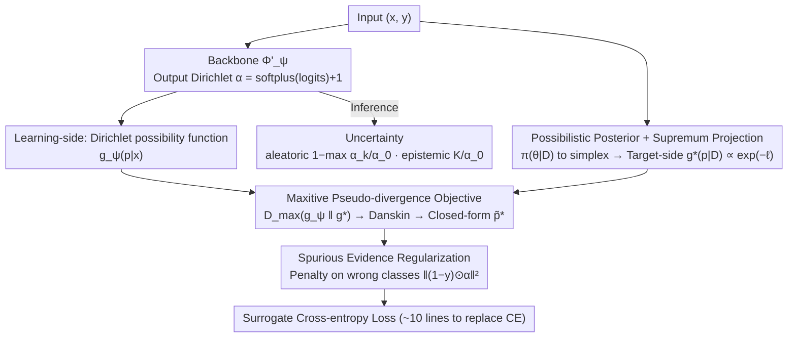

# Possibilistic Predictive Uncertainty for Deep Learning

**Conference**: ICML 2026  
**arXiv**: [2605.00600](https://arxiv.org/abs/2605.00600)  
**Code**: https://github.com/MaxwellYaoNi/DAPPr  
**Keywords**: Epistemic Uncertainty, Possibility Theory, Dirichlet, Second-order Predictor, EDL

## TL;DR
This paper replaces the Bayesian probabilistic framework with possibility theory to propose DAPPr. By projecting the possibilistic posterior in the parameter space onto the predictive space via supremum and fitting it with a learnable Dirichlet possibility function, the authors derive a method for modeling epistemic uncertainty that requires only 10 lines of code, directly replaces cross-entropy, and outperforms the EDL family in OOD detection.

## Background & Motivation
**Background**: It is a well-known pain point that deep networks are overconfident on out-of-distribution (OOD) samples. Current epistemic uncertainty modeling mainstreams follow two paths: Bayesian deep learning (BNN / MC Dropout / Deep Ensemble) and second-order predictors (EDL / PostNet / Prior Networks).

**Limitations of Prior Work**: The Bayesian route is theoretically rigorous but requires posterior marginalization in high-dimensional parameter spaces, which is computationally expensive and difficult to scale. Second-order predictors are efficient, but their objectives are mostly heuristic and lack rigorous derivation from probabilistic axioms. EDL has even been pointed out to exhibit pathological behavior where "more data leads to higher uncertainty."

**Key Challenge**: There is a trade-off between theoretical rigor and computational feasibility—Bayesian methods are rigorous but expensive, while second-order methods are cheap but ad hoc. The authors argue the root cause is treating epistemic uncertainty as probability, whereas the "sum to 1" constraint of probability distributions is naturally better suited for characterizing aleatoric randomness rather than "ignorance."

**Goal**: (1) Identify a rigorous uncertainty representation framework that does not require parameter-space integration; (2) Derivation of a training objective with a closed-form solution; (3) Direct comparison against the EDL family on standard benchmarks.

**Key Insight**: The authors start from possibility theory (proposed by Zadeh in 1978 but largely ignored in deep learning). It uses supremum instead of integration and max-normalization instead of sum-to-1, making it naturally suited for expressing epistemic information like "which hypotheses cannot be excluded."

**Core Idea**: Project the possibilistic posterior of model parameters onto the simplex via supremum, then use a Dirichlet possibility function for parametric approximation on the simplex. The entire pipeline yields a closed-form solution using cross-entropy.

## Method
The elegance of DAPPr lies in taking a "projected posterior" that originally required constrained optimization in high-dimensional parameter space and compressing it into 10 lines of PyTorch code via three components: the over-parameterized assumption, Dirichlet parameterization, and Danskin’s theorem.

### Overall Architecture
The input consists of ordinary classification samples $(\bm{x}, \bm{y})$. The model $\Phi'_{\bm{\psi}}$ outputs Dirichlet parameters $\bm{\alpha} = \mathrm{softplus}(\mathrm{logits}) + 1$, which defines a **learning-side** Dirichlet possibility function $g_{\bm{\psi}}(\bm{p}|\bm{x})$. The core of training is an "alignment" problem: a separate **target-side** branch projects the parameter-space possibilistic posterior $\pi(\bm{\theta}|\mathcal{D})$ onto the simplex via supremum to obtain the projected posterior $g^*_{\bm{x}}(\bm{p}|\mathcal{D}) \propto \exp(-\ell)$. Finally, a maxitive pseudo-divergence is used to make the learning-side $g_{\bm{\psi}}$ approximate the target-side $g^*$. This min-max objective collapses into a closed-form surrogate loss via Danskin's theorem and Dirichlet parameterization under cross-entropy, plus a spurious evidence regularizer. During inference, $\bm{\alpha}$ is used directly: $1 - \max_k \alpha_k / \alpha_0$ calculates aleatoric uncertainty, while $K / \alpha_0$ calculates epistemic uncertainty (where $\alpha_0 = \sum_k \alpha_k$ is the total evidence).

### Key Designs

**1. Possibilistic Posterior + Supremum Projection: Replacing Expensive Integration with Optimization**

Bayesian methods are expensive because of marginalization integrals over high-dimensional parameter spaces. The fundamental difference in possibility theory is replacing integration with supremum. Given a uniform prior, the parameter-space possibilistic posterior is defined as $\pi(\bm{\theta}|\mathcal{D}) = \exp(-L(\bm{\theta};\mathcal{D})) / \sup_{\bm{\theta}'}\exp(-L(\bm{\theta}';\mathcal{D}))$; smaller loss implies higher plausibility. This is projected onto the simplex using a possibilistic change-of-variable: $g^*_{\bm{x}}(\bm{p}|\mathcal{D}) = \sup\{\pi(\bm{\theta}|\mathcal{D}) : \Phi_{\bm{\theta}}(\bm{x}) = \bm{p}\}$. Using the over-parameterized assumption (a sufficiently large network can fit any single point without affecting others), it is proven that $\inf_{\Phi_{\bm{\theta}}(\bm{x})=\bm{p}} L(\bm{\theta}; \mathcal{D} \setminus \{(\bm{x},\bm{y})\}) \approx c_{\bm{x}}$ is nearly independent of $\bm{p}$, simplifying the projected posterior to $g^*_{\bm{x}}(\bm{p}|\mathcal{D}) \propto \exp(-\ell(\bm{p}, \bm{y}))$. This two-stage simplification—using supremum and over-parameterization to replace parameter integration with sample-wise leave-one-out infimum—is the key to bypassing expensive Bayesian marginalization.

**2. Maxitive Pseudo-divergence Objective: Turning Abstract Framework into Differentiable Loss**

A trainable objective is needed for the projected posterior. The authors use $D_{\mathrm{max}}(f\|g) = \max_{\theta} \log(f(\theta)/g(\theta))$ to measure the deviation between possibility functions, defining the training objective $\mathcal{L}(\bm{\psi}; \mathcal{D}) = \mathbb{E}_{\bm{x}}[\max_{\bm{p}}(\log g_{\bm{\psi}}(\bm{p}|\bm{x}) - \log g^*_{\bm{x}}(\bm{p}|\mathcal{D}))]$. This essentially penalizes the maximum pointwise overestimation of the projected posterior by the learned function. This is a min-max problem where the inner maximizer $\bm{p}^*$ depends on $\bm{\psi}$. The authors apply Danskin's theorem to equate the outer gradient to the derivative of $\bm{\psi}$ at the inner maximizer, avoiding the instability of GAN-style adversarial training. Under Dirichlet parameterization, the inner max of the cross-entropy loss has a closed-form solution $\tilde{\bm{p}}^* = (\bm{\alpha} - \bm{y}) / (\alpha_0 - 1)$ (requiring $\alpha_k > 1$, enforced by softplus + 1). This combination of maxitive divergence, Danskin's theorem, and Dirichlet parameterization is the core engineering contribution.

**3. Spurious Evidence Regularization: Controlling Overconfidence via Masked L2**

The surrogate objective encourages precise fitting of every sample, which could lead to unbounded growth of total evidence $\alpha_0$, representing unrealistically high confidence. The authors add a regularizer $\mathcal{R}(\bm{x}) = \|(\bm{1} - \bm{y}) \odot \bm{\alpha}\|_2^2$, which only penalizes evidence assigned to incorrect classes. This keeps total evidence controlled without hindering the growth of correct-class evidence. Unlike the complex Fisher regularization used in EDL, this simple mask + L2 suppresses overconfidence on wrong classes.

### Loss & Training
The final training objective is as follows (implementable in ~10 lines of PyTorch):

$$\ell_{\bm{\psi}}(\bm{x}) = \alpha_0 \log \alpha_0 + \sum_k \alpha_k \log(\tilde{p}^*_k / \alpha_k) + \lambda \|(\bm{1} - \bm{y}) \odot \bm{\alpha}\|_2^2$$

where $\tilde{\bm{p}}^* = (\bm{\alpha} - \bm{y} + \epsilon) / (\alpha_0 - 1)$ is detached to prevent gradient backpropagation. $\lambda$ controls the regularization strength and is the only explicit hyperparameter.

## Key Experimental Results

### Main Results
Comparison with SOTA EDL family ($\mathcal{I}$-EDL / R-EDL / $\mathcal{F}$-EDL) and Bayesian baselines (MC Dropout / DUQ / PostNet) on MNIST / CIFAR-10 / CIFAR-100:

| Dataset | Metric | DAPPr | $\mathcal{F}$-EDL | R-EDL | $\mathcal{I}$-EDL | EDL |
|------|------|------|------|------|------|------|
| MNIST Test Acc | ↑ | 99.26 | 99.30 | 99.33 | 99.21 | 98.22 |
| MNIST Conf AUPR | ↑ | 99.99 | 99.93 | 99.99 | 99.98 | 99.99 |
| MNIST→KMNIST OOD | ↑ | **98.81** | 98.74 | 98.69 | 98.33 | 96.31 |
| MNIST→FMNIST OOD | ↑ | **99.55** | 99.31 | 99.29 | 98.86 | 98.08 |

DAPPr consistently outperforms the strongest variants of the EDL family in OOD detection, while remaining competitive in accuracy and confidence calibration.

### Ablation Study
The paper includes empirical validation of the over-parameterization assumption, sensitivity analysis of $\lambda$, and comparisons on more complex benchmarks like long-tailed distributions and fine-grained classification:

| Configuration | Key Effect | Description |
|------|------|------|
| Without Reg ($\lambda = 0$) | Unbounded $\alpha_0$ | Fits every sample with arbitrary precision, destroying uncertainty. |
| Large $\lambda$ | Suppressed evidence | Overall higher uncertainty, slight drop in accuracy. |
| Moderate $\lambda$ | Best trade-off | Highest OOD AUPR. |
| Eq. (11) Validation | Constant loss | Empirical support for the over-param assumption. |

### Key Findings
- In OOD detection tasks where epistemic uncertainty is critical, DAPPr consistently outperforms all EDL variants, suggesting that objectives derived from possibility theory are more sensitive to OOD scenarios.
- Spurious evidence regularization is more than an engineering trick; it theoretically caps unbounded behavior from overfitting single samples, significantly impacting calibration.
- The closed-form $\tilde{\bm{p}}^*$ makes the training cost identical to standard cross-entropy, introducing no ensemble or sampling overhead and allowing direct replacement in existing pipelines.

## Highlights & Insights
- The introduction of possibility theory to deep uncertainty is the largest conceptual contribution—ignoring the standard probabilistic framework in favor of the "max" operator naturally fits the "cannot exclude" semantics of epistemic uncertainty.
- Danskin's theorem is used elegantly to collapse a min-max problem into a single-level gradient at the inner-maximizer, avoiding adversarial training instability.
- The 10-line PyTorch implementation makes it incredibly engineering-friendly with near-zero migration cost.
- The over-parameterized assumption is a powerful simplification trick—approximating a leave-one-out optimization as a constant could be transferred to other areas like influence functions or data attribution.

## Limitations & Future Work
- The over-parameterization assumption might fail in under-parameterized or sample-sensitive scenarios (e.g., few-shot or conflicting multi-tasking); the paper lacks a theoretical characterization of these boundaries.
- The regularization strength $\lambda$ still needs tuning for new datasets; an adaptive version could be considered.
- Currently only implemented for Dirichlet approximation on the simplex for classification; extending to regression or structured prediction requires finding new families of possibility functions.
- Comparison with calibration methods like conformal prediction is missing; it remains unclear if DAPPr uncertainty translates to guaranteed coverage intervals.

## Related Work & Insights
- **vs EDL Family**: EDL is based on subjective logic/Dempster-Shafer theory with heuristic objectives; DAPPr derives its objective rigorously from possibility theory and outperforms EDL variants in OOD.
- **vs Bayesian Deep Learning**: Bayesian routes require ensembles or sampling; DAPPr uses a single model with standard inference costs while still expressing epistemic uncertainty.
- **vs PostNet / Natural Posterior Networks**: Those methods use normalizing flows to fit posteriors, which is complex; DAPPr is simpler, using Dirichlet parameterization and a closed-form maximizer.

## Rating
- Novelty: ⭐⭐⭐⭐⭐ Systematic introduction of possibility theory to deep epistemic uncertainty.
- Experimental Thoroughness: ⭐⭐⭐⭐ Coverage of MNIST/CIFAR, long-tail, and distribution shift benchmarks.
- Writing Quality: ⭐⭐⭐⭐ Rigorous and clear derivation from basic concepts to closed-form solutions.
- Value: ⭐⭐⭐⭐⭐ High engineering value; 10 lines of code to achieve SOTA OOD performance.

<!-- RELATED:START -->

## Related Papers

- [\[CVPR 2026\] Evidential Deep Partial Label Learning to Quantify Disambiguation Uncertainty](../../CVPR2026/others/evidential_deep_partial_label_learning_to_quantify_disambiguation_uncertainty.md)
- [\[ICML 2026\] On the Epistemic Uncertainty of Overparametrized Neural Networks](on_the_epistemic_uncertainty_of_overparametrized_neural_networks.md)
- [\[NeurIPS 2025\] Uncertainty Estimation by Flexible Evidential Deep Learning](../../NeurIPS2025/others/uncertainty_estimation_by_flexible_evidential_deep_learning.md)
- [\[ICML 2026\] Sequential Group Composition: A Window into the Mechanics of Deep Learning](sequential_group_composition_a_window_into_the_mechanics_of_deep_learning.md)
- [\[ICML 2026\] Rectified LpJEPA: Joint-Embedding Predictive Architectures with Sparse and Maximum-Entropy Representations](rectified_lpjepa_joint-embedding_predictive_architectures_with_sparse_and_maximu.md)

<!-- RELATED:END -->
