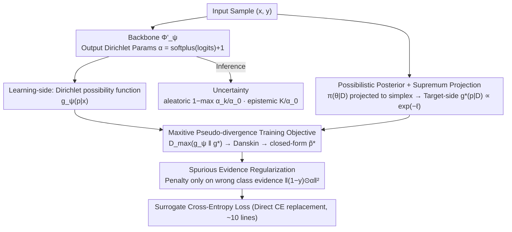

# Possibilistic Predictive Uncertainty for Deep Learning

**Conference**: ICML 2026  
**arXiv**: [2605.00600](https://arxiv.org/abs/2605.00600)  
**Code**: https://github.com/MaxwellYaoNi/DAPPr  
**Keywords**: Epistemic Uncertainty, Possibility Theory, Dirichlet, Second-order Predictor, EDL

## TL;DR
This paper replaces the Bayesian probabilistic framework with possibility theory to propose DAPPr—a method that projects the possibilistic posterior from the parameter space onto the predictive space via supremum, then fits it with a learnable Dirichlet possibility function. The resulting epistemic uncertainty modeling method requires only 10 lines of code, directly replaces cross-entropy, and outperforms the EDL family in OOD detection.

## Background & Motivation
**Background**: It is a well-known pain point that deep networks are overconfident on out-of-distribution (OOD) samples. Current epistemic uncertainty modeling follows two paths: Bayesian deep learning (BNN / MC Dropout / Deep Ensemble) and second-order predictors (EDL / PostNet / Prior Networks).

**Limitations of Prior Work**: The Bayesian path is theoretically rigorous but requires posterior marginalization in high-dimensional parameter spaces, which is computationally expensive and difficult to scale. Second-order predictors are efficient, but their objectives are mostly heuristic and lack rigorous derivation from probabilistic axioms. EDL has even been pointed out to exhibit pathological behavior where "more data leads to higher uncertainty."

**Key Challenge**: A trade-off exists between theoretical rigor and computational feasibility—Bayesian methods are rigorous but expensive, while second-order predictors are cheap but ad hoc. The authors argue the root cause is treating epistemic uncertainty as probability, whereas the "sum to 1" constraint of probability distributions is naturally better suited for characterizing aleatoric randomness rather than "ignorance."

**Goal**: (1) Identify a rigorous uncertainty representation framework that does not require parameter space integration; (2) Derivate a training objective with a closed-form solution; (3) Perform a head-to-head comparison with the EDL family on standard benchmarks.

**Key Insight**: The authors start from possibility theory, proposed by Zadeh in 1978 but largely ignored in deep learning. It uses supremum instead of integration and max-normalization instead of sum-to-1, making it naturally suitable for expressing epistemic information such as "which hypotheses cannot be excluded."

**Core Idea**: Project the possibilistic posterior of model parameters onto the simplex via supremum, then use a Dirichlet possibility function for parametric approximation on the simplex. The entire pipeline can be solved in closed-form using cross-entropy.

## Method
The elegance of DAPPr lies in compressing a "projected posterior"—which originally required constrained optimization in high-dimensional parameter space—into 10 lines of PyTorch code using the trio of over-parameterized assumption, Dirichlet parameterization, and Danskin’s theorem.

### Overall Architecture
The input is a standard classification sample $(\bm{x}, \bm{y})$. The model $\Phi'_{\bm{\psi}}$ outputs Dirichlet parameters $\bm{\alpha} = \mathrm{softplus}(\mathrm{logits}) + 1$, defining a **learning-side** Dirichlet possibility function $g_{\bm{\psi}}(\bm{p}|\bm{x})$. Training is essentially an "alignment" problem: a separate **target-side** branch projects the parameter space possibilistic posterior $\pi(\bm{\theta}|\mathcal{D})$ onto the simplex via supremum to obtain the projected posterior $g^*_{\bm{x}}(\bm{p}|\mathcal{D}) \propto \exp(-\ell)$. Finally, a maxitive pseudo-divergence is used to make the learning-side $g_{\bm{\psi}}$ approximate the target-side $g^*$. This min-max objective collapses into a closed-form surrogate loss via Danskin’s theorem and Dirichlet parameterization under cross-entropy, supplemented by a spurious evidence regularizer. During inference, $\bm{\alpha}$ is used directly: $1 - \max_k \alpha_k / \alpha_0$ calculates aleatoric uncertainty and $K / \alpha_0$ calculates epistemic uncertainty (where $\alpha_0 = \sum_k \alpha_k$ is the total evidence).

### Key Designs

**1. Possibilistic Posterior + Supremum Projection: Replacing Expensive Integration with Optimization**

Bayesian methods are expensive because marginalization requires integration over high-dimensional parameter spaces. The fundamental difference in possibility theory is replacing integration with supremum. Under a uniform prior, the parameter space possibilistic posterior is defined as $\pi(\bm{\theta}|\mathcal{D}) = \exp(-L(\bm{\theta};\mathcal{D})) / \sup_{\bm{\theta}'}\exp(-L(\bm{\theta}';\mathcal{D}))$, where smaller loss implies higher plausibility. This is then projected onto the simplex via a possibilistic change-of-variable: $g^*_{\bm{x}}(\bm{p}|\mathcal{D}) = \sup\{\pi(\bm{\theta}|\mathcal{D}) : \Phi_{\bm{\theta}}(\bm{x}) = \bm{p}\}$. By employing the over-parameterized assumption (a sufficiently large network can fit any single point without affecting others), it is proven that $\inf_{\Phi_{\bm{\theta}}(\bm{x})=\bm{p}} L(\bm{\theta}; \mathcal{D} \setminus \{(\bm{x},\bm{y})\}) \approx c_{\bm{x}}$ is nearly independent of $\bm{p}$, simplifying the projected posterior to $g^*_{\bm{x}}(\bm{p}|\mathcal{D}) \propto \exp(-\ell(\bm{p}, \bm{y}))$. This two-stage simplification—replacing integration with sample-wise leave-one-out infimum via supremum and over-parameterization—is the key to bypassing expensive Bayesian marginalization.

**2. Maxitive Pseudo-divergence Objective: Turning Abstract Framework into Differentiable Loss**

With the projected posterior defined, a trainable objective is needed. The authors use $D_{\mathrm{max}}(f\|g) = \max_{\theta} \log(f(\theta)/g(\theta))$ to measure the deviation between two possibility functions, defining the training objective $\mathcal{L}(\bm{\psi}; \mathcal{D}) = \mathbb{E}_{\bm{x}}[\max_{\bm{p}}(\log g_{\bm{\psi}}(\bm{p}|\bm{x}) - \log g^*_{\bm{x}}(\bm{p}|\mathcal{D}))]$. This essentially penalizes the maximum pointwise overestimation of the projected posterior by the learned function. This is a min-max problem where the inner maximizer $\bm{p}^*$ depends on $\bm{\psi}$. The authors use Danskin’s theorem to equate the outer gradient to the derivative with respect to $\bm{\psi}$ at the inner maximizer, avoiding the instability of GAN-style adversarial training. Under Dirichlet parameterization, the inner max of the cross-entropy loss has a closed-form solution $\tilde{\bm{p}}^* = (\bm{\alpha} - \bm{y}) / (\alpha_0 - 1)$ (requiring $\alpha_k > 1$, enforced by softplus + 1). This combination—maxitive divergence instead of KL, Danskin for solving min-max, and Dirichlet for closed-form—is the core engineering contribution.

**3. Spurious Evidence Regularization: Controlling Overconfidence via Masking + L2**

The surrogate objective encourages precise fitting of every sample, which could cause the total evidence $\alpha_0$ to grow unboundedly, leading to unrealistically high evidence. The authors add a regularizer $\mathcal{R}(\bm{x}) = \|(\bm{1} - \bm{y}) \odot \bm{\alpha}\|_2^2$, which penalizes only the evidence assigned to incorrect classes. This keeps the total evidence controlled without hindering the growth of evidence for the correct class. While the EDL series often requires complex Fisher regularization to control evidence, this method suppresses overconfidence on incorrect classes using a simple mask + L2.

### Loss & Training
The final training objective is as follows (implementable in 10 lines of PyTorch):

$\ell_{\bm{\psi}}(\bm{x}) = \alpha_0 \log \alpha_0 + \sum_k \alpha_k \log(\tilde{p}^*_k / \alpha_k) + \lambda \|(\bm{1} - \bm{y}) \odot \bm{\alpha}\|_2^2$

where $\tilde{\bm{p}}^* = (\bm{\alpha} - \bm{y} + \epsilon) / (\alpha_0 - 1)$ is detached to prevent gradient backpropagation. $\lambda$ controls the regularization strength and is the only explicit hyperparameter.

## Key Experimental Results

### Main Results
Comparison with SOTA EDL family members ($\mathcal{I}$-EDL / R-EDL / $\mathcal{F}$-EDL) and Bayesian baselines (MC Dropout / DUQ / PostNet) on MNIST / CIFAR-10 / CIFAR-100:

| Dataset | Metric | DAPPr | $\mathcal{F}$-EDL | R-EDL | $\mathcal{I}$-EDL | EDL |
|------|------|------|------|------|------|------|
| MNIST Test Acc | ↑ | 99.26 | 99.30 | 99.33 | 99.21 | 98.22 |
| MNIST Conf AUPR | ↑ | 99.99 | 99.93 | 99.99 | 99.98 | 99.99 |
| MNIST→KMNIST OOD | ↑ | **98.81** | 98.74 | 98.69 | 98.33 | 96.31 |
| MNIST→FMNIST OOD | ↑ | **99.55** | 99.31 | 99.29 | 98.86 | 98.08 |

DAPPr consistently outperforms the strongest variants of the EDL family in OOD detection, while maintaining parity in accuracy and confidence calibration.

### Ablation Study
The paper includes empirical validation of the over-parameterization assumption, parameter sweeps for the spurious evidence regularizer $\lambda$, and comparisons on more complex benchmarks like long-tailed distributions, distribution shift detection, and fine-grained classification:

| Configuration | Key Effect | Description |
|------|------|------|
| No regularization $\lambda = 0$ | Unbounded $\alpha_0$ growth | Fitting every sample too precisely destroys uncertainty representation |
| Large $\lambda$ | Suppressed evidence | Overall uncertainty becomes too high, slight drop in accuracy |
| Moderate $\lambda$ | Best trade-off | Highest OOD AUPR |
| Eq. (11) Approximation | Leave-one-out loss nearly independent of $\bm{p}$ | Empirical support for the over-parameterization assumption |

### Key Findings
- On OOD detection tasks where epistemic uncertainty is crucial, DAPPr consistently outperforms all EDL variants, suggesting that objectives derived from possibility theory are more sensitive to OOD scenarios than heuristic EDL objectives.
- The spurious evidence regularizer is more than an engineering trick; it theoretically caps the unbounded behavior of overfitting single samples, significantly impacting final calibration.
- The closed-form $\tilde{\bm{p}}^*$ makes the training cost identical to standard cross-entropy, introducing no ensemble or sampling overhead, allowing for direct replacement in existing pipelines.

## Highlights & Insights
- The introduction of possibility theory to deep uncertainty is the paper's greatest conceptual contribution. For decades, the field has thought almost exclusively within the probability theory framework; the max operator in possibility theory naturally fits the epistemic semantics of "unable to exclude."
- Danskin’s theorem is used elegantly here to collapse a min-max problem into a single-layer gradient at the inner-maximizer, avoiding the instability of adversarial training.
- The 10-line PyTorch implementation for drop-in replacement of cross-entropy is a very engineering-friendly design with near-zero migration cost, which could significantly drive adoption.
- The over-parameterized assumption is a powerful simplification trick—it approximates a leave-one-out optimization problem as a constant. This logic could be transferred to other methods involving parameter space integration (such as influence functions or data attribution).

## Limitations & Future Work
- The over-parameterization assumption may fail in under-parameterized scenarios or sample-sensitive contexts (e.g., few-shot learning or conflicting multi-task learning). While the paper provides empirical validation, it lacks a theoretical characterization of these boundaries.
- The spurious evidence regularizer $\lambda$ is the only explicit hyperparameter and still requires tuning on new datasets; an adaptive version could be considered in the future.
- Currently, Dirichlet approximation is only performed on the simplex for classification; extending this to regression or structured prediction requires finding new families of possibility functions.
- Comparison with calibration methods like conformal prediction is missing; it is currently unclear if DAPPr's uncertainty can be directly converted into guaranteed coverage intervals.

## Related Work & Insights
- **vs. EDL Family**: EDL is based on subjective logic / Dempster-Shafer theory with heuristic objectives. DAPPr rigorously derives its objective from possibility theory and consistently outperforms the strongest EDL variants on OOD tasks.
- **vs. Bayesian Deep Learning (BNN/MC Dropout/Deep Ensemble)**: Bayesian approaches require ensembles or sampling. DAPPr utilizes a single-model inference with costs identical to standard classification while still effectively expressing epistemic uncertainty.
- **vs. PostNet / Natural Posterior Networks**: Those methods use normalizing flows to fit posteriors, which is complex and requires additional components. DAPPr is much simpler, utilizing Dirichlet parameterization and a closed-form maximizer.

## Rating
- Novelty: ⭐⭐⭐⭐⭐ Systematically introduces possibility theory to deep epistemic uncertainty for the first time; novel theoretical foundation.
- Experimental Thoroughness: ⭐⭐⭐⭐ Comprehensive coverage across multiple benchmarks including MNIST, CIFAR, long-tail, distribution shift, and fine-grained classification.
- Writing Quality: ⭐⭐⭐⭐ Rigorous and clear derivations, building step-by-step from basic possibility concepts to the closed-form solution.
- Value: ⭐⭐⭐⭐⭐ High engineering value; 10 lines of code to replace cross-entropy for SOTA OOD performance.

<!-- RELATED:START -->

## Related Papers

- [\[ICML 2026\] On the Epistemic Uncertainty of Overparametrized Neural Networks](on_the_epistemic_uncertainty_of_overparametrized_neural_networks.md)
- [\[CVPR 2026\] Evidential Deep Partial Label Learning to Quantify Disambiguation Uncertainty](../../CVPR2026/others/evidential_deep_partial_label_learning_to_quantify_disambiguation_uncertainty.md)
- [\[NeurIPS 2025\] Uncertainty Estimation by Flexible Evidential Deep Learning](../../NeurIPS2025/others/uncertainty_estimation_by_flexible_evidential_deep_learning.md)
- [\[ICML 2026\] Sequential Group Composition: A Window into the Mechanics of Deep Learning](sequential_group_composition_a_window_into_the_mechanics_of_deep_learning.md)
- [\[ICML 2026\] Rectified LpJEPA: Joint-Embedding Predictive Architectures with Sparse and Maximum-Entropy Representations](rectified_lpjepa_joint-embedding_predictive_architectures_with_sparse_and_maximu.md)

<!-- RELATED:END -->
