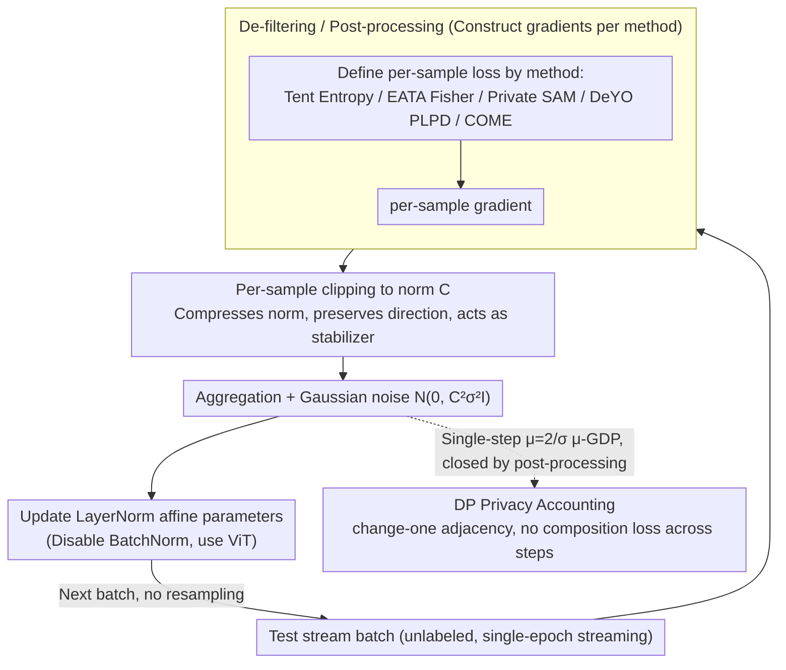

# Private and Stable Test-Time Adaptation with Differential Privacy

**Conference**: ICML 2026  
**arXiv**: [2606.01908](https://arxiv.org/abs/2606.01908)  
**Code**: None  
**Area**: AI Security / Differential Privacy / Test-Time Adaptation  
**Keywords**: Test-Time Adaptation, Differential Privacy, DP-SGD, Per-Sample Clipping, ImageNet-C  

## TL;DR
This paper is the first to point out that Test-Time Adaptation (TTA) leads to leakage of test data privacy. It systematically transforms five mainstream TTA methods (Tent, EATA, SAR, DeYO, and COME) into differentially private (DP) versions using per-sample gradient clipping and Gaussian noise. On ImageNet-C, it provides provable $(\epsilon, \delta)$-DP guarantees and unexpectedly finds that "clipping itself" improves TTA accuracy by $0.1\%$–$4.1\%$.

## Background & Motivation

**Background**: TTA continues to update models during the deployment phase using unlabeled test samples (usually updating only the affine parameters of normalization layers) to combat distribution shifts through entropy minimization, filtering, or re-weighting. Tent represents entropy minimization; EATA adds reliability filtering and Fisher regularization; SAR employs sharpness-aware optimization; DeYO utilizes patch shuffling to calculate Pseudo-label Prediction Difference (PLPD); and COME replaces entropy with Dirichlet uncertainty.

**Limitations of Prior Work**: All these methods rely on an implicit assumption: test data does not require protection. In reality, test images could be medical scans, faces, or location traces, yet TTA "welds" these samples into the model parameters. Once the model or its outputs are queried or shared, attackers can launch membership inference or reconstruction attacks, just as they do against training data, to reverse-engineer individual test samples from updates.

**Key Challenge**: Directly applying DP-SGD to TTA cannot solve the problem because: (1) TTA batch sizes are often as small as 1, causing DP noise to be amplified relative to the signal; (2) TTA methods heavily depend on data-dependent filtering/re-weighting, where dynamic decisions at each step are essentially "queries" from a privacy perspective; naive implementations break both DP and stability; (3) classic DP-SGD analysis is built on sampling and leave-one-out adjacency, whereas TTA is a single-epoch stream where each sample is seen once, requiring a different accounting framework.

**Goal**: (a) Provide a general DP recipe for TTA; (b) implement it in five representative TTA methods; (c) systematically characterize the "privacy budget vs. adaptation accuracy" curve and identify which TTA designs are naturally more DP-friendly.

**Key Insight**: The authors realized that the streaming nature of TTA actually simplifies DP analysis—since each sample is processed only once in a single step, there is no need for composition across steps. As long as the sensitivity of a single step is controlled, the global guarantee is closed via post-processing.

**Core Idea**: Use "per-sample gradient clipping + Gaussian noise" as the mandatory privacy interface for TTA. Operators that are not DP-friendly are either removed or converted into DP post-processing forms. Simultaneously, it was discovered that per-sample clipping serves as a "free lunch" for TTA accuracy even at zero noise.

## Method

### Overall Architecture

Let the source model be $f_{\theta_0}$, the test stream be $\{B_t\}_{t=1}^T$, and the adaptable parameters be the affine subset of normalization layers $\theta^a \subset \theta$. Standard TTA updates are $\theta_{t+1} = \theta_t - \eta \Delta_t$, where $\Delta_t = \frac{1}{|B_t|}\sum_{x_i \in B_t} w_t^i g_t(x_i)$ and $g_t(x_i) = \nabla_\theta \ell_\text{tta}(x_i,\theta_t)$. DP-TTA replaces this with: first performing $L_2$ clipping on each sample gradient $\bar g_t(x_i) = g_t(x_i)/\max(1,\|g_t(x_i)\|_2/C)$, then injecting Gaussian noise $\Delta_t^{DP} = \frac{1}{|B_t|}(\sum_i \bar g_t(x_i) + \mathcal{N}(0,C^2\sigma^2 I_d))$. At the architecture level, BatchNorm is disabled (cross-sample gradient coupling violates the per-sample sensitivity assumption), and ViT-Base/16 with LayerNorm is adopted. The pipeline is shown below:

### Key Designs

**1. DP-TTA Privacy Analysis: Saving composition loss with streaming + change-one adjacency**

Directly using DP-SGD accounting is inefficient as it assumes training with multiple epochs, sub-sampling, and leave-one-out adjacency, leading to heavy composition loss. This paper exploits a structural fact of TTA: it is single-epoch and streaming, where each sample is processed exactly once. Thus, once a single step satisfies $\mu$-GDP, all subsequent steps are merely post-processing of the DP result, requiring no composition across steps. Adjacency is switched to "change-one" (replacing one sample) instead of "leave-one-out"—since streaming batch sizes are fixed, deleting a sample is unnatural—at the cost of doubling the sensitivity from $C$ to $2C$. Consequently, DP-Tent satisfies $\mu=2/\sigma$ $\mu$-GDP, and thus:

$$\delta(\epsilon)=\Phi(-\sigma\epsilon/2+1/\sigma)-e^\epsilon\Phi(-\sigma\epsilon/2-1/\sigma)$$

This analysis aligns accounting with the actual usage of TTA and turns "streaming + no resampling" from a disadvantage into an advantage, eliminating expensive composition loss.

**2. De-filtering / Post-processing: Moving data-dependent operators outside the privacy boundary**

Every non-trivial TTA method has one or two operators that "query the test set." The core of DP conversion is identifying which can be moved after the DP result (free), which must be internalized into clipping (increasing noise), and which should be removed. For EATA, entropy thresholding and diversity filtering cause effective batch size drift and require private statistics; the authors remove these filters but keep the Fisher regularization $\mathcal{R}(\theta_t,\theta_0)$, which depends only on parameters and is thus DP post-processing. SAR's sharpness-aware updates would consume double the privacy budget, so they adopt a private SAM variant: using the previous private gradient $\tilde g_{t-1}$ to construct the perturbation $\tilde\epsilon_t=\rho\tilde g_{t-1}/\|\tilde g_{t-1}\|_2$, evaluating the gradient only once.

**3. Per-sample clipping as a free stabilizer for TTA: Improving accuracy through clipping**

Previous consensus suggested that per-batch clipping is ineffective for TTA. This paper refines the granularity to per-sample—preserving individual directions but compressing their norms—and finds that even at zero noise ($\sigma=0$), adding clipping alone improves the average gain from $0.1\%$ to $4.1\%$. The logic is that TTA's pseudo-label gradients are high-variance and prone to being dominated by outliers; per-sample clipping acts as a hard constraint that suppresses bad samples, preventing model collapse in continual streams.

### Loss & Training

Only affine parameters of normalization layers are updated. DP-EATA retains the $\lambda \nabla_\theta \mathcal{R}(\theta_t,\theta_0)$ term (Fisher regularization does not enter the clipping channel). Hyperparameters are selected via cross-validation: $\eta \in \{10^{-4}, 5\cdot 10^{-4}, \dots, 1\}$, $C \in \{1, 5, 10, 15\}$. The batch size is fixed at 64. Noise levels $\sigma \in \{8.594, 1.966, 1.084, 0.777, 0.619\}$ correspond to $\epsilon = 1, 5, 10, 15, 20$ ($\delta=10^{-6}$).

## Key Experimental Results

### Main Results

Performance of DP-Tent on ImageNet-C (severity 5, continual setting, ViT-B/16, average of 5 seeds):

| Setting | $\epsilon$ | Avg Top-1 (%) | Description |
|------|------------|----------------|------|
| Non-private Tent | $\infty$ | 60.8 | Original baseline |
| DP-Tent | 20 | 62.9 | Outperforms non-private by 2.1% |
| DP-Tent | 15 | 62.6 | Still outperforms non-private |
| DP-Tent | 10 | 62.1 | Still outperforms non-private |
| DP-Tent | 1 | 58.5 | Only drops 2.3% under strong privacy |

Accuracy gaps for other methods at $\epsilon=20$ relative to non-private: DP-EATA $-2.9\%$, DP-SAR $-1.2\%$, DP-DeYO $-2.4\%$, DP-DeYO-COME $-1.7\%$. These gaps are much smaller than typical losses in DP-SGD training.

### Ablation Study: Contribution of Per-sample Clipping

Comparison with and without per-sample clipping (zero DP noise) on ImageNet-C continual, ViT-B/16:

| Configuration | Average Gain | Key Finding |
|----------|----------|----------|
| Original TTA (No clip) | $+0.1\%$ | Average of five methods relative to source |
| Original TTA + per-sample clip | $+4.1\%$ | Accuracy increased in 4/5 methods |
| DeYO-COME + clip | $67.5\%$ abs. acc. | Highest accuracy in continual setting |
| ImageNet-R + clip | Up to $+14\%$ | Clipping yields higher gains on harder data |

### Key Findings

- **Per-sample clipping is a "free lunch" for TTA**: Even without privacy requirements, adding clipping stabilizes continual TTA and prevents collapse.
- **Streaming TTA makes DP exceptionally cheap**: Due to the single-pass nature and change-one adjacency, there is no composition loss, making "medium privacy" ($\epsilon=10$) almost free.
- **Complexity is an enemy of DP**: Simple methods like Tent are more robust to DP conversion compared to complex ones like EATA or SAR, which require removing components to maintain sensitivity bounds.
- **Architecture constraints are rigid**: The requirement for LayerNorm models (due to BatchNorm's cross-sample coupling) means model choice is an inherent privacy decision.

## Highlights & Insights
- **Shifting the threat model to TTA fills a paradigm gap**: While TTA papers usually focus on accuracy, this work demonstrates that deployment updates are a privacy surface and provides a provable solution.
- **Triple-tiered handling of operators**: The strategy of "removing filters, keeping regularization, and internalizing weighting" serves as a clear engineering template for making new TTA methods differentially private.
- **The stabilising effect of clipping is an independent contribution**: The discovery that per-sample clipping stabilizes TTA independently of privacy is a valuable trick that can be adopted by the broader TTA community.

## Limitations & Future Work
- **Cost of removing filters**: Removing reliability filters in EATA/DeYO only drops accuracy by 1–3% in these experiments, but their contribution to long-term stability in more extreme OOD scenarios remains to be quantified.
- **The batch=1 problem**: While the authors suggest robustness to batch size, the experiments are fixed at 64; the trade-off between strong privacy and the $B=1$ case common in edge deployment needs more depth.
- **Lack of empirical auditing**: Only upper DP bounds are provided; empirical verification via membership inference attacks is missing to confirm if the actual leakage is significantly lower than the theoretical $\epsilon$.
- **Restriction to LayerNorm**: Excluding BatchNorm models limits applicability. Future research into ghost normalization or private BN estimation could relax this.

## Related Work & Insights
- **vs DP-SGD (Abadi et al., 2016)**: DP-SGD assumes multiple epochs and leave-one-out adjacency; this work proves that single-epoch streaming TTA avoids composition losses but requires change-one adjacency (with $2C$ sensitivity).
- **vs Original TTA Methods**: While original methods focus on accuracy, this work shows that Tent, the simplest method, is surprisingly the most robust under DP constraints.
- **vs DP-SAM (Park et al., 2023)**: This work adapts the trick of using the previous private gradient for perturbation to reduce DP-SAR from dual-gradient to single-gradient evaluation.

<!-- RELATED:START -->

## Related Papers

- [\[ICML 2026\] TEMPORA: Characterising the Time-Contingent Utility of Online Test-Time Adaptation](tempora_characterising_the_time-contingent_utility_of_online_test-time_adaptatio.md)
- [\[CVPR 2026\] Neural Collapse in Test-Time Adaptation](../../CVPR2026/others/neural_collapse_in_test-time_adaptation.md)
- [\[NeurIPS 2025\] Test-Time Adaptation by Causal Trimming](../../NeurIPS2025/others/test-time_adaptation_by_causal_trimming.md)
- [\[CVPR 2026\] WiTTA-Bench: Benchmarking Test-Time Adaptation for WiFi Sensing](../../CVPR2026/others/witta-bench_benchmarking_test-time_adaptation_for_wifi_sensing.md)
- [\[ICML 2026\] Test-Time Training with KV Binding Is Secretly Linear Attention](test-time_training_with_kv_binding_is_secretly_linear_attention.md)

<!-- RELATED:END -->
