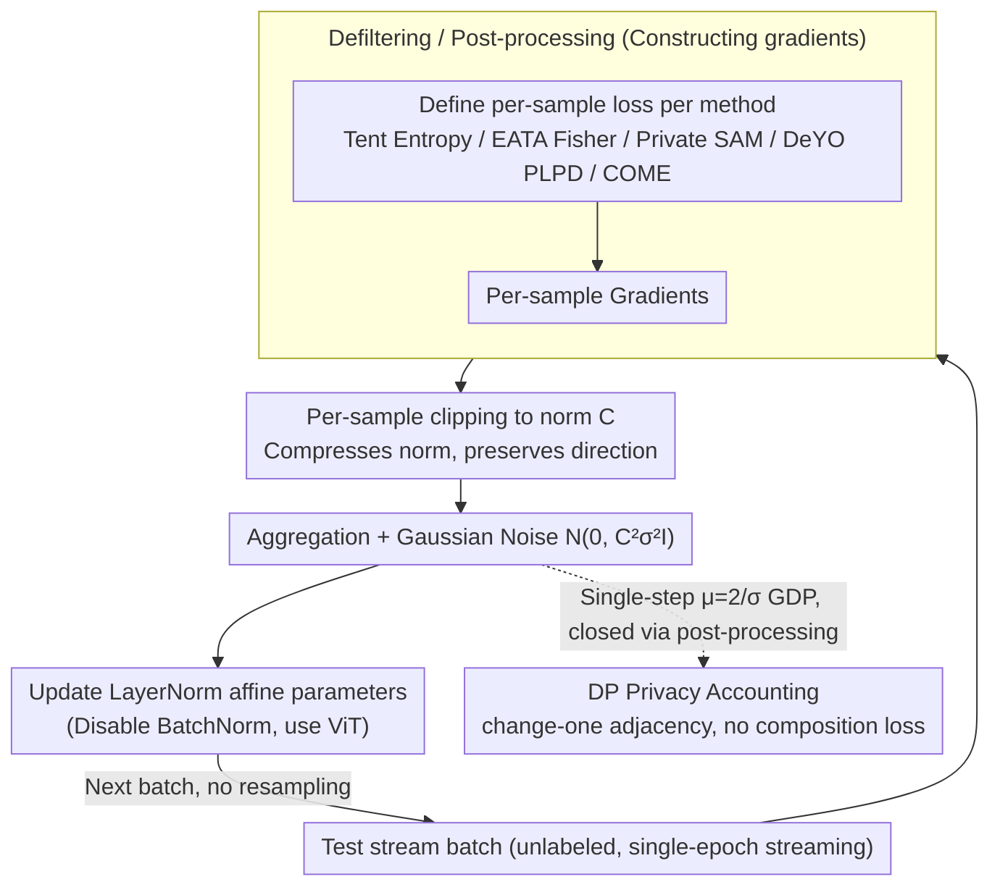

# Private and Stable Test-Time Adaptation with Differential Privacy

**Conference**: ICML 2026  
**arXiv**: [2606.01908](https://arxiv.org/abs/2606.01908)  
**Code**: N/A  
**Area**: AI Safety / Differential Privacy / Test-Time Adaptation  
**Keywords**: Test-Time Adaptation, Differential Privacy, DP-SGD, Per-Sample Clipping, ImageNet-C  

## TL;DR
This paper is the first to indicate that Test-Time Adaptation (TTA) can leak private information from test data through model parameters. It systematically transforms five mainstream TTA methods (Tent, EATA, SAR, DeYO, COME) into Differential Privacy (DP) versions using per-sample gradient clipping and Gaussian noise. On ImageNet-C, it provides provable $(\epsilon,\delta)$-DP guarantees and unexpectedly finds that "clipping itself" improves TTA accuracy by $0.1\%$–$4.1\%$.

## Background & Motivation

**Background**: TTA updates models during the deployment phase using unlabeled test samples (typically only updating the affine parameters of normalization layers) to combat distribution shifts through entropy minimization, filtering, and reweighting. Tent represents entropy minimization; EATA adds reliability filtering and Fisher regularization; SAR employs sharpness-aware optimization; DeYO uses patch shuffle to calculate Pseudo-Label Prediction Difference (PLPD); COME replaces entropy with Dirichlet uncertainty.

**Limitations of Prior Work**: All these methods rely on an implicit assumption: test data does not require protection. However, test images may involve medical records, faces, or location traces. TTA "bakes" these samples into the parameters. Once the model or its outputs are queried or shared, an attacker can launch membership inference or reconstruction attacks, just as they would against training data, to reverse-engineer individual test samples from the updates.

**Key Challenge**: Directly applying DP-SGD to TTA does not solve the problem: (1) TTA batches are often as small as 1, causing DP noise to be amplified relative to the signal; (2) TTA methods rely heavily on data-dependent filtering/reweighting, deciding dynamically at each step which samples to use and their weights—these are effectively "queries" in a privacy sense. Naive implementations break both DP and stability; (3) Classic DP-SGD analysis is built on sampling and leave-one-out adjacency, whereas TTA is single-epoch streaming where each sample is seen only once, requiring a different accounting framework.

**Goal**: (a) Provide a universal DP recipe for TTA; (b) Implement it across five representative TTA methods; (c) Systematically characterize the "privacy budget vs. adaptation accuracy" curve and identify which TTA designs are naturally more DP-friendly.

**Key Insight**: The authors realized that the streaming nature of TTA allows for cleaner DP analysis—each sample is processed only once in a single step. Consequently, there is no composition across steps; as long as the sensitivity of a single step is controlled, the global guarantee follows by the post-processing property.

**Core Idea**: Treat "per-sample gradient clipping + Gaussian noise" as the mandatory privacy interface for TTA. Non-DP-friendly filtering/reweighting operations are either removed or converted into DP-post-processing forms. Simultaneously, it was discovered that per-sample clipping serves as a "free lunch" for TTA accuracy even with zero noise.

## Method

### Overall Architecture

Let the source model be $f_{\theta_0}$, the test stream be $\{B_t\}_{t=1}^T$, and the adaptable parameters be the affine subset of normalization layers $\theta^a \subset \theta$. The standard TTA update is $\theta_{t+1} = \theta_t - \eta \Delta_t$, where $\Delta_t = \frac{1}{|B_t|}\sum_{x_i \in B_t} w_t^i g_t(x_i)$ and $g_t(x_i) = \nabla_\theta \ell_\text{tta}(x_i,\theta_t)$. DP-TTA replaces this by first performing $L_2$ clipping on per-sample gradients $\bar g_t(x_i) = g_t(x_i)/\max(1,\|g_t(x_i)\|_2/C)$, then injecting Gaussian noise $\Delta_t^{DP} = \frac{1}{|B_t|}(\sum_i \bar g_t(x_i) + \mathcal{N}(0,C^2\sigma^2 I_d))$. At the architectural level, BatchNorm is disabled (as inter-sample gradient coupling violates the per-sample sensitivity assumption), and ViT-Base/16 with LayerNorm is used. The pipeline is shown below: each test batch constructs per-sample loss and gradients (defiltered), followed by per-sample clipping, aggregation with noise, and updating LayerNorm affine parameters. The privacy accounting for streaming + change-one adjacency is closed at the noise injection step.

### Key Designs

**1. DP-TTA Privacy Analysis: Avoiding Composition Loss with Streaming + Change-one Adjacency**

Directly adopting DP-SGD accounting is inefficient as it assumes multi-epoch training with sub-sampling and leave-one-out adjacency, leading to heavy composition loss. This paper leverages a structural fact of TTA: it is single-epoch and streaming, where each sample is processed exactly once. Thus, once $\mu$-GDP is guaranteed for a single step, all subsequent steps are post-processing of DP results, requiring no composition across steps. Adjacency is changed to "change-one" (replacing one sample) instead of "leave-one-out"—since streaming batch sizes are fixed, deleting a sample is unnatural. This doubles the sensitivity from $C$ to $2C$. Consequently, DP-Tent satisfies $\mu=2/\sigma$ $\mu$-GDP, and:

$$\delta(\epsilon)=\Phi(-\sigma\epsilon/2+1/\sigma)-e^\epsilon\Phi(-\sigma\epsilon/2-1/\sigma)$$

This analysis aligns with the real-world usage of TTA and turns "streaming without resampling" into an advantage by eliminating composition overhead, which is why $\epsilon=10$ is effectively free.

**2. Defiltering / Post-processing: Moving Data-Dependent Operators Outside the Privacy Boundary**

Each non-trivial TTA method has operators that "query the test set." The core of DP-ification is identifying which can be moved after the DP result (free), which must be inside the clipping (increasing noise), and which should be removed. EATA's entropy and diversity filters cause effective batch size drift and require private statistics; the authors remove these filters but keep the Fisher regularization $\mathcal{R}(\theta_t,\theta_0)$, which only depends on parameters (DP post-processing). SAR's two-point sharpness update consumes double the privacy budget; it is replaced with a private SAM variant using the previous private gradient $\tilde g_{t-1}$ to construct the perturbation $\tilde\epsilon_t=\rho\tilde g_{t-1}/\|\tilde g_{t-1}\|_2$, requiring only one gradient evaluation. DeYO embeds the PLPD term $e^{\text{PLPD}_\theta(x_i,x_i')}$ into the loss per-sample. COME, using Dirichlet uncertainty $\ell_\text{COME}=-\sum_k b_k\log b_k-u\log u$, naturally fits without major modification.

**3. Per-sample Clipping as a Free Stabilizer for TTA: Clipping Alone Boosts Performance**

Previous research suggested per-batch clipping was ineffective for TTA (Niu et al., 2023), so clipping was viewed solely as a privacy cost. By refining the granularity to per-sample—preserving individual directions while compressing norms—this work finds that even at zero noise ($\sigma=0$), clipping alone improves average adaptation gains from $0.1\%$ to $4.1\%$, and up to $14\%$ on ImageNet-R. This is because TTA pseudo-label gradients are high-variance and easily dominated by outliers; per-sample clipping acts as a form of directional sparsification and outlier suppression, preventing model collapse in continual streams.

### Loss & Training

Only affine parameters of normalization layers are updated. DP-EATA retains the $\lambda \nabla_\theta \mathcal{R}(\theta_t,\theta_0)$ term (Fisher regularization is not clipped). Hyperparameters $\eta \in \{10^{-4}, 5\cdot 10^{-4}, \dots, 1\}$ and $C \in \{1,5,10,15\}$ are selected via cross-validation. Batch size is fixed at 64. Noise levels $\sigma \in \{8.594,1.966,1.084,0.777,0.619\}$ correspond to $\epsilon = 1,5,10,15,20$ ($\delta=10^{-6}$).

## Key Experimental Results

### Main Results

Accuracy of DP-Tent across different privacy budgets on ImageNet-C (severity 5, continual setting, ViT-B/16, average of 5 seeds):

| Setting | $\epsilon$ | Avg Top-1 (%) | Notes |
|------|------------|----------------|------|
| Non-private Tent | $\infty$ | 60.8 | Original baseline |
| DP-Tent | 20 | 62.9 | Outperforms non-private by 2.1% |
| DP-Tent | 15 | 62.6 | Still exceeds non-private |
| DP-Tent | 10 | 62.1 | Still exceeds non-private |
| DP-Tent | 1 | 58.5 | Only 2.3% drop under strong privacy |

For other methods at $\epsilon=20$, the gap compared to non-private is: DP-EATA $-2.9\%$, DP-SAR $-1.2\%$, DP-DeYO $-2.4\%$, and DP-DeYO-COME $-1.7\%$, much smaller than typical losses in DP-SGD training.

### Ablation Study: Contribution of Per-Sample Clipping Alone

ImageNet-C continual, ViT-B/16, comparing "with vs. without per-sample clipping" (no DP noise):

| Configuration | Avg Gain | Key Finding |
|------|----------|----------|
| Original TTA (no clip) | $+0.1\%$ | Average of five methods relative to source |
| Original TTA + per-sample clip | $+4.1\%$ | 4 methods improved, only 1 dropped slightly ($-0.3\%$) |
| DeYO-COME + clip | $67.5\%$ Abs Acc | Highest performance in continual setting |
| Tent / EATA + clip (ConvNeXt) | $+1\%$ to $+5\%$ | Consistent across continual & episodic |
| ImageNet-R + clip | Up to $+14\%$ | Larger gains on more difficult data |

### Key Findings

- **Per-sample clipping is a free lunch for TTA**: Even without privacy requirements, clipping stabilizes continual TTA and suppresses collapse— a level of granularity missed by previous work using per-batch clipping.
- **Streaming TTA makes DP overhead exceptionally low**: Due to single-epoch + change-one adjacency + post-processing closure, there is no composition loss, making "medium privacy" ($\epsilon=10$) almost free on ImageNet-C.
- **More filters mean less DP-friendliness**: Sophisticated filters in EATA / SAR / DeYO often must be removed to avoid breaking sensitivity bounds. Ironically, the simplest method, Tent, is the most resilient to DP-ification.
- **Architectural constraints are rigid**: BatchNorm violates sensitivity independence under per-sample clipping, necessitating LayerNorm-based models like ViTs.

## Highlights & Insights
- **Shifting the threat model to TTA fills a paradigm gap**: While previous TTA papers focused only on accuracy, this work demonstrates that parameter updates during deployment are a privacy surface and provides a provable solution.
- **The "defiltering, regularization preservation, weighting internalization" taxonomy is reusable**: This provides a clear engineering template for DP-ifying any new TTA method.
- **The discovery regarding per-sample clipping is valuable independently**: It can be adopted by non-privacy TTA research as a nearly zero-cost trick to stabilize continual TTA.

## Limitations & Future Work
- **The cost of removing filters**: Replacing EATA / DeYO filters with DP causes minor drops ($1-3\%$), but their long-term contribution to stability in longer sequences might be underestimated.
- **Batch=1 remains an open challenge**: While robust to batch size, experiments used 64. The trade-off for the common $batch=1$ deployment scenario under strong privacy is not fully quantified.
- **Lack of empirical privacy auditing**: DP provides an upper bound; the paper does not use membership inference attacks to verify if the actual leakage is significantly lower than $\epsilon$.
- **Restricted to LayerNorm models**: Excluding BatchNorm models limits applicability; future work is needed on ghost normalization or private BN estimation.

## Related Work & Insights
- **vs. DP-SGD (Abadi et al., 2016)**: DP-SGD assumes training, multi-epoch, and leave-one-out; this work proves streaming TTA avoids composition and requires change-one adjacency (sensitivity $2C$).
- **vs. Original TTA methods**: While those methods prioritize accuracy, this work adds a privacy dimension and finds simple structures (Tent) are more robust to privacy constraints.
- **vs. DP-SAM (Park et al., 2023)**: Borrowing the technique of using previous private gradients for perturbation directions allows DP-SAR to reduce gradient evaluations.

<!-- RELATED:START -->

## Related Papers

- [\[ICML 2026\] TEMPORA: Characterising the Time-Contingent Utility of Online Test-Time Adaptation](tempora_characterising_the_time-contingent_utility_of_online_test-time_adaptatio.md)
- [\[CVPR 2026\] Towards Stable Federated Continual Test-Time Adaptation in Wild World](../../CVPR2026/others/towards_stable_federated_continual_test-time_adaptation_in_wild_world.md)
- [\[CVPR 2026\] Neural Collapse in Test-Time Adaptation](../../CVPR2026/others/neural_collapse_in_test-time_adaptation.md)
- [\[ICML 2026\] Test-Time Training with KV Binding Is Secretly Linear Attention](test-time_training_with_kv_binding_is_secretly_linear_attention.md)
- [\[CVPR 2026\] WiTTA-Bench: Benchmarking Test-Time Adaptation for WiFi Sensing](../../CVPR2026/others/witta-bench_benchmarking_test-time_adaptation_for_wifi_sensing.md)

<!-- RELATED:END -->
