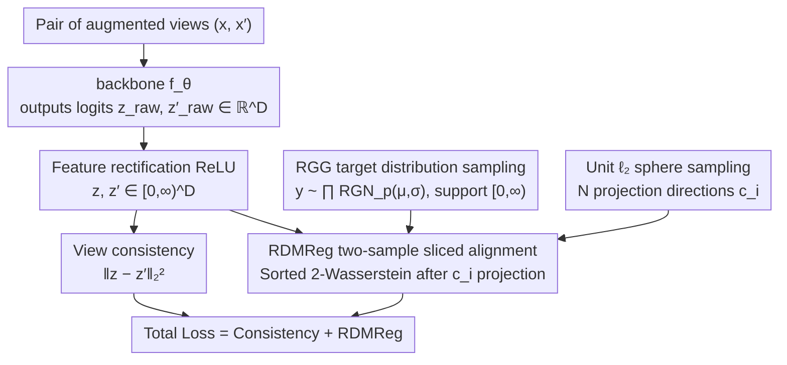

# Rectified LpJEPA: Joint-Embedding Predictive Architectures with Sparse and Maximum-Entropy Representations

**Conference**: ICML 2026  
**arXiv**: [2602.01456](https://arxiv.org/abs/2602.01456)  
**Code**: https://github.com (Author's homepage link, repository not directly provided)  
**Area**: Self-Supervised Learning / JEPA / Sparse Representations  
**Keywords**: JEPA, Sparse Representations, Maximum Entropy Distributions, Rectified Generalized Gaussian, Sliced Wasserstein  

## TL;DR
The authors generalize the "post-projection isotropic Gaussian alignment" in LeJEPA to "post-projection Rectified Generalized Gaussian (RGG) distribution alignment." By obtaining explicitly controllable expected $\ell_0$ sparsity via rectification and truncation of generalized Gaussians, the ResNet encoder linear probe reaches $85.08\%$ on ImageNet-100 while maintaining $\ell_0$ sparsity at $\sim 73\%$, significantly outperforming the fully dense representations of LeJEPA.

## Background & Motivation

**Background**: The JEPA series (I-JEPA, LeJEPA, etc.) learns self-supervised representations by enforcing multi-view consistency in the latent space, avoiding reconstruction in pixel space. LeJEPA (Balestriero & LeCun 2025) builds on this by using SIGReg to align the marginals after 1D random projections to a univariate Gaussian, relying on the Cramér–Wold theorem to approximately "pull" the entire representation distribution into an isotropic Gaussian to prevent collapse.

**Limitations of Prior Work**: Pulling representations into an isotropic Gaussian naturally leads to dense (all dimensions uniformly active) representations, discarding the key prior of "sparsity + non-negativity" that repeatedly appears in neuroscience, signal processing, and deep learning. On ImageNet-100, LeJEPA's $\ell_0$ sparsity remains constant at $1.0$ (fully dense), which is contrary to the "efficient coding" hypothesis found in sparse coding, ReLU, and NMF.

**Key Challenge**: Sparsity requires introducing an $\ell_0$ constraint or a Dirac mass into the representation distribution. However, once a target distribution contains a Dirac mass, it is no longer a stable distribution (it is not closed under linear combinations), causing the analytical reasoning of SIGReg—which assumes the distribution family is preserved after projection—to fail. How can the target distribution be both "sparsity-controllable" and "maximum entropy" while remaining within the Cramér–Wold slicing framework?

**Goal**: (i) Construct a new distribution family where both expected $\ell_p$ and expected $\ell_0$ are analytically controllable; (ii) Design a corresponding sliced regularization term that bypasses the "projection non-closure" issue; (iii) Verify that the resulting representations are controllably sparse while maintaining downstream accuracy.

**Key Insight**: The authors start from the Maximum Entropy Principle—given a support $S$ and a constraint $\mathbb{E}[\|\mathbf{x}\|_p^p]$, the maximum entropy distribution is the Truncated Generalized Gaussian $\mathcal{TGN}_p$. By mixing $\mathcal{TGN}_p$ with a Dirac $\delta_0$ at the origin, they obtain the Rectified Generalized Gaussian (RGG), whose expected $\ell_0$ is analytically determined by $(\mu, \sigma, p)$.

**Core Idea**: Replace "post-projection Gaussian alignment" in LeJEPA with "post-projection two-sample sliced Wasserstein alignment to RGG" and apply explicit ReLU rectification to the features. This ensures that the target distribution and model output share the same $[0, \infty)$ support, simultaneously achieving non-negativity, controllable sparsity, maximum entropy, and consistency.

## Method

### Overall Architecture
For a pair of augmented views $(\mathbf{x}, \mathbf{x}')$, the backbone $f_{\boldsymbol{\theta}}$ produces logits $\mathbf{z}_{\text{raw}}, \mathbf{z}'_{\text{raw}} \in \mathbb{R}^D$, which are then passed through a ReLU to obtain $\mathbf{z} = \mathrm{ReLU}(\mathbf{z}_{\text{raw}})$ and $\mathbf{z}' = \mathrm{ReLU}(\mathbf{z}'_{\text{raw}})$. Simultaneously, $\mathbf{y}$ is sampled from the target distribution $\prod_{i=1}^D \mathcal{RGN}_p(\mu, \sigma)$, and $N$ projection directions $\mathbf{c}_i$ are uniformly sampled from the unit $\ell_2$ sphere $\mathbb{S}^{D-1}_{\ell_2}$. The loss consists of two parts: view consistency $\|\mathbf{z}-\mathbf{z}'\|_2^2$ and sliced distribution matching $\sum_i \mathcal{L}(\mathbb{P}_{\mathbf{c}_i^\top \mathbf{z}} \,\|\, \mathbb{P}_{\mathbf{c}_i^\top \mathbf{y}})$, where $\mathcal{L}$ is the sorted difference form of the 1D sliced 2-Wasserstein distance. The overall flow follows the "backbone + projector + post-projection alignment" framework of LeJEPA, but replaces the Gaussian target with RGG and enforces feature rectification.

### Key Designs

**1. Rectified Generalized Gaussian (RGG) target distribution: Turning "sparsity intensity" into an analytically adjustable knob**

LeJEPA pulls representations toward an isotropic Gaussian, which naturally results in fully dense activations, losing the "sparse + non-negative" prior. The RGG is constructed by mixing a Dirac $\delta_0$ with a Truncated Generalized Gaussian $\mathcal{TGN}_p(\mu,\sigma,(0,\infty))$ at zero, equivalent to sampling from $\mathcal{GN}_p(\mu,\sigma)$ followed by a ReLU. Its advantage lies in the closed-form expected $\ell_0$:

$$\mathbb{E}[\|\mathbf{x}\|_0] = D \cdot \Phi_{\mathcal{GN}_p(0,1)}(\mu/\sigma),$$

Thus, a negative $\mu$ directly corresponds to high sparsity (e.g., $\mu=-3$ suppresses activation to $\sim 1\%$). The continuous part inherits the maximum entropy property under the expected $\ell_p$ norm constraint (Prop 3.3). RGG provides the simplest structure to analytically combine a point mass at zero (for hard zeros) with a continuous maximum entropy component (to preserve task information).

**2. Two-sample Sliced Distribution Matching (RDMReg): Bypassing the non-closure of RGG under projection**

SIGReg uses the NLL of a univariate Gaussian because Gaussians are closed under linear combinations. Once the target distribution includes a Dirac mass, closure is lost; the 1D marginal of $\mathbf{c}^\top \mathbf{y}$ lacks a closed-form family, making analytical reasoning fail. RDMReg solves this by using a two-sample approach: sampling $\mathbf{Y}\in\mathbb{R}^{B\times D}$ from the target RGG and aligning using the sorted 1D 2-Wasserstein squared distance for each projection direction $\mathbf{c}_i$:

$$\mathcal{L}(\cdot)=\tfrac{1}{B}\big\|(\mathbf{Z}\mathbf{c}_i)^\uparrow-(\mathbf{Y}\mathbf{c}_i)^\uparrow\big\|_2^2.$$

Aligning via non-parametric 2-Wasserstein in 1D is the only compromise that maintains compatibility with arbitrary target distributions while resisting the curse of dimensionality.

**3. Pairing Feature Rectification + Target Rectification: Strict alignment of output space and target support**

The sparsity-accuracy trade-off relies on alignment occurring on the same support. The authors explicitly add a ReLU at the end of the backbone so that $\mathbf{z}\in[0,\infty)^D$, matching the RGG's $[0,\infty)$ support. Evaluation of the four combinations—$(\mathcal{RGN}_p \mid \mathbf{z}^+)$ (Ours), $(\mathcal{GN}_p \mid \mathbf{z})$ (Baseline), $(\mathcal{GN}_p \mid \mathbf{z}^+)$, and $(\mathcal{RGN}_p \mid \mathbf{z})$—shows that only "rectified both" achieves both high accuracy and high sparsity. If supports do not match, the sliced Wasserstein distance never reaches zero, forcing the model to sacrifice either accuracy or sparsity.

### Loss & Training
The complete loss is:
$\min_{\boldsymbol{\theta}} \mathbb{E}\big[\|\mathbf{z}-\mathbf{z}'\|_2^2\big] + \mathbb{E}_{\mathbf{c}}\big[\mathcal{L}(\mathbb{P}_{\mathbf{c}^\top \mathbf{z}} \,\|\, \mathbb{P}_{\mathbf{c}^\top \mathbf{y}}) + \mathcal{L}(\mathbb{P}_{\mathbf{c}^\top \mathbf{z}'} \,\|\, \mathbb{P}_{\mathbf{c}^\top \mathbf{y}})\big]$,
where $\mathcal{L}$ is the sliced 2-Wasserstein. Besides uniform sampling, the authors provide a variant using the covariance eigenvectors of $\mathbf{Z}$ for projection to accelerate the removal of second-order dependencies. The backbone uses standard ResNet/ViT/ConvNeXt + MLP projector configurations.

## Key Experimental Results

### Main Results
ImageNet-100 linear probe (top-1 acc% / higher is better, $\ell_0$ sparsity / lower is better).

| Method | Encoder Acc1 | Projector Acc1 | $\ell_1$ Sparsity | $\ell_0$ Sparsity |
|------|-------------:|---------------:|--------------:|--------------:|
| Rectified LpJEPA $\mathcal{RGN}_{2.0}(0, \sigma_{\text{GN}})$ | **85.08** | 80.00 | 0.341 | 0.730 |
| Rectified LpJEPA $\mathcal{RGN}_{2.0}(1.0, \sigma_{\text{GN}})$ | **85.08** | 80.54 | 0.628 | 0.867 |
| Rectified LpJEPA $\mathcal{RGN}_{1.0}(0.25, \sigma_{\text{GN}})$ | 84.98 | **80.76** | 0.375 | 0.744 |
| Rectified LpJEPA $\mathcal{RGN}_{1.0}(-3.0, \sigma_{\text{GN}})$ | 82.72 | 71.88 | **0.006** | **0.010** |
| LeJEPA (Baseline, Dense) | 84.80 | 79.52 | 0.637 | 1.000 |
| VICReg | 84.18 | 78.88 | 0.795 | 1.000 |
| SimCLR | 83.44 | 77.90 | 0.634 | 1.000 |
| NCL-ReLU (Sparse Baseline) | 82.58 | 76.88 | 0.004 | 0.009 |
| NVICReg-ReLU (Sparse Baseline) | 84.48 | 77.74 | 0.521 | 0.712 |

Ours achieves comparable or higher accuracy than LeJEPA while reducing $\ell_0$ sparsity to $0.730$ (i.e., $\sim 27\%$ of dimensions are zero).

### Ablation Study

| Configuration | Key Metric | Description |
|------|---------|------|
| $(\mathcal{RGN}_p \mid \mathbf{z}^+)$ (Ours) | Best Accuracy-Sparsity trade-off | Both feature and target rectified |
| $(\mathcal{GN}_p \mid \mathbf{z})$ (No rectification) | High accuracy but dense | $\ell_0$ is 0, reduces to LeJEPA |
| $(\mathcal{GN}_p \mid \mathbf{z}^+)$ | Accuracy drops significantly | Support mismatch (feature rectified, target not) |
| $(\mathcal{RGN}_p \mid \mathbf{z})$ | Accuracy drops significantly | Support mismatch (target rectified, feature not) |
| Moving $\mu$ from $1.0$ to $-3.0$ | Empirical $\ell_0$ matches Prop 3.5 | Theoretical prediction $\mathbb{E}[\|\mathbf{x}\|_0] = D \cdot \Phi(\mu/\sigma)$ holds |

### Key Findings
- Empirical $\ell_0$ matches the theoretical formula $D \cdot \Phi_{\mathcal{GN}_p(0,1)}(\mu/\sigma)$ across backbones, showing RGG allows the model to densify/sparsify based on analytical knobs.
- Sparsity is "cheap": accuracy holds until $\ell_0$ reach $\sim 95\%$, after which a cliff-like drop occurs.
- Compared to VICReg/NVICReg, Rectified LpJEPA shows significantly lower nHSIC, proving sliced Wasserstein captures dependencies beyond the second order.

## Highlights & Insights
- Extends the LeJEPA concept to any target distribution using two-sample sliced Wasserstein, providing a framework for any prior representation shape (heavy-tailed, non-negative, etc.).
- Converts sparsity from an indirect result of ReLU/$\ell_1$ into an analytically adjustable distribution hyperparameter $(\mu, \sigma, p)$, useful for embodied models with power/bandwidth budgets.
- Provides a formal argument for "sparsity + max entropy + independence" using d-dimensional Rényi entropy $\mathbb{H}_d$, a useful tool for analyzing mixed discrete-continuous representations.

## Limitations & Future Work
- Primarily evaluated on ImageNet-100; ImageNet-1K results are only in the appendix.
- Sliced Wasserstein introduces an $O(N \cdot B \log B)$ sorting overhead, which may impact training efficiency for large batches.
- Choosing the target $\sigma$ requires binary search, increasing the hyperparameter search space.
- The value of sparse representations in dense prediction tasks (detection/segmentation) remains to be explored.

## Related Work & Insights
- **vs LeJEPA**: LeJEPA is a degenerate case of RGG where $\mu \to +\infty$. This work generalizes it and achieves sparsity with accuracy at $\mu = 0$.
- **vs VICReg / NVICReg**: While VICReg only performs second-order matching, this work uses sliced Wasserstein to capture higher-order dependencies, as shown by lower nHSIC.
- **vs Pure Sparsity (NCL-ReLU)**: Rectified LpJEPA maintains accuracy via a distribution prior rather than a hard penalty, closing the $\sim 2\%$ accuracy gap typical of pure sparsity methods.

## Rating
- Novelty: ⭐⭐⭐⭐⭐ 
- Experimental Thoroughness: ⭐⭐⭐⭐ 
- Writing Quality: ⭐⭐⭐⭐ 
- Value: ⭐⭐⭐⭐ 

<!-- RELATED:START -->

## Related Papers

- [\[ICML 2026\] Possibilistic Predictive Uncertainty for Deep Learning](possibilistic_predictive_uncertainty_for_deep_learning.md)
- [\[ICML 2026\] On Revisiting Entropy for Identifying Mislabeled Images](on_revisiting_entropy_for_identifying_mislabeled_images.md)
- [\[ICML 2026\] Continual Learning of Domain-Invariant Representations](continual_learning_of_domain-invariant_representations.md)
- [\[ICML 2026\] HASTE: Hardware-Aware Dynamic Sparse Training for Large Output Spaces](haste_hardware-aware_dynamic_sparse_training_for_large_output_spaces.md)
- [\[CVPR 2026\] Consensus vs. Controversy: Mapping the Decision Space Where Architectures Diverge](../../CVPR2026/others/consensus_vs_controversy_mapping_the_decision_space_where_architectures_diverge.md)

<!-- RELATED:END -->
