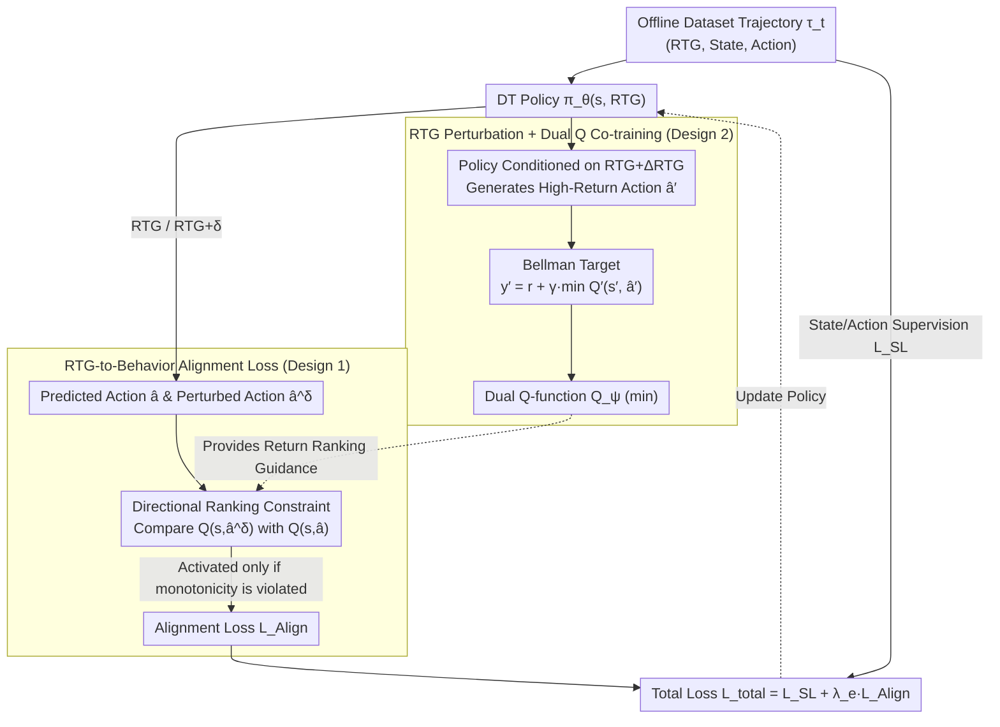

# Return-to-Go is More Than a Number: Q-Guided Alignment for Return-Conditioned Supervised Learning

**Conference**: ICML 2026  
**arXiv**: [2605.29028](https://arxiv.org/abs/2605.29028)  
**Code**: To be confirmed  
**Area**: Reinforcement Learning / Decision Transformer  
**Keywords**: Offline RL, Conditional Sequence Models, Return Alignment, Q-Learning, Decision Transformer

## TL;DR
Addressing the insufficient return-to-go (RTG) alignment in conditional sequence models (like Decision Transformer), this paper proposes the Q-align DT framework. By combining an RTG-to-behavior alignment loss (enforcing monotonic correspondence between RTG and Q-value shifts) with Q-function co-training under RTG perturbation, it creates a positive feedback loop that achieves SOTA performance on D4RL and significantly reduces alignment errors (68.9 vs 102.3 for QCS on HalfCheetah-medium).

## Background & Motivation

**Background**: Conditional sequence models (CSMs), such as the Decision Transformer (DT), transform offline RL into a supervised learning problem. They use return-to-go (RTG) as a conditioning signal to guide policies toward generating trajectories with specific return levels, showing strong empirical performance on D4RL.

**Limitations of Prior Work**: RTG is theoretically intended to control the return level of generated trajectories, but **many CSMs are severely insensitive to RTG**. Changing the input RTG often results in virtually no change in the actual generated return (e.g., in HalfCheetah), implying that the model essentially ignores the RTG signal. Existing methods either duplicate the return distribution of the behavior policy or treat RTG as a standard token, failing to structurally establish a mapping between RTG and policy behavior.

**Key Challenge**: CSMs lack explicit constraints for the RTG-behavior mapping. Ideally, a higher RTG should correspond to trajectories with higher returns (a partial ordering), but existing methods cannot enforce this monotonicity. Furthermore, constructing trajectories that satisfy a total ordering directly from fixed offline datasets is infeasible.

**Goal**: To enable a single CSM to learn a family of RTG-conditioned policies where trajectories generated under various RTG conditions accurately track the target RTG values while maintaining competitive task performance.

**Key Insight**: The authors observe that an auxiliary Q-function can provide return estimation information to guide the CSM in learning RTG-behavior alignment. The critical innovation is leveraging the **monotonicity** of the Q-function as a constraint rather than its **absolute value**, thereby avoiding the over-optimization issues common in offline RL.

**Core Idea**: Use an RTG-to-behavior alignment loss to explicitly constrain the policy such that behavior changes caused by RTG variations align with the direction of reward changes estimated by the Q-function. Simultaneously, co-train the Q-function using RTG perturbation techniques, allowing both components to enhance each other in a positive feedback loop.

## Method

### Overall Architecture
Two core components are optimized jointly in a teacher-student fashion: (1) a DT policy network $\pi_\theta(s, \text{RTG})$; and (2) dual Q-functions $Q_\psi(s, a)$. The policy receives sequences $\tau_t = (\text{rtg}_{t-k+1}, s_{t-k+1}, a_{t-k+1}, \ldots, \text{rtg}_t, s_t)$. During inference, all RTG tokens can be modified to $\tau_t^g$ (by adding an offset $g$) to achieve fine-grained control over policy behavior. Training focuses on two aspects: the **RTG-to-Behavior Alignment Loss** uses the Q-function to rank returns, forcing the policy to output higher-reward behaviors as RTG increases (updated alongside standard supervised loss). Conversely, **RTG Perturbation + Dual Q Co-training** allows the Q-function to learn more accurate value estimates from high-return actions generated by the policy under higher RTG settings. This forms an actor-critic positive feedback loop where better Q-accuracy leads to better alignment, and better alignment provides more high-return demonstrations for Q-learning.

### Key Designs

**1. RTG-to-Behavior Alignment Loss: Constraining Relative Ranking, Not Absolute Q-values**
CSM insensitivity to RTG stems from a lack of pressure for "higher RTG to correspond to higher return behavior." This paper enforces this partial ordering via constrained optimization: $\min_\theta L_{SL}(\theta)$ s.t. $\frac{\partial Q_\psi(s,\pi_\theta(s,\text{RTG}))}{\partial \text{RTG}}\ge 0$. Since calculating this gradient directly is expensive, a zero-order estimate is used: $\frac{\partial Q}{\partial \text{RTG}}\approx \frac{Q(s,\hat{a}^\delta)-Q(s,\hat{a})}{\delta}$. This is converted into a directional ranking constraint $\text{sgn}(\delta)\,(Q(s,\hat{a}^\delta)-Q(s,\hat{a}))\ge 0$, leading to the loss:

$$L_{\text{Align}}=\sum_{i=t-k+1}^{t} I_\mathcal{C}\cdot \big|Q_\psi(s_i,\hat{a}_i^\delta)-Q_\psi^\perp(s_i,\hat{a}_i)\big|$$

where the indicator function $I_\mathcal{C}$ activates only when the constraint is violated, and $Q_\psi^\perp$ is a reference Q-value with stop-gradient. The key is "focusing on relative order, ignoring absolute scale." Directly optimizing absolute Q-values in offline RL pushes policies toward out-of-distribution high-value actions (the over-optimization problem), while monotonicity constraints are more conservative, establishing the RTG-behavior correspondence without overstepping. The alignment loss is integrated into standard CSM training via a Lagrange multiplier: $\mathcal{L}_{\text{total}}(\theta)=L_{SL}(\theta)+\lambda_e L_{\text{Align}}(\theta)$, where $L_{SL}(\theta)=\sum_i \|s_i-\hat{s}_i\|^2+\|a_i-\hat{a}_i\|^2$ anchors the policy to the dataset, while $\lambda_e$ adjusts the weight of the alignment constraint.

**2. RTG Perturbation + Dual Q Co-training: Enabling Q-functions to Evaluate the RTG Spectrum**
Alignment loss depends on reliable return ranking from the Q-function. However, if the Q-function is trained only on the static distribution of the dataset, its horizon is locked within the returns covered by the data, failing to provide guidance for policies under "higher RTG conditions." The solution is injecting RTG perturbation into Bellman consistency: the Q-function learns the target $y_i'=r_i+\gamma\min_{m=1,2}Q_{\psi_m'}^\perp(s_{i+1},\hat{a}_{i+1}^{',\Delta\text{RTG}})$, where $\hat{a}_{i+1}^{',\Delta\text{RTG}}$ is the action predicted by the target policy after adding a fixed offset $\Delta\text{RTG}$ to the RTG. Essentially, the policy is conditioned on higher RTG to generate higher-return action candidates, providing high-quality Bellman targets for the Q-function. This forms an actor-critic positive feedback loop: more accurate Q $\to$ better policy alignment via loss $\to$ better policy generates higher-quality demonstrations via RTG perturbation $\to$ Q learns more accurate estimates. The Q-function follows Double Q-learning practices—taking the minimum of two Q-functions to suppress overestimation—combined with stop-gradients to ensure stability.

## Key Experimental Results

### Main Results (D4RL Gym Domain)

| Dataset | IQL | TD3+BC | DT | RADT | QT | QCS | **Q-align DT** |
| :--- | :--- | :--- | :--- | :--- | :--- | :--- | :--- |
| HalfCheetah-medium | 47.4 | 48.3 | 42.6 | — | 51.4 | 59.0 | **65.3 ± 0.63** |
| HalfCheetah-medium-replay | 44.1 | 44.6 | 36.6 | 41.3 | 48.9 | 54.1 | **57.1 ± 0.74** |
| Hopper-medium | 63.8 | 59.3 | 67.6 | — | 96.9 | 96.4 | **102.1 ± 0.74** |
| Hopper-medium-replay | 92.1 | 60.9 | 82.7 | 95.7 | 102.0 | 100.4 | **102.2 ± 0.64** |
| Walker2d-medium | 79.9 | 83.7 | 74.0 | — | 88.8 | 88.2 | **94.7 ± 0.67** |
| Walker2d-medium-replay | 73.7 | 81.8 | 79.4 | 75.9 | 98.5 | 94.1 | **101.3 ± 0.73** |
| **Total Score** | 688.8 | 677.4 | 685.4 | — | 808.6 | 812.3 | **856.9** |

### Alignment Performance (RMSE of actual trajectory return vs. target RTG ↓)

| Dataset | DC | DT | QT | QCS | **Q-align DT** |
| :--- | :--- | :--- | :--- | :--- | :--- |
| HalfCheetah-medium | 155.4 | 161.2 | 138.6 | 102.3 | **68.9** |
| Hopper-medium | 89.7 | 45.2 | 22.1 | 18.3 | **12.4** |
| Walker2d-medium | 102.3 | 97.8 | 52.4 | 51.2 | **31.5** |

### Key Findings
- **Significant Alignment Improvement**: On HalfCheetah-medium, the alignment error of Q-align DT is 68.9 compared to QCS at 102.3, directly addressing the RTG insensitivity problem.
- **Performance and Alignment Synergy**: The total Gym score of 856.9 vs. QCS at 812.3 (a 5.5% increase) shows that alignment improvements do not come at the cost of task performance.
- **Impact of RTG Perturbation**: Ablation studies show performance drops when $\Delta\text{RTG} = 0$, indicating that sufficient perturbation is critical for Q-function learning; excessive perturbation introduces instability.
- **Zero-shot Generalization**: On the HalfCheetah-Vel (velocity control) task, the model achieves control over different speeds simply by modifying the RTG value without retraining, proving it learns a truly structured policy family.

## Highlights & Insights
- **From Relative Ranking to Monotonicity Constraints**: The indicator function $I_\mathcal{C}$ penalizes only partial ordering violations, ensuring monotonicity while avoiding over-constraint. It is more stable than absolute Q-gradients (solving over-optimization).
- **Dual Role of RTG Perturbation**: While it ostensibly generates high-quality targets for Q-learning, it also improves alignment loss effectiveness by varying policy behavior under high RTG conditions, creating a tight actor-critic synergy.
- **Unified Theory and Empirics**: Theoretically demonstrates that alignment constraints reduce the complexity of the hypothesis class $\Pi$ from $O(|S| |G| \log |A|)$ to $O(|S| |G|)$, explaining improvements in sample efficiency and alignment.
- **Transferable Design**: The method is generalizable to any CSM architecture, and RTG perturbation techniques can be extended to other conditional modeling problems (dynamic control, goal-conditioned RL).

## Limitations & Future Work
- Requires pre-trained Q-functions and dual Q maintenance, increasing computational overhead.
- Limited improvement in extremely sparse reward tasks (e.g., AntMaze) as sparse signals restrict Q-function learning.
- $\Delta\text{RTG}$ requires manual tuning; optimal values vary across tasks, lacking an adaptive mechanism.
- Assumes reasonable data coverage; might fail in highly non-uniform distributions (e.g., datasets with only very high or very low return trajectories).
- Future directions: Learning $\Delta\text{RTG}$ dynamically; automatically weighting alignment constraints based on data coverage; extending to discrete or hybrid action spaces.

## Related Work & Insights
- **vs. DT**: DT treats RTG as a numerical token without structural constraints. Ours establishes a monotonic correspondence, serving as a significant improvement over DT.
- **vs. QT** (Hu 2024): QT directly maximizes Q-values to improve performance, causing policy collapse toward in-distribution high-value regions and poor alignment. Ours balances this with alignment constraints and RTG perturbation.
- **vs. RADT** (Tanaka 2025): RADT enhances RTG sensitivity via additional attention layers, increasing parameters. Ours is more lightweight, using only an alignment loss and RTG perturbation.
- **vs. IQL / CQL**: Inherits the conservative philosophy of offline RL but adapts it through RTG conditioning, opening new directions for conditional policy learning.

## Rating
- Novelty: ⭐⭐⭐⭐⭐ (Elevates RTG alignment from empirical observation to structural constraint; the indicator function + RTG perturbation mechanism is innovative.)
- Experimental Thoroughness: ⭐⭐⭐⭐⭐ (Complete D4RL suite + AntMaze + Ablations + Alignment metrics + Alignment curves provide a solid evidence chain.)
- Writing Quality: ⭐⭐⭐⭐ (Clear logic and motivation with rigorous theoretical analysis; intuitive explanations for RTG perturbation could be deepened.)
- Value: ⭐⭐⭐⭐⭐ (Solves a practical problem of RTG insensitivity and opens a research direction for conditional policy alignment with high application potential.)

<!-- RELATED:START -->

## Related Papers

- [\[AAAI 2026\] More Than Irrational: Modeling Belief-Biased Agents](../../AAAI2026/others/more_than_irrational_modeling_belief-biased_agents.md)
- [\[ACL 2025\] PopAlign: Diversifying Contrasting Patterns for a More Comprehensive Alignment](../../ACL2025/others/popalign_diversifying_contrasting_patterns_for_a_more_comprehensive_alignment.md)
- [\[ICML 2026\] Over-Alignment vs Over-Fitting: The Role of Feature Learning Strength in Generalization](over-alignment_vs_over-fitting_the_role_of_feature_learning_strength_in_generali.md)
- [\[ACL 2025\] Are Any-to-Any Models More Consistent Across Modality Transfers Than Specialists?](../../ACL2025/others/are_any-to-any_models_more_consistent_across_modality_transfers_than_specialists.md)
- [\[AAAI 2026\] Sampling Control for Imbalanced Calibration in Semi-Supervised Learning](../../AAAI2026/others/sampling_control_for_imbalanced_calibration_in_semi-supervised_learning.md)

<!-- RELATED:END -->
## Related Papers

- [\[AAAI 2026\] More Than Irrational: Modeling Belief-Biased Agents](../../AAAI2026/others/more_than_irrational_modeling_belief-biased_agents.md)
- [\[ACL 2025\] PopAlign: Diversifying Contrasting Patterns for a More Comprehensive Alignment](../../ACL2025/others/popalign_diversifying_contrasting_patterns_for_a_more_comprehensive_alignment.md)
- [\[ICML 2026\] Over-Alignment vs Over-Fitting: The Role of Feature Learning Strength in Generalization](over-alignment_vs_over-fitting_the_role_of_feature_learning_strength_in_generali.md)
- [\[ACL 2025\] Are Any-to-Any Models More Consistent Across Modality Transfers Than Specialists?](../../ACL2025/others/are_any-to-any_models_more_consistent_across_modality_transfers_than_specialists.md)
- [\[AAAI 2026\] Sampling Control for Imbalanced Calibration in Semi-Supervised Learning](../../AAAI2026/others/sampling_control_for_imbalanced_calibration_in_semi-supervised_learning.md)

<!-- RELATED:END -->
