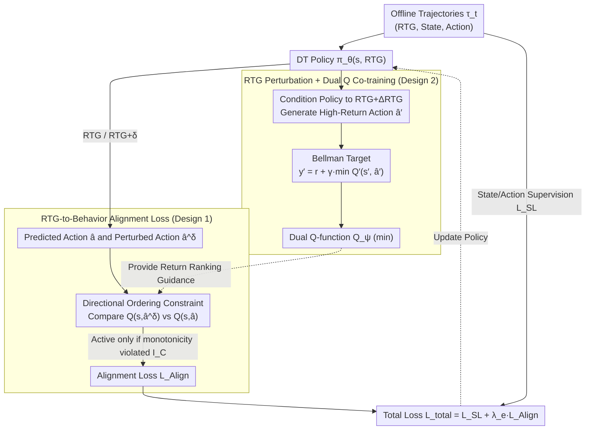

# Return-to-Go is More Than a Number: Q-Guided Alignment for Return-Conditioned Supervised Learning

**Conference**: ICML 2026  
**arXiv**: [2605.29028](https://arxiv.org/abs/2605.29028)  
**Code**: TBD  
**Area**: Reinforcement Learning / Decision Transformer  
**Keywords**: Offline RL, Conditional Sequence Models, Return Alignment, Q-Learning, Decision Transformer

## TL;DR
Addressing the insufficient return-to-go (RTG) alignment in conditional sequence models (e.g., Decision Transformer), this paper proposes the Q-align DT framework. By combining an RTG-to-behavior alignment loss (enforcing monotonic mapping between RTG and Q-values) with RTG-perturbed Q-function training (co-training to form a positive feedback loop), the method achieves SOTA performance on D4RL with significantly reduced alignment errors (68.9 vs. 102.3 for QCS on HalfCheetah-medium).

## Background & Motivation

**Background**: Conditional Sequence Models (CSMs) like Decision Transformer (DT) treat offline RL as a supervised learning problem, using return-to-go (RTG) as a conditional signal to guide the policy in generating trajectories of specific performance levels. These models have shown strong empirical performance on D4RL.

**Limitations of Prior Work**: Theoretically, RTG should control the return level of generated trajectories; however, **many CSMs are severely insensitive to RTG**. Changing the input RTG often results in negligible changes in the actual returns (e.g., in HalfCheetah), indicating that models largely ignore the RTG signal. Previous methods either replicate the return distribution of the behavioral policy or treat RTG as a standard token without structurally establishing the correspondence between RTG and policy behavior.

**Key Challenge**: CSMs lack explicit constraints on the RTG-behavior mapping. Ideally, a higher RTG should correspond to trajectories with higher returns (a partial ordering), but existing methods cannot enforce this monotonicity. Furthermore, since offline datasets are fixed, directly constructing trajectories that satisfy a total ordering is infeasible.

**Goal**: To enable a single CSM to learn a family of RTG-conditioned policies where generated returns accurately track target RTG values while maintaining competitive task performance.

**Key Insight**: An auxiliary Q-function can provide return estimation information to guide the CSM in learning RTG-behavior alignment. The key innovation is using the **monotonicity** of the Q-function as a constraint target rather than its **absolute value**, thereby avoiding the common over-optimization problem in offline RL.

**Core Idea**: Explicitly constrain policy shifts in response to RTG changes to align with return directions estimated by the Q-function via an RTG-to-behavior alignment loss. Simultaneously, co-train the Q-function using RTG perturbation techniques to create a positive feedback loop.

## Method

### Overall Architecture
Two core components are jointly optimized in a teacher-student fashion: (1) the DT policy network $\pi_\theta(s, \text{RTG})$ and (2) dual Q-functions $Q_\psi(s, a)$. The policy processes sequences $\tau_t = (\text{rtg}_{t-k+1}, s_{t-k+1}, a_{t-k+1}, \ldots, \text{rtg}_t, s_t)$. At inference time, all RTG tokens can be modified to $\tau_t^g$ (adding an offset $g$) for fine-grained control. Training involves two mechanisms: **RTG-to-Behavior Alignment Loss** uses Q-function rankings to force the policy toward higher-return behaviors as RTG increases (updated alongside standard SL loss); **RTG Perturbation + Dual Q Co-training** allows the Q-function to learn accurate value estimates from "high-return actions generated at higher RTGs." This forms an actor-critic feedback loop—better Q-accuracy leads to better alignment, and better alignment provides higher-quality demonstrations for Q-learning.

### Key Designs

**1. RTG-to-Behavior Alignment Loss: Constraining Relative Order, Not Absolute Q-values**

CSM insensitivity to RTG persists because no existing constraint requires "higher RTG to map to higher-return behavior." This is addressed via a constrained optimization: $\min_\theta L_{SL}(\theta)$ s.t. $\frac{\partial Q_\psi(s, \pi_\theta(s, \text{RTG}))}{\partial \text{RTG}} \ge 0$. Since computing this gradient is expensive, a zero-order estimate $\frac{\partial Q}{\partial \text{RTG}} \approx \frac{Q(s,\hat{a}^\delta)-Q(s,\hat{a})}{\delta}$ is used, converted into a directional ordering constraint $\text{sgn}(\delta)\,(Q(s,\hat{a}^\delta)-Q(s,\hat{a})) \ge 0$. The resulting loss is:

$$L_{\text{Align}}=\sum_{i=t-k+1}^{t} I_\mathcal{C}\cdot \big|Q_\psi(s_i,\hat{a}_i^\delta)-Q_\psi^\perp(s_i,\hat{a}_i)\big|,$$

where the indicator $I_\mathcal{C}$ activates only when the constraint is violated, and $Q_\psi^\perp$ is the reference Q-value with stopped gradients. By focusing on relative order rather than absolute magnitude, the method avoids pushing the policy toward out-of-distribution (OOD) actions (avoiding typical over-optimization) while establishing a systematic correspondence between RTG and behavior. The final loss is $\mathcal{L}_{\text{total}}(\theta)=L_{SL}(\theta)+\lambda_e L_{\text{Align}}(\theta)$, where $L_{SL}(\theta)$ anchors the policy to the dataset.

**2. RTG Perturbation + Dual Q Co-training: Evaluating Behavior Across the RTG Spectrum**

The alignment loss relies on a reliable Q-function ranking. If the Q-function is trained only on static dataset distributions, it cannot guide policies conditioned on higher RTGs. The solution injects RTG perturbations into Bellman consistency: the target becomes $y_i'=r_i+\gamma\min_{m=1,2}Q_{\psi_m'}^\perp(s_{i+1},\hat{a}_{i+1}^{',\Delta\text{RTG}})$, where $\hat{a}_{i+1}^{',\Delta\text{RTG}}$ is the action predicted by the target policy after adding a fixed offset $\Delta\text{RTG}$. This creates a feedback loop: the Q-function evaluates high-return action candidates, which in turn improves the alignment loss for the policy. Standard Double Q-learning (taking the min of two Q-functions) is used to suppress overestimation bias.

## Key Experimental Results

### Main Results (D4RL Gym Domain)

| Dataset | IQL | TD3+BC | DT | RADT | QT | QCS | **Q-align DT** |
| :--- | :--- | :--- | :--- | :--- | :--- | :--- | :--- |
| HalfCheetah-medium | 47.4 | 48.3 | 42.6 | — | 51.4 | 59.0 | **65.3 ± 0.63** |
| HalfCheetah-medium-replay | 44.1 | 44.6 | 36.6 | 41.3 | 48.9 | 54.1 | **57.1 ± 0.74** |
| Hopper-medium | 63.8 | 59.3 | 67.6 | — | 96.9 | 96.4 | **102.1 ± 0.74** |
| Hopper-medium-replay | 92.1 | 60.9 | 82.7 | 95.7 | 102.0 | 100.4 | **102.2 ± 0.64** |
| Walker2d-medium | 79.9 | 83.7 | 74.0 | — | 88.8 | 88.2 | **94.7 ± 0.67** |
| Walker2d-medium-replay | 73.7 | 81.8 | 79.4 | 75.9 | 98.5 | 94.1 | **101.3 ± 0.73** |
| **Total Score** | 688.8 | 677.4 | 685.4 | — | 808.6 | 812.3 | **856.9** |

### Alignment Performance (RMSE ↓ of actual trajectory returns vs. target RTG)

| Dataset | DC | DT | QT | QCS | **Q-align DT** |
| :--- | :--- | :--- | :--- | :--- | :--- |
| HalfCheetah-medium | 155.4 | 161.2 | 138.6 | 102.3 | **68.9** |
| Hopper-medium | 89.7 | 45.2 | 22.1 | 18.3 | **12.4** |
| Walker2d-medium | 102.3 | 97.8 | 52.4 | 51.2 | **31.5** |

### Key Findings
- **Significant Alignment Improvement**: On HalfCheetah-medium, Q-align DT achieves an alignment error of 68.9 vs. 102.3 for the runner-up QCS, effectively resolving RTG insensitivity.
- **Duality of Performance and Alignment**: The total Gym score of 856.9 increases task performance by 5.5% over QCS while improving alignment.
- **Impact of RTG Perturbation**: Ablations show that $\Delta\text{RTG} = 0$ degrades performance; sufficient perturbation is critical for Q-function learning, though excessive values introduce instability.
- **Zero-shot Generalization**: On HalfCheetah-Vel tasks, varying only the RTG value enables control over different target speeds without retraining, proving the model learns a truly structured policy family.

## Highlights & Insights
- **Monotonicity as a Soft Constraint**: The indicator function $I_\mathcal{C}$ penalizes only partial-order violations, ensuring monotonicity while avoiding over-constraining the policy compared to direct Q-gradient optimization.
- **Dual Role of RTG Perturbation**: While it generates high-quality targets for the Q-function, it also improves the effectiveness of the alignment loss by altering policy behavior at high RTGs.
- **Theory-Practice Unification**: The paper theoretically demonstrates that alignment constraints reduce the hypothesis class $\Pi$ complexity from $O(|S| |G| \log |A|)$ to $O(|S| |G|)$, explaining improvements in sample efficiency and alignment.
- **Transferable Design**: The framework is architecture-agnostic and can be applied to any CSM; RTG perturbation is generalizable to other conditional modeling problems like goal-conditioned RL.

## Limitations & Future Work
- Requires pre-training and maintaining dual Q-functions, increasing computational overhead.
- Limited improvement on extremely sparse reward tasks (e.g., AntMaze) as sparse signals hinder Q-learning.
- $\Delta\text{RTG}$ requires manual tuning; task-specific optimal values vary significantly, lacking an adaptive mechanism.
- Efficiency depends on reasonable offline dataset coverage; performance may degrade in extremely non-uniform distributions.
- Future directions: Learning $\Delta\text{RTG}$, adaptive weighting based on data coverage, and extension to discrete/mixed action spaces.

## Related Work & Insights
- **vs. DT**: DT treats RTG as a numerical token lacks structural constraints; this work explicitly establishes monotonicity.
- **vs. QT** (Hu 2024): QT maximizes Q-values directly which can lead to policy collapse within the dataset's high-value regions; this work balances alignment and performance via monotonicity.
- **vs. RADT** (Tanaka 2025): RADT uses additional layers for RTG sensitivity; this work is more lightweight using only a loss and perturbation.
- **vs. IQL / CQL**: Inherits the conservative philosophy but tailors it for conditional policies, offering a new direction for conditioned RL.

## Rating
- Novelty: ⭐⭐⭐⭐⭐ 
- Experimental Thoroughness: ⭐⭐⭐⭐⭐ 
- Writing Quality: ⭐⭐⭐⭐ 
- Value: ⭐⭐⭐⭐⭐ 

<!-- RELATED:START -->

## Related Papers

- [\[AAAI 2026\] More Than Irrational: Modeling Belief-Biased Agents](../../AAAI2026/others/more_than_irrational_modeling_belief-biased_agents.md)
- [\[ACL 2025\] PopAlign: Diversifying Contrasting Patterns for a More Comprehensive Alignment](../../ACL2025/others/popalign_diversifying_contrasting_patterns_for_a_more_comprehensive_alignment.md)
- [\[ACL 2025\] Are Any-to-Any Models More Consistent Across Modality Transfers Than Specialists?](../../ACL2025/others/are_any-to-any_models_more_consistent_across_modality_transfers_than_specialists.md)
- [\[ICML 2026\] Over-Alignment vs Over-Fitting: The Role of Feature Learning Strength in Generalization](over-alignment_vs_over-fitting_the_role_of_feature_learning_strength_in_generali.md)
- [\[AAAI 2026\] Sampling Control for Imbalanced Calibration in Semi-Supervised Learning](../../AAAI2026/others/sampling_control_for_imbalanced_calibration_in_semi-supervised_learning.md)

<!-- RELATED:END -->
