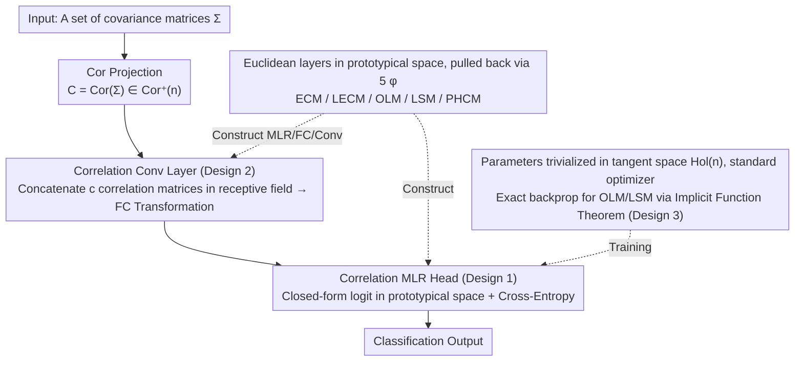

# Riemannian Networks over Full-Rank Correlation Matrices

**Conference**: ICML 2026  
**arXiv**: [2605.19073](https://arxiv.org/abs/2605.19073)  
**Code**: To be confirmed  
**Area**: Geometric Deep Learning / Manifold Neural Networks  
**Keywords**: Correlation Matrix Manifold, Riemannian Networks, Log-Euclidean Metric, Cholesky Decomposition, Poincaré Ball

## TL;DR
This paper systematically extends three fundamental layers (MLR, FC, Conv) to five Riemannian geometries (ECM, LECM, OLM, LSM, PHCM) on the full-rank correlation matrix manifold $\mathrm{Cor}^+(n)$. It derives exact backpropagation for OLM and LSM. The constructed CorNet consistently outperforms SPDNet and Grassmann networks of similar scale on Radar, HDM05, FPHA, and NTU120 datasets.

## Background & Motivation

**Background**: In tasks driven by covariance-like features (e.g., EEG, radar, skeletal muscle action), SPD manifold neural networks have formed a mature pipeline. From SPDNet and SPDNetBN to various new layers based on gyrovectors and Riemannian geometry, geometric priors have consistently proven to enhance discriminative power.

**Limitations of Prior Work**: Although the correlation matrix $C = D(\Sigma)^{-1/2} \Sigma\, D(\Sigma)^{-1/2}$ is a normalized version of covariance and is statistically more compact, specialized deep networks for such inputs are scarce. Directly feeding them into SPDNet ignores the core constraint that diagonals are always 1, leaving only $n(n-1)/2$ degrees of freedom. Earlier attempts treating correlation matrices as quotient manifolds of SPD could not obtain unique closed-form solutions for the Riemannian log and Fréchet mean.

**Key Challenge**: The geometry of the correlation matrix manifold $\mathrm{Cor}^+(n)$ has only recently been toolized—ECM, LECM, PHCM (Thanwerdas & Pennec, 2022) and the permutation-invariant OLM and LSM (Thanwerdas, 2024) provide five sets of metrics with closed-form expressions. However, these tools have not yet been utilized in deep learning.

**Goal**: Systematically migrate the most commonly used Euclidean deep learning components (MLR, FC, Conv) to $\mathrm{Cor}^+(n)$, covering four zero-curvature Log-Euclidean metrics and one non-zero curvature metric (PHCM) composed of a product of Poincaré balls, while resolving exact backpropagation for implicit operators under OLM and LSM.

**Key Insight**: All Log-Euclidean metrics are isometric to a Euclidean prototypical space via a diffeomorphism $\phi$. By pulling back the "signed distance to a boundary hyperplane" form of MLR (Lebanon & Lafferty) using $\phi$, the FC layer can be implicitly defined from MLR. This avoids handcrafted layers for every single geometry.

**Core Idea**: Euclidean layers written in the prototypical space can produce five corresponding correlation layers through five pullbacks of $\phi$. The training process of CorNet is "Euclideanized" by using trivialization in the tangent space to prevent over-parameterization and replacing Riemannian trigonometry approximations with closed-form expressions.

## Method

### Overall Architecture
The input is a set of covariance matrices, first projected to $\mathrm{Cor}^+(n)$ via $\mathrm{Cor}(\Sigma)$ to obtain correlation matrices. Two stages are then stacked: "Correlation Conv layers → Correlation MLR head". The Conv layer performs FC transformations on multi-channel correlation matrices concatenated within each receptive field, where FC is implicitly defined by the MLR logits under the corresponding metric. All learnable parameters are parameterized in the tangent space $T_E M \cong \mathrm{Hol}(n)$ (symmetric matrices with zero diagonals), allowing direct training with standard PyTorch optimizers. Geometry is manifested through the forward $\phi$, $\phi^{-1}$, and necessary Newton/iterations. The layers are unified: "write Euclidean layers in prototypical space → pull back isometrically via five diffeomorphisms $\phi$".

### Key Designs

**1. Unified MLR: Write once in prototypical space, obtain five metrics simultaneously**

Defining MLR formulas manually for each geometry would be labor-intensive and susceptible to approximation errors from Riemannian trigonometry. The authors write the formulation only in the prototypical space. For each Log-Euclidean metric, it is proven that $\phi(I) = 0$, allowing the identity matrix $I$ to serve as the manifold origin. Using the isometry in Thm. 3.1, the manifold MLR logit from Chen et al. (2024c) is reduced to the familiar $v_k(X) = \langle \phi(X), \phi_{*,E}(Z_k)\rangle - \gamma_k \|\phi_{*,E}(Z_k)\|$ in the prototypical space. Substituting the four differentials provided in Prop. 3.2 (ECM/LECM use strictly lower triangular $\lfloor V\rfloor$, OLM uses $V$, LSM uses $V - \mathrm{diag}(V\mathbf{1})$) yields the MLR under four Log-Euclidean geometries. PHCM reuses the Poincaré MLR of Ganea/Shimizu by mapping it to the product of $n-1$ Poincaré half-spaces $\mathrm{PHS}^{n-1}$ via Cholesky. All logits are in closed form, and parameters $(Z_k, \gamma_k) \in \mathrm{Hol}(n)\times\mathbb{R}$ reside in Euclidean space. Adding a new geometry only requires calculating $\phi_{*,E}$ once.

**2. FC / Conv Layers: Implicitly defined by MLR with closed-form solutions per metric**

Shimizu et al. (2021) provided a perspective on the Poincaré ball where the FC layer is formed by "stacking signed distances of multiple MLRs". The authors extend this to the correlation manifold: the FC layer $F: \mathrm{Cor}^+(n)\to\mathrm{Cor}^+(m)$ is implicitly defined via $m(m-1)/2$ equations $s_k\, d(Y, H_{O_k, I}) = v_k(X; Z_k, \gamma_k)$. This yields closed-form solutions under Log-Euclidean metrics (Thm. 3.5). For instance, in ECM, $Y = \mathrm{Cor}\circ \mathrm{Chol}^{-1}(V^{EC} + I_m)$; LECM adds an $\exp$ layer; OLM uses $\mathrm{Exp}^\circ$; LSM uses $\mathrm{Cor}\circ\exp$. Matrix elements $V^{*}_{ij}$ are populated according to the subspace structures of $\lfloor\cdot\rfloor$ / $\mathrm{Hol}$ / $\mathrm{Row}_0$. The Conv layer concatenates $c$ correlation matrices in each receptive field into $(\mathrm{Cor}^+(n))^c$ and feeds them into the same FC, equivalent to a Euclidean convolution performing an affine transformation on each receptive field. This unified definition ensures FC, MLR, and Conv share the same metric and parameter space, preventing geometric mismatch and removing the need for separate convolution theories.

**3. Exact Backpropagation for OLM/LSM: Implicit operators as explicit Jacobians**

OLM and LSM involve two operators without closed forms: $D(H)$ (the unique diagonal correction that returns $\exp(D+H)$ to a correlation matrix) and $D^\star(C)$ (the unique positive diagonal scaling that results in a zero row-sum after logging $D^\star C D^\star$). Normally, autograd would backpropagate through exponentially convergent iterations like $D_{k+1} = D_k - \log(D(\exp(D_k + H)))$ and damped Newton methods. However, autograd through iterations is inaccurate and slow, especially for these permutation-invariant metrics. The authors apply the Implicit Function Theorem to the fixed-point conditions $f(D,H)=0$ and $g(D^\star,C)=0$ to solve for the Jacobian in closed form (Sec. E). During training, the explicit formula is called once after the iterations converge. Backpropagation accuracy is independent of the number of iterations, and the overhead of re-running iterations during the backward pass is skipped—this is a prerequisite for stable training of large networks with OLM/LSM.

### Loss & Training
Classification uses an MLR head with cross-entropy. All learnable parameters are placed in the tangent space $\mathrm{Hol}(n)$ (or $\mathrm{Row}_0(n)$ for LSM) via trivialization and updated directly using standard Adam/SGD without needing Riemannian optimizers. Using the same metric for both Conv and MLR is the default configuration; mixed metrics are explored in ablations.

## Key Experimental Results

### Main Results
Evaluation protocol: Four standard SPD tasks—Radar (3000 signals, 3 classes), HDM05 (MoCap skeletal actions), FPHA (hand actions), and NTU120 (large-scale skeletal actions). Results are 5-fold average accuracy (%).

| Manifold | Method | Radar | HDM05 | FPHA | NTU120 |
|--------|------|------|------|------|------|
| Grassmann | GrNet | 90.48 | 63.19 | 85.31 | 57.59 |
| SPD | SPDNet | 93.25 | 64.57 | 85.59 | 51.25 |
| SPD | SPDNetBN | 94.85 | 71.28 | 89.33 | 54.35 |
| SPD | SPDNetLieBN-AIM | 95.47 | 71.83 | 90.39 | 58.20 |
| SPD | GyroSPD++ | 95.20 | 69.82 | 89.50 | 61.57 |
| Correlation | CorNet-ECM | **97.71** | 81.35 | **92.17** | **65.04** |
| Correlation | CorNet-LECM | **98.40** | 78.05 | 91.17 | 65.03 |
| Correlation | CorNet-OLM | 97.57 | 81.46 | 91.63 | 64.41 |
| Correlation | CorNet-PHCM | 96.56 | **82.26** | 90.03 | 60.01 |

Compared to the classic SPDNet, CorNets show Gains of +5.15% / +17.69% / +6.58% / +13.79% across four datasets. They remain superior to GyroSPD++ (same architecture template). On the largest NTU120 dataset, CorNet-ECM/LECM are among the top-2 fastest methods (~12 s per epoch).

### Ablation Study
| Configuration | Key Observation | Description |
|------|---------|------|
| Same metric for Conv and MLR (Tab. 3 diagonal) | Almost always optimal on HDM05/FPHA | Cross-metric mixing usually degrades performance; geometric consistency is vital |
| SPDNet Input: Covariance vs. Correlation (Tab. 4) | HDM05: 64.57→66.81; FPHA: 85.59→83.37; Radar: 93.25→89.49 | Correlation is sometimes better, but **ignoring the correlation manifold geometry leads to drops**, justifying the need for dedicated CorNet |
| CorMLR vs SPDMLR-Trivlz (Tab. 5) | CorMLR leads on HDM05/FPHA; slightly trails on Radar; ECM/PHCM have efficiency advantages | Single MLR layers reflect the discriminative power of correlation embeddings; ECM-style geometries are cheaper |
| Backprop: autograd vs. Exact Jacobian (OLM/LSM) | Better accuracy and stability (Sec. E) | Essential for training permutation-invariant metrics |

### Key Findings
- **Optimal metrics vary by task**: Radar prefers LECM, HDM05 prefers PHCM, and FPHA/NTU120 prefer ECM. This suggests geometry is a "hyperparameter," and making it a switchable component is a contribution.
- **Explainable gains of Correlation vs. Covariance**: On HDM05, the coefficient of variation for diagonal variance in covariance is large, with diagonals much larger than off-diagonals. Correlation matrices flatten diagonals to 1, forcing the network to focus on off-diagonal terms where information density is high.
- **Efficiency is not compromised**: CorNet-ECM/LECM is ~17× faster than GyroSPD++ and ~8× faster than GyroAI on NTU120, showing that the "lighter" correlation manifold is not a burden.

## Highlights & Insights
- **"Prototypical space once + five pullbacks" paradigm**: Previously, every new manifold metric required handcrafted layers. Here, all Log-Euclidean geometries are merged into a single proof for Euclidean MLR via $\phi$ isometry. Adding a metric only requires calculating $\phi_{*, I}$, ensuring high reusability.
- **Trivialization as the bridge between Riemannian geometry and PyTorch**: Learnable parameters are kept in the tangent space and pushed back via $\mathrm{Exp}$. This avoids over-parameterization and permits Euclidean optimizers, making it engineering-friendly.
- **Exact backprop for implicit operators**: Mapping iterative operators to implicit functions and solving for the Jacobian via the implicit function theorem is a versatile strategy (similar to OT or DEQ) and serves as a reusable training trick in geometric deep learning.

## Limitations & Future Work
- Only five existing metrics are covered. Other geometries on $\mathrm{Cor}^+(n)$ with non-trivial curvature (e.g., quotient metrics or affine-invariant versions) have not been layered.
- Experiments focus on traditional SPD benchmarks with moderate $n$ (signals/skeletons). Large-scale, image-level covariance/correlation tasks (e.g., visual second-order pooling) have not been explored.
- Metrics must be manually specified. Future work could use hypernetworks or learned metrics to automatically select between ECM/LECM/OLM/LSM/PHCM.
- PHCM uses a product of Poincaré balls, with the number of balls growing linearly with $n$. It may not be as scalable as ECM for extremely large $n$.

## Related Work & Insights
- **vs. SPDNet series (Huang & Van Gool 2017, Brooks et al. 2019, Chen et al. 2024)**: While they build geometric layers for covariance, Ours moves to correlation. The advantages include lower dimensionality, more geometric options, and significant gains in tasks with high diagonal variation (e.g., EEG/Action). The disadvantage is the need to rebuild the metric catalog.
- **vs. Poincaré networks (Ganea et al. 2018, Shimizu et al. 2021)**: They define layers on a single Poincaré ball. The PHCM part of Ours reuses this by applying it to the product space $\mathrm{PPS}^{n-1}$ on the correlation manifold.
- **vs. Unified Manifold MLR (Chen et al. 2024c)**: They use Riemannian trigonometry to approximate hyperplane distances; Ours provides closed-form solutions (Eq. 4) under Log-Euclidean metrics, avoiding approximation errors.
- **vs. Grassmann Networks (GrNet, GyroGr)**: Grassmann uses subspace representations; Ours uses correlation structures. The latter retains more second-order statistics, providing stronger discriminative power for long-sequence actions like in HDM05/NTU120.

<!-- RELATED:START -->

## Related Papers

- [\[ICLR 2026\] Consistent Low-Rank Approximation](../../ICLR2026/others/consistent_low-rank_approximation.md)
- [\[ICML 2026\] DISCO: Mitigating Bias in Deep Learning with Conditional Distance Correlation](disco_mitigating_bias_in_deep_learning_with_conditional_distance_correlation.md)
- [\[ICML 2026\] On the Epistemic Uncertainty of Overparametrized Neural Networks](on_the_epistemic_uncertainty_of_overparametrized_neural_networks.md)
- [\[AAAI 2026\] Improved Differentially Private Algorithms for Rank Aggregation](../../AAAI2026/others/improved_differentially_private_algorithms_for_rank_aggregation.md)
- [\[ICLR 2026\] Fast and Stable Riemannian Metrics on SPD Manifolds via Cholesky Product Geometry](../../ICLR2026/others/fast_and_stable_riemannian_metrics_on_spd_manifolds_via_cholesky_product_geometr.md)

<!-- RELATED:END -->
