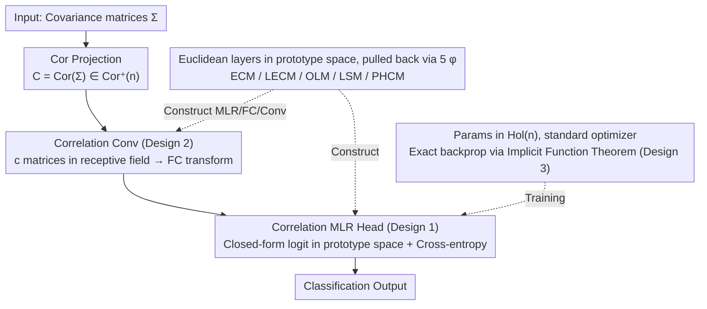

# Riemannian Networks over Full-Rank Correlation Matrices

**Conference**: ICML 2026  
**arXiv**: [2605.19073](https://arxiv.org/abs/2605.19073)  
**Code**: TBD  
**Area**: Geometric Deep Learning / Manifold Neural Networks  
**Keywords**: Correlation Matrix Manifold, Riemannian Networks, Log-Euclidean Metric, Cholesky Decomposition, Poincaré Ball  

## TL;DR
This paper systematically generalizes three fundamental layers—MLR, FC, and Conv—to five Riemannian geometries (ECM, LECM, OLM, LSM, PHCM) on the full-rank correlation matrix manifold $\mathrm{Cor}^+(n)$. It derives exact backpropagation for OLM and LSM. The constructed CorNet consistently outperforms SPDNet and Grassmann networks of similar size on Radar, HDM05, FPHA, and NTU120 datasets.

## Background & Motivation

**Background**: In tasks driven by covariance-like features (EEG, Radar, skeletal motion), SPD manifold neural networks have established a mature technical route—from SPDNet and SPDNetBN to various new layers based on gyrovectors and Riemannian geometry. Geometric priors have been repeatedly proven to enhance discriminative power.

**Limitations of Prior Work**: Although the correlation matrix $C = D(\Sigma)^{-1/2} \Sigma\, D(\Sigma)^{-1/2}$ is a normalized and statistically more compact version of covariance, specialized deep networks for such inputs are almost non-existent. Feeding them directly into SPDNet ignores the core constraints: the diagonal must be constant 1, and the degrees of freedom are reduced to $n(n-1)/2$. Early attempts treating correlation matrices as quotient manifolds of SPD lacked unique closed-form solutions for the Riemannian log and Fréchet mean.

**Key Challenge**: The geometry of the correlation matrix manifold $\mathrm{Cor}^+(n)$ has only recently been commodified. While ECM, LECM, PHCM (Thanwerdas & Pennec, 2022) and the permutation-invariant OLM and LSM (Thanwerdas, 2024) provide five sets of metrics with closed-form expressions, the deep learning community has yet to utilize these tools.

**Goal**: Systematically port the most commonly used "three-piece set" of Euclidean deep learning (MLR, FC, Conv) to $\mathrm{Cor}^+(n)$, covering four zero-curvature Log-Euclidean metrics plus one non-zero curvature metric (PHCM) composed of products of Poincaré balls, while resolving exact backpropagation for implicit operators under OLM and LSM.

**Key Insight**: All Log-Euclidean metrics are isometric to a Euclidean prototype space via a diffeomorphism $\phi$. Thus, by pulling back the "signed distance to a boundary hyperplane" form of MLR (Lebanon & Lafferty) according to $\phi$, the FC layer can be implicitly defined from the MLR. This avoids writing a separate set of manual layers for every geometry.

**Core Idea**: Euclidean layers formulated in the prototype space are pulled back via five types of $\phi$ to obtain five corresponding correlation layers. The entire CorNet training process is "Euclideanized" by using tangent space trivialization to avoid overparameterization and replacing Riemannian trigonometry approximations with closed-form expressions.

## Method

### Overall Architecture
The input is a set of covariance matrices, first projected onto $\mathrm{Cor}^+(n)$ via $\mathrm{Cor}(\Sigma)$ to obtain correlation matrices. Two stages are then stacked: "Correlation Conv layers $\to$ Correlation MLR head." The Conv layer performs an FC transformation on multi-channel correlation matrices concatenated within each receptive field, where the FC is implicitly defined by the MLR logit under the corresponding metric. All learnable parameters are parameterized in the tangent space $T_E M \cong \mathrm{Hol}(n)$ (symmetric matrices with zero diagonal), allowing direct training with standard PyTorch optimizers. Geometry is reflected only in the forward $\phi$, $\phi^{-1}$, and necessary Newton/iterations. The layers are produced uniformly: "write Euclidean layers once in prototype space $\to$ pull back isometrically via five diffeomorphisms $\phi$."

### Key Designs

**1. Unified MLR: Write once in prototype space, obtain five metrics simultaneously**

Manually deriving MLR formulas for every geometry would be labor-intensive and subject to approximation errors from Riemannian trigonometry. The authors' approach is to write only once in the prototype space. For each Log-Euclidean metric, it is proven that $\phi(I) = 0$, so the identity matrix $I$ acts as the manifold origin. Using the isometry from Thm. 3.1, the manifold MLR logit from Chen et al. (2024c) degenerates into the familiar form in the prototype space: $v_k(X) = \langle \phi(X), \phi_{*,E}(Z_k)\rangle - \gamma_k \|\phi_{*,E}(Z_k)\|$. By substituting the four differentials given in Prop. 3.2 (strictly lower triangular $\lfloor V\rfloor$ for ECM/LECM, $V$ for OLM, and $V - \mathrm{diag}(V\mathbf{1})$ for LSM), MLR for four Log-Euclidean geometries is obtained. PHCM is mapped via Cholesky to the product of $n-1$ Poincaré hemispheres $\mathrm{PHS}^{n-1}$ to reuse the Poincaré MLR of Ganea/Shimizu. All logits are closed-form, and parameters $(Z_k, \gamma_k) \in \mathrm{Hol}(n)\times\mathbb{R}$ reside in Euclidean space. Adding a new geometry only requires calculating $\phi_{*,E}$ once.

**2. FC / Conv Layers: Inverse mapping from MLR to provide closed-form solutions per metric**

Shimizu et al. (2021) provided a perspective on Poincaré balls where the FC layer is "a stack of signed distances from multiple MLRs." The authors generalize this to correlation manifolds: the FC layer $F: \mathrm{Cor}^+(n)\to\mathrm{Cor}^+(m)$ is implicitly defined through $m(m-1)/2$ equations $s_k\, d(Y, H_{O_k, I}) = v_k(X; Z_k, \gamma_k)$. Under Log-Euclidean metrics, this yields closed-form solutions (Thm. 3.5). For instance, under ECM, $Y = \mathrm{Cor}\circ \mathrm{Chol}^{-1}(V^{EC} + I_m)$; LECM adds an $\exp$ layer; OLM uses $\mathrm{Exp}^\circ$; and LSM uses $\mathrm{Cor}\circ\exp$. Matrix elements $V^{*}_{ij}$ are populated according to the subspace structures of $\lfloor\cdot\rfloor$ / $\mathrm{Hol}$ / $\mathrm{Row}_0$. The Conv layer concatenates $c$ correlation matrices in each receptive field into $(\mathrm{Cor}^+(n))^c$ before feeding them into the same FC, equivalent to applying an affine transformation per receptive field in Euclidean convolution. This unified definition ensures FC, MLR, and Conv share the same metric and parameter space, preventing geometric mismatch.

**3. Exact Backpropagation for OLM/LSM: Explicit Jacobians for Implicit Operators**

OLM and LSM involve two operators without closed-form expressions: $D(H)$ (the unique diagonal correction ensuring $\exp(D+H)$ returns to a correlation matrix) and $D^\star(C)$ (the unique positive diagonal scaling ensuring the log of $D^\star C D^\star$ has zero row sums). Initially, autograd could only penetrate exponential convergence iterations $D_{k+1} = D_k - \log(D(\exp(D_k + H)))$ and damped Newton methods. However, autograd through iterations is inaccurate and slow, especially for these permutation-invariant metrics requiring numerical root-finding. The authors apply the Implicit Function Theorem to the fixed-point conditions $f(D,H)=0$ and $g(D^\star,C)=0$, solving directly for the closed-form Jacobian (Sec. E). During training, the explicit formula is called once after iteration convergence. Backpropagation accuracy is independent of the number of iteration steps, skipping the overhead of re-running iterations during the backward pass—a prerequisite for stable training of large OLM/LSM networks.

### Loss & Training
Cross-entropy loss is used with the MLR head. All learnable parameters are placed in the tangent space $\mathrm{Hol}(n)$ (or $\mathrm{Row}_0(n)$ for LSM) via trivialization and updated directly with standard Adam/SGD, eliminating the need for Riemannian optimizers. Using the same metric for both Conv and MLR is the default configuration; mixed metrics are explored in ablation studies.

## Key Experimental Results

### Main Results
Evaluation protocol: Four standard SPD tasks—Radar (3000 radar signals, 3 classes), HDM05 (MoCap skeletal motion), FPHA (hand action), and NTU120 (large-scale skeletal action). Average accuracy over five folds (%).

| Manifold | Method | Radar | HDM05 | FPHA | NTU120 |
|--------|------|------|------|------|------|
| Grassmann | GrNet | 90.48 | 63.19 | 85.31 | 57.59 |
| SPD | SPDNet | 93.25 | 64.57 | 85.59 | 51.25 |
| SPD | SPDNetBN | 94.85 | 71.28 | 89.33 | 54.35 |
| SPD | SPDNetLieBN-AIM | 95.47 | 71.83 | 90.39 | 58.20 |
| SPD | GyroSPD++ | 95.20 | 69.82 | 89.50 | 61.57 |
| Correlation | CorNet-ECM | **97.71** | 81.35 | **92.17** | **65.04** |
| Correlation | CorNet-LECM | **98.40** | 78.05 | 91.17 | 65.03 |
| Correlation | CorNet-OLM | 97.57 | 81.46 | 91.63 | 64.41 |
| Correlation | CorNet-PHCM | 96.56 | **82.26** | 90.03 | 60.01 |

Compared to the classic SPDNet, CorNets show gains of +5.15% / +17.69% / +6.58% / +13.79% across the four datasets. CorNets comprehensively outperform GyroSPD++ (same architecture template). On the largest dataset, NTU120, CorNet-ECM/LECM are among the top-2 fastest methods (~12 s per epoch).

### Ablation Study

| Configuration | Key Observation | Description |
|------|---------|------|
| Same metric for Conv and MLR (Tab. 3 diagonal) | Almost always optimal on HDM05/FPHA | Mixing metrics generally leads to performance drops; geometric consistency is vital. |
| SPDNet input: Covariance vs Correlation (Tab. 4) | HDM05: 64.57→66.81; FPHA: 85.59→83.37; Radar: 93.25→89.49 | Correlation is sometimes better, but **ignoring correlation manifold geometry leads to performance loss**, justifying the need for CorNet. |
| CorMLR vs SPDMLR-Trivlz (Tab. 5) | CorMLR leads on HDM05/FPHA; Radar slightly lower; ECM/PHCM have clear speed advantages | Even a single MLR layer reflects the discriminative power of correlation embedding; ECM-style geometries are cheaper. |
| Backprop: autograd vs Exact Jacobian (OLM/LSM) | Improved accuracy and stability (Sec. E) | Necessary condition for training permutation-invariant metrics. |

### Key Findings
- **Optimal metrics vary by task**: Radar prefers LECM, HDM05 prefers PHCM, and FPHA/NTU120 prefer ECM. This suggests that the choice of geometry is a "hyperparameter," and making CorNet a switchable component is a contribution in itself.
- **Explainable gains of Correlation vs Covariance**: On HDM05, covariance diagonal variances have high coefficients of variation and are much larger than off-diagonal elements. Correlation matrices flatten the diagonal to 1, forcing the network to focus on off-diagonal correlation terms with higher information density, yielding the largest gains.
- **Efficiency is not a drawback**: CorNet-ECM/LECM is ~17× faster than GyroSPD++ and ~8× faster than GyroAI on NTU120, showing that the "lighter" geometry of correlation manifolds is an advantage.

## Highlights & Insights
- **"Prototype space once + five pullbacks" paradigm**: Previously, setiap new manifold metric required a manual set of layers. Here, $\phi$ isometries unify all Log-Euclidean geometries into a single proof of Euclidean MLR. Adding metrics only requires calculating $\phi_{*, I}$ once, offering high reusability.
- **Trivialization as a bridge between Riemannian geometry and PyTorch**: Keeping learnable parameters in the tangent space and pushing them back to the manifold via $\mathrm{Exp}$ avoids overparameterization and allows for the direct use of Euclidean optimizers, which is engineering-friendly.
- **Exact Backpropagation for Implicit Operators**: Formulating iterative operators as implicit functions and calculating the Jacobian via the Implicit Function Theorem is a versatile pattern (also used in OT, fixed-point layers, DEQs) and a reusable training trick in geometric deep learning.

## Limitations & Future Work
- Only five existing metrics are covered. Other geometries on $\mathrm{Cor}^+(n)$ with non-trivial curvature (e.g., quotient metrics, affine-invariant correlation versions) have not yet been layered.
- Experiments remain focused on traditional SPD benchmarks with moderate $n$ (signals/skeletons). Large-scale image-level covariance/correlation tasks (e.g., visual second-order pooling) have not been explored.
- Metrics must be manually specified. Future work could use hypernetworks or learned metrics to automatically select between ECM/LECM/OLM/LSM/PHCM to save explicit tuning.
- PHCM uses a product of Poincaré balls, where the number of hemispheres grows linearly with $n$. For extremely large $n$, it may not be as scalable as ECM.

## Related Work & Insights
- **vs SPDNet series (Huang & Van Gool 2017, Brooks et al. 2019, Chen et al. 2024)**: They develop geometric layers for the covariance side, while Ours switches to the correlation side. The advantage is a smaller manifold dimension and more geometric options, benefiting tasks with high diagonal variation (EEG/motion), though it requires a new catalog of metrics.
- **vs Poincaré Networks (Ganea et al. 2018, Shimizu et al. 2021)**: They develop layers for a single Poincaré ball. The PHCM part of Ours effectively reuses this for correlation manifolds on the product space $\mathrm{PPS}^{n-1}$, demonstrating clean geometric reuse.
- **vs Unified Manifold MLR (Chen et al. 2024c)**: They use Riemannian trigonometry approximations for hyperplane distances. Ours provides closed-form solutions under Log-Euclidean metrics (Eq. 4), avoiding approximation errors and yielding a more structured architecture.
- **vs Grassmann Networks (GrNet, GyroGr)**: Grassmann uses subspace representations, while Ours uses correlation structures. The latter retains more second-order statistics, resulting in stronger discriminative power on long-sequence actions like HDM05/NTU120.

<!-- RELATED:START -->

## Related Papers

- [\[ICLR 2026\] Fast and Stable Riemannian Metrics on SPD Manifolds via Cholesky Product Geometry](../../ICLR2026/others/fast_and_stable_riemannian_metrics_on_spd_manifolds_via_cholesky_product_geometr.md)
- [\[ICLR 2026\] Consistent Low-Rank Approximation](../../ICLR2026/others/consistent_low-rank_approximation.md)
- [\[ICML 2026\] DISCO: Mitigating Bias in Deep Learning with Conditional Distance Correlation](disco_mitigating_bias_in_deep_learning_with_conditional_distance_correlation.md)
- [\[ICML 2026\] On the Epistemic Uncertainty of Overparametrized Neural Networks](on_the_epistemic_uncertainty_of_overparametrized_neural_networks.md)
- [\[ICML 2026\] Identifiable Equivariant Networks are Layerwise Equivariant](identifiable_equivariant_networks_are_layerwise_equivariant.md)

<!-- RELATED:END -->
