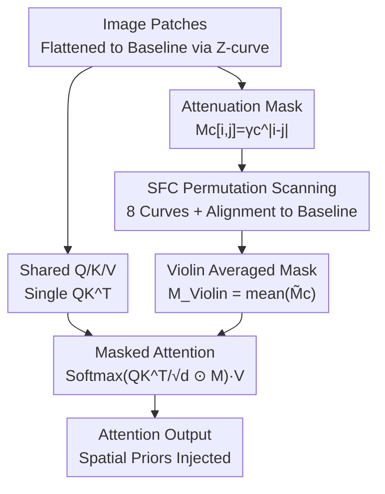

# Spatial Priors via Space Filling Curves for Small and Limited Data Vision Transformers

**Conference**: ICML2026  
**arXiv**: [2606.14757](https://arxiv.org/abs/2606.14757)  
**Code**: Yes (The paper notes "Violin Code"; refer to the original text for the repository)  
**Area**: Vision Backbone / ViT Attention / Spatial Priors  
**Keywords**: Vision Transformer, Space Filling Curves, Attenuation Mask, Small Data, Inductive Bias

## TL;DR
To address the performance gap of ViTs in small-model and limited-data scenarios due to the lack of spatial priors caused by permutation equivariance, this paper constructs a set of attenuation masks using Space Filling Curves (SFCs) such as Snake, Zig-zag, Peano, and Hilbert. By averaging these masks and multiplying them into the attention matrix, the method improves performance on spatial-sensitive tasks in VTAB-1K by up to 8.7%, with less than 0.0015% additional parameters and approximately 0.64% more FLOPs.

## Background & Motivation
**Background**: ViTs partition images into patches and model them as a sequence of unordered tokens using self-attention, relying on position embeddings to recover spatial order. With large-scale models and massive data, ViTs can directly "learn" locality.

**Limitations of Prior Work**: Self-attention is permutation-equivariant—if the token order is shuffled, the output is simply shuffled in the same way, as the attention mechanism itself lacks knowledge of patch adjacency. This results in ViTs lacking the innate local inductive bias of CNNs, making them "data-hungry." When model capacity is small ($\le$ 30M) or downstream data is scarce (e.g., 1000 images per task), even large ViTs struggle to specialize.

**Key Challenge**: Locality must either be learned through massive data/parameters or manually injected via architectural changes (convolutions, specialized position embeddings), the latter of which often incurs significant overhead. This work seeks a near-zero-cost, plug-and-play injection method that does not modify the backbone structure.

**Key Insight**: The authors observe that linear Transformers and Vision SSMs use "attenuation factors" along a scanning order to penalize attention scores based on distance to encode relative position. Flattening 2D patches into a 1D sequence is essentially a **Space Filling Curve (SFC)**. While Z-curve (row-wise scanning) is the simplest, curves like Snake, Zig-zag, Peano, and Hilbert preserve locality in different ways.

**Core Idea**: Construct "sequence-distance-based attenuation" masks for multiple SFCs, align them to a unified baseline, average them, and multiply the result element-wise into the standard attention matrix. This replaces structural modifications with a low-cost mask, injecting locality priors from multiple perspectives into the ViT.

## Method

### Overall Architecture
Violin does not alter the ViT backbone. It only multiplies the standard attention score matrix by a specially designed mask $\mathbf{M}_{\text{Violin}}$ at each attention layer. The process is as follows: images are flattened into a baseline sequence via Z-curve; shared $\mathbf{Q}, \mathbf{K}, \mathbf{V}$ and a single $\mathbf{Q}\mathbf{K}^\top$ are computed as in a standard ViT. Simultaneously, attenuation masks $\mathbf{M}_c[i,j]=\gamma_c^{|i-j|}$ are constructed for a set of 8 SFCs. These masks are aligned back to the Z-curve baseline via permutation and then averaged to produce $\mathbf{M}_{\text{Violin}}$. Finally, it is multiplied into the attention before the softmax. The key is that all curves share the same $\mathbf{Q}\mathbf{K}^\top$, with differences reflected only in the mask, resulting in negligible extra computation.

### Key Designs

**1. Attenuation Mask Attention: Breaking Permutation Equivariance with Sequence Distance Penalty**

Standard attention $\mathbf{Y}=\text{Softmax}(\mathbf{Q}\mathbf{K}^\top/\sqrt{d})\mathbf{V}$ is permutation-equivariant and thus has no inherent knowledge of adjacency. Violin draws from linear Transformers to multiply an attenuation mask element-wise inside the softmax: $\mathbf{Y}=\text{Softmax}(\frac{\mathbf{Q}\mathbf{K}^\top}{\sqrt d}\odot\mathbf{M})\mathbf{V}$, where $\mathbf{M}[i,j]=\gamma^{|i-j|}$ and $0<\gamma\le 1$. This mask is a Kac–Murdock–Szegö matrix, generalizing causal attenuation masks to full (non-causal) attention. Tokens further apart in the sequence have their attention scores penalized more heavily, injecting locality. However, "sequence distance $|i-j|$" depends entirely on how the image is flattened; a single Z-curve only captures one type of adjacency.

**2. SFC Permutation Scanning: Switching Curves Without Reprocessing Images**

Different SFCs preserve locality differently (e.g., the Hilbert curve is excellent at keeping 2D neighbors close in 1D). To use multiple curves without the prohibitive cost of re-scanning and re-encoding for each, the authors observe that switching from curve $c_1$ to $c_2$ is merely a permutation $\pi_{c_1\mapsto c_2}$. This can be represented by a permutation matrix $\mathbf{P}_{c_1\mapsto c_2}$. Consequently, the image only needs to be flattened once via Z-curve, and other sequences (or masks) can be obtained via cheap indexing.

**3. Baseline Alignment + Violin Averaged Mask: Fusing 8 Curves with a Single QK^T**

Computing masked attention $\mathbf{Y}_c$ for each curve separately would yield inconsistent output orders that cannot be directly summed. The authors select the Z-curve as the "baseline" and permute each curve's mask back to this baseline: $\widetilde{\mathbf{M}_c}=\mathbf{P}_c^\top\mathbf{M}_c\mathbf{P}_c$. This allows attention to be computed in the baseline coordinate system so that **all curves share a single $\mathbf{Q}\mathbf{K}^\top$**. The final Violin mask is the average of 8 aligned curves (Snake, Zig-Zag, Peano, Hilbert, and their transposes), modulated by a learnable scalar $\alpha$. Each curve has its own attenuation factor $\gamma_c=\text{sigmoid}(\beta_c)$. In multi-head attention, each head $k$ has independent $\beta_c^k$ and $\alpha^k$, allowing different heads to learn distinct locality preferences.

### Loss & Training
Violin introduces no additional loss functions. Mask parameters ($\beta_c^k$ and $\alpha^k$ per head per curve) are optimized end-to-end with the backbone. It can be used for training from scratch (DeiT/DeiT-III/DINO) or by adding initialized masks to pre-trained models for fine-tuning. It is also compatible with Parameter-Efficient Fine-Tuning (PEFT) methods like LoRA.

## Key Experimental Results

### Main Results
In full fine-tuning on VTAB-1K (1,000 samples per task, categorized into Natural/Specialized/Structured), Violin consistently improves performance across backbones and scales, with the largest gains in the spatial-dependent Structured group:

| Model | Params | Baseline Mean | +Violin Mean | Structured Gain |
|------|--------|--------------|--------------|-------------------|
| DeiT-T | 5M | 65.52 | 68.33 (+2.81) | +3.93 |
| DeiT-S | 22M | 67.38 | 70.46 (+3.08) | +4.82 |
| DeiT-III-S | 22M | 67.57 | 72.31 (+4.74) | **+8.69** |
| DeiT-III-B | 86M | 70.63 | 73.94 (+3.31) | +6.32 |
| DINO-B | 86M | 71.23 | 72.79 (+1.56) | +2.37 |

Gains are most significant for spatial-sensitive Structured tasks and small-to-medium models. Even the 632M DeiT-III-H shows a positive mean gain (+1.41). Additionally, it improves small model pre-training on ImageNet-1K by up to 0.9% and pixel-level CIFAR-100 by up to 7.2%.

### Overhead Analysis

| Metric | Relative Change vs. DeiT-B | Measured (DeiT-S, bs=256) |
|------|------------------|------------------------|
| Parameters | +0.0015% | — |
| FLOPs | +0.64% | — |
| GPU Memory (224²) | — | 0.80 → 0.81 GB |
| Inference Latency (224²) | — | 206.1 → 233.1 ms/batch |
| Inference Latency (512²) | — | 1739.3 → 1789.7 ms/batch |

### Key Findings
- **Spatial Correlation**: Improvements in the Structured group (counting, localization) are significantly higher than in the Natural group, verifying that the injected prior is indeed spatial.
- **Model Scale Inverse Correlation**: Gains are largest for small models and limited data, supporting the hypothesis that large models can learn locality while small ones cannot.
- **Multi-Curve Complementarity**: Different SFCs preserve locality in distinct ways; averaging is more robust than using a single Z-curve. Learnable $\gamma_c$ allows each curve to adapt its influence range.
- **Negligible Cost**: With +0.0015% parameters and +0.64% FLOPs, the performance gain is achieved with nearly zero overhead.

## Highlights & Insights
- Re-interpreting "image flattening" as a Space Filling Curve provides a elegant unified perspective: Z-curve, Hilbert, and Peano are simply different 1D→2D adjacency preservation methods.
- The permutation trick is the engineering highlight: switching curves equals a cheap index permutation, and permuting the mask instead of the output allows 8 curves to share one $\mathbf{Q}\mathbf{K}^\top$.
- The approach is transferable: Any scenario using full attention but lacking spatial/sequential priors (multi-modal patches, point cloud voxels, temporal grids) could use SFC attenuation masks.

## Limitations & Future Work
- The mask uses isotropic attenuation based on sequence distance $\gamma^{|i-j|}$, which is a 1D approximation and cannot perfectly capture specific 2D relationships like diagonal neighbors.
- The 8 fixed curves are manually selected; the paper does not fully explore automatic selection or subset pruning.
- Gains diminish as model size and data volume increase, making it less valuable for ultra-large-scale models.
- The mask operates on the attention matrix; for very high resolutions, the memory footprint of the $N\times N$ mask increases (though acceptable at 512²).

## Related Work & Insights
- **vs. Convolutional Injection (e.g., CvT)**: These use convolutional layers to introduce locality by modifying the backbone; Violin uses a simple mask multiplication, reducing overhead by an order of magnitude.
- **vs. Vision SSM / Linear Transformer Scans**: These use recursion and attenuation to encode order and require multi-directional scans. Violin adapts the attenuation idea for **full attention** and collapses multiple curves into a single shared mask.
- **vs. Position Embedding Improvements**: Position embeddings are additive biases on tokens; Violin is multiplicative and acts on attention pairs, directly modulating patch visibility.

## Rating
- Novelty: ⭐⭐⭐⭐ Unifying image flattening as SFCs and using multi-curve masks for spatial priors is fresh and practical.
- Experimental Thoroughness: ⭐⭐⭐⭐ Covers various backbones (DeiT/DeiT-III/DINO), scales (5M–632M), and tasks, with overhead measurements.
- Writing Quality: ⭐⭐⭐⭐ Clear derivation from attenuation masks to permutation alignment.
- Value: ⭐⭐⭐⭐ Near-zero cost, plug-and-play, and compatible with PEFT; high value for real-world small model deployments.

<!-- RELATED:START -->

## Related Papers

- [\[ECCV 2024\] SpatialFormer: Towards Generalizable Vision Transformers with Explicit Spatial Understanding](../../ECCV2024/others/spatialformer_towards_generalizable_vision_transformers_with_explicit_spatial_un.md)
- [\[ICML 2026\] Vision Transformer 微调中的非光滑分量优势](vision_transformer_finetuning_benefits_from_non-smooth_components.md)
- [\[ICLR 2026\] Predicting Kernel Regression Learning Curves from Only Raw Data Statistics](../../ICLR2026/others/predicting_kernel_regression_learning_curves_from_only_raw_data_statistics.md)
- [\[ECCV 2024\] AttnZero: Efficient Attention Discovery for Vision Transformers](../../ECCV2024/others/attnzero_efficient_attention_discovery_for_vision_transformers.md)
- [\[CVPR 2026\] Inter-Photon-Limited Videography](../../CVPR2026/others/inter-photon-limited_videography.md)

<!-- RELATED:END -->
