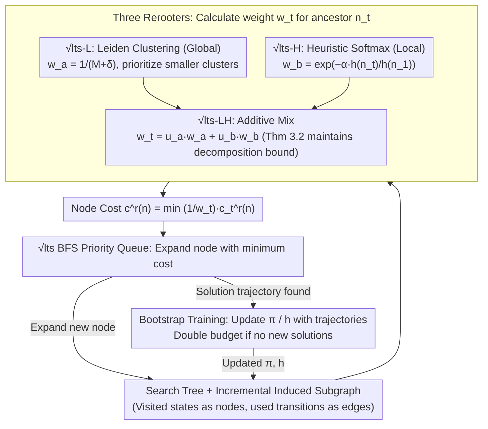

# Structure-Induced Information for Rerooting Levin Tree Search

**Conference**: ICML 2026  
**arXiv**: [2605.30664](https://arxiv.org/abs/2605.30664)  
**Code**: Not yet released  
**Area**: Reinforcement Learning / Learning-guided Search / Planning  
**Keywords**: Levin Tree Search, rerooting, Leiden clustering, heuristics, sub-task decomposition

## TL;DR
Within the $\sqrt{\mathrm{lts}}$ framework, the authors propose three "rerooters"—global Leiden clustering, local heuristic cost-to-go, and an additive mixture of both—to automatically allocate search effort to implicit sub-tasks based on state-space structure and goal distance. This approach avoids expensive explicit sub-goal generation models like HIPS-$\varepsilon$ / SGPS, achieving SOTA in online training sample efficiency and test-time expansion counts on complex domains such as BoulderDash and CraftWorld.

## Background & Motivation

**Background**: Policy tree search utilizes a learned policy $\pi$ to concentrate probability mass on promising branches. Levin Tree Search (LTS, 2018) uses $\varphi_{\mathrm{LTS}}(n)=\tfrac{d(n)+1}{\pi(n)}$ as node cost, providing a strict upper bound: "at most $(d(n^*)+1)/\pi(n^*)$ nodes are expanded before finding the first solution node." PHS* (2021) incorporates a heuristic $h$ into this bound and learns policies to minimize it.

**Limitations of Prior Work**: LTS/PHS* struggle in complex domains (e.g., BoulderDash, CraftWorld) because they lack a "sub-goal decomposition" mechanism. HIPS-$\varepsilon$ (2024) and SGPS (2025) decompose problems and extend search radii through explicit sub-goal generation (using high-capacity models like VQ-VAE). While effective, the computational overhead of querying sub-goal networks explodes with domain complexity; on BoulderDash 30% difficulty, PHS*($\pi^{\mathrm{SG}}$) can solve 11 problems, but fails entirely by 40% due to timeouts.

**Key Challenge**: Scaling to complex domains requires sub-task decomposition; however, explicit sub-goal reconstruction implies high-capacity generative models, which are expensive in both training and inference. A trade-off exists between computational cost and performance.

**Goal**: Based on the "implicit sub-task" mechanism of $\sqrt{\mathrm{lts}}$ (Orseau et al. 2024), this work answers an open question posed by Orseau: how to automatically derive rerooting weights $w_t$ from the search tree structure itself **without** invoking a separate sub-goal network?

**Key Insight**: $\sqrt{\mathrm{lts}}$ implicitly starts an LTS sub-search at each node $n_t$, with node costs modified to $c^r(n)=\min_{n_t\prec n}\tfrac{1}{w_t}c_t^r(n)$, where $w_t$ determines the time share allocated to each sub-search. Orseau et al. proved that if the rerooter "correctly selects" sub-task boundaries, $\sqrt{\mathrm{lts}}$ can be exponentially better than LTS. The authors observe that rerooting weights can be derived from both **global state-space connectivity** (Leiden clustering partitioning the state space into "rooms") and **local heuristic cost-to-go** $h(n_t)$, which are naturally complementary.

**Core Idea**: Utilize three lightweight structural signals—(L) Leiden clustering, (H) softmax heuristics, and (LH) an additive mixture—to dynamically generate $w_t$. This replaces "explicit sub-goal generation" with "implicit structure-awareness" and provides a complementary proof that additive rerooters maintain the sub-task decomposition bounds of $\sqrt{\mathrm{lts}}$.

## Method

### Overall Architecture
The search process follows the BFS framework of $\sqrt{\mathrm{lts}}$: the cost of node $n$ is
$$c^r(n)=\min_{n_t\prec n}\tfrac{1}{w_t}c_t^r(n),\quad c_t^r(n)=\sum_{n_t\prec n'\preceq n}\tfrac{1}{\pi(n'\mid n_t)}.$$

The primary modification is the definition of "how to calculate the weight $w_t$ for ancestor nodes $n_t$." Three rerooters ($\sqrt{\mathrm{lts}}$-L / -H / -LH) provide distinct $w_t$ formulas, while the rest of the search (priority queue, policy/heuristic networks, bootstrap training loop) remains unchanged.

Training employs the Bootstrap method (Arfaee et al. 2011): policy/heuristic networks are initialized randomly, the training set is scanned with the current budget, and solved trajectories are used to update the networks. If no new problems are solved, the expansion budget is doubled for the next scan. Training stops when 95% of the validation set is solved.

### Key Designs

**1. $\sqrt{\mathrm{lts}}$-L: Global Structure Rerooter via Leiden Clustering**

In human planning, "entering a new room" or "obtaining a key" are typical key sub-goal boundaries, corresponding to transitions in state-space clusters. This rerooter ensures $w_t$ reflects "how much unexplored space remains in the current cluster," pushing search effort toward new clusters. An induced subgraph $G_0$ of the state space is constructed incrementally. At search steps $t=\gamma^i$ (geometric schedule, $\gamma>1+1/\epsilon$), the Leiden algorithm is run to obtain hierarchical clusters, using the $k$-th level to color each tree node $c$. Let $M_{\tau,c}$ be the number of nodes of color $c$ after the $\tau$-th coloring, and $\delta_{\tau,c}$ be nodes of the same color expanded since then. Then $w_t=\tfrac{1}{M_{\tau,c_t}+\delta_{\tau,c_t}}$. Smaller clusters yield larger $w_t$, lower costs, and prioritized expansion. Continued expansion of the same color increases the denominator, decaying $w_t$ and diverting the search to new clusters. Leiden uses modularity to find this structure without external sub-goal labels. The overhead is amortized to $O(bN\log N + DN)$ via geometric scheduling and node color inheritance proxies (Theorem 3.1).

**2. $\sqrt{\mathrm{lts}}$-H: Local Rerooter via Heuristic Cost-to-go**

Global clustering cannot distinguish which of two "structurally symmetric" subtrees is closer to the goal; heuristics natively provide this information. This rerooter determines weight directly from $h(n_t)$: $w_1=1$, $w_t=\exp\!\left(-\alpha\,\tfrac{h(n_t)}{h(n_1)}\right)$. Normalization by $h(n_1)$ makes weights invariant to multiplicative scaling of the heuristic; the exponential ensures non-zero mass; $\alpha$ is an inverse temperature—smaller values are conservative, larger values concentrate mass on low-heuristic nodes. For a set of candidate rerooting nodes $I$, $\tfrac{w_t}{\sum_{i\in I}w_i}$ is a softmax over $-\alpha h/h(n_1)$. This formulation allows the rerooter to smoothly distribute search time among promising ancestors rather than a "hard pick," increasing robustness to heuristic noise.

**3. $\sqrt{\mathrm{lts}}$-LH: Additive Mix with Theoretical Guarantees**

Pure heuristic rerooters can be misled where heuristics fail, while pure clustering rerooters are agnostic to goal proximity. Thus, an additive mixture is used: $w_t=u_a\,\tfrac{1}{M_{\tau,c_t}+\delta_{\tau,c_t}}+u_b\,\exp\!\left(-\alpha\,\tfrac{h(n_t)}{h(n_1)}\right)$ (default $u_a=u_b=1$). Global structure dictates coarse-grained time allocation, while heuristics refine priorities within clusters. Theorem 3.2 proves that any additive rerooter $w=u_a w_a+u_b w_b$ follows the sub-task decomposition bound $T\le 1+(C+1)\min_D\max_i\min\{\tfrac{w_{a,<T}}{w_{a,T_i}},\tfrac{w_{b,<T}}{w_{b,T_i}}\}c^r_{T_i}(n_{T_{i+1}})$, provided the cumulative weight ratio satisfies $1/C\le \tfrac{u_a w_{a,<T}}{u_b w_{b,<T}}\le C$. This implies the search can fall back to whichever signal is more informative.

### Loss & Training
Policy $\pi$ and heuristic $h$ are neural networks initialized from scratch and trained via Bootstrap. Training scans the algorithm, solves trajectories are used as supervised samples, and the expansion budget doubles if a round yields no new solutions. The training budget cap is $10^6$ seconds (~11.5 CPU-days). Key hyperparameters include Leiden frequency $\gamma$, cluster level $k$, $\alpha$, and mixture weights $u_a, u_b$.

## Key Experimental Results

### Main Results
Testing on four domains with a budget of $5.12\times10^5$ expansions, averaged over 5 seeds.

| Domain | Algorithm | Solved | Expansions | Time (s) |
|----|------|--------|-----------:|---------:|
| BoulderDash | LTS | 10 | 195 451 | 119.86 |
| BoulderDash | PHS*($\pi^{\mathrm{SG}}$) | 100 | 359.86 | 2.70 |
| BoulderDash | **Ours ($\sqrt{\mathrm{lts}}$-H)** | 100 | **92.37** | **0.60** |
| BoulderDash | **Ours ($\sqrt{\mathrm{lts}}$-LH)** | 100 | 92.68 | **0.58** |
| CraftWorld | LTS | 100 | 306 224 | 373.44 |
| CraftWorld | PHS*($\pi^{\mathrm{SG}}$) | 100 | 1 413 | 8.67 |
| CraftWorld | **Ours ($\sqrt{\mathrm{lts}}$-LH)** | 100 | **1 347.5** | **4.59** |
| Sokoban | PHS*($\pi^{\mathrm{SG}}$) | 1 000 | 1 630.6 | 1.56 |
| Sokoban | Ours ($\sqrt{\mathrm{lts}}$-LH) | 1 000 | 1 736.0 | 1.10 |
| TSP (Gridworld) | PHS*($\pi^{\mathrm{SG}}$) | 100 | **46.31** | 0.49 |
| TSP (Gridworld) | Ours ($\sqrt{\mathrm{lts}}$-H) | 100 | 55.44 | 0.37 |

### BoulderDash Difficulty Scaling (Online Training)
Wall fill rate increased from 10% to 40%; expansions/time to solve 10,000 training problems recorded.

| Difficulty | PHS*($\pi^{\mathrm{SG}}$) Exp / Time(h) | $\sqrt{\mathrm{lts}}$-H Exp / Time(h) | Note |
|------|----------------------------------------:|-------------------------------------:|------|
| 10% | $3.07\times10^7$ / 10.63 | $1.77\times10^7$ / **5.00** | Slight lead |
| 20% | $3.00\times10^8$ / 137.12 | $1.99\times10^7$ / **5.99** | 15× compute advantage |
| 30% | $4.29\times10^8$ / 278.23 (Solved 11) | $2.80\times10^7$ / **8.37** (Solved 9,996) | Baseline collapses |
| 40% | — (Timeout) | $3.85\times10^7$ / **11.94** (Solved 9,994) | Only successful method |

### Key Findings
- In high-difficulty regions of BoulderDash (30%/40%), the sub-goal generation-based PHS*($\pi^{\mathrm{SG}}$) collapses (solving only 11 problems at 30% and timing out at 40%). All $\sqrt{\mathrm{lts}}$ variants maintain a ~99% success rate, indicating that **explicit sub-goal reconstruction is a scalability bottleneck for SGPS**, which rerooting bypasses using implicit sub-tasks.
- $\sqrt{\mathrm{lts}}$-H (local heuristic) outperforms SGPS on BoulderDash on its own, implying that **learned heuristics combined with softmax weights provide effective sub-task decomposition even without global structural signals**.
- $\sqrt{\mathrm{lts}}$-LH combines the robustness of -L with the speed of -H. On CraftWorld, it uses 1,347 expansions (5% fewer than PHS* while halving the time), validating the additive complementarity of Theorem 3.2.
- Benefits of rerooting are more pronounced in domains with clear "room-like" structures (BoulderDash/CraftWorld) than in combinatorial domains like Sokoban.

## Highlights & Insights
- **Converting "sub-goal generation" into "weight allocation"**: Instead of training a VQ-VAE to output sub-goals, weights are derived from the existing search tree and heuristic signals. This removes the training and inference costs of a generative network, a significant engineering simplification.
- **Leiden clustering + geometric scheduling + color inheritance**: These tricks reduce the complexity of "clustering at every step" from $O(N^2)$ to $O(bN\log N + DN)$, making clustering-based rerooting practically viable.
- **Softmax heuristic rerooter temperature $\alpha$**: This provides a continuous interface for the "trust heuristic vs. exploration" trade-off, allowing heuristic uncertainty to be explicitly incorporated into the search.
- **Additive sub-task decomposition bound** (Theorem 3.2): This theoretical template confirms that as long as weight ratios are bounded, mixed rerooters do not break the exponential advantages of $\sqrt{\mathrm{lts}}$, allowing for future integration of other signals (e.g., model uncertainty).

## Limitations & Future Work
- Global rerooters depend on an incremental induced subgraph; Leiden clustering fails in domains where the state space cannot be enumerated or the transition function is a black box.
- The heuristic rerooter assumes heuristics are at least weakly correlated with goal distance. In early stages of sparse-reward RL, -H may be misled.
- Performance gains are domain-sensitive, favoring spatially clusterable structures over purely combinatorial ones.
- Experiments focused on unit costs $\ell(n)=1$; verification of the $\sqrt{\mathrm{lts}}$ exponential advantage in non-uniform cost scenarios (e.g., energy optimization) is required.
- Online adaptation of mixture coefficients $u_a, u_b$ remains an open problem.

## Related Work & Insights
- **vs LTS / PHS* (Orseau & Lelis)**: Proves that simple structural rerooters provide exponential or order-of-magnitude gains over baseline policy/heuristic search without sub-goal networks.
- **vs HIPS-$\varepsilon$ (Kujanpää 2024) / SGPS (Tuero 2025)**: Bypasses the scalability issues of explicit sub-goal generation using "implicit sub-tasks," achieving similar or better decomposition at 10× lower cost on difficult tasks.
- **vs $\sqrt{\mathrm{lts}}$ (Orseau et al. 2024)**: Provides the first full instantiation and empirical proof for the theoretical frame, specifically solving how to define rerooters in practice.
- **vs Louvain/Leiden in RL (Evans & Şimşek 2023)**: Leverages Leiden for rerooting weights rather than option discovery, providing a more lightweight approach for online search.
- **vs WA***: Continues to prove that "policy + rerooting" routes have significantly more scaling potential than "pure heuristic" approaches like Weighted A*.

## Rating
- Novelty: ⭐⭐⭐⭐ Systematically solves rerooter automation; provides theoretical bounds for additive mixing.
- Experimental Thoroughness: ⭐⭐⭐⭐ Extensive testing across four domains and difficulty tiers.
- Writing Quality: ⭐⭐⭐⭐ Clear pipeline and logic, though some theorem details are dense.
- Value: ⭐⭐⭐⭐⭐ Replaces expensive sub-goal networks with simple formulas; high engineering value for search-guided RL.

<!-- RELATED:START -->

## Related Papers

- [\[ACL 2025\] The Harmonic Structure of Information Contours](../../ACL2025/others/the_harmonic_structure_of_information_contours.md)
- [\[ICML 2026\] NonZero: Interaction-Guided Exploration for Multi-Agent Monte Carlo Tree Search](nonzero_interaction-guided_exploration_for_multi-agent_monte_carlo_tree_search.md)
- [\[ICML 2026\] Decision Tree Learning on Product Spaces](decision_tree_learning_on_product_spaces.md)
- [\[AAAI 2026\] Extreme Value Monte Carlo Tree Search for Classical Planning](../../AAAI2026/others/extreme_value_monte_carlo_tree_search_for_classical_planning.md)
- [\[ICML 2026\] Networked Information Aggregation for Binary Classification](networked_information_aggregation_for_binary_classification.md)

<!-- RELATED:END -->
