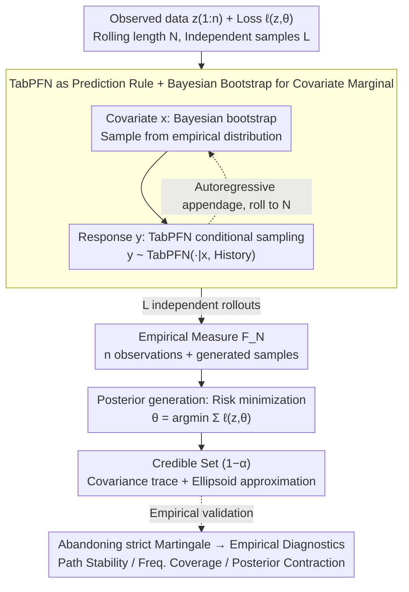

# TabMGP: Martingale Posterior with TabPFN

**Conference**: ICML 2026  
**arXiv**: [2510.25154](https://arxiv.org/abs/2510.25154)  
**Code**: Not yet public  
**Area**: Self-supervised / Tabular Foundation Models / Bayesian Uncertainty  
**Keywords**: Martingale Posterior, TabPFN, Tabular Foundation Models, Generalized Bayes, Credible Sets

## TL;DR
This paper treats TabPFN, a pre-trained tabular Transformer, directly as a prediction rule for Martingale Posteriors (MGP). Through in-context forward rolling sampling, it obtains credible sets for parameters $\theta$ under arbitrary loss functions. This approach avoids manual design of priors/likelihoods and hyperparameter tuning, outperforming manual MGP and classical Bayes in both coverage and credible set area across 30 real/synthetic scenarios.

## Background & Motivation

**Background**: Classical Bayesian inference provides uncertainty for parameters $\theta$ but requires explicit specification of priors and likelihoods. Martingale Posteriors (MGP, Fong et al. 2023) replace the prior-likelihood with a "prediction rule" $(P_i)_{i\ge 0}$, combined with a loss function $\ell(z,\theta)$ to define the functional of interest $\theta(F)=\arg\min_\vartheta \int \ell(z,\vartheta)\,\mathrm{d}F(z)$, bypassing prior specification.

**Limitations of Prior Work**: MGP literature almost exclusively uses "manual" prediction rules (e.g., Bayesian bootstrap, bivariate copulas, autoregressive GPs, vine copulas). Each introduces one or more smoothing/bandwidth hyperparameters that must be retuned for every dataset. Furthermore, they perform well only in low dimensions or specific distribution families, struggling with the complex structures of modern tabular data.

**Key Challenge**: Manual prediction rules prevail because the community views "strictly satisfying the martingale property $\mathbb{E}[P_{i+1}(A)\mid Z_{1:i}]=P_i(A)$" as a necessary condition. The authors argue that the martingale property is a sufficient, rather than necessary, condition for the existence of $F_\infty$. Overemphasizing it prevents the integration of high-capacity predictors.

**Goal**: Can a foundation model (TabPFN) pre-trained on large-scale synthetic tabular data—approximating the Bayesian PPD—be used directly as an MGP prediction rule? This would (i) eliminate manual design, (ii) leverage pre-trained coverage capabilities, and (iii) provide near-nominal coverage even if the strict martingale property is empirically violated.

**Key Insight**: Three natural properties of TabPFN align with MGP: ① In-context learning, outputting predictive distributions for $y\mid x$ without fine-tuning; ② Row-permutation invariance, eliminating the need to manually average over permutations like copulas; ③ Its training objective is to approximate the Bayesian PPD, which is the ideal prediction rule in MGP.

**Core Idea**: Use TabPFN to provide the $Y\mid X$ conditional distribution and Bayesian bootstrap for the marginal distribution of $X$. Map "forward rolling sampling + loss minimization" into the Transformer's autoregressive inference to obtain $\theta(F_N^{(l)})$ as an approximate posterior sample of $\theta(F_\infty)\mid z_{1:n}$.

## Method

### Overall Architecture
Input: Observed data $z_{1:n}=(x_i,y_i)_{i=1}^n$, loss function $\ell(z,\theta)$, rolling length $N$ (typically $N=n+T$, $T=500$), and number of samples $L$.
Output: $L$ approximate posterior samples $\{\theta^{(l)}\}_{l=1}^L \sim \theta(F_\infty)\mid z_{1:n}$, used to construct the credible set $\widehat{C}_{1-\alpha}(z_{1:n})$.

The pipeline consists of three stages:
1. **Forward Rolling**: For each $l\in\{1,\dots,L\}$, autoregressively generate $z_{n+1:N}^{(l)}$ starting from $z_{1:n}$; $x_{i+1}^{(l)}$ is drawn from the empirical distribution of $x_{1:i}^{(l)}$ (Bayesian bootstrap), and $y_{i+1}^{(l)}\sim \mathrm{TabPFN}(\cdot\mid x_{i+1}^{(l)}, z_{1:i}^{(l)})$.
2. **Risk Minimization**: Form an empirical measure $F_N^{(l)}=\tfrac1N\sum_{i=1}^N\delta_{z_i^{(l)}}$ for each rollout and solve $\theta^{(l)}=\arg\min_\theta\sum_i\ell(z_i^{(l)},\theta)$.
3. **Credible Set**: Approximate the $(1-\alpha)$ joint credible set using the covariance trace and ellipsoidal approximation of $\{\theta^{(l)}\}$.

All $l$ samples are independent, allowing for natural parallelization.

### Key Designs

**1. TabPFN as Prediction Rule + Bayesian Bootstrap for Covariate Marginal: Assigning tasks to specialized components**

MGP in supervised settings requires building a joint distribution of $(X,Y)$. However, unconditional modeling of high-dimensional $X$ is difficult. The authors use a "divide and conquer" approach: following the joint method of Fong et al. (2023), TabPFN handles the conditional distribution $y_{i+1}\sim P_i(\cdot\mid x_{i+1},z_{1:i})$, while the covariate marginal $x_{i+1}\sim\mathrm{Empirical}(x_{1:i})$ is handled by Bayesian bootstrap. This leverages TabPFN's strength (supervised prediction) while bypassing its weakness (unconditional modeling).

**2. Abandoning "Strict Martingale Property" for Empirical Diagnostics: Replacing unprovable thresholds with observable utility**

The MGP community generally regards the martingale property as a prerequisite for new prediction rules. This excludes TabPFN, which satisfies neither the martingale property nor the relaxed a.c.i.d. condition. The authors argue that since the property is unprovable for high-capacity neural networks, it is better to validate utility through three empirical diagnostics: (a) Path Stability: monitoring if $\mathbb{E}_{F_N}[\tfrac1p\|\theta(F_n)-\theta(F_N)\|_1]$ plateaus with $N$; (b) Frequentist Coverage: checking if $(1-\alpha)$ sets cover $\theta(F^\star)$ with $\ge 1-\alpha$ frequency; (c) Posterior Contraction: ensuring the set tightens around $\theta(F^\star)$ as $n$ increases.

**3. Generating Parameter Posteriors instead of Predictions: Enabling credible sets for any science quantity**

Scientific estimators $\theta$ (e.g., regression coefficients) are often unrelated to the Transformer's implicit latent model. TabMGP treats MGP as a convergence of Bayesian Predictive Inference (BPI) and Generalized Bayes (GB). By performing risk minimization after forward sampling, it produces posterior samples of $\theta(F_\infty)\mid z_{1:n}$. This structure fills the gap between having only a predictive distribution and needing parameter credible sets.

### Loss & Training
Ours **has no training phase**—TabPFN is pre-trained on synthetic tables and serves as an inference engine. The loss function $\ell$ is defined by the user during inference: e.g., squared loss $(y-[1\ x^\top]\theta)^2$ for linear regression or cross-entropy for classification. Key hyperparameters include rolling length $T=500$ and number of independent rollouts $L$ ($100 \sim 1000$).

## Key Experimental Results

### Main Results
Evaluation across 30 setups (11 synthetic + 19 real OpenML/UCI). Target coverage is 0.95. "Size" refers to the trace of the posterior covariance matrix (lower is better, provided coverage is met).

| Setup | TabMGP Rate / Size | BB Rate / Size | Copula Rate / Size | Bayes Rate / Size | Asymptotic Rate / Size |
|-------|--------------------|----------------|--------------------|-------------------|------------------------|
| $\mathcal{N}(0,1)$ | **1.00 / 0.45** | 0.55 / 0.09 | 0.99 / 0.35 | 1.00 / 0.65 | 1.00 / 1.31 |
| $t_3$ (Heavy tail) | **1.00 / 0.48** | 0.66 / 0.14 | 0.97 / 0.35 | 0.98 / 0.65 | 0.98 / 1.31 |
| heterosc. $s_3$ | **1.00 / 0.33** | 0.53 / 0.02 | 1.00 / 0.37 | 1.00 / 0.65 | 1.00 / 1.31 |
| concrete (Real) | 0.91 / **0.06** | 0.80 / 0.05 | 1.00 / 0.12 | 0.87 / 0.05 | 1.00 / 0.10 |
| airfoil (Real) | 0.96 / **0.08** | 0.93 / 0.05 | 0.97 / 0.11 | 0.96 / 0.06 | 1.00 / 0.12 |
| energy (Real) | **1.00 / 0.04** | 0.80 / 0.01 | 1.00 / 0.06 | — | — |

### Ablation Study

| Config / Diagnosis | Key Metric | Description |
|-------------|---------|------|
| TabMGP $T=500$ | All 30 setups plateau | Path stability converges within $T=500$ |
| TabMGP $T=1000$ | Slow setups plateau | No path divergence observed, suggesting $F_\infty$ exists |
| Martingale Test | Visual deviation from Martingale | TabPFN violates strict martingale but maintains coverage |
| Baseline (Copula+TabPFN init) | Underperforms TabMGP | Keeping TabPFN as the prediction rule is more effective than copula smoothing |

### Key Findings
- TabMGP coverage is the most stable: $\ge 0.97$ in all synthetic scenarios; BB severely undercovers due to lack of forward diversity at low $n$.
- TabMGP posterior shapes often exhibit skewness and multimodality, whereas others are mostly Gaussian, indicating that the Transformer captures non-Gaussian structure from the pre-training data.
- Copulas fail when data deviates from Gaussian assumptions (e.g., undercovering on kin8nm), whereas TabMGP is robust due to its large-scale pre-training.

## Highlights & Insights
- **The "sufficiency vs. necessity" argument regarding the martingale property is the pivot point**: By using empirical diagnostics, the authors decouple theoretical conditions from practical utility, allowing for high-capacity predictors.
- **The "Divide and Conquer" strategy with Bayesian bootstrap is ingenious**: By letting TabPFN handle $Y\mid X$ and bootstrap handle $X$, they leverage the foundation model's strength while avoiding areas where it wasn't trained (unconditional $X$ modeling).
- **Non-Gaussian posterior shapes are a "free" benefit**: Unlike manual MGP or Bayes which often output Gaussian sets, TabMGP captures skewness/multimodality inherent in real data.
- **Permutation invariance as a Cost Reduction**: Unlike copula-based MGP which requires expensive averaging over permutations, the TabPFN architecture handles this natively, reducing the engineering cost to zero.

## Limitations & Future Work
- Lack of strict theoretical guarantees; empirical stability is a weak evidence for the existence of $F_\infty$.
- TabPFN has a context length limit ($10^3\sim 10^4$ rows); rolling beyond this requires chunking strategies not explored here.
- Restricted to linear/interpretable models and small-to-medium $n$; performance on high-dimensional non-linear $\theta$ is unverified.
- Bootstrap for $X$ may limit diversity in scenarios with extremely unbalanced or sparse covariates.

## Related Work & Insights
- **vs. Fong et al. (2023) Original MGP**: They use manual copulas to ensure strict martingale properties; Ours uses pre-trained TabPFN for zero-tuning robustness.
- **vs. Nagler & Rügamer (2025)**: They use TabPFN only as a copula initialization; Ours remains with TabPFN throughout, arguing that non-martingale behavior does not impede utility.
- **vs. Classical Bayes**: Classical methods are dominated by priors at low $n/p$; TabMGP uses pre-trained knowledge as an implicit, more robust prior.

## Rating
- Novelty: ⭐⭐⭐⭐⭐ First to implement "foundation models as prediction rules" in MGP and challenge the necessity of the martingale property.
- Experimental Thoroughness: ⭐⭐⭐⭐ Extensive setups and diagnostics, though $\theta$ is limited to low-dimensional models.
- Writing Quality: ⭐⭐⭐⭐⭐ Clear conceptual layering; Algorithm 1 makes the forward sampling process highly intuitive.
- Value: ⭐⭐⭐⭐⭐ High engineering significance as it allows practitioners to plug TabPFN directly into a Bayesian toolkit.

<!-- RELATED:START -->

## Related Papers

- [\[ICML 2026\] Amortized Simulation-Based Inference in Generalized Bayes via Neural Posterior Estimation](amortized_simulation-based_inference_in_generalized_bayes_via_neural_posterior_e.md)
- [\[ICLR 2026\] Using maximal information auxiliary variables to improve synthetic data generation based on TabPFN foundation models](../../ICLR2026/others/using_maximal_information_auxiliary_variables_to_improve_synthetic_data_generati.md)
- [\[ICML 2026\] GOTabPFN: From Feature Ordering to Compact Tokenization for Tabular Foundation Models on High-Dimensional Data](gotabpfn_from_feature_ordering_to_compact_tokenization_for_tabular_foundation_mo.md)
- [\[ICML 2026\] Position: Age Estimation Models Do Not Process Biometric Data](position_age_estimation_models_do_not_process_biometric_data.md)
- [\[ICML 2026\] Less Data, Faster Training: Repeating Smaller Datasets Speeds Up Learning via Sampling Biases](less_data_faster_training_repeating_smaller_datasets_speeds_up_learning_via_samp.md)

<!-- RELATED:END -->
