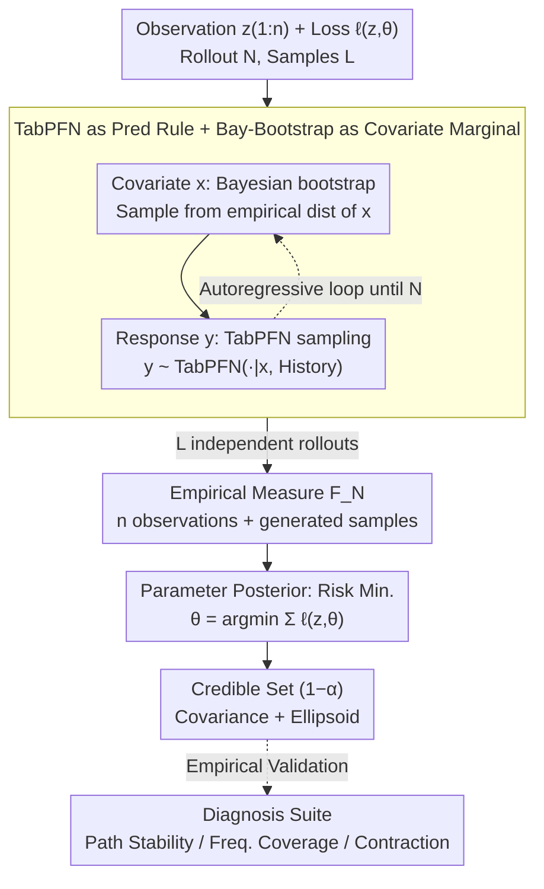

# TabMGP: Martingale Posterior with TabPFN

**Conference**: ICML 2026  
**arXiv**: [2510.25154](https://arxiv.org/abs/2510.25154)  
**Code**: Not yet public  
**Area**: Self-Supervised / Tabular Foundation Models / Bayesian Uncertainty  
**Keywords**: Martingale Posterior, TabPFN, Tabular Foundation Models, Generalized Bayes, Credible Sets

## TL;DR
This paper treats TabPFN, a pre-trained tabular Transformer, directly as the predictive rule for a Martingale Posterior (MGP). Through in-context forward rollout sampling, it obtains credible sets for parameters $\theta$ under arbitrary loss functions. This approach avoids manual design of priors/likelihoods and tuning of hyper-parameters; across 30 real and synthetic scenarios, it outperforms both manual MGP and classical Bayesian methods in terms of coverage and credible set area.

## Background & Motivation

**Background**: Classical Bayesian inference provides uncertainty for parameters $\theta$ but requires explicit specification of a prior and a likelihood. The Martingale Posterior (MGP, Fong et al. 2023) replaces the prior-likelihood with a "predictive rule" $(P_i)_{i\ge 0}$ and uses a loss function $\ell(z,\theta)$ to define the functional of interest $\theta(F)=\arg\min_\vartheta \int \ell(z,\vartheta)\,\mathrm{d}F(z)$, bypassing prior specification.

**Limitations of Prior Work**: Existing MGP literature almost exclusively uses "manual" predictive rules (e.g., Bayesian bootstrap, bivariate copula, autoregressive GP, vine copula). Each introduces at least one smoothing or bandwidth hyper-parameter that must be tuned for every dataset. Furthermore, these rules perform well only in low dimensions or for specific distribution families, making it difficult to handle the complex structures of modern tabular data.

**Key Challenge**: Manual predictive rules persist because the community treats "strictly satisfying the martingale property $\mathbb{E}[P_{i+1}(A)\mid Z_{1:i}]=P_i(A)$" as a necessary condition for designing any new predictive rule. The authors argue that the martingale property is a sufficient, but not necessary, condition for the existence of $F_\infty$; overemphasizing it hinders the integration of high-capacity predictors.

**Goal**: Can a foundation model (TabPFN) pre-trained on large-scale synthetic tabular data to approximate the Bayesian PPD be used directly as the MGP predictive rule? This would (i) eliminate manual design, (ii) leverage pre-trained coverage capabilities, and (iii) empirically provide near-nominal coverage even if the strict martingale property is violated.

**Key Insight**: TabPFN possesses three natural characteristics that align with MGP: ① in-context learning, where predictive distributions for $y\mid x$ are output without fine-tuning; ② row-permutation invariance in its architecture, removing the need for manual averaging over permutations as in copulas; and ③ an optimization objective that approximates the Bayesian PPD, which is the ideal predictive rule in MGP.

**Core Idea**: Use TabPFN to provide the $Y\mid X$ conditional distribution and Bayesian bootstrap to provide the $X$ marginal distribution. Map "forward rollout sampling + loss minimization" into the autoregressive inference of the Transformer to obtain $\theta(F_N^{(l)})$ as an approximate posterior sample of $\theta(F_\infty)\mid z_{1:n}$.

## Method

### Overall Architecture
Input: Observational data $z_{1:n}=(x_i,y_i)_{i=1}^n$, loss function $\ell(z,\theta)$, rollout length $N$ (typically $N=n+T$ with $T=500$), and number of samples $L$.  
Output: $L$ approximate posterior samples $\{\theta^{(l)}\}_{l=1}^L \sim \theta(F_\infty)\mid z_{1:n}$, used to construct the credible set $\widehat{C}_{1-\alpha}(z_{1:n})$.

The pipeline consists of three stages:
1. **Forward Rollout**: For each $l\in\{1,\dots,L\}$, generate $z_{n+1:N}^{(l)}$ starting from $z_{1:n}$ autoregressively; $x_{i+1}^{(l)}$ is sampled from the empirical distribution of $x_{1:i}^{(l)}$ (Bayesian bootstrap), and $y_{i+1}^{(l)}\sim \mathrm{TabPFN}(\cdot\mid x_{i+1}^{(l)}, z_{1:i}^{(l)})$.
2. **Risk Minimization**: Form the empirical measure $F_N^{(l)}=\tfrac1N\sum_{i=1}^N\delta_{z_i^{(l)}}$ for each rollout and solve $\theta^{(l)}=\arg\min_\theta\sum_i\ell(z_i^{(l)},\theta)$.
3. **Credible Set**: Use the covariance trace and ellipsoidal approximation of $\{\theta^{(l)}\}$ to obtain the $(1-\alpha)$ joint credible set.

All rollouts $l$ are independent and naturally parallelizable.

### Key Designs

**1. TabPFN as Predictive Rule + Bayesian Bootstrap for Marginal: Allocating hard tasks to specialized components**  
In supervised settings, MGP requires modeling the joint $(X,Y)$ distribution. However, unconditional modeling of high-dimensional $X$ is difficult, and traditional copula rules require explicit averaging over permutations and manual bandwidth tuning. The authors use a "divide and conquer" approach: following the joint method of Fong et al. (2023), TabPFN handles the conditional distribution $y_{i+1}\sim P_i(\cdot\mid x_{i+1},z_{1:i})$ while the covariate marginal $x_{i+1}\sim\mathrm{Empirical}(x_{1:i})$ is handled by the Bayesian bootstrap. This utilizes TabPFN's strength in supervised prediction while bypassing its weakness in unconditional modeling. This setup also leverages TabPFN’s inherent permutation invariance, eliminating two major engineering bottlenecks of copulas.

**2. Relaxing the "Strict Martingale" constraint with Empirical Diagnosis: Replacing unprovable theory with observable utility**  
The MGP community often treats the martingale property $\mathbb{E}[P_{i+1}(A)\mid Z_{1:i}]=P_i(A)$ as a prerequisite. This excludes TabPFN, as its martingale property cannot be proven with current tools. The authors argue that the martingale property is sufficient but not necessary for the existence of $F_\infty$. Instead of rejecting high-capacity predictors, they propose a verification loop using three empirical diagnoses: (a) Path Stability: monitoring if $\mathbb{E}_{F_N}[\tfrac1p\|\theta(F_n)-\theta(F_N)\|_1]$ plateaus as $N$ increases; (b) Frequentist Coverage: checking if the $(1-\alpha)$ set contains $\theta(F^\star)$ with $\ge 1-\alpha$ frequency; (c) Posterior Contraction: ensuring the set tightens as $n$ increases. All 30 experimental setups reached a plateau and provided near-nominal coverage.

**3. Generating Parameter Posteriors instead of just Predictive Distributions: Credible sets for any functional**  
Parameters $\theta$ of interest (e.g., regression coefficients) often have no direct relation to the Transformer's internal latent model. Standard foundation models only provide predictive distributions. TabMGP merges Bayesian Predictive Inference (BPI) with Generalized Bayes (GB), treating the inference target as the minimizer of an arbitrary loss. By combining forward rollout sampling with risk minimization, the method yields posterior samples for $\theta(F_\infty)\mid z_{1:n}$. This allows users to obtain credible sets for any scientifically relevant functional defined by a loss function $\ell(z,\theta)$.

### Loss & Training
TabMGP **itself has no training phase**. TabPFN is used as a pre-trained inference engine for forward passes. The loss function $\ell$ is specified by the user at inference time: squared loss $\ell(x,y,\theta)=(y-[1\ x^\top]\theta)^2$ for linear regression, or cross-entropy $\ell(x,y,\theta)=-\log\Pr(y=k)$ for $K$-class classification. Key hyper-parameters include rollout length $T=500$ (occasionally $T=1000$) and independent rollout count $L$ ($100 \sim 1000$).

## Key Experimental Results

### Main Results
Selection from linear regression experiments across 30 setups (11 synthetic, 19 real). Target coverage is 0.95. Rate is coverage (closer to 1.00 is better), and Size is the trace of the posterior covariance (smaller is better if coverage is met).

| Setup | TabMGP Rate / Size | BB Rate / Size | Copula Rate / Size | Bayes Rate / Size | Asymptotic Rate / Size |
|-------|--------------------|----------------|--------------------|-------------------|------------------------|
| $\mathcal{N}(0,1)$ | **1.00 / 0.45** | 0.55 / 0.09 | 0.99 / 0.35 | 1.00 / 0.65 | 1.00 / 1.31 |
| $t_3$ (Heavy Tail) | **1.00 / 0.48** | 0.66 / 0.14 | 0.97 / 0.35 | 0.98 / 0.65 | 0.98 / 1.31 |
| Heterosc. $s_3$ | **1.00 / 0.33** | 0.53 / 0.02 | 1.00 / 0.37 | 1.00 / 0.65 | 1.00 / 1.31 |
| concrete (Real) | 0.91 / **0.06** | 0.80 / 0.05 | 1.00 / 0.12 | 0.87 / 0.05 | 1.00 / 0.10 |
| airfoil (Real) | 0.96 / **0.08** | 0.93 / 0.05 | 0.97 / 0.11 | 0.96 / 0.06 | 1.00 / 0.12 |
| energy (Real) | **1.00 / 0.04** | 0.80 / 0.01 | 1.00 / 0.06 | — | — |

### Ablation Study

| Configuration / Diagnosis | Key Metric | Description |
|-------------|---------|------|
| TabMGP $T=500$ | All 30 setups plateaued | Path stability reached convergence within $T=500$ |
| TabMGP $T=1000$ | Slow-convergence setups plateaued | No path divergence observed, suggesting $F_\infty$ existence |
| Martingale Check | Visual deviation | TabPFN is not strictly martingale, yet coverage remains near-nominal |
| Alternative Baseline | Copula+TabPFN init | Outperformed by TabMGP in most setups, validating direct use |

### Key Findings
- **Coverage Stability**: TabMGP yields the most stable coverage ($\ge 0.97$ in synthetic cases), whereas BB suffers from under-coverage due to limited forward diversity, and Bayes/Asymptotic over-cover with large sets due to failure of asymptotic approximations at low $n$.
- **Non-Gaussian Posteriors**: TabMGP posteriors often exhibit skewness and multimodality compared to the Gaussian shapes of BB/Copula/Bayes, suggesting the pre-trained Transformer captures non-Gaussian structural information.
- **Robustness**: Copulas fail when data deviates from Gaussian assumptions (e.g., severe under-coverage on *kin8nm*); TabMGP remains robust due to its large-scale pre-training.

## Highlights & Insights
- **Heuristic Breakthrough**: Challenging the "martingale property is necessary" dogma is the paper's main contribution. Decoupling theoretical conditions from empirical utility allows the inclusion of high-capacity predictors.
- **Strategic Combination**: Using TabPFN for $Y\mid X$ and Bayesian bootstrap for $X$ leverages the strengths of both without forcing TabPFN to simulate $X$ distributions it wasn't trained on.
- **Structural Advantage**: TabPFN's row-permutation invariance removes the most computationally expensive part of the MGP framework (averaging permutations).
- **Functional Flexibility**: The bridge between BPI and GB allows any user-defined science quantity $\theta$ to receive a full posterior.

## Limitations & Future Work
- **Theoretical Guarantee**: Lack of a formal proof for $F_\infty$ existence; the plateau is only a weak empirical indicator.
- **Context Length**: TabPFN is limited by Transformer context windows ($10^3 \sim 10^4$); $N$ cannot exceed this without chunking strategies.
- **High-Dimensional Scaling**: While effective for interpretable linear models, performance on high-dimensional non-linear $\theta$ (like neural net weights) remains untested and potentially ill-posed.
- **Covariate Bottleneck**: Bayesian bootstrap for $X$ might limit diversity in sparse or imbalanced settings; future work could integrate generative models (VAE/Diffusion).

## Related Work & Insights
- **vs. Fong et al. (2023)**: They use manual copulas to ensure martingale properties; Ours uses pre-trained TabPFN to trade strict theory for zero-tuning and robustness.
- **vs. Nagler & Rügamer (2025)**: They used TabPFN only as an initialization for copulas; Ours retains TabPFN throughout, arguing that the non-martingale nature does not hinder utility.
- **vs. Classical Bayes**: Bayes is dominated by priors at low $n/p$; TabMGP uses pre-trained knowledge as an implicit, more effective prior.

## Rating
- Novelty: ⭐⭐⭐⭐⭐ 
- Experimental Thoroughness: ⭐⭐⭐⭐ 
- Writing Quality: ⭐⭐⭐⭐⭐ 
- Value: ⭐⭐⭐⭐⭐ 

<!-- RELATED:START -->

## Related Papers

- [\[ICML 2026\] Amortized Simulation-Based Inference in Generalized Bayes via Neural Posterior Estimation](amortized_simulation-based_inference_in_generalized_bayes_via_neural_posterior_e.md)
- [\[ICML 2026\] Position: Age Estimation Models Do Not Process Biometric Data](position_age_estimation_models_do_not_process_biometric_data.md)
- [\[ICML 2026\] Less Data, Faster Training: Repeating Smaller Datasets Speeds Up Learning via Sampling Biases](less_data_faster_training_repeating_smaller_datasets_speeds_up_learning_via_samp.md)
- [\[ICML 2026\] Adaptive Multi-Round Allocation with Stochastic Arrivals](adaptive_multi-round_allocation_with_stochastic_arrivals.md)
- [\[ICML 2026\] Mapping Human Anti-collusion Mechanisms to Multi-agent AI Systems](mapping_human_anti-collusion_mechanisms_to_multi-agent_ai_systems.md)

<!-- RELATED:END -->
