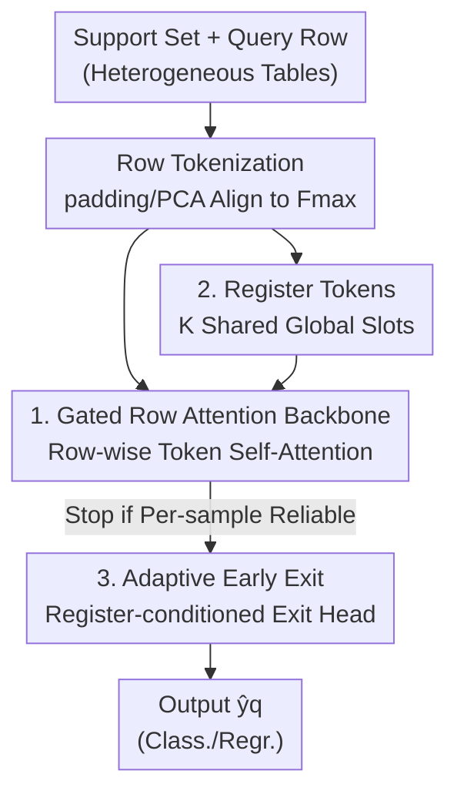

# TabSwift: An Efficient Tabular Foundation Model with Row-Wise Attention

**Conference**: ICML 2026  
**arXiv**: [2606.07345](https://arxiv.org/abs/2606.07345)  
**Code**: https://github.com/LAMDA-Tabular/TabSwift  
**Area**: Tabular Foundation Models / Efficient Inference / In-Context Learning  
**Keywords**: Tabular Foundation Model, Row-wise Attention, Gated Attention, Register Token, Adaptive Early Exit

## TL;DR
The authors demonstrate that the minimalist backbone of TabPFN, which employs "row-wise attention only," is not outdated. By incorporating gated attention to stabilize training, a small set of learnable register tokens to aggregate global information, and a per-sample adaptive early exit head, the model achieves accuracy comparable to heavier column-aware models like TabPFN v2 and TabICL while significantly accelerating inference.

## Background & Motivation
**Background**: Tabular prediction has long been dominated by GBDT (XGBoost, LightGBM). However, the Prior-Fitted Network (PFN) paradigm has introduced tabular foundation models: a Transformer is pre-trained on massive synthetic tabular tasks. During inference, a "labeled support set + query to be predicted" is fed in as a prompt, and predictions are generated directly via In-Context Learning (ICL) without any test-time parameter updates. TabPFN achieved remarkable results on small-data classification, and TabPFN v2 extended coverage to both classification and regression.

**Limitations of Prior Work**: To push accuracy, the architectures of next-generation tabular foundation models have become increasingly heavy. They generally follow an "alternating row/column attention" route—treating input as an $n \times d$ token grid and performing attention in both the row (sample) and column (feature) directions. While this better captures inter-feature structures and dataset heterogeneity, the cost of a single forward pass increases significantly. The dominant overhead of an alternating block is $\mathcal{O}(d\,n^{2}d_{\text{model}}) + \mathcal{O}(n\,d^{2}d_{\text{model}})$, which is much heavier than the row-wise attention of TabPFN v1 at $\mathcal{O}(n^{2}d_{\text{model}})$.

**Key Challenge**: Many real-world tabular scenarios have strict constraints on latency and throughput, making the accuracy-efficiency trade-off a priority. The community has defaulted to the assumption that "stronger accuracy requires heavier column-aware architectures," yet this assumption has never been rigorously questioned—could the minimalist row-wise backbone be perceived as weak simply because it lacks modern attention stabilization and pre-training techniques?

**Goal**: To train a row-wise attention backbone that can compete with heavy models without introducing column attention, and further eliminate computational waste where "every sample must pass through all layers" during deployment.

**Key Insight**: Retain the pure row-wise attention inference structure of TabPFN v1 (the root of low cost) and add two lightweight modifications that barely increase computation to unlock its training potential.

**Core Idea**: Row-wise attention backbone + Gated attention (stabilizes training) + Register tokens (complements global context) = TabSwift; augmented with a per-sample early exit head to dynamically allocate inference depth based on sample difficulty.

## Method

### Overall Architecture
TabSwift is a PFN-style tabular ICL Transformer. The input consists of a "support set $\mathcal{D}_{\text{sup}}=\{(\mathbf{x}_i,y_i)\}_{i=1}^N$ + one query $\mathbf{x}_q$," and the output is the predicted label $\hat{y}_q$ (classification and regression share the same backbone). The pipeline consists of three stages: first, each row is encoded into a single token, with $K$ register tokens prepended to the sequence; second, the sequence is processed by a **row-wise only** Transformer backbone with element-wise gating in the self-attention; finally, prediction heads and "early exit" heads are attached to the trailing layers, allowing simple samples to finish at shallower depths.

### Key Designs

**1. Element-wise Gated Row Attention: Stabilizing training without column attention**

The row-wise backbone itself is not inherently flawed; rather, its optimization is insufficiently stable during large-scale synthetic pre-training, which suppresses the accuracy ceiling and leads the community toward heavier column attention. The authors' solution is not to change the structure but the attention output path: using SDPA-output gating (the G1 design by Qiu et al.). Before the self-attention output $\mathbf{O}^h$ is projected, it is multiplied by an element-wise gate $\mathbf{G}^h=\sigma(\mathbf{X}\mathbf{W}_g^h+\mathbf{b}_g^h)\in(0,1)^{S\times d_h}$ computed from the input, yielding $\widetilde{\mathbf{O}}^h=\mathbf{G}^h\odot\mathbf{O}^h$. This gate introduces an additional layer of non-linearity between the value and output projections and allows attention updates to exhibit "input-dependent sparsity," thereby stabilizing optimization during synthetic pre-training. The cost is negligible—the gating adds only a linear term $\mathcal{O}(Sd_{\text{model}})$ compared to the quadratic attention term $\mathcal{O}(S^2 d_{\text{model}})$, remaining much cheaper than architectures requiring column attention.

**2. Learnable Register Tokens: Providing a global context "scratchpad" for row attention**

Row-wise attention only mixes information between samples, lacking a carrier to maintain "dataset-level" representations across depths. TabSwift prepends $K$ learnable register tokens $\mathbf{R}^{(0)}=\{\mathbf{r}_k^{(0)}\}_{k=1}^K$ to the row token sequence. These are shared across all tasks and updated across layers, acting as latent slots to aggregate context, making it easier for the model to refine task-level representations in deeper layers. Specifically, row tokens are aligned and embedded to obtain $\mathbf{H}_{\text{rows}}^{(0)}$. For support rows, label embeddings are injected as $\mathbf{h}_i^{(0)}=\mathbf{e}(\mathbf{x}_i)+\mathbf{e}_y(y_i)$. The input to the final layer is $\mathbf{H}^{(0)}=[\mathbf{R}^{(0)};\mathbf{H}_{\text{rows}}^{(0)}]\in\mathbb{R}^{S\times d_{\text{model}}}$, where $S=K+n$. This aligns with the "thinking rows" concept in recent PFN variants, but TabSwift combines it with gated attention as a lightweight means to enhance pre-training quality. These registers are later reused by the early exit head (see Design 3).

To handle varying feature dimensions across datasets, inputs are aligned to a fixed dimension $F_{\max}$: zero-padding for $F < F_{\max}$ and PCA projection for $F > F_{\max}$, resulting in $\tilde{\mathbf{x}}\in\mathbb{R}^{F_{\max}}$ (the authors acknowledge that for extremely high-dimensional features, PCA adds overhead, and TabSwift's speedup stems from the lightweight backbone rather than asymptotic advantage).

**3. Register-conditioned Per-sample Adaptive Early Exit: Dynamic depth allocation**

Even with a lightweight backbone, running all $L$ layers for every test sample is wasteful in per-query serving—latency is dominated by worst-case depth. TabSwift attaches a prediction head $\hat{\mathbf{y}}^{(e)}=h_{\text{pred}}^{(e)}(\mathbf{z}^{(e)})$ to each of the last $E$ layers (where $E=L$) to allow valid predictions from intermediate layers, plus a learned exit head to judge reliability. The key innovation is that the exit head considers not only the query representation $\mathbf{z}_t^{(e)}$ but also the pooled summary of register tokens $\mathbf{r}^{(e)}=\frac{1}{K}\sum_{k=1}^K\mathbf{R}_k^{(e)}$, which carries task-level context accumulated up to that depth. A stop score is computed as $s_t^{(e)}=h_{\text{exit}}^{(e)}([\mathbf{z}_t^{(e)};\mathbf{r}^{(e)}])$. Deployment involves scanning from shallow to deep layers and exiting at the first layer where $\sigma(s_t^{(e)})\ge\tau$:

$$e_t^{\star}=\min\{e\in\{1,\dots,E\}:\sigma(s_t^{(e)})\ge\tau\}$$

If no layer meets the criteria, the model defaults to the final layer. The threshold $\tau$ is tuned on the validation set to control the accuracy-computation trade-off. The main difference from existing tabular ICL early exit work (e.g., Küken et al.) is that those methods typically use statistics from the **entire test set** (e.g., mean entropy) to determine depth, which leans toward transductive/test-time adaptation. TabSwift is designed for per-query online inference; the exit decision uses only the current sample's intermediate state + register summary within a single forward pass.

### Loss & Training
Pre-training follows the TabICL synthetic data protocol: an offline pool of 20,000 steps is generated, each containing 512 sampled synthetic tasks with up to 2,000 rows and 100 features, consumed via round-robin. A "unified objective" is used—when sampling target variables from SCM nodes, both a discretized classification target and a standardized regression target are stored for each task. Thus, the same task supervises both heads: Cross-Entropy for classification and a combination of MSE + MAE for regression. The backbone is a 24-layer Transformer with $d_{\text{model}}=192$, trained for 150,000 steps on 8 RTX 5090 GPUs (approx. 7 days), followed by 2,000 steps on larger tasks (up to 20,000 rows) for long-context robustness. Early exit is added in a post-training stage: the backbone is frozen, and only the new prediction and exit heads are trained for 10,000 steps (approx. 6 hours).

## Key Experimental Results

### Main Results
Evaluated on the TALENT large-scale benchmark (300 binary/multi-class/regression datasets), using a 64%/16%/20% split averaged over 15 seeds. AUC is reported for classification and RMSE for regression. Results use Critical Difference (CD) diagrams and PAMA (Percentage of datasets where A Method is Above others).

| Metric | TabSwift Performance | Meaning |
|----------|---------------|------|
| Avg. Rank (Cls/Reg) | Comparable to strongest baselines, superior in some settings | No significant difference from top methods under Wilcoxon–Holm correction |
| PAMA (Best %) | High for both Cls/Reg | Strong rank is supported by consistent performance across many datasets, not outliers |
| Full-depth Inference Time | Significantly lower than other TFMs | Based on $N\times d$ complexity, row-wise backbone constants are smaller |

Core Conclusion: A well-trained purely row-wise tabular foundation model matches the accuracy of heavier column-aware models like TabPFN v2 / TabICL while maintaining lower inference costs, providing a superior accuracy-efficiency trade-off. PAMA also shows different models excel on different subsets, suggesting complementarity.

### Ablation Study
Starting from a retrained TabPFN v1-style pure row-wise backbone (TabS-S1), components were added incrementally:

| Configuration | Change | Function |
|------|------|------|
| TabS-S1 | Pure row attention (Baseline) | Reproduces TabPFN v1 starting point |
| TabS-S1-Gate | + Element-wise Gated Attention | Stabilizes pre-training optimization |
| TabS-S1-Register | + learnable register tokens | Complements global context |
| TabS-S1-Gate-Register | Gate + Register combination | Overlap of lightweight modifications |
| TabSwift | + Two-stage pre-training | Full model |

Early exit was compared against a "per-query entropy stop" baseline and ablated for the inclusion of register summaries. Results show the learned exit head provides a better accuracy-computation Pareto frontier than entropy stopping, with register conditioning pushing the frontier further.

### Key Findings
- Gated attention and registers are "virtually zero-cost" modifications, but they allow the row-wise backbone to overcome its perceived "low ceiling"—indicating that previous weakness was due to training techniques rather than structural limitations.
- Visualization of the early exit embedding space (PCA of query embeddings) shows that as $\tau$ increases, more samples are deferred to deeper layers. The deepest exits cluster in overlapping regions of the embedding space, confirming the exit head allocates more compute to difficult/ambiguous samples.
- The majority of samples can be predicted reliably at shallow layers, significantly reducing average computation with negligible performance loss, achieving "anytime" tabular ICL.

## Highlights & Insights
- **"Retro" beats complexity**: While the trend favors alternating row/column attention, the authors prove that optimizing the simplest row-wise backbone can close the gap, suggesting much of the performance gain in heavier models comes from optimization/pre-training quality rather than architectural expressive power.
- **Multipurpose Registers**: Register tokens serve as global context scratchpads to improve pre-training quality and as task-level summaries for the early exit head, demonstrating economic design.
- **Deployment-ready Early Exit**: The strict per-query (online) exit strategy without looking at test set statistics is more practical for latency-sensitive online services than transductive adaptation methods.
- **Unified Classification + Regression**: Supervising two heads with two versions of the target from the same synthetic task allows one model to cover a wider range of tasks, eliminating the need to train separate models for regression.

## Limitations & Future Work
- The authors admit that for extremely high-dimensional features, PCA preprocessing introduces overhead, where speedup relies on backbone constants rather than asymptotic complexity.
- Pure row attention discards explicit feature (column) interaction modeling. While training tricks bridge the gap, its performance on highly heterogeneous tasks might still hit an expressive ceiling.
- The early exit threshold $\tau$ requires validation set tuning and may need recalibration under distribution shifts; reliability under shift was not deeply discussed.
- Future Directions: Utilizing register summaries for difficulty-aware curriculum training or exploring hybrid backbones with extremely lightweight column interactions to raise the ceiling for heterogeneous tasks.

## Related Work & Insights
- **vs TabPFN v1 (Pure Row Attention)**: Shares the same row-wise inference structure, but TabSwift adds gated attention, registers, and two-stage pre-training, significantly raising accuracy at almost no extra inference cost.
- **vs TabPFN v2 / TabICL (Alternating Row/Column Attention)**: These models use column attention to model feature structure at a higher cost. TabSwift achieves comparable accuracy with faster inference, offering a better trade-off.
- **vs Küken et al. (Tabular ICL Early Exit)**: The latter uses test-set statistics (mean entropy) to set depth, which is transductive. TabSwift is strictly per-query online exit, which is better for delay-sensitive serving.

## Rating
- Novelty: ⭐⭐⭐⭐ The conclusion that "row-wise is enough" is an impactful counter-trend statement, though components are combinations of existing techniques.
- Experimental Thoroughness: ⭐⭐⭐⭐⭐ TALENT 300 datasets + 15 seeds + CD/PAMA significance + Early Exit Pareto analysis make for a very solid evaluation.
- Writing Quality: ⭐⭐⭐⭐ Clear motivation, complexity analysis, standardized formulas, and easy-to-follow framework.
- Value: ⭐⭐⭐⭐ Provides a ready-to-use solution for latency-sensitive tabular deployment; the early exit mechanism is highly reusable.

<!-- RELATED:START -->

## Related Papers

- [\[ICML 2026\] GOTabPFN: From Feature Ordering to Compact Tokenization for Tabular Foundation Models on High-Dimensional Data](gotabpfn_from_feature_ordering_to_compact_tokenization_for_tabular_foundation_mo.md)
- [\[ACL 2025\] HATA: Trainable and Hardware-Efficient Hash-Aware Top-k Attention for Scalable Large Model Inference](../../ACL2025/others/hata_trainable_and_hardware-efficient_hash-aware_top-k_attention_for_scalable_la.md)
- [\[ICML 2026\] Cascaded Flow Matching for Heterogeneous Tabular Data with Mixed-Type Features](cascaded_flow_matching_for_heterogeneous_tabular_data_with_mixed-type_features.md)
- [\[ECCV 2024\] AttnZero: Efficient Attention Discovery for Vision Transformers](../../ECCV2024/others/attnzero_efficient_attention_discovery_for_vision_transformers.md)
- [\[ICML 2026\] Connecting Independently Trained Modes via Layer-Wise Connectivity](connecting_independently_trained_modes_via_layer-wise_connectivity.md)

<!-- RELATED:END -->
