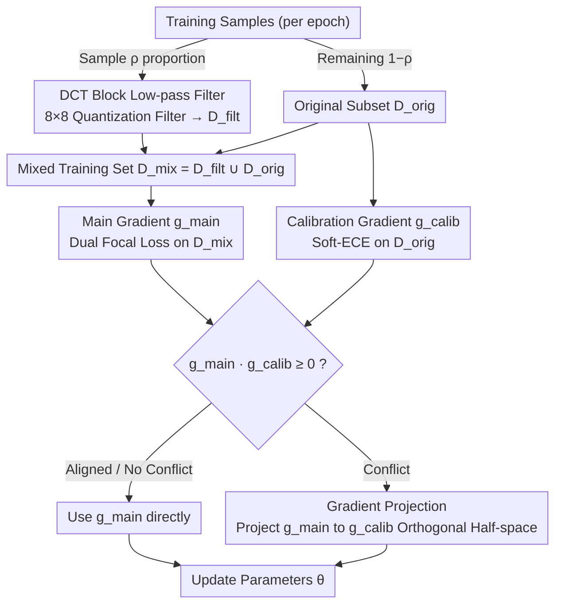

# Target-Agnostic Calibration under Distribution Shift with Frequency-Aware Gradient Rectification

**Conference**: ICML 2026  
**arXiv**: [2508.19830](https://arxiv.org/abs/2508.19830)  
**Code**: https://github.com/YilinZhang107/FGR-Calib (Available)  
**Area**: Interpretability / Confidence Calibration / Distribution Shift Robustness  
**Keywords**: Calibration, Distribution Shift, DCT Low-pass Filtering, Gradient Projection, Domain-Invariant Features

## TL;DR
FGR employs DCT low-pass filtering to remove high-frequency spurious shortcuts from training images to achieve more accurate OOD calibration. It resolves the gradient conflict between "improving calibration" and "maintaining ID performance" through a geometric projection as a hard constraint, suppressing OOD ECE while preserving ID performance without hyperparameter tuning for loss weights.

## Background & Motivation

**Background**: Deep models during deployment require not only accurate predictions but also reliable confidence scores—in high-risk scenarios such as healthcare or autonomous driving, a "wrong prediction with 0.9 confidence" is significantly more dangerous than one with 0.5 confidence. Calibration methods follow two main paths: post-hoc methods (Temperature Scaling, isotonic regression, etc.) which fit a confidence transformation on a fixed model, and training-time methods (Focal Loss / MMCE / Soft-ECE / Dual Focal Loss / Label Smoothing / Mixup, etc.) which add regularization to the loss to suppress overconfidence.

**Limitations of Prior Work**: The aforementioned methods perform well on ID (In-Distribution) data, but confidence collapses once distribution shifts occur (changes in weather/lighting/sensors, differences in hospitals/equipment, or geographical domains)—a typical ResNet drops from 76% to 18% accuracy on ImageNet-C while remaining excessively overconfident. Existing "calibration under distribution shift" methods often rely on target domain information: requiring multi-domain training data to train input-conditional temperature regressors, using synthetic validation sets to simulate the target domain, or relying on additional assumptions like Bayesian or feature density, which are often unavailable during deployment.

**Key Challenge**: Maintaining calibration on unknown OOD data requires the model to rely only on features that are stable across distributions. However, removing unstable signals (such as high-frequency textures) inevitably harms the fine-grained decision boundaries on ID data, leading to under-confidence. This creates an irreconcilable conflict between "OOD calibration vs. ID calibration" objectives; conventional multi-task weighted sums cannot explicitly handle "maintaining ID" as a hard constraint.

**Goal**: (1) Improve OOD calibration without accessing any target domain information; (2) Preserve ID calibration without introducing additional loss balancing coefficients.

**Key Insight**: Distribution shifts can be viewed through the frequency domain—existing evidence (Yin et al. 2019 / Fridovich-Keil et al. 2022 / Li et al. 2023) indicates that models often use high-frequency statistics as classification shortcuts, and shifts primarily perturb these components. Actively masking high-frequency signals during training forces the model to capture "shape/semantics" features that are stable across domains; the side effects of masking (ID under-confidence) are then handled by a hard constraint mechanism at the optimizer level.

**Core Idea**: "Frequency domain filtering to build domain-invariant features + Gradient projection treating ID calibration as a hard constraint"—the former provides robustness from the data perspective, while the latter serves as a safety net on the optimization side, working in a decoupled yet coupled manner.

## Method

FGR is a training-time framework combining "low-pass filter-based mixed training set generation" and "gradient projection." The training process is appended after conventional classification training (the authors suggest starting from epoch 200).

### Overall Architecture
At the start of each epoch, a proportion $\rho$ of training samples is randomly selected for DCT low-pass filtering to form $\mathcal{D}_{\text{filt}}$, while the remaining $(1-\rho)$ is kept as $\mathcal{D}_{\text{orig}}$. The union is the mixed training set $\mathcal{D}_{\text{mix}}=\mathcal{D}_{\text{filt}}\cup\mathcal{D}_{\text{orig}}$. At each training step, two gradients are computed: the main gradient $\mathbf{g}_{\text{main}}=\nabla_\theta\mathcal{L}_{\text{main}}(\theta;\mathcal{D}_{\text{mix}})$ using Dual Focal Loss on the mixed set, and the calibration gradient $\mathbf{g}_{\text{calib}}=\nabla_\theta\mathcal{L}_{\text{calib}}(\theta;\mathcal{D}_{\text{orig}})$ using Soft-ECE only on the original data. When 
conflict occurs, the main gradient is projected onto the half-space orthogonal to $\mathbf{g}_{\text{calib}}$ before updating.

### Key Designs

**1. DCT Block-level Low-pass Filtering (Robust Feature Builder): Masking high-frequency details to force the model to rely on shape and global structure.**

Since distribution shifts primarily perturb high-frequency components, models often exploit high-frequency statistics as shortcuts. The paper actively masks these signals: images are converted to YCbCr, split into $8\times 8$ non-overlapping blocks $\bm{x}_b$, and transformed via 2D-DCT to $\mathbf{F}_b$. These are quantized using a JPEG table $\mathbf{Q}_\lambda$ with intensity parameter $\lambda$ as $\mathbf{F}_b^{(q)}=\text{round}(\mathbf{F}_b/\mathbf{Q}_\lambda)$, followed by inverse quantization and transformation $\hat{\bm{x}}_b=\text{DCT}^{-1}(\mathbf{F}_b^{(q)}\cdot\mathbf{Q}_\lambda)$ back to RGB. A smaller $\lambda$ results in more aggressive filtering. DCT is chosen over Fourier because its energy concentration ensures low-frequency coefficients carry major semantics, and block-level processing avoids global ringing while staying robust to common texture distortions. The strategy of filtering only a portion of the samples prevents total ID under-confidence while maintaining pressure for domain invariance.

**2. Gradient Projection Mechanism (FGR Rectification, Mechanism): Reformulating OOD and ID calibration from weighted losses into a "Main Objective + Hard Constraint".**

Removing high frequencies degrades fine decision boundaries on ID data. The feasible half-space is defined as $\mathcal{C}_\text{ID}=\{\mathbf{g}\mid \mathbf{g}^\top\mathbf{g}_{\text{calib}}\ge 0\}$ (directions that do not degrade ID calibration). If $\mathbf{g}_{\text{main}}\cdot\mathbf{g}_{\text{calib}}\ge 0$, $\mathbf{g}_{\text{main}}$ is used directly; otherwise, an Euclidean projection is performed: $\mathbf{g}_\text{final}=\mathbf{g}_{\text{main}}-\frac{\mathbf{g}_{\text{main}}\cdot\mathbf{g}_{\text{calib}}}{\|\mathbf{g}_{\text{calib}}\|^2+\epsilon}\mathbf{g}_{\text{calib}}$. Proposition 4.1 proves this is the Euclidean projection of $\mathbf{g}_{\text{main}}$ onto $\mathcal{C}_\text{ID}$, ensuring $\mathcal{L}_{\text{calib}}(\theta-\eta\mathbf{g}_\text{final})\le\mathcal{L}_{\text{calib}}(\theta)+\mathcal{O}(\eta^2)$ for small steps. Unlike symmetric multi-task methods (PCGrad/CAGrad), FGR is **asymmetric**: it only modifies $\mathbf{g}_{\text{main}}$ and never $\mathbf{g}_{\text{calib}}$, treating ID calibration as a "red line" rather than a negotiable target, thus removing the need for manual weight tuning.

**3. Loss & Training (Dual Focal Loss + Soft-ECE Pairing): Main loss learns robust distributions, while constraint loss provides geometric direction.**

The main loss uses Dual Focal Loss $\mathcal{L}_{\text{main}}=-\sum_k y_k(1-\hat{p}_k+\hat{p}_j)^\gamma\log\hat{p}_k$ ($j$ is the top-1 incorrect class), which penalizes both over- and under-confidence. The constraint loss uses Soft-ECE, a differentiable approximation of ECE using temperature-based soft binning $\mathcal{L}_{\text{calib}}=(\sum_m\frac{|S_m|}{N}|\text{acc}(S_m)-\text{conf}(S_m)|^2)^{1/2}$. DFL learns robust distributions on the mixed set, while Soft-ECE provides the geometric direction for ID calibration on original data. This combination is an instance of the framework and can theoretically be replaced by other calibration-oriented losses.

### Loss & Training
ResNet-50/110, DenseNet-121, and Wide-ResNet-26 are trained for 350 epochs. After 200 epochs of standard training to stabilize boundaries, DCT filtering and gradient projection are enabled. For WILDS datasets, ImageNet pre-trained models are fine-tuned following official protocols. Total training time increases by only 18% compared to standard training. A two-stage fine-tuning interface for existing models is also provided.

## Key Experimental Results

### Main Results
Key calibration metrics on synthetic shifts (CIFAR/Tiny-ImageNet-C, DenseNet-121, average of 15 corruptions × 5 severities) and real shifts (WILDS):

| Dataset | Method | Acc.↑ | ECE↓ | w/ TS ECE↓ | CECE↓ | ACE↓ |
|--------|------|-------|------|-----------|-------|------|
| CIFAR-10-C | DFL | 70.18 | 16.19 | 15.12 | 4.28 | 4.23 |
| CIFAR-10-C | MaxEnt | 71.98 | 11.62 | 13.63 | 3.62 | 3.62 |
| CIFAR-10-C | **FGR** | **75.12** | **9.02** | 9.90 | **3.12** | **3.09** |
| CIFAR-100-C | DFL | 50.17 | 9.99 | 8.82 | 0.51 | 0.49 |
| CIFAR-100-C | **FGR** | 52.66 | **8.53** | **7.57** | **0.47** | **0.46** |
| Camelyon17 | DFL | 88.03 | 2.74 | 2.12 | 9.957 | 9.956 |
| Camelyon17 | **FGR** | **89.19** | **2.36** | **1.82** | **5.714** | **5.691** |
| iWildCam | **FGR** | 76.11 | 3.34 | **2.97** | 0.155 | 0.152 |
| FMoW | **FGR** | 51.95 | **25.06** | 3.84 | **0.92** | **0.74** |

Semantic shift on Office-Home (leave-one-domain-out average):

| Method | OOD Acc.↑ | OOD ECE↓ | OOD TS-ECE↓ | OOD CECE↓ | OOD ACE↓ |
|------|----------|---------|------------|----------|----------|
| CE | 34.20 | 36.45 | 15.11 | 1.429 | 1.238 |
| DFL | 34.17 | 22.91 | 14.51 | 1.061 | 0.975 |
| BSCE-GRA | 32.55 | 21.09 | 15.29 | 1.052 | 0.991 |
| **FGR** | 34.03 | **20.41** | **13.93** | **1.018** | **0.971** |

### Ablation Study

| Configuration | Key Finding |
|------|---------|
| Full FGR | Best performance across OOD ECE/CECE/ACE. |
| DCT Filtering Only | OOD improves, but ID under-confidence causes ECE bounce-back. |
| Gradient Projection Only | Lacks OOD robustness source, results close to DFL baseline. |
| FGR vs PCGrad | FGR is superior—Hard constraint vs. Soft compromise. |
| FGR vs CAGrad | Confirms "Asymmetric Projection" is critical. |
| Filter Intensity $\lambda$ | Lower $\lambda$ increases OOD robustness but worsens ID under-confidence. |

### Key Findings
- **Filtering and Projection must be paired**: Using filtering alone on Camelyon17 reduces ECE to DFL levels but destroys ID calibration; using projection alone provides no OOD benefit. Together, they achieve ECE 2.36 (43% reduction relative to DFL).
- **Symmetric multi-task methods fail**: PCGrad/CAGrad treat objectives as equal, allowing ID degradation; FGR's asymmetric projection locks ID and allows OOD progress in the feasible direction.
- **Compatible with post-hoc calibration**: FGR further lowers ECE in the "w/ TS" columns across all datasets, indicating it learns feature-level robustness.

## Highlights & Insights
- **"ID Calibration as Hard Constraint + Geometric Projection"** is the most transferable design—applicable to any "Main vs. Red-line" training scenario (fairness, safety, or sparsity constraints).
- **Attributing OOD robustness to the frequency domain** provides a concrete engineering interface for "domain-invariant features," moving beyond abstract concepts to directly imposing priors via DCT.
- **Mixed data strategy is clever**: By filtering only a portion of samples, the model sees both "clean fine boundaries" and "robust coarse features," which is more effective than simple pixel-level augmentation.

## Limitations & Future Work
- **Task Scope**: Experiments are limited to image classification with CNN/DenseNet. The interaction between Vision Transformer (ViT) patches and DCT block sizes may not be trivial.
- **Strong Assumption (High-frequency = Shortcut)**: In medical imaging or fine-grained recognition, high frequencies may contain critical signals. While FGR performed well on Camelyon17, caution is needed for high-frequency discriminative tasks.
- **First-order Guarantee**: Proposition 4.1 provides only an $\mathcal{O}(\eta^2)$ non-increase guarantee; ID calibration might drift with large learning rates.
- **Future Directions**: Replacing DCT with learnable frequency masks; extending hard constraints to multiple objectives (e.g., ID calibration + accuracy); combining with TTA for joint train-test calibration.

## Related Work & Insights
- **vs Adaptive Temperature Scaling**: FGR is target-agnostic and does not require simulating the target domain.
- **vs Focal/MaxEnt/DFL**: These lack an explicit source of OOD robustness; FGR simulates distribution shift pressure during training.
- **vs PCGrad/CAGrad**: FGR removes loss weight hyperparameters through asymmetric projection.
- **vs AugMix**: FGR is more stable across both synthetic and real-world (WILDS) shifts.

## Rating
- Novelty: ⭐⭐⭐⭐ The combination of frequency filtering and hard-constraint projection is novel, particularly the conceptual upgrade of treating ID as a non-negotiable constraint.
- Experimental Thoroughness: ⭐⭐⭐⭐⭐ Comprehensive coverage across synthetic (CIFAR-C), real (Camelyon17/WILDS), and semantic (Office-Home) shifts.
- Writing Quality: ⭐⭐⭐⭐ Clear formulas and geometric intuition, especially the formalization of optimization semantics in Prop 4.1.
- Value: ⭐⭐⭐⭐ Directly addresses the deployment pain point of target-dependency in OOD calibration with low engineering overhead.

<!-- RELATED:START -->

## Related Papers

- [\[CVPR 2025\] Sufficient Invariant Learning for Distribution Shift](../../CVPR2025/others/sufficient_invariant_learning_for_distribution_shift.md)
- [\[CVPR 2026\] FedSST: Rethinking Fair Federated Graph Learning under Structural Shift](../../CVPR2026/others/fedsst_rethinking_fair_federated_graph_learning_under_structural_shift.md)
- [\[CVPR 2025\] Open Set Label Shift with Test Time Out-of-Distribution Reference](../../CVPR2025/others/open_set_label_shift_with_test_time_out-of-distribution_reference.md)
- [\[ECCV 2024\] Rebalancing Using Estimated Class Distribution for Imbalanced Semi-Supervised Learning under Class Distribution Mismatch](../../ECCV2024/others/rebalancing_using_estimated_class_distribution_for_imbalanced_semi-supervised_le.md)
- [\[NeurIPS 2025\] Frequency-Aware Token Reduction for Efficient Vision Transformer](../../NeurIPS2025/others/frequency-aware_token_reduction_for_efficient_vision_transformer.md)

<!-- RELATED:END -->
