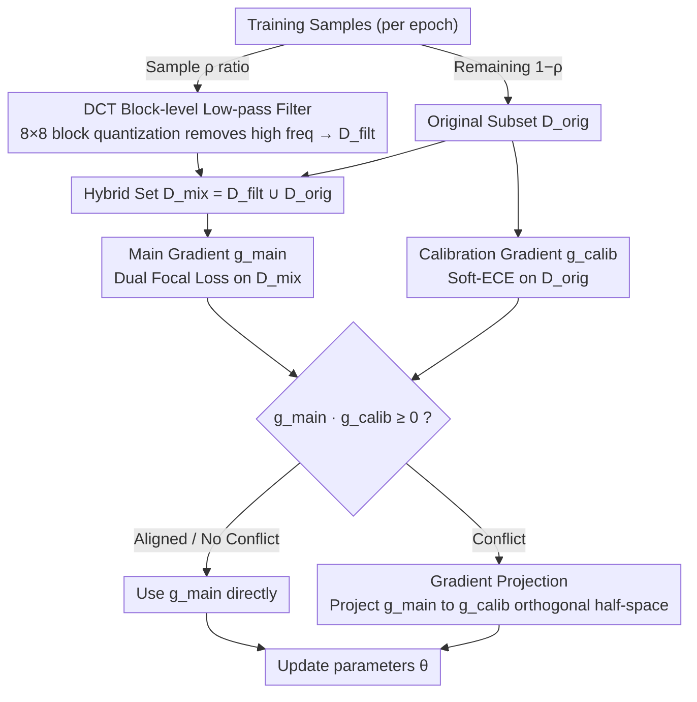

# Target-Agnostic Calibration under Distribution Shift with Frequency-Aware Gradient Rectification

**Conference**: ICML 2026  
**arXiv**: [2508.19830](https://arxiv.org/abs/2508.19830)  
**Code**: https://github.com/YilinZhang107/FGR-Calib (Available)  
**Area**: Interpretability / Confidence Calibration / Distribution Shift Robustness  
**Keywords**: Calibration, Distribution Shift, DCT Low-pass Filtering, Gradient Projection, Domain-Invariant Features

## TL;DR
FGR employs DCT low-pass filtering to eliminate high-frequency spurious shortcuts in training images to improve OOD calibration accuracy. It resolves the gradient conflict between "improving calibration" and "preserving ID performance" through geometric projection as a hard constraint, suppressing OOD ECE and maintaining ID performance without needing weight tuning.

## Background & Motivation

**Background**: Deep models require not only accurate predictions but also reliable confidence estimates—especially in high-risk scenarios like healthcare and autonomous driving, where a "misprediction with 0.9 confidence" is significantly more dangerous than one with 0.5. Calibration methods follow two main paths: post-hoc (Temperature Scaling, isotonic regression, etc.) which fits a confidence transformation on a fixed model; and training-time methods (Focal Loss / MMCE / Soft-ECE / Dual Focal Loss / Label Smoothing / Mixup, etc.) which add regularization to the loss to penalize overconfidence.

**Limitations of Prior Work**: The aforementioned methods perform well on ID (In-Distribution) data but collapse under distribution shifts (changes in weather, lighting, sensors, hospitals, or geographical domains). A typical ResNet drops from 76% to 18% on ImageNet-C while remaining overconfident. Existing "calibration under distribution shift" methods often rely on target domain information: they require multi-domain training data for input-dependent temperature regressors, synthetic validation sets to simulate the target domain, or additional assumptions like Bayesian density, which are rarely available during deployment.

**Key Challenge**: To maintain calibration on unknown OOD data, the model must rely solely on features that are stable across distributions. However, erasing unstable signals (such as high-frequency textures) inevitably damages the fine-grained decision boundaries on ID data, leading to under-confidence. This creates an irreconcilable objective conflict between "OOD calibration vs. ID calibration," which standard multi-task weighted sums cannot handle effectively as a hard constraint for ID preservation.

**Goal**: (1) Improve OOD calibration without accessing any target domain information; (2) Preserve ID calibration without introducing additional loss weight coefficients.

**Key Insight**: Distribution shifts mainly perturb high-frequency components, and models often use high-frequency statistics as classification shortcuts (Yin et al. 2019 / Fridovich-Keil et al. 2022). By actively masking a portion of high-frequency signals during training, the model is forced to capture domain-invariant features like "shape" or "semantics." The side effects of masking (ID under-confidence) are then addressed through a hard constraint mechanism at the optimizer level.

**Core Idea**: "Frequency domain filtering to build domain-invariant features + Gradient projection treating ID calibration as a hard constraint." The former provides robustness on the data side, while the latter serves as a safety net on the optimization side; they are decoupled but work in tandem.

## Method

FGR is a training-time framework consisting of "hybrid training set generation via low-pass filtering" and "gradient rectification." This process is appended to the standard classification training (inserted from epoch 200 in the authors' experiments).

### Overall Architecture
At the start of each epoch, a proportion $\rho$ of training samples is randomly selected for DCT low-pass filtering to form $\mathcal{D}_{\text{filt}}$, while the remaining $(1-\rho)$ is kept as $\mathcal{D}_{\text{orig}}$. The union forms the hybrid training set $\mathcal{D}_{\text{mix}}=\mathcal{D}_{\text{filt}}\cup\mathcal{D}_{\text{orig}}$. In each training step, two gradients are calculated: the main gradient $\mathbf{g}_{\text{main}}=\nabla_\theta\mathcal{L}_{\text{main}}(\theta;\mathcal{D}_{\text{mix}})$ using Dual Focal Loss on the hybrid set, and the calibration gradient $\mathbf{g}_{\text{calib}}=\nabla_\theta\mathcal{L}_{\text{calib}}(\theta;\mathcal{D}_{\text{orig}})$ using Soft-ECE only on the original data. If they conflict, the main gradient is projected onto the half-space orthogonal to $\mathbf{g}_{\text{calib}}$ before the update.

### Key Designs

**1. DCT Block-level Low-pass Filtering (Robust Feature Builder): Erasing high-frequency details to force the model to rely on shape and global structures without knowing the target domain.**

Distribution shifts primarily affect high-frequency components, which models often exploit as shortcuts. FGR actively masks these signals: images are converted to YCbCr, partitioned into $8\times 8$ non-overlapping blocks $\bm{x}_b$, and transformed via 2D-DCT into $\mathbf{F}_b$. These are quantized using a JPEG quantization table $\mathbf{Q}_\lambda$ with intensity parameter $\lambda$ as $\mathbf{F}_b^{(q)}=\text{round}(\mathbf{F}_b/\mathbf{Q}_\lambda)$, then reconstructed via inverse DCT into RGB. Smaller $\lambda$ values result in more aggressive filtering. DCT is chosen over Fourier because its energy compaction allows low-frequency coefficients to carry primary semantics while discarding high-frequency "spurious textures." Block-level processing avoids global ringing and is more robust to texture distortions. Only a portion of samples is filtered to exert domain-invariant pressure without completely destroying decision boundaries.

**2. Gradient Projection Mechanism (FGR Rectification): Converting OOD improvement and ID preservation from weighted losses into a "Main Objective + Hard Constraint" formulation.**

Erasing high frequencies causes ID under-confidence. FGR defines the feasible half-space as $\mathcal{C}_\text{ID}=\{\mathbf{g}\mid \mathbf{g}^\top\mathbf{g}_{\text{calib}}\ge 0\}$, representing all update directions that "do not degrade ID calibration." If $\mathbf{g}_{\text{main}}\cdot\mathbf{g}_{\text{calib}}\ge 0$, $\mathbf{g}_{\text{main}}$ is used. Otherwise, an Euclidean projection is performed: $\mathbf{g}_\text{final}=\mathbf{g}_{\text{main}}-\frac{\mathbf{g}_{\text{main}}\cdot\mathbf{g}_{\text{calib}}}{\|\mathbf{g}_{\text{calib}}\|^2+\epsilon}\mathbf{g}_{\text{calib}}$. Proposition 4.1 proves this is the Euclidean projection of $\mathbf{g}_{\text{main}}$ onto $\mathcal{C}_\text{ID}$, ensuring $\mathcal{L}_{\text{calib}}(\theta-\eta\mathbf{g}_\text{final})\le\mathcal{L}_{\text{calib}}(\theta)+\mathcal{O}(\eta^2)$ for small step sizes. Unlike symmetric multi-task methods (PCGrad/CAGrad), FGR is **asymmetric**—it only rectifies $\mathbf{g}_{\text{main}}$ and never alters $\mathbf{g}_{\text{calib}}$, treating ID calibration as a "red line."

**3. Loss Function Choice (Dual Focal Loss + Soft-ECE): Coupling robust prediction learning with ID calibration geometry.**

The main loss is Dual Focal Loss $\mathcal{L}_{\text{main}}=-\sum_k y_k(1-\hat{p}_k+\hat{p}_j)^\gamma\log\hat{p}_k$ (where $j$ is the top-scoring incorrect class), which penalizes both overconfidence and under-confidence. The constraint loss is Soft-ECE, a differentiable approximation of ECE using temperature-based soft binning: $\mathcal{L}_{\text{calib}}=(\sum_m\frac{|S_m|}{N}|\text{acc}(S_m)-\text{conf}(S_m)|^2)^{1/2}$. DFL learns robust distributions on the hybrid set, while Soft-ECE provides the geometric direction for ID calibration on original data. This combination is an instance of the projection framework and can theoretically be replaced by other losses.

### Loss & Training
ResNet-50/110, DenseNet-121, and Wide-ResNet-26 are trained for 350 epochs. For the first 200 epochs, standard training stabilizes the classification boundaries. From epoch 200 onwards, DCT filtering and gradient projection are introduced. WILDS datasets follow official protocols for fine-tuning ImageNet pre-trained models. Total training time increases by only 18% compared to standard training.

## Key Experimental Results

### Main Results
Key calibration metrics on synthetic shifts (CIFAR/Tiny-ImageNet-C, DenseNet-121, average of 15 corruptions × 5 severities) and real-world shifts (WILDS):

| Dataset | Method | Acc.↑ | ECE↓ | w/ TS ECE↓ | CECE↓ | ACE↓ |
|--------|------|-------|------|-----------|-------|------|
| CIFAR-10-C | DFL | 70.18 | 16.19 | 15.12 | 4.28 | 4.23 |
| CIFAR-10-C | MaxEnt | 71.98 | 11.62 | 13.63 | 3.62 | 3.62 |
| CIFAR-10-C | **FGR** | **75.12** | **9.02** | **9.90** | **3.12** | **3.09** |
| CIFAR-100-C | DFL | 50.17 | 9.99 | 8.82 | 0.51 | 0.49 |
| CIFAR-100-C | **FGR** | **52.66** | **8.53** | **7.57** | **0.47** | **0.46** |
| Camelyon17 | DFL | 88.03 | 2.74 | 2.12 | 9.957 | 9.956 |
| Camelyon17 | **FGR** | **89.19** | **2.36** | **1.82** | **5.714** | **5.691** |
| iWildCam | **FGR** | **76.11** | **3.34** | **2.97** | **0.155** | **0.152** |
| FMoW | **FGR** | **51.95** | **25.06** | **3.84** | **0.92** | **0.74** |

Semantic shift on Office-Home (Average leave-one-domain-out):

| Method | OOD Acc.↑ | OOD ECE↓ | OOD TS-ECE↓ | OOD CECE↓ | OOD ACE↓ |
|------|----------|---------|------------|----------|----------|
| CE | 34.20 | 36.45 | 15.11 | 1.429 | 1.238 |
| DFL | 34.17 | 22.91 | 14.51 | 1.061 | 0.975 |
| **FGR** | **34.03** | **20.41** | **13.93** | **1.018** | **0.971** |

### Ablation Study

| Configuration | Key Finding |
|------|---------|
| Full FGR | Achieves best ECE / CECE / ACE overall on OOD. |
| DCT filtering only | OOD improves, but ID under-confidence causes ECE rebound. |
| Gradient projection only | Lacks OOD robustness source, results close to DFL baseline. |
| FGR vs PCGrad (Symmetric) | FGR is superior—Hard constraint vs. Soft compromise. |
| FGR vs CAGrad (Symmetric) | Confirms "Asymmetric Projection" is critical. |
| Filtering intensity $\lambda$ scan | Lower $\lambda$ increases OOD robustness but hurts ID confidence (trade-off). |

### Key Findings
- **Filtering and projection are indispensable**: Using only filtering on Camelyon17 reduces ECE but damages ID calibration. Only using projection provides no OOD benefit. The combination reduces Camelyon17 CECE by 43% compared to DFL.
- **Symmetric multi-task methods fail**: PCGrad/CAGrad treat objectives as equally weighted compromises, leading to continual ID degradation. FGR's asymmetric projection locks the ID performance.
- **Compatible with post-hoc calibration**: FGR further reduces ECE in the "w/ TS" columns across all datasets, suggesting it learns robustness at the feature level.

## Highlights & Insights
- **"ID Calibration as Hard Constraint + Geometric Projection"** is the most transferable design. It is applicable to any training scenario involving "Main Objective vs. Red-line Constraints" (fairness, safety, sparsity) and is more suitable for non-negotiable side objectives than PCGrad/CAGrad.
- **Frequency-domain attribution of OOD robustness** provides a concrete interface for "domain-invariant features." Usually an abstract concept, FGR imposes it directly via DCT block-level low-pass filtering. 
- **Hybrid data strategy**: By filtering only a subset of samples, the model observes both "clean fine boundaries" and "robust coarse structures," which aligns better with the goal of improving OOD without sacrificing ID compared to simple data augmentation.

## Limitations & Future Work
- **Task Scope**: Experiments are limited to image classification with CNN/DenseNet. The interaction between ViT patches and DCT block sizes remains to be explored.
- **Assumption of High-frequency = Spurious**: In medical imaging or fine-grained recognition, high-frequency details may be task-relevant. While FGR performed well on Camelyon17, caution is needed for tasks highly dependent on high-frequency discriminators.
- **First-order Guarantee**: Proposition 4.1 provides only an $\mathcal{O}(\eta^2)$ guarantee, which doesn't rule out slow ID calibration drift over long training dynamics.
- **Potential Improvements**: Replacing DCT with a learnable frequency mask; extending hard constraints to multiple objectives (e.g., ID calibration + ID accuracy); combining with TTA (Test-Time Adaptation).

## Related Work & Insights
- **vs. Adaptive Temperature Scaling**: These require target domain data to train temperature regressors; FGR is target-agnostic and easier to deploy.
- **vs. Focal / MaxEnt / Dual Focal Loss**: These are regularization-only and lack explicit OOD robustness sources; FGR simulates distribution shifts during training via filtering.
- **vs. PCGrad / CAGrad**: Symmetric multi-task methods; FGR upgrades ID to a hard constraint via asymmetric projection, removing the need for loss weighting hyper-parameters.
- **vs. AugMix**: Strong on synthetic shifts but often fails on real shifts (WILDS); FGR is consistent across both, suggesting frequency-domain priors are more universal than pixel-level mixing.

## Rating
- Novelty: ⭐⭐⭐⭐ The combination of frequency filtering and hard-constraint projection is novel, particularly the conceptual upgrade of ID performance to a non-negotiable constraint.
- Experimental Thoroughness: ⭐⭐⭐⭐⭐ Comprehensive coverage across synthetic (CIFAR-C), real (WILDS), and semantic (Office-Home) shifts.
- Writing Quality: ⭐⭐⭐⭐ Clear formulas and geometric intuition; Proposition 4.1 clarifies the optimization semantics.
- Value: ⭐⭐⭐⭐ Addresses the deployment bottleneck of target-dependent OOD calibration. The 18% additional training time is a fair trade-off for significant OOD gains.

<!-- RELATED:START -->

<!-- RELATED:END -->

## Related Papers

- [\[CVPR 2025\] Sufficient Invariant Learning for Distribution Shift](../../CVPR2025/others/sufficient_invariant_learning_for_distribution_shift.md)
- [\[CVPR 2026\] FAST: Topology-Aware Frequency-Domain Distribution Matching for Coreset Selection](../../CVPR2026/others/fast_topology-aware_frequency-domain_distribution_matching_for_coreset_selection.md)
- [\[CVPR 2025\] Open Set Label Shift with Test Time Out-of-Distribution Reference](../../CVPR2025/others/open_set_label_shift_with_test_time_out-of-distribution_reference.md)
- [\[ECCV 2024\] Rebalancing Using Estimated Class Distribution for Imbalanced Semi-Supervised Learning under Class Distribution Mismatch](../../ECCV2024/others/rebalancing_using_estimated_class_distribution_for_imbalanced_semi-supervised_le.md)
- [\[ICML 2026\] Markov Chain Monte Carlo without Evaluating the Target: An Auxiliary Variable Approach](markov_chain_monte_carlo_without_evaluating_the_target_an_auxiliary_variable_app.md)

<!-- RELATED:END -->
