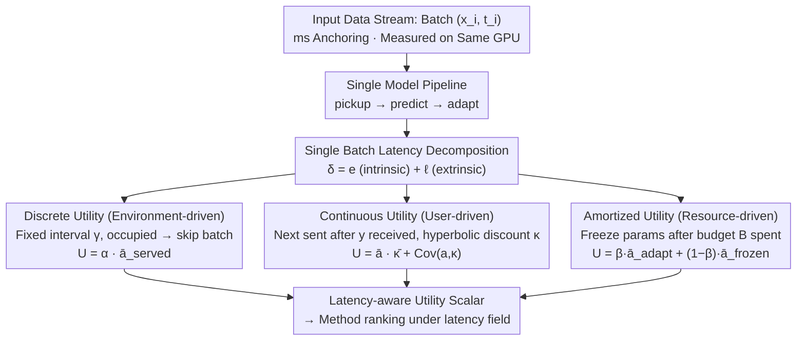

# TEMPORA: Characterising the Time-Contingent Utility of Online Test-Time Adaptation

**Conference**: ICML 2026  
**arXiv**: [2602.06136](https://arxiv.org/abs/2602.06136)  
**Code**: https://github.com/sudotensor/tempora (Available)  
**Area**: Self-Supervised Learning / Test-Time Adaptation / Evaluation Frameworks  
**Keywords**: TTA, Latency Constraints, Ranking Instability, Utility Decomposition, Edge Deployment

## TL;DR
TEMPORA reframes TTA evaluation from "offline accuracy with no latency upper bound" to "serviceable utility under latency constraints." By employing three types of time constraints (discrete, continuous, and amortized) and decomposable utility metrics, over 750 experiments on ImageNet-C × ResNet-50 demonstrate that offline SOTA methods lose their top ranking in 87.9% of latency-constrained scenarios, becoming increasingly impractical as they approach real-world deployment conditions.

## Background & Motivation

**Background**: Fully Test-Time Adaptation (Fully TTA) assumes that distribution shifts can only be corrected using pre-trained parameters $\theta$ and an incoming stream of unlabeled samples $x_i \sim \mathcal{T}$. The mainstream approach involves freezing the backbone and updating only the BN affine parameters (e.g., Tent, ETA, SAR, CMF, DeYO). Based on ImageNet-C offline average accuracy rankings, CMF is typically considered the SOTA.

**Limitations of Prior Work**: Offline evaluation treats TTA as a "static mapping $f_\theta: \mathcal{X} \to \mathcal{Y}$," implicitly assuming the next batch of data waits for the current batch's adaptation to complete. However, in real-world systems, a delayed prediction is a useless prediction—a mobile camera classification delayed by 200 ms results in the user moving on, an inspection drone delayed by 1 s crashes, and a surveillance video delayed by one frame loses that frame entirely. Empirical tests show that one common method (diffusion-based input adaptation) is $810\times$ slower than standard inference, a fact completely obscured by offline leaderboards.

**Key Challenge**: There exists a trade-off between the "accuracy gain from adaptation" and the "wall-clock time consumed by adaptation." Current evaluations only measure the former while treating the latter as a footnote. Alfarra et al. (2024) first attempted to model latency, but their speed unit was "relative to the model's inference FLOPs" rather than physical milliseconds, causing the meaning of the same threshold to drift across different hardware/models. Furthermore, their ceiling operator mapped any $\delta \in (k\gamma, (k+1)\gamma]$ to the same miss rate, flattening intra-method optimizations.

**Goal**: To transform TTA evaluation into a measurement of "how many usable predictions a method actually delivers under a given physical latency constraint (ms)," and to decompose this new dimension into diagnosable sub-components to answer "why the ranking changed" rather than just "if it changed."

**Key Insight**: The authors categorize deployment scenarios into three archetypal sources of time pressure: environment-driven (sensors pushing frames), user-driven (users waiting for responses), and resource-driven (battery or total compute budgets). These correspond to discrete, continuous, and amortized utility metrics, respectively. Each metric is designed as a parsable product or weighted sum, decoupling "accuracy" from the "time penalty."

**Core Idea**: By using "physical millisecond anchoring + three timing archetypes + decomposable utility," TTA is redefined from "running fast on an offline leaderboard" to "producing results within the latency your hardware supports and your customers tolerate."

## Method

TEMPORA is not a new TTA method but an evaluation framework consisting of three parts: (i) temporal scenario characterization of deployment constraints, (ii) an evaluation protocol for wall-clock simulation of constraints, and (iii) latency-aware utility metrics that couple accuracy and latency into a single scalar.

### Overall Architecture
The data stream is formalized as $\{(\mathbf{x}_i, t_i)\}_{i=1}^N$, where $t_i$ is the actual arrival time of the $i$-th batch. Each batch follows a "pickup $\to$ predict $\to$ subsequent adaptation" pipeline. The authors decompose the single-batch latency as $\delta_i = e_i + \ell_i$: $e_i$ is the intrinsic part (pickup to prediction), and $\ell_i$ is the extrinsic part (backpropagation updates performed after prediction that block the next batch). The framework runs three different "arrival-queueing-utility settlement" rules on this common timeline, requiring all latencies to be measured in milliseconds on the same GPU rather than using FLOPs as a proxy.

### Key Designs

**1. Discrete Utility (Environment-driven): Modeling fixed-rate sensor data streams where "batch skipping" emerges naturally from wall-clock simulation.**

In scenarios like cameras or LiDAR, data arrives at fixed intervals $\gamma$. Batches that cannot keep up with the pipeline are permanently discarded. TEMPORA uses recursion $s_{j+1} = \max(f_j, t_{p_{j+1}})$ and $f_{j+1} = s_{j+1} + \delta_{p_{j+1}}$ to simulate pipeline start and end times. The next batch pointer $p_{j+1} = \max(p_j+1, \lfloor f_j/\gamma \rfloor + 1)$ allows batch skipping to emerge naturally rather than being pre-discretized by a ceiling operator. Utility is $U_{\text{discrete}} = \alpha \cdot \bar{a}_{\text{served}}$, where $\alpha = |\mathcal{Q}|/N$ is availability and $\bar{a}_{\text{served}}$ is the average accuracy of served batches. This allows independent diagnosis of "system errors (skips)" vs. "model errors (misclassifications)." This design fixes three flaws in Alfarra et al.: it adds a batch-sized buffer to eliminate forced idling, uses real milliseconds to eliminate stepped penalties, and removes zero-cost fallback models to avoid masking performance loss. This explicitly exposes "computational bankruptcy," such as when ETA cannot match AdaBN even with a $1.5\times$ increase in served accuracy due to the availability ceiling.

**2. Continuous Utility (User-driven): Modeling interactive scenarios where "the next item is sent only after an answer is given," applying soft penalties for slow responses.**

In interactive systems, $x_{i+1}$ is sent only after the user receives $y_i$. Delayed predictions are not discarded but lose value. The user-perceived wait time is $w_i = \ell_{i-1} + e_i$, the effective response delay is $d_i = \max(0, w_i - \lambda)$, and a hyperbolic discount $\kappa_i = (1+d_i/(T-\lambda))^{-1}$ from HCI literature weights the accuracy by a factor in $[0, 1]$ ($T$ is the "half-life" threshold). Utility is $U_{\text{continuous}} = \bar{a} \cdot \bar{\kappa} + \mathrm{Cov}(a, \kappa)$, decomposed into "average accuracy $\times$ average responsiveness" plus an "alignment term." A negative alignment term indicates high accuracy occurs specifically on slow-response batches. Hyperbolic decay is chosen over linear/exponential because it better fits subjective time perception in psychological experiments (where 100 ms delay is felt more strongly than the same delay at 1 s) and remains monotonic, continuous, and bounded. Splitting $e_i$ and $\ell_i$ reveals that "gradient-based methods have extrinsic overheads as high as 56–154 ms, the root cause of their failure in user-driven scenarios."

**3. Amortized Utility (Resource-driven): Modeling resource-constrained devices where individual batch latency matters less than the total overhead budget.**

Scenarios like drone battery life or overnight inference prioritize total overhead $\sum c_i \le B$. TEMPORA defines a cut-off point $m = \max\{j: \sum_{i=1}^{j} c_i \le B\}$, where the first $m$ batches utilize adaptation and subsequent batches use frozen parameters $\theta_m$. Utility is $U_{\text{amortised}} = \beta \cdot \bar{a}_{\text{adapt}} + (1 - \beta) \cdot \bar{a}_{\text{frozen}}$, where $\beta = m/N$ is the adaptation ratio. This metric exposes "harmful adaptation"—where a model left after budget depletion performs worse than the unadapted baseline. Comparison is done via Pareto fronts across different budgets. This reveals that SHOT-IM (preserving source running statistics) maintains accuracy after freezing, whereas Tent, ETA, CMF, SAR, and DeYO all collapse to 0.1%.

### Loss & Training
TEMPORA does not train models but runs evaluations. The framework evaluates 9 Fully TTA methods (AdaBN, LAME, NEO, Tent, ETA, SHOT-IM, CMF, DeYO, SAR) plus a standard inference baseline on RTX 4080 across 15 ImageNet-C corruptions (severity 5). Each method uses default hyperparameters and a single seed (2025). The standard inference latency $\lambda = 39.9$ ms (calculated using a $6\sigma$ margin for five-nines availability).

## Key Experimental Results

### Main Results
Decomposed utility results across three metrics (Average of 15 corruptions, 11,715 batches):

| Method | Discrete $U(\rho{=}100\%)$ | Continuous $U(T{=}50\,\text{ms})$ | Amortized $U(B{=}1\,\text{s})$ | Offline Accuracy |
|------|-----------------------|--------------------------|--------------------------|---------|
| Standard | 18.2 | 18.16 | 18.16 | 18.2 |
| AdaBN | 30.8 | 28.42 | 31.72 | ≈26 |
| NEO | 22.1 | 22.14 | 22.14 | ≈22 |
| ETA | 18.7 | 7.22 | 0.87 | High (offline #3) |
| CMF | 11.5 | 3.84 | 0.48 | Offline SOTA (10/15) |
| SAR | 7.8 | 2.73 | 0.40 | ≈32 |
| SHOT-IM | 13.5 | 4.73 | **32.22** | 13.15-67.62 |

Latency decomposition per batch ($\lambda = 39.9$ ms):

| Method | $\bar{\delta}$ (ms) | $\bar{e}-\lambda$ (Intrinsic) | $\bar{\ell}$ (Extrinsic) | Slowdown |
|------|---------------------|------------------------|--------------------|------|
| AdaBN | 41.1 | 1.1 | 0.0 | 1.03× |
| Tent | 97.1 | 1.2 | 56.1 | 2.43× |
| ETA | 97.7 | 1.2 | 56.6 | 2.45× |
| SHOT-IM | 121.0 | 1.2 | 79.8 | 3.03× |
| CMF | 160.1 | 1.2 | 119.0 | 4.01× |
| SAR | 195.2 | 1.2 | 154.1 | 4.89× |

### Ablation Study

| Configuration | Key Finding | Description |
|------|---------|------|
| Offline vs. $\rho=100\%$ | CMF ranked 1st in 10/15 offline $\to$ Wins only 29/240 (12.1%) under latency | Direct evidence of ranking instability. |
| Different $T$ (50 $\to$ 1000 ms) | Spearman $r_s$ rises from -0.19 to 0.97 | Evaluation converges to offline as latency constraints relax. |
| ETA at $\rho=100\%$ | Served acc 45.6%, but $\alpha=0.41 \to$ 18.7% utility | Availability ceiling; requires 75.1% served acc to match AdaBN. |
| SAR at $\rho=100\%$ | Needs 149.5% accuracy to match AdaBN | Mathematically impossible; computational bankruptcy. |
| Amortized $B=1$ s | Gradient methods exhaust budget in ~20 batches, 97% frozen at 0.1% acc | "Harmful adaptation" failure mode. |
| SHOT-IM Anomaly | Maintains 32.2% after freeze due to source running stats | Robustness invisible in offline evaluations. |

### Key Findings
- **"Extrinsic overhead" is the killer**: The intrinsic overhead of all methods is only 0–1.2 ms, but the backpropagation overhead (56–154 ms) is entirely loaded into $\ell_i$, dragging availability and responsiveness to the floor in user/environment-driven scenarios.
- **Offline SOTA is the biggest loser under latency**: CMF lost 211 out of 240 latency-contingent evaluations (87.9%), averaging 15% lower utility than the winners. ETA, while not an offline champion, won 42.9% of latency-contingent tests, primarily in mid-pressure ranges ($35\% \le \rho \le 70\%$, $T \ge 100$ ms).
- **Three failure modes have geometric interpretations**: In discrete utility, $\alpha$ acts as an additive ceiling; in continuous utility, $\bar{\kappa}$ acts as a multiplicative discount; in amortized utility, parameter drift leads to cumulative negative contributions. All stem from overhead not being compensated by equivalent accuracy gains.

## Highlights & Insights
- **Physical millisecond anchoring** ensures a specific value (e.g., 50 ms threshold) maintains semantic consistency across hardware and models. This allows cross-paper and cross-hardware latency comparisons—a substantial advancement over Alfarra's "relative FLOPs" unit.
- **Utility decomposition** ($U_{\text{discrete}} = \alpha \cdot \bar{a}_{\text{served}}$, etc.) makes "why a method lost" explicit. The authors derive three necessary conditions for "deployable adaptation" (corruption-conditioned compute, time-aware scaling, anytime performance) which serve as design specifications for future work.
- **Batch-sized buffer + wall-clock simulation** treats missed batches as an output rather than an input. This "simulation over analytical scoring" approach is applicable to streaming continual learning, online RL, and other accuracy-latency trade-off scenarios.

## Limitations & Future Work
- **Scope Limitation**: Main experiments are limited to ImageNet-C × ResNet-50 (though appendix includes ViT-B/16, ImageNet-R/V2, and Pi 5 CPU). Other modalities (segmentation, translation, audio) require case-by-case recalibration of $\lambda, T, B$.
- **Method Coverage**: Extremely slow (DDA/MEMO) or wrapper methods were excluded. The conclusion that certain methods are "stronger" under latency applies primarily to mid-overhead fully TTA methods.
- **Single Seed + Default Hyperparameters**: While hyperparameter sweeps might flip some rankings, methods near computational bankruptcy cannot be saved by tuning alone. This claim is strong and requires further evidence.
- **Future Directions**: Combining the three utility types into hybrid metrics (e.g., battery-powered drone detection subject to arrival rate, response time, and total energy); integrating TEMPORA with BoTTA/UniTTA to simulate non-i.i.d. real-world streams.

## Related Work & Insights
- **vs. Alfarra et al. (ICML 2024)**: They first introduced latency as a dimension but used FLOPs, ceiling discretization, and fallback models, preventing cross-hardware reuse. TEMPORA fixes these and expands the single discrete scenario into three prototypes.
- **vs. BoTTA / UniTTA / TTAB (2023-2025)**: These works improve "distributional realism" (non-i.i.d., Markov switches). TEMPORA addresses "temporal realism"; both are orthogonal and can be combined.
- **vs. Ghunaim et al. (2023, Online CL)**: Observed that sample starvation changes rankings, but measured in FLOPs. TEMPORA generalizes this to TTA using physical, decomposable metrics.

## Rating
- Novelty: ⭐⭐⭐⭐ Not a new method, but the "physical ms + 3 archetypes + decomposable utility" evaluation design is a necessary engineering paradigm shift for the field.
- Experimental Thoroughness: ⭐⭐⭐⭐⭐ 9 methods × 15 corruptions × 16 timing scenarios = 750+ evaluations, plus cross-hardware validation.
- Writing Quality: ⭐⭐⭐⭐⭐ Formalization of the archetypes and failure mode diagnosis is exceptionally clear; the analytical conditions for beating the baseline are highly practical.
- Value: ⭐⭐⭐⭐⭐ Directly challenges the "offline accuracy is king" community bias and provides clear objectives for future TTA design.

<!-- RELATED:START -->

## Related Papers

- [\[ICML 2026\] Private and Stable Test-Time Adaptation with Differential Privacy](private_and_stable_test-time_adaptation_with_differential_privacy.md)
- [\[CVPR 2026\] Neural Collapse in Test-Time Adaptation](../../CVPR2026/others/neural_collapse_in_test-time_adaptation.md)
- [\[ICLR 2026\] Prior-Free Tabular Test-Time Adaptation](../../ICLR2026/others/prior-free_tabular_test-time_adaptation.md)
- [\[ICML 2026\] Test-Time Training with KV Binding Is Secretly Linear Attention](test-time_training_with_kv_binding_is_secretly_linear_attention.md)
- [\[ICLR 2026\] PriorGuide: Test-Time Prior Adaptation for Simulation-Based Inference](../../ICLR2026/others/priorguide_test-time_prior_adaptation_for_simulation-based_inference.md)

<!-- RELATED:END -->
