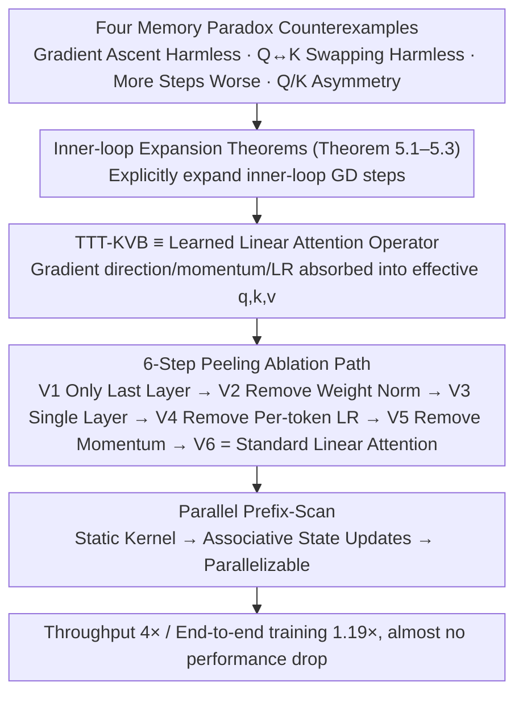

# Test-Time Training with KV Binding Is Secretly Linear Attention

**Conference**: ICML 2026  
**arXiv**: [2602.21204](https://arxiv.org/abs/2602.21204)  
**Code**: https://research.nvidia.com/labs/sil/projects/tttla/ (Available)  
**Area**: Sequence Modeling / Transformer Alternatives / Linear Attention  
**Keywords**: Test-Time Training, TTT-KVB, Linear Attention, Parallelization, Architectural Simplification

## TL;DR
This paper uses four "memory paradox" counterexamples and a set of rigorous expansion theorems to prove that TTT with KV-binding inner loops (such as LaCT, ViTTT) remains a "learned linear attention operator" even with multi-layer MLPs and momentum. Based on this, the authors simplify and parallelize it into standard linear attention, achieving a 4× throughput Gain with almost no performance degradation.

## Background & Motivation
**Background**: TTT-KVB (Test-Time Training with KV-binding inner loops) is treated as an alternative sequence modeling layer to softmax attention. The mainstream interpretation is "online meta-learning / test-time memorization"—where key-value relationships are stored in the weights $f_\theta$ of an MLP, which is then retrieved by a query. Recent works like LaCT, Titans, and ViTTT have introduced complex designs such as multi-layer MLPs, Muon-style gradient orthogonalization, momentum, weight normalization, and per-token learnable learning rates to improve "memory fidelity."

**Limitations of Prior Work**: The authors found that the "test-time memorization" interpretation systematically contradicts empirical phenomena:
- **Optimization-Performance Inversion**: Increasing inner-loop GD steps reduces inner loss (better memorization), but downstream task performance worsens (Fig. 1);
- **Gradient Ascent still works**: Changing the inner loop to gradient ascent (intentionally destroying memory) results in almost no performance loss or even slight improvements after retraining (Table 1);
- **Q-K Distribution Asymmetry**: t-SNE shows that Q and K are significantly separated in representation space, directly conflicting with the assumption of "using Q to retrieve $f_\theta$ trained on K";
- **Q→K Replacement is Harmless**: Replacing queries directly with keys to calculate TTT output results in nearly identical PPL / PSNR / accuracy.

Any one of these four phenomena is sufficient to doubt the memorization interpretation; together, they constitute a complete reductio ad absurdum.

**Key Challenge**: The existing theoretical framework (test-time memorization) fails to match empirical findings (gradient direction irrelevance, Q-K role-swapping harmlessness, and the inverse relationship between memory quality and performance). Continuing to add complex modules based on the memorization narrative is merely "ineffectual refinement."

**Goal**: (i) Find a unified theoretical framework for TTT-KVB that explains all counterexamples; (ii) Determine which complex designs are redundant; (iii) Unlock the sequence structure from recurrent to parallel for engineering acceleration.

**Key Insight**: Explicitly expand the inner-loop GD steps. While Sun 2025 proved that TTT equals linear attention for "single-layer + zero-initialization + linear inner loop," this study generalizes the conclusion to "multi-layer MLP + momentum + non-zero initialization."

**Core Idea**: The inner loop of TTT-KVB is not meta-learning a retrieval table, but rather mapping the original $(q,k,v)$ through $\phi$ into a "learned structured $(q,k,v)$." The entire mechanism is equivalent to a linear attention operator.

## Method

### Overall Architecture
The paper follows three steps: (1) Empirically presents four counterexamples conflicting with the memorization interpretation (Section 4); (2) Uses three theorems to rigorously formalize TTT-KVB as a form of linear attention (Section 5); (3) Proposes an ablation path (Variants 1-6) to progressively strip LaCT/ViTTT down to standard linear attention based on this theory, finally replacing the recurrent implementation with a parallel prefix-scan (Section 6). The logic forms a causal chain of "Paradox Demystification → Expansion Theorems → Stepwise Stripping → Parallel Acceleration."

### Key Designs

**1. Inner-loop Expansion Theorems: Deconstructing the "Test-time Memorization" narrative to reveal the underlying linear attention operator**

The four counterexamples occur because the "memory" interpretation is fundamentally flawed. Theorem 5.1 shows that for an inner loop $f(x)=\phi(x;\Theta)W$ with a bias-free linear last layer, a single GD step yields $o=\phi_{t+1}(q)(W_t+\phi_t(k)^\top g_t(k))$, where $g_t(k)=-\eta\,\partial\mathcal{L}/\partial f_t(k)$—exactly the form of linear attention $o=\hat q(S_0+\hat k^\top\hat v)$ with $\hat q=\phi_{t+1}(q)$, $\hat k=\phi_t(k)$, and $\hat v=g_t(k)$. Theorem 5.3 further proves that GD with momentum results in an effective value $v^\text{eff}_i=g_i(k_i)\cdot\sum_{j=i}^t\beta_i^j$, maintaining the linear attention structure. This perspective explains all paradoxes: the gradient direction is absorbed into the effective value, Q and K need not be symmetrically semantic, and inner-loop steps correspond to different effective operators rather than "stronger memory."

**2. 6-Step Ablation Path: Pricing every popular design by stripping TTT down to linear attention**

To make the abstract equivalence claim tangible, the authors provide a 6-step ablation path to reduce LaCT and ViTTT to standard linear attention. Each step is supported by theorems: Step 1 updates only the last layer (making $\phi$ static); Step 2 removes weight normalization (making state updates parallelizable); Step 3 simplifies the MLP to a single linear layer; Step 4 removes per-token learnable learning rates (absorbed by effective values); Step 5 removes momentum; and Step 6 removes gradient orthogonalization $\mathcal{M}(\cdot)$, resulting in $o=q(W+\sum_i k_i^\top v_i)$. This confirms that weight normalization, per-token lr, momentum, and multi-layer MLPs contribute very little to performance.

**3. Parallel Prefix-Scan Form: Transitioning to parallelization once recognized as linear code, resulting in 4× throughput**

Previous TTT implementations were sequential by default because they assumed weights were being "updated over time." However, when weight normalization is removed and only the last layer is updated, the kernel function $\phi_t\equiv\phi(\cdot;\Theta)$ becomes history-independent, making state updates associative. This allows replacing token-by-token accumulation with a parallel prefix scan. Appendix H and I provide the equivalence proofs and show that weight normalization or dynamic kernels would break this associativity.

### Loss & Training
The paper maintains existing loss functions but changes architectural understanding. Ablations are evaluated on LaCT-LLM, LaCT-NVS, and ViTTT. The parallel implementation achieves a 1.19× end-to-end training speedup on LaCT-LLM.

## Key Experimental Results

### Main Results: 6-Step Ablation Path

| Configuration | LaCT-LLM PPL ↓ | LaCT-NVS PSNR ↑ | ViTTT Top-1 ↑ | Throughput (recurrent) | Throughput (parallel) |
|------|---------------|-----------------|----------------|-------------------|-----------------|
| Baseline (full TTT) | 16.43 | 25.94 | 79.34% | 4.30M tok/s | — |
| V1 Only Last Layer Update | **15.93** | **25.97** | 79.63% | 10.60M | — |
| V2 Remove Weight Norm | 16.31 | 25.93 | 79.63% | 11.02M | 30.18M |
| V3 MLP → Single Layer | 16.23 | 25.71 | 79.39% | 12.95M | 49.69M |
| V4 Remove per-token LR | 16.12 | 25.70 | 79.39% | 13.31M | 53.99M |
| V5 Remove Momentum | 15.97 | 25.70 | 79.39% | 14.40M | 57.28M |
| V6 Remove Orthograd (= Std Linear Attn) | 16.80 | 25.73 | **79.54%** | **89.67M** | **124.6M** |

Variant 1 (only last layer update) is actually the best performing. Variant 6 (pure linear attention) slightly increases PPL (+0.37) compared to the baseline but yields 21× recurrent and 29× parallel throughput.

### Paradox Ablation (Table 1)

| Setting | LaCT-LLM PPL ↓ | LaCT-NVS PSNR ↑ | ViTTT Top-1 ↑ |
|------|---------------|-----------------|----------------|
| Baseline | 16.43 | 25.94 | 79.34% |
| Inner-loop GD → Gradient Ascent (retrain) | **16.19** | 25.85 | **79.61%** |
| Replace Q with K for TTT Output | **16.18** | 25.95 | 79.18% |

Performance remains largely unchanged, invalidating the memorization interpretation.

### Key Findings
- **"Only updating the last layer" is optimal**: Consistent with the "freeze backbone, tune head" intuition. Updating internal $\phi$ parameters makes the effective kernel history-dependent and harder to train.
- **Redundancy of complex components**: Weight norm, per-token LR, momentum, and multi-layer MLPs are theoretically absorbed into effective $q,k,v$ and provide little empirical benefit.
- **Orthogonalization matters for LLMs**: This is the only "TTT-specific design" that remains significant for LLMs, though its impact is limited.
- **Parallel implementation facilitates a 1.19× training speedup** with no PPL loss, proving that the recurrence of TTT is a misconception.

## Highlights & Insights
- **Paradox-driven demystification narrative**: The use of four simple counterexamples that conflict with existing theory is a powerful "break and rebuild" paradigm.
- **Mathematizing intuition**: Theorems 5.1-5.3 provide mechanically verifiable expansions, allowing the conclusions to generalize to other methods like Titans.
- **Engineering clarity**: The causal chain from theory → ablation → engineering acceleration provides a template for theory-guided engineering.
- **Role Reversal**: The fact that Q-K distributions are asymmetric and Q→K replacement is harmless suggests that $q$ and $k$ in TTT are no longer semantic queries/keys but raw materials for effective projections.

## Limitations & Future Work
- The theory assumes the inner loop's last layer is a bias-free linear layer; it does not directly apply to non-linear output layers (e.g., with softmax/norm).
- Empirical verification focused on LaCT and ViTTT; Titans and Atlas satisfy the theoretical assumptions but were not experimentally tested.
- The deeper mechanism of why gradient orthogonalization helps in LLMs remains unexplored and may relate to implicit regularization of gradient noise.
- The discovery that "only updating the last layer" is optimal directly challenges the trend of increasing inner-loop complexity.

## Related Work & Insights
- **vs Sun 2025**: Extends the proof of linear attention equivalence from simple linear inner loops to multi-layer MLPs with momentum.
- **vs Linear Attention / DeltaNet / Mamba**: Integrates TTT-KVB into the linear attention family, showing that their "learning capacity" is not significantly greater than standard LA.
- **vs LaCT / ViTTT / Titans**: Provides a "peeling tool" to evaluate whether new TTT variants offer substantive novelty or are just rebranded linear attention.
- **vs Linear Transformers Are Secretly Fast Weight Programmers**: This paper continues the tradition of revealing the hidden nature of complex architectures.
- **Insight**: For "test-time optimization" or "meta-learning" layers, expansion and equivalence analysis should precede any increase in complexity to avoid the trap of improving optimization metrics without downstream gain.

## Rating
- Novelty: ⭐⭐⭐⭐⭐ Demystifies the TTT-KVB research line with theory, evidence, and engineering.
- Experimental Thoroughness: ⭐⭐⭐⭐ Covers LLM, NVS, and classification with solid ablations.
- Writing Quality: ⭐⭐⭐⭐⭐ Excellent narrative structure with strong statistical backing.
- Value: ⭐⭐⭐⭐⭐ Directly impacts methodological choices for the TTT research community and provides practical parallel implementations.

<!-- RELATED:START -->

## Related Papers

- [\[CVPR 2026\] ViT3: Unlocking Test-Time Training in Vision](../../CVPR2026/others/vit3_unlocking_test_time_training_in_vision.md)
- [\[ICML 2026\] TEMPORA: Characterising the Time-Contingent Utility of Online Test-Time Adaptation](tempora_characterising_the_time-contingent_utility_of_online_test-time_adaptatio.md)
- [\[ICML 2026\] Private and Stable Test-Time Adaptation with Differential Privacy](private_and_stable_test-time_adaptation_with_differential_privacy.md)
- [\[CVPR 2026\] Neural Collapse in Test-Time Adaptation](../../CVPR2026/others/neural_collapse_in_test-time_adaptation.md)
- [\[NeurIPS 2025\] Alias-Free ViT: Fractional Shift Invariance via Linear Attention](../../NeurIPS2025/others/alias-free_vit_fractional_shift_invariance_via_linear_attention.md)

<!-- RELATED:END -->
