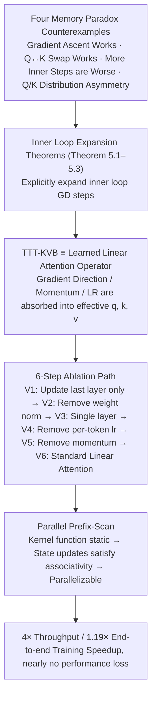

# Test-Time Training with KV Binding Is Secretly Linear Attention

**Conference**: ICML 2026  
**arXiv**: [2602.21204](https://arxiv.org/abs/2602.21204)  
**Code**: https://research.nvidia.com/labs/sil/projects/tttla/ (Available)  
**Area**: Sequence Modeling / Transformer Alternatives / Linear Attention  
**Keywords**: Test-Time Training, TTT-KVB, Linear Attention, Parallelization, Architecture Simplification

## TL;DR
This paper employs four "memory paradox" counterexamples and a set of rigorous expansion theorems to prove that TTT with KV-binding inner loops (such as LaCT and ViTTT) remains a "learned linear attention operator" even when utilizing multi-layer MLPs and momentum. Based on this, the authors simplify and parallelize it into standard linear attention, achieving a $4\times$ throughput increase with almost no performance degradation.

## Background & Motivation
**Background**: TTT-KVB (Test-Time Training with KV-binding inner loops) is considered an alternative sequence modeling layer to softmax attention. The mainstream interpretation is "online meta-learning / test-time memorization"—storing key-value relationships into the fast weights $f_\theta$ of an MLP and retrieving them via queries. Recent works like LaCT, Titans, and ViTTT have introduced complex designs under this interpretation, such as multi-layer MLPs, Muon-style gradient orthogonalization, momentum, weight normalization, and per-token learnable learning rates, all aimed at improving "memory fidelity."

**Limitations of Prior Work**: The authors observe systematic contradictions between the "test-time memory" interpretation and empirical phenomena:
- **Optimization-Performance Inversion**: Increasing inner-loop GD steps reduces inner loss (improving memory accuracy), yet downstream task performance degrades (Fig. 1);
- **Gradient Ascent Works**: Changing the inner loop to gradient ascent (intentionally destroying memory) results in almost no performance loss or even slight improvements after retraining (Table 1);
- **Q-K Distribution Asymmetry**: t-SNE shows significant separation of Q and K in representation space, directly conflicting with the assumption of "using Q to retrieve $f_\theta$ trained on K";
- **Q→K Substitution Invariance**: Directly replacing queries with keys to calculate TTT output yields nearly identical PPL / PSNR / accuracy.

Any one of these four phenomena is sufficient to doubt the memory interpretation; together, they constitute a fundamental refutation.

**Key Challenge**: The existing theoretical framework (test-time memorization) does not align with empirical observations (gradient direction irrelevance, Q-K role swap invariance, and the inverse relationship between memory quality and performance). Continuing to add complex modules based on the memory narrative is merely "ineffective refinement."

**Goal**: (i) Establish a unified theoretical framework for TTT-KVB that explains all counterexamples; (ii) Determine which complex designs are redundant; (iii) Unlock the sequence structure from recurrent to parallel for engineering acceleration.

**Key Insight**: Explicitly expand the inner-loop GD steps. While Sun 2025 proved that TTT equals linear attention for "single-layer + zero-initialization + linear inner loops," this work generalizes the conclusion to the case of "multi-layer MLPs + momentum + non-zero initialization."

**Core Idea**: The inner loop of TTT-KVB does not function as a meta-learning retrieval table; instead, it maps the original $(q,k,v)$ through $\phi$ into a "learned structured $(q,k,v)$," making the entire mechanism equivalent to a linear attention operator.

## Method

### Overall Architecture
The paper proceeds in three steps: (1) Empirically presents four counterexamples conflicting with the memory interpretation (Section 4); (2) Rigorously formalizes TTT-KVB as a form of linear attention via three theorems (Section 5); (3) Proposes an ablation path (Variants 1-6) to strip LaCT/ViTTT down to standard linear attention based on this theory, ultimately replacing the recurrent implementation with a parallel prefix-scan (Section 6). The logic follows a causal chain of "Demystification via counterexamples → Expansion theorems → Step-wise stripping → Parallel acceleration."

### Key Designs

**1. Inner Loop Expansion Theorems: Deconstructing the "Test-Time Memory" Narrative**

The four counterexamples occur because the "memory" interpretation fails to match reality. A formal representation independent of the memory hypothesis is required. The authors explicitly expand the GD steps in the inner loop. Assuming the last layer of the inner loop $f(x)=\phi(x;\Theta)W$ is linear without bias, Theorem 5.1 gives the output after a single GD step: $o=\phi_{t+1}(q)(W_t+\phi_t(k)^\top g_t(k))$, where $g_t(k)=-\eta\,\partial\mathcal{L}/\partial f_t(k)$. This is exactly the form of linear attention $o=\hat q(S_0+\hat k^\top\hat v)$, corresponding to $\hat q=\phi_{t+1}(q)$, $\hat k=\phi_t(k)$, $\hat v=g_t(k)$, and $S_0=W_t$. Theorem 5.2 expands this along the sequence, and Theorem 5.3 incorporates momentum into an effective value $v^\text{eff}_i$, maintaining the linear attention structure. This perspective explains all counterexamples: gradient direction is absorbed into effective values, Q and K do not require semantic symmetry, and inner loop steps correspond to different effective operators rather than "better memory."

**2. 6-Step Ablation Path: Pricing Every Popular Design**

Directly claiming "TTT is equivalent to linear attention" is abstract. The paper provides a 6-step ablation path to reduce LaCT and ViTTT to standard linear attention. Each step is supported by theorems or derivations justifying the removal: Step 1 updates only the last layer (making $\phi$ static); Step 2 removes weight normalization (enabling parallel state updates); Step 3 collapses multi-layer MLPs to a single linear layer; Step 4 removes per-token learnable LR (absorbed by effective values); Step 5 removes momentum; and Step 6 removes gradient orthogonalization $\mathcal{M}(\cdot)$, resulting in $o=q(W+\sum_i k_i^\top v_i)$. Consequently, each removed module is linked to specific performance and speed metrics, transforming the equivalence claim into an actionable engineering decision.

**3. Parallel Prefix-Scan Form: Logical Acceleration**

Previous TTT implementations were sequential by default because they treated the inner loop as "updating parameters over time." Once recognized as linear attention, this assumption fails: when weight normalization is removed and only the last layer is updated, the kernel function $\phi_t\equiv\phi(\cdot;\Theta)$ becomes independent of history, making state updates associative. Thus, parallel prefix scan can replace token-by-token accumulation. The paper provides formal equivalence proofs and shows that adding back weight normalization or dynamic kernels destroys associativity—confirming that TTT's recurrent nature is a byproduct of the parameter-update interpretation.

### Loss & Training
The paper does not modify the loss function, only the architectural understanding. Ablations are evaluated on LaCT-LLM, LaCT-NVS, and ViTTT tasks. The parallel implementation achieves a $1.19\times$ end-to-end training speedup on LaCT-LLM.

## Key Experimental Results

### Main Results: 6-Step Ablation Path

| Configuration | LaCT-LLM PPL ↓ | LaCT-NVS PSNR ↑ | ViTTT Top-1 ↑ | Throughput (Recurrent) | Throughput (Parallel) |
| :--- | :--- | :--- | :--- | :--- | :--- |
| Baseline (full TTT) | 16.43 | 25.94 | 79.34% | 4.30M tok/s | — |
| V1 (Only update last layer) | **15.93** | **25.97** | 79.63% | 10.60M | — |
| V2 (Remove weight norm) | 16.31 | 25.93 | 79.63% | 11.02M | 30.18M |
| V3 (MLP → Single layer) | 16.23 | 25.71 | 79.39% | 12.95M | 49.69M |
| V4 (Remove per-token lr) | 16.12 | 25.70 | 79.39% | 13.31M | 53.99M |
| V5 (Remove momentum) | 15.97 | 25.70 | 79.39% | 14.40M | 57.28M |
| V6 (Std. Linear Attention) | 16.80 | 25.73 | **79.54%** | **89.67M** | **124.6M** |

Variant 1 (updating only the last layer) is actually optimal. Variant 6 (pure linear attention) slightly increases PPL (+0.37) but gains $21\times$ recurrent and $29\times$ parallel throughput compared to the baseline.

### Ablation Study (Table 1)

| Setting | LaCT-LLM PPL ↓ | LaCT-NVS PSNR ↑ | ViTTT Top-1 ↑ |
| :--- | :--- | :--- | :--- |
| Baseline | 16.43 | 25.94 | 79.34% |
| Inner loop GD → Ascent (retrain) | **16.19** | 25.85 | **79.61%** |
| Replace Q with K for output | **16.18** | 25.95 | 79.18% |

Performance remains largely unchanged, invalidating the memory interpretation.

### Key Findings
- **"Updating only the last layer" is superior**: Aligns with the intuition of "freezing the backbone and tuning the head" in LoRA; updating internal $\phi$ parameters makes the effective kernel history-dependent and harder to train.
- **Weight norm / per-token LR / momentum / MLP are mostly useless**: Theoretically absorbed into effective $q,k,v$; empirically, they mostly add overhead.
- **Gradient orthogonalization is useful for LLMs but not for NVS/Images**: The only "TTT-unique design" that retains significance, though its impact is minor.
- **Parallel implementation accelerates end-to-end training by $1.19\times$** while maintaining PPL, proving that TTT's recurrent bottleneck is unnecessary.

## Highlights & Insights
- **"Paradox-driven demystification" narrative**: The four counterexamples are simple and cleanly conflict with existing theory, effectively setting up the structural reconstruction.
- **Mathematizing intuition**: Theorem 5.1-5.3 provide mechanically verifiable expansions, allowing the conclusions to generalize to methods like Titans that were not experimentally tested.
- **Clean causal chain**: Theory → Ablation → Engineering Acceleration → End-to-end speed. This is a standard template for theory-guided engineering.
- **Q-K distribution asymmetry + Q→K substitution invariance**: A surprising phenomenon suggesting $q,k$ in TTT are not semantic key/query roles but input material for effective queries/keys.

## Limitations & Future Work
- The theory assumes the last layer of the inner loop is linear without bias; it does not directly apply to non-linear output layers (e.g., those with softmax/normalization).
- Empirical results are primarily on LaCT and ViTTT; Titans and Atlas satisfy the theoretical assumptions but were not experimentally validated.
- The deeper mechanism of "why gradient orthogonalization helps in LLMs" is not discussed; it likely involves implicit regularization of gradient noise/rank.
- The discovery that "updating only the last layer" is optimal contradicts the current trend toward increasingly complex inner loops.

## Related Work & Insights
- **vs. Sun 2025**: Generalizes the "single-layer linear inner loop = linear attention" proof to multi-layer MLPs and momentum with empirical consequences.
- **vs. Linear Attention / DeltaNet / Mamba**: Integrates TTT-KVB into the linear attention family, showing that their "learning capability" is not significantly greater than standard LA.
- **vs. LaCT / ViTTT / Titans**: Provides a unified tool to evaluate whether any new TTT variant is "truly new" or just "repackaged linear attention."
- **Insight**: For "test-time optimization" or "meta-learning" layers, expansion and equivalence analysis should precede adding complexity to avoid the trap of "improving inner metrics without downstream gains."

## Rating
- Novelty: ⭐⭐⭐⭐⭐ Demystifies an entire research line with a unified theory.
- Experimental Thoroughness: ⭐⭐⭐⭐ Covers LLM, NVS, and classification with solid ablations.
- Writing Quality: ⭐⭐⭐⭐⭐ Strong narrative backed by theorems and empirical data.
- Value: ⭐⭐⭐⭐⭐ Directly impacts methodological choices for future sequence models.

<!-- RELATED:START -->

## Related Papers

- [\[CVPR 2026\] ViT3: Unlocking Test-Time Training in Vision](../../CVPR2026/others/vit3_unlocking_test_time_training_in_vision.md)
- [\[ICML 2026\] TEMPORA: Characterising the Time-Contingent Utility of Online Test-Time Adaptation](tempora_characterising_the_time-contingent_utility_of_online_test-time_adaptatio.md)
- [\[ICML 2026\] Private and Stable Test-Time Adaptation with Differential Privacy](private_and_stable_test-time_adaptation_with_differential_privacy.md)
- [\[ICML 2026\] Functional Equivalence in Attention: A Comprehensive Study with Applications to Linear Mode Connectivity](functional_equivalence_in_attention_a_comprehensive_study_with_applications_to_l.md)
- [\[CVPR 2026\] Neural Collapse in Test-Time Adaptation](../../CVPR2026/others/neural_collapse_in_test-time_adaptation.md)

<!-- RELATED:END -->
