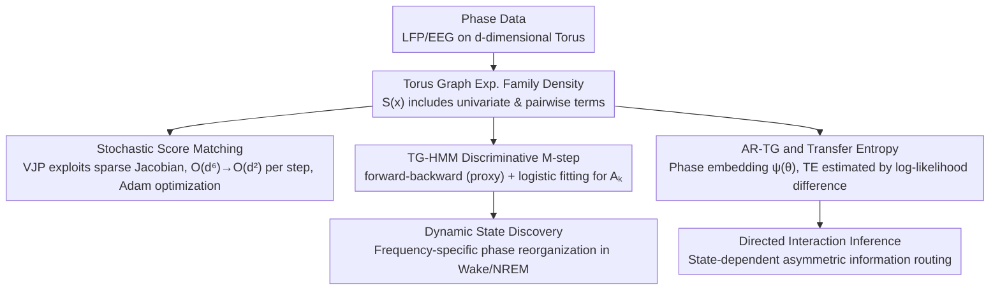

# Torus Graphs for Large-Scale Neural Phase Analysis

**Conference**: ICML 2026  
**arXiv**: [2606.00496](https://arxiv.org/abs/2606.00496)  
**Code**: https://github.com/jackgoffinet/torus-graphs  
**Area**: Neuroscience / Probabilistic Graphical Models / Directional Statistics  
**Keywords**: torus graph, score matching, phase coupling, hidden Markov model, transfer entropy

## TL;DR
The authors define the Torus Graph (TG) as an exponential family phase graph model on the $d$-torus $\mathbb{T}^d$. By leveraging stochastic score matching, the inference complexity per step is reduced from $\mathcal{O}(d^6)$ to $\mathcal{O}(d^2)$, enabling support for thousands of phase variables for the first time. Based on this, two dynamic/directed extensions, TG-HMM and autoregressive TG (AR-TG), are developed and applied to mouse LFP data, revealing frequency-specific phase reorganization between Wake and NREM states.

## Background & Motivation

**Background**: EEG/LFP recordings are typically described as a superposition of multiple oscillatory components, each characterized by a continuously advancing phase. Phase relationships are considered core computational variables for communication between brain regions. However, mainstream neural phase analysis remains limited to pairwise metrics like the Phase Locking Value (PLV): $PLV_{X,Y}=|\mathbb{E}\,e^{i(X-Y)}|$. The Torus Graph, proposed by Klein et al. (2020), is an exponential family model for circular variables. Its univariate and pairwise potential functions generalize the von Mises distribution, allowing for direct conditional independence inference to distinguish "direct coupling" from "spurious coupling caused by intermediaries."

**Limitations of Prior Work**: The normalization constant of the TG is analytically intractable, necessitating the use of score matching for inference. Prior closed-form solutions required solving a $2d^2 \times 2d^2$ linear system and storing $\Gamma \in \mathbb{R}^{2d^2 \times 2d^2}$, leading to $\mathcal{O}(d^6)$ time complexity and $\mathcal{O}(d^4)$ memory complexity. In practice, this crashes at $d \approx 100$ on a single 24GB GPU. Modern LFP/EEG experiments, however, involve $d = O(10^3)$ phase variables (dozens of channels × dozens of frequency bins).

**Key Challenge**: Pairwise metrics (PLV, coherence) are computationally efficient but fail to distinguish "direct vs. indirect" relations; TG handles this distinction but is computationally prohibitive. Researchers facing high-dimensional phase data are forced to revert to pairwise analysis, losing conditional independence information. Models like Kuramoto or Granger primarily model amplitude or linear Gaussian structures, making them unsuitable for the circular geometry of pure phase variables.

**Goal**: (i) Reduce TG inference complexity per step to $\mathcal{O}(d^2)$; (ii) develop a dynamic version capable of capturing temporal state switching; (iii) provide an autoregressive version for inferring directionality, accompanied by transfer entropy estimation for phase variables.

**Key Insight**: Each term in the sufficient statistics $S(\mathbf{x})$ of the TG depends on at most two phase variables. Thus, although the Jacobian $\nabla_{\mathbf{x}}S(\mathbf{x})$ is formally $\mathcal{O}(d^3)$, it is sparse with only $\Theta(d^2)$ non-zero elements. This implies that $\bm{\phi}^\top\nabla_{\mathbf{x}}S(\mathbf{x})$ can be computed directly in $\mathcal{O}(d^2)$ time using the vector-Jacobian product (VJP) in reverse-mode automatic differentiation, without ever explicitly constructing the Jacobian.

**Core Idea**: Rewrite the TG score matching objective into a stochastic optimization form that relies solely on VJP. This allows unbiased inference on thousands of phase variables using Adam. By layering HMM and autoregressive structures on top, the authors present the first family of phase graph models scalable to thousands of dimensions.

## Method

### Overall Architecture
The method consists of three layers: (1) Static TG using stochastic score matching; (2) dynamic extension TG-HMM using EM with a discriminative M-step to bypass the log-partition function; (3) directed extension AR-TG, which embeds historical phases into TG parameters via $\psi(\theta)=[\cos\theta;\sin\theta]^\top$, and estimates transfer entropy (TE) by comparing predictions from two AR-TG models.

The TG density is defined as $p(\mathbf{x};\bm{\phi})\propto\exp(\bm{\phi}^\top S(\mathbf{x}))$, where $S(\mathbf{x})$ includes univariate terms $\cos x_j, \sin x_j$ and pairwise phase difference/sum terms $\cos(x_j\pm x_k), \sin(x_j\pm x_k)$, with parameter dimension $2d^2$. The implementation uses JAX and runs end-to-end on a single A5000 24GB GPU.

### Key Designs

**1. Stochastic Score Matching: Reducing Inference from $\mathcal{O}(d^6)$ to $\mathcal{O}(d^2)$ via VJP**

The bottleneck for scaling TG is the closed-form solution of score matching, which involves solving a $2d^2 \times 2d^2$ linear system and storing $\Gamma \in \mathbb{R}^{2d^2 \times 2d^2}$, leading to $\mathcal{O}(d^6)$ time and $\mathcal{O}(d^4)$ memory risks (OOM at $d \approx 100$). The key observation is that while $\Gamma = \nabla_{\mathbf{x}}S(\nabla_{\mathbf{x}}S)^\top$ appears as a large matrix, each TG sufficient statistic depends on at most two variables, making the Jacobian sparse with only $\Theta(d^2)$ entries. By rewriting the quadratic form as a norm $\|\bm{\phi}^\top\nabla_{\mathbf{x}}S(\mathbf{x})\|_2^2$, it can be computed in $\mathcal{O}(d^2)$ using a single VJP of the scalar $\bm{\phi}^\top S(\mathbf{x})$. The objective becomes:

$$J(\bm{\phi})=\mathbb{E}_{\mathbf{x}}\Big[\tfrac{1}{2}\|\bm{\phi}^\top\nabla_{\mathbf{x}}S(\mathbf{x})\|_2^2-\bm{\phi}^\top\mathbf{h}(\mathbf{x})\Big]$$

This allows for unbiased minibatch estimation and Adam updates, compatible with $L_2$ and group-$\ell_1$ regularization for inducing sparse graph structures. This VJP approach directly targets the sparsity of the TG's physical structure, eliminating the methodological bottleneck.

**2. TG-HMM Discriminative M-step: Degrading the Intractable Partition Function to Softmax Fitting**

To allow TG to switch dynamically between latent states $z_t \in \{1, \dots, K\}$, the log-normalization constant $A(\bm{\phi}_k)$ in the emission model $p(x_t|z_t=k) = \exp(\bm{\phi}_k^\top S(x_t) - A(\bm{\phi}_k))$ is intractable, hindering standard EM. This work avoids calculating $A(\bm{\phi}_k)$ by introducing free parameters $A_k \in \mathbb{R}$ with lightweight ridge regularization to construct a proxy joint model. The E-step runs standard forward-backward on the proxy model to obtain soft responsibilities $\gamma_{t,k}$. The M-step then treats $A_k$ as a trainable class intercept. The objective $Q'(A)$ is equivalent to multinomial logistic regression with $\gamma_{t,k}$ as soft labels, $S(x_t)$ as features, and fixed weights $\{\bm{\phi}_k\}$—a convex optimization problem. The authors prove that under certain assumptions, $\nabla A(\bm{\phi}_k) \approx \hat{\mu}_k(\gamma)$, satisfying the stationary conditions of an exact M-step.

**3. AR-TG and Transfer Entropy: Circular Granger Causality via Phase Embedding**

Inferring directionality in phase variables is difficult; naive Granger causality with linear Gaussian assumptions violates phase periodicity. This work extends the TG into an autoregressive form $p(y_t|\mathbf{x}_{<t},y_{<t}) \propto \exp[\bm{\phi}(\mathbf{x}_{<t},y_{<t})^\top S(y_t)]$, parameterized as:

$$\bm{\phi}(\mathbf{x}_{<t},y_{<t})=\mathbf{b}+\sum_{\ell=1}^L\big(\mathbf{W}^{(y)}_\ell\psi(y_{t-\ell})+\mathbf{W}^{(x)}_\ell\psi(\mathbf{x}_{t-\ell})\big)$$

The embedding $\psi(\theta)=[\cos \theta; \sin \theta]^\top$ maps phase to $\mathbb{R}^2$, preserving periodicity while keeping parameter counts at $\mathcal{O}(L)$. Transfer entropy $TE_{X \to Y}$ is estimated by fitting two AR-TG models—one using only history $y$ ($\hat{p}_1$) and one including $\mathbf{x}$ ($\hat{p}_2$)—and calculating the log-likelihood difference on an independent test set. In multivariate scenarios, Gaussian imputation and Monte Carlo methods are used to keep training costs to a constant number of models.

### Loss & Training
All components are implemented in JAX. TG and conditional TG use stochastic score matching with Adam. TG-HMM utilizes alternating "forward-backward (proxy) + discriminative M-step (logistic)". AR-TG utilizes score matching for parameter estimation, with TE calculated as log-likelihood differences on test data.

## Key Experimental Results

### Main Results
Parameter recovery of stochastic score matching is validated on 4-dimensional and 64-dimensional synthetic TG data. Large-scale visualization and state discovery are performed on mouse LFP data with $d=1860$.

| Dimension $d$ | Inference Method | Complexity / Step | Max Capacity | Parameter Recovery $R^2$ |
| :--- | :--- | :--- | :--- | :--- |
| 4 | Exact score matching | $\mathcal{O}(d^6)$ | OK | Comparable to stochastic |
| 64 | Exact | $\mathcal{O}(d^6)$ | OK (Slower) | Comparable to stochastic |
| $\sim$100 | Exact | $\mathcal{O}(d^6)$ | OOM (24GB GPU) | — |
| $\sim$1000+ | **Ours (Stochastic)** | **$\mathcal{O}(d^2)$** | **OK** | Matches exact at low dim |
| 1860 | **Ours (Stochastic)** | **$\mathcal{O}(d^2)$** | Real LFP data | Reveals Wake/NREM reorganization |

### Ablation Study
| Configuration | Key Observation |
| :--- | :--- |
| Full TG-HMM | Stably extracts 6 states across 1334 spindles, with one state time-locked to the spindle center. |
| TG-HMM (Exact) | Accurate for $d \lesssim 100$, but OOM for $d > 100$. |
| AR-TG vs. Multivariate Granger | Granger times out after 30h at $d=64$; AR-TG remains accurate and finishes in <1h. |
| AR-TG (Score Matching) vs. AR-TG (MLE) | Score matching is more stable for bidirectional TE estimation. |

### Key Findings
- Reducing inference from $\mathcal{O}(d^6)$ to $\mathcal{O}(d^2)$ is a transition in scale: on identical hardware, the number of handleable variables jumps from $\sim$100 to $\sim$1860, with an order of magnitude speedup.
- Application to 48-hour mouse LFP (1860 dimensions) shows high-frequency (>30 Hz) coupling in Wake and low-frequency (<30 Hz) coupling in NREM, consistent with sleep physiology.
- TG parameters are significantly sparser than empirical PLV, suggesting many pairwise synchronies are spurious edges mediated by third parties, which PLV cannot identify.
- TG-HMM identifies a "spatially sparse spindle state" on sleep spindles, contrasting with the "diffuse synchrony enhancement" shown by PLV.
- AR-TG reveals asymmetric directional interactions (e.g., prelimbic $\to$ striatum) in Wake/NREM that are invisible to PLV/coherence.

## Highlights & Insights
- **Sparsity + VJP as a Recipe for Scaling PGMs**: The TG $\Gamma$ matrix has $\mathcal{O}(d^4)$ elements, but the physical reality is that each statistic only "sees" two variables. VJP targets this sparsity directly. This pattern—writing out a closed form, observing its sparsity, and applying VJP—is transferable to other exponential family PGMs.
- **Discriminative M-step replaces NCE/MCMC**: Fitting the log-partition constants $A_k$ via logistic regression turns an intractable integral into a learnable hyperparameter, a useful trick for any latent state model with intractable partition functions.
- **Geometric Intuition for Phase Variables**: The $\psi(\theta)=[\cos\theta;\sin\theta]$ embedding allows for periodic preservation and analytical von Mises conditionals, explaining why the TG family can simultaneously support sparse inference, dynamic switching, and directed interaction.

## Limitations & Future Work
- TE estimation in AR-TG requires a scalar $y_t$ target due to dependency on the univariate von Mises partition function; multivariate targets are not yet supported.
- The discriminative M-step in TG-HMM is "approximately consistent"; rigorous statistical properties (convergence rates) require further study.
- Phase variables are treated as homogeneous nodes; cross-frequency and within-frequency couplings can be difficult for neuroscientists to interpret directly from raw parameters.
- AR-TG directionality remains "predictive" rather than "interventional" causality.

## Related Work & Insights
- **vs. PLV / Coherence**: Pairwise and unable to remove indirect edges; this work provides a scalable conditional independence alternative.
- **vs. Original TG (Klein et al., 2020)**: They used closed-form score matching ($d^6$) capped at 100 dimensions; this work scales to 1860 dimensions and adds dynamic/directed extensions.
- **vs. Kuramoto Model**: Dynamical models describe large-scale coordination but are not probabilistic and unsuitable for conditional independence inference.
- **vs. Multivariate Granger Causality**: Granger uses linear Gaussian assumptions that break phase periodicity and times out for $d > 64$.

## Rating
- Novelty: ⭐⭐⭐⭐
- Experimental Thoroughness: ⭐⭐⭐⭐
- Writing Quality: ⭐⭐⭐⭐
- Value: ⭐⭐⭐⭐

<!-- RELATED:START -->

## Related Papers

- [\[ICML 2026\] AMDP: Asynchronous Multi-Directional Pipeline Parallelism for Large-Scale Models Training](amdp_asynchronous_multi-directional_pipeline_parallelism_for_large-scale_models_.md)
- [\[CVPR 2026\] MSPT: Efficient Large-Scale Physical Modeling via Parallelized Multi-Scale Attention](../../CVPR2026/others/mspt_efficient_large-scale_physical_modeling_via_parallelized_multi-scale_attent.md)
- [\[CVPR 2026\] Large-scale Robust Enhanced Ensemble Clustering via Outlier Decoupling](../../CVPR2026/others/large-scale_robust_enhanced_ensemble_clustering_via_outlier_decoupling.md)
- [\[CVPR 2026\] Efficient Unrolled Networks for Large-Scale 3D Inverse Problems](../../CVPR2026/others/efficient_unrolled_networks_for_large-scale_3d_inverse_problems.md)
- [\[ACL 2025\] Code-Switching and Syntax: A Large-Scale Experiment](../../ACL2025/others/code-switching_and_syntax_a_large-scale_experiment.md)

<!-- RELATED:END -->
