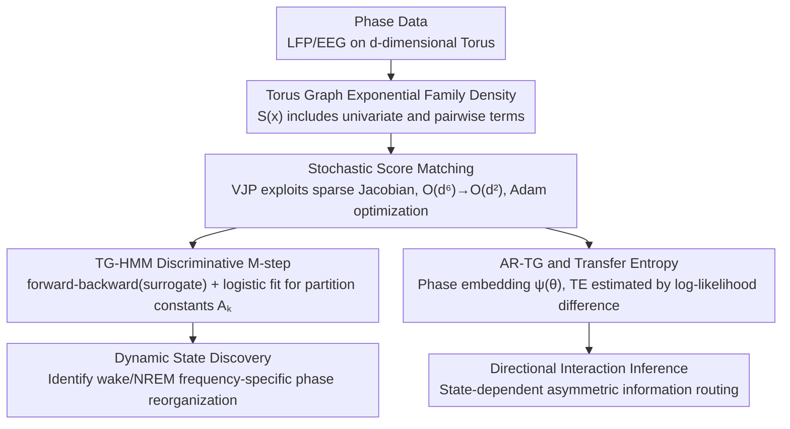

# Torus Graphs for Large-Scale Neural Phase Analysis

**Conference**: ICML 2026  
**arXiv**: [2606.00496](https://arxiv.org/abs/2606.00496)  
**Code**: https://github.com/jackgoffinet/torus-graphs  
**Area**: Neuroscience / Probabilistic Graphical Models / Directional Statistics  
**Keywords**: torus graph, score matching, phase coupling, hidden Markov model, transfer entropy

## TL;DR
The authors introduce the Torus Graph (TG)—an exponential family phase graph model defined on the $d$-torus $\mathbb{T}^d$. By leveraging stochastic score matching, they reduce the per-step inference complexity from $\mathcal{O}(d^6)$ to $\mathcal{O}(d^2)$, enabling support for thousands of phase variables for the first time. They further develop TG-HMM and autoregressive TG (AR-TG) extensions, which revealed frequency-specific phase reorganization between wakefulness and NREM sleep in mouse LFP data.

## Background & Motivation

**Background**: EEG/LFP recordings are typically described as the superposition of multiple oscillatory components, each with an advancing phase. Phase relationships are considered core computational variables for communication between brain regions. However, mainstream phase analysis still relies on pairwise metrics like Phase Locking Value (PLV): $PLV_{X,Y}=|\mathbb{E}\,e^{i(X-Y)}|$. The Torus Graph, proposed by Klein et al. (2020), is an exponential family model for circular variables where univariate and pairwise potentials generalize the von Mises distribution. It allows for conditional independence inference, distinguishing "direct coupling" from "spurious coupling" caused by mediators.

**Limitations of Prior Work**: The normalization constant of TG is analytically intractable, necessitating the use of score matching for inference. The closed-form solution requires solving a $2d^2 \times 2d^2$ linear system and storing $\Gamma \in \mathbb{R}^{2d^2 \times 2d^2}$, resulting in $\mathcal{O}(d^6)$ time and $\mathcal{O}(d^4)$ memory complexity. In practice, this fails at $d \approx 100$ on a 24GB GPU. Modern LFP/EEG experiments, however, involve $d = O(10^3)$ phase variables (dozens of channels $\times$ dozens of frequency bins).

**Key Challenge**: Pairwise metrics (PLV, coherence) are computationally efficient but fail to distinguish "direct vs. indirect" interactions. TG can distinguish them but is computationally prohibitive. Researchers facing high-dimensional phase data are forced to regress to pairwise analysis, losing conditional independence information. Furthermore, models like Kuramoto or Granger typically model amplitude or linear Gaussian structures, which are unsuitable for the circular geometry of pure phase variables.

**Goal**: (i) Reduce the per-step complexity of TG inference to $\mathcal{O}(d^2)$; (ii) Develop a dynamic version capable of capturing temporal state transitions; (iii) Provide an autoregressive version for inferring directionality, accompanied by transfer entropy estimation for phase variables.

**Key Insight**: Each term in the sufficient statistics $S(\mathbf{x})$ of the TG depends on at most two phase variables. Thus, while the Jacobian $\nabla_{\mathbf{x}}S(\mathbf{x})$ is technically $\mathcal{O}(d^3)$ in size, it is sparse with only $\Theta(d^2)$ non-zero elements. This implies that the vector-Jacobian product $\bm{\phi}^\top\nabla_{\mathbf{x}}S(\mathbf{x})$ can be computed directly in $\mathcal{O}(d^2)$ time using reverse-mode automatic differentiation without explicitly constructing the Jacobian.

**Core Idea**: The TG score matching objective is rewritten into a stochastic optimization form that depends only on VJP, which is then solved using Adam to achieve unbiased inference for thousands of phase variables. By superimposing HMM and autoregressive structures, the authors establish the first family of phase graph models scalable to thousand-dimensional spaces.

## Method

### Overall Architecture
The method is structured in three layers: (1) Static TG using stochastic score matching; (2) Dynamic extension (TG-HMM) using EM with a discriminative M-step to bypass the log-partition function; (3) Directional extension (AR-TG) which embeds historical phases into TG parameters via $\psi(\theta)=[\cos \theta; \sin \theta]^\top$ and estimates transfer entropy (TE) by comparing predictions from two AR-TG models.

The TG density is defined as $p(\mathbf{x};\bm{\phi})\propto\exp(\bm{\phi}^\top S(\mathbf{x}))$, where $S(\mathbf{x})$ includes univariate terms $\cos x_j, \sin x_j$ and pairwise phase difference/sum terms $\cos(x_j\pm x_k), \sin(x_j \pm x_k)$, with parameter dimension $2d^2$. The implementation uses JAX and runs end-to-end on a single A5000 24GB GPU.

### Key Designs

**1. Stochastic Score Matching: Reducing Complexity from $\mathcal{O}(d^6)$ to $\mathcal{O}(d^2)$ via VJP**

The bottleneck for TG at scale is the requirements of the closed-form score matching solution: solving a $2d^2 \times 2d^2$ linear system and storing $\Gamma \in \mathbb{R}^{2d^2 \times 2d^2}$, which leads to $\mathcal{O}(d^6)$ time and $\mathcal{O}(d^4)$ memory. The authors observe that while $\Gamma = \nabla_{\mathbf{x}} S (\nabla_{\mathbf{x}} S)^\top$ appears as a massive matrix, each sufficient statistic in TG depends on at most two variables, making the Jacobian sparse with $\Theta(d^2)$ non-zero entries. By rewriting the quadratic form in the objective as a norm $\|\bm{\phi}^\top\nabla_{\mathbf{x}}S(\mathbf{x})\|_2^2$, it can be computed via a single reverse-mode automatic differentiation (vector-Jacobian product) on the scalar $\bm{\phi}^\top S(\mathbf{x})$ in $\mathcal{O}(d^2)$ time. The objective becomes:

$$J(\bm{\phi})=\mathbb{E}_{\mathbf{x}}\Big[\tfrac{1}{2}\|\bm{\phi}^\top\nabla_{\mathbf{x}}S(\mathbf{x})\|_2^2-\bm{\phi}^\top\mathbf{h}(\mathbf{x})\Big]$$

This allows for unbiased minibatch estimation and Adam updates, compatible with $L_2$ and group-$\ell_1$ regularization. This VJP approach bypasses the explicit Jacobian construction, removing the primary methodological bottleneck of TG.

**2. Discriminative M-step for TG-HMM: Reducing Intractable Partition Constants to Softmax Fitting**

To allow TG to switch dynamically between hidden states $z_t \in \{1, \dots, K\}$, the log-normalization constant $A(\bm{\phi}_k)$ in the emission model $p(x_t|z_t=k)$ must be handled. Since $A(\bm{\phi}_k)$ is intractable, standard EM fails. The authors instead introduce $A_k \in \mathbb{R}$ as free parameters with light ridge regularization, constructing a surrogate joint model $\log\tilde{p}(z,x)=\sum_t\log\Pi_{z_{t-1},z_t}+\sum_t[\bm{\phi}_{z_t}^\top S(x_t)-A_{z_t}]$. The E-step runs standard forward-backward on this surrogate to obtain soft responsibilities $\gamma_{t,k}$. The M-step then treats $A_k$ as trainable intercepts, where the objective $Q'(A)$ is equivalent to a multinomial logistic regression with $\gamma_{t,k}$ as soft labels and $S(x_t)$ as features—a convex optimization. This discriminative perspective integrates seamlessly into the forward-backward framework.

**3. AR-TG and Transfer Entropy Estimation: Circular Granger Causality via Phase Embedding**

Directorial inference for phase variables is challenging; naive Granger based on linear Gaussian assumptions violates phase periodicity. This work extends TG into an autoregressive form $p(y_t|\mathbf{x}_{<t},y_{<t})\propto\exp[\bm{\phi}(\mathbf{x}_{<t},y_{<t})^\top S(y_t)]$, parameterized as:

$$\bm{\phi}(\mathbf{x}_{<t},y_{<t})=\mathbf{b}+\sum_{\ell=1}^L\big(\mathbf{W}^{(y)}_\ell\psi(y_{t-\ell})+\mathbf{W}^{(x)}_\ell\psi(\mathbf{x}_{t-\ell})\big)$$

The embedding $\psi(\theta)=[\cos \theta; \sin \theta]^\top$ maps phase to $\mathbb{R}^2$, preserving periodicity while keeping parameter counts $\mathcal{O}(L)$. Transfer entropy $TE_{X \to Y}$ is estimated by fitting two AR-TG models—one using only historical $y$ ($\hat{p}_1$) and one using both $y$ and $\mathbf{x}$ ($\hat{p}_2$)—and calculating the log-likelihood difference on a test set.

### Loss & Training
The entire framework is implemented in JAX. TG and conditional TG use stochastic score matching with Adam. TG-HMM alternates between surrogate forward-backward E-steps and discriminative M-steps (logistic regression). AR-TG parameters are estimated via score matching, and TE is evaluated as the log-likelihood difference on held-out data.

## Key Experimental Results

### Main Results
Parameter recovery via stochastic score matching was validated on 4D and 64D synthetic TG data, followed by large-scale visualization and state discovery on mouse LFP data with $d=1860$.

| Dimension $d$ | Inference Method | Complexity / Step | Max Capacity | Parameter Recovery $R^2$ |
|---------|---------|----------------|-----------|---------------|
| 4 | Exact score matching | $\mathcal{O}(d^6)$ | OK | Equal to stochastic |
| 64 | Exact | $\mathcal{O}(d^6)$ | OK, but slow | Equal to stochastic |
| $\sim$100 | Exact | $\mathcal{O}(d^6)$ | OOM (24GB GPU) | — |
| $\sim$1000+ | **Stochastic (Ours)** | **$\mathcal{O}(d^2)$** | **OK** | Equal to exact (low dim) |
| 1860 | Stochastic (Ours) | $\mathcal{O}(d^2)$ | Real LFP Data | Reveals Wake/NREM reorganization |

### Ablation Study

| Configuration | Key Observation | Description |
|------|---------|------|
| Full TG-HMM | Stable extraction of 6 states from 1334 spindles | Discriminative M-step does not disrupt state recovery |
| TG-HMM (exact) | Accurate for $d \lesssim 100$, OOM for $>100$ | Not scalable, but consistent with Ours in low dim |
| AR-TG vs. Multivariate Granger | Granger timed out (>30h) at $d=64$; AR-TG remained accurate (<1h) | Significant advantage in causal discovery |
| AR-TG (SM) vs. AR-TG (MLE) | Score matching is more stable for bi-directional TE | Stability difference due to partition function handling |

### Key Findings
- Reducing inference bottleneck from $\mathcal{O}(d^6)$ to $\mathcal{O}(d^2)$ is a magnitude leap: on the same hardware, the number of processed variables jumped from $\sim$100 to $\sim$1860 with faster runtimes.
- Application to 48-hour mouse LFP (1860 dims) confirmed stronger high-frequency (>30 Hz) coupling during wakefulness and stronger low-frequency (<30 Hz) coupling during NREM, consistent with sleep physiology.
- TG parameters are significantly sparser than empirical PLV, indicating that many pairwise synchronies are spurious edges mediated by third parties.
- AR-TG transfer entropy revealed asymmetric directional interactions (e.g., prelimbic $\to$ striatum) across Wake/NREM states that are invisible to PLV/coherence.

## Highlights & Insights
- **Sparse Structure + VJP as a Recipe for Large-Scale PGM**: While $\Gamma$ contains $\mathcal{O}(d^4)$ elements, the physical structure of TG only requires statistics involving pairs. VJP directly exploits this sparsity. This pattern of "analyzing closed-form sparsity and applying VJP" is transferable to other exponential family PGMs.
- **Discriminative M-step replacing NCE/MCMC**: Fitting the log-partition constant $A_k$ via logistic regression converts an intractable constant into a learnable hyperparameter, a technique applicable to various latent state models with intractable densities.
- **Geometry of Phase Variables**: The 2D embedding $\psi(\theta)$ ensures periodicity while enabling analytical von Mises conditionals, explaining why the TG family can simultaneously support sparse inference, dynamic switching, and directional interactions.

## Limitations & Future Work
- Transfer entropy estimation in AR-TG currently requires the target $y_t$ to be univariate due to the reliance on the analytical partition function of the von Mises distribution.
- The discriminative M-step in TG-HMM is "approximately consistent"; rigorous statistical properties (convergence rates, behavior under model misspecification) require further investigation.
- TG parameters can be difficult for neuroscientists to interpret when cross-frequency and within-frequency couplings are modeled as homogeneous nodes.
- Like all Granger-style methods, AR-TG directionality is predictive rather than interventional causality.

## Related Work & Insights
- **vs. PLV / Coherence**: These pairwise methods cannot eliminate indirect edges and are unsuited for conditional independence analysis at scale. This work provides an $\mathcal{O}(d^2)$ alternative.
- **vs. Klein et al. (2020) Original TG**: The original used closed-form score matching, limited to $\sim$100 dimensions. This work scales it to 1860 dimensions and adds dynamic/directional extensions.
- **vs. Kuramoto Models**: Dynamical models describe large-scale coordination but lack probabilistic inference frameworks for conditional independence.
- **Inspiration**: Beyond neuroscience, this combination of "Exponential Family + VJP Score Matching + Discriminative M-step" can be applied to other circular variable tasks such as protein backbone torsion angles and wind direction time series.

## Rating
- Novelty: ⭐⭐⭐⭐
- Experimental Thoroughness: ⭐⭐⭐⭐
- Writing Quality: ⭐⭐⭐⭐
- Value: ⭐⭐⭐⭐

<!-- RELATED:START -->

## Related Papers

- [\[ICML 2026\] AMDP: Asynchronous Multi-Directional Pipeline Parallelism for Large-Scale Models Training](amdp_asynchronous_multi-directional_pipeline_parallelism_for_large-scale_models_.md)
- [\[CVPR 2026\] MSPT: Efficient Large-Scale Physical Modeling via Parallelized Multi-Scale Attention](../../CVPR2026/others/mspt_efficient_large-scale_physical_modeling_via_parallelized_multi-scale_attent.md)
- [\[CVPR 2026\] Large-scale Robust Enhanced Ensemble Clustering via Outlier Decoupling](../../CVPR2026/others/large-scale_robust_enhanced_ensemble_clustering_via_outlier_decoupling.md)
- [\[ICLR 2026\] SmellNet: A Large-scale Dataset for Real-world Smell Recognition](../../ICLR2026/others/smellnet_a_large-scale_dataset_for_real-world_smell_recognition.md)
- [\[ACL 2025\] Code-Switching and Syntax: A Large-Scale Experiment](../../ACL2025/others/code-switching_and_syntax_a_large-scale_experiment.md)

<!-- RELATED:END -->
