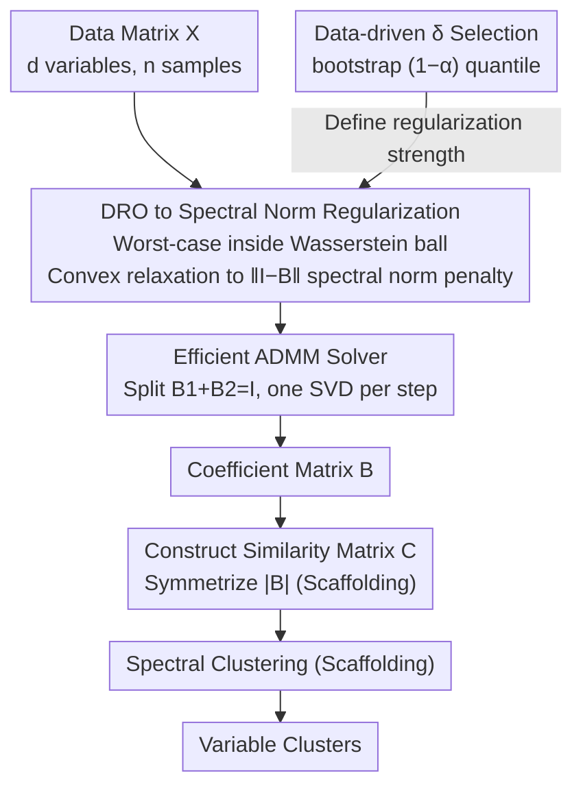

# Variable Clustering via Distributionally Robust Nodewise Regression

**Conference**: ICML 2026  
**arXiv**: [2212.07944](https://arxiv.org/abs/2212.07944)  
**Code**: https://github.com/xuxiao2695/dro-subspace-clustering  
**Area**: Optimization / Variable Clustering  
**Keywords**: Variable Clustering, Subspace Clustering, Nodewise Regression, Distributionally Robust Optimization, Uncertainty Quantification

## TL;DR
The study utilizes a Distributionally Robust Optimization (DRO) framework to transform the parameter tuning problem of nodewise regression into a convex optimization problem with spectral norm regularization—achieving a parameter-free clustering method that significantly outperforms Lasso sparse clustering on simulated, facial, and financial data.

## Background & Motivation

**Background**: Nodewise regression is a classic tool for subspace clustering. It generates a similarity matrix by regressing each variable against all others, then recovers variable clusters via spectral clustering. Existing methods primarily employ $L_1$ regularized Sparse Subspace Clustering (SSC) or nuclear norm regularized Low-Rank Representation (LRR).

**Limitations of Prior Work**: SSC methods suffer from three main issues: (1) the parameter $\lambda_i$ depends on unknown power noise variance and is difficult to tune; (2) the pursuit of coefficient sparsity is unnatural, as the ground truth correlation matrix is often dense when subspaces are non-orthogonal or variables within a cluster are strongly correlated; (3) recovery of strongly correlated variables is difficult.

**Key Challenge**: Existing regularization strategies either over-sparsify (destroying true correlations) or rely on prior parameters (high tuning cost), making it difficult to balance data-driven execution, interpretability, and computational efficiency.

**Goal**: Reformulate the nodewise regression problem from a DRO perspective to naturally derive a spectral norm regularization term, while providing a data-driven parameter selection method.

**Core Idea**: The nodewise regression problem is placed within a DRO framework that maximizes over an uncertainty set $\mathcal{U}_\delta(\mathbb{P}_n)$, where the uncertainty radius $\delta$ is defined by the Wasserstein distance. After convex relaxation, this is equivalent to regularizing the spectral norm of $(I-B)$.

## Method

### Overall Architecture
Under a multi-factor block model, each variable is $X_i = (F_G^{z(i)})^\top \beta_i + U_i$. Standard nodewise regression solves $\min_B \|X - XB\|_F^2, \text{s.t.} \text{diag}(B)=0$. Ours improves this to a distributionally robust version: $\min_B \sup_{\mathcal{D}_c(\mathbb{P}, \mathbb{P}_n) \le \delta} \mathbb{E}_\mathbb{P}[\|X - B^\top X\|_2^2]$, where $\mathcal{D}_c$ is the Wasserstein-2 distance and $\delta$ is the uncertainty radius.

The entire variable clustering workflow follows the two-stage skeleton of subspace clustering: first, solve for the coefficient matrix $B$ using nodewise regression; then, symmetrize $B$ into a similarity matrix $C=B_{abs}^\top+B_{abs}$ as per standard practice; finally, run spectral clustering on $C$ to obtain variable clusters. The three contributions of this paper focus on "how to solve for $B$ properly": relaxing the infinite-dimensional DRO objective into a spectral norm regularization of $(I-B)$, determining the uncertainty radius $\delta$ in a data-driven manner using bootstrap, and implementing an efficient ADMM solver that exploits SVD structure. The subsequent construction of the similarity matrix and spectral clustering follow established procedures and are not the primary innovations.

### Key Designs

**1. Converting DRO to Spectral Norm Regularization: Relaxing Infinite-Level Robust Optimization to a Finite-Level Convex Problem**

The pain point of nodewise regression is that $L_1$ sparse regularization is unnatural (true correlation matrices are often dense) and requires manual tuning of $\lambda_i$ which depends on unknown noise variance. This paper takes a different perspective: placing the regression inside a Wasserstein-2 ball $\mathcal{U}_\delta(\mathbb{P}_n)$ to solve for the worst-case scenario, $\min_B \sup_{\mathcal{D}_c(\mathbb{P},\mathbb{P}_n)\le\delta}\mathbb{E}_\mathbb{P}[\|X-B^\top X\|_2^2]$. Theorem 3.1 proves that this infinite-dimensional problem is sandwiched between $\tfrac{1}{2}f(B)\le \text{DRO Objective}\le f(B)$, where

$$f(B)=\Big(\tfrac{1}{\sqrt{n}}\|X-XB\|_F+\sqrt{\delta}\,\|I-B\|_2\Big)^2.$$

Thus, distributional uncertainty naturally leads to a penalty on the spectral norm $\|I-B\|_2$ of $(I-B)$, which acts as a robustness regulator, constraining the model's sensitivity to data perturbations. Unlike $L_1$, the spectral norm does not require absolute sparsity of coefficients and allows for dense linear combinations. Therefore, it better fits the subspace structure where "variables in the same cluster are inherently strongly correlated and the correlation matrix is inherently dense," fundamental avoiding the problem of sparsification destroying true correlations.

**2. Data-driven Parameter Selection: Letting the Uncertainty Radius $\delta$ "Grow" from the Data**

Although spectral norm regularization replaces variable-specific $\lambda_i$, the uncertainty radius $\delta$ still needs to be determined. This paper automates it entirely. The idea is to derive $\delta$ using the confidence level at which the residual structure $Z=(I-B)^{-1}U$ satisfies the constraints: fix the confidence at $1-\alpha=0.95$, use parametric bootstrap to sample $M=1000$ times to generate the distribution of $Z$, and take its $(1-\alpha)$ quantile as $\delta$. Since the reasonable value of $\delta$ inherently depends on the data scale and noise level, determining it automatically from bootstrap quantiles is both transparent and saves the overhead of cross-validation; experiments also show it is extremely insensitive to the confidence level (AMI remains stable at 0.91–0.93 when $\alpha\in[0.001,0.2]$), essentially taking "parameter tuning" entirely out of the user's hands.

**3. Efficient ADMM Algorithm: Reducing Computational Cost via Spectral Structure**

Solving the convex problem of spectral norm regularization directly with a general-purpose convex optimizer would be slow. This paper designs a specialized ADMM for its structure. The approach is to rewrite the original problem into a constrained form $B_1+B_2=I$, splitting it into two sub-problems solved alternately: the $B_1$ update remains a Frobenius norm with a quadratic penalty, solved via first-order optimization; the $B_2$ update introduces Lemma 3.2, automatically zeroing out small singular values through a single SVD. Each iteration requires only one full SVD, without the tedious process of tuning $\lambda_i$ variable-by-variable. This yields an 80%+ speedup compared to general optimizers, making the method truly viable for large $d$ scenarios.

## Key Experimental Results

### Main Results (Simulated Data)

| Method | Avg AMI | Std Dev | Description |
|------|--------|--------|------|
| DRO | 0.92 | 0.02 | Proposed, spectral norm regularization |
| Lasso | 0.83 | 0.04 | SSC baseline, $L_1$ regularization |
| MFC | 0.43 | - | Multi-factor model, underfitting |
| k-medoids | 0.33 | - | Centroid-based |
| ACC | 0.15 | - | Assumes single factor, inconsistent with multi-factor |

| Dataset | 500 dim, 25 clusters, 250 samples | AMI Difference |
|--------|----------------------|-----------|
| No Global Factor | DRO=0.92, Lasso=0.83 | $\Delta=0.09$ |
| Global Factor $\beta_H^2=0.5$ | DRO=0.88, Lasso=0.78 | $\Delta=0.10$ |
| Global Factor $\beta_H^2=0.9$ | DRO=0.82, Lasso=0.65 | $\Delta=0.17$ |

### Face Clustering (Extended Yale B)

| Metric | DRO | Lasso | SSC-EnSC | MFC |
|------|-----|-------|----------|-----|
| Average AMI | 0.580 | 0.403 | 0.218 | 0.172 |
| Median AMI | 0.584 | 0.422 | 0.220 | 0.171 |

### Financial Data Experiment
S&P 500 stock portfolio construction—the DRO-ACC combined method (first cluster into $K_1=6$ groups using DRO, then split into $K_2=6$ sub-clusters using ACC, totaling 36 stocks) showed significant improvements in annual excess returns and Sharpe ratios compared to Lasso-ACC, LRR and other baselines (backtest period 2001-2020).

### Key Findings
- Performance for all methods drops as the global factor increases, but DRO maintains its lead.
- Parameter selection is extremely insensitive to the confidence level $1-\alpha$ (AMI remains stable at 0.91-0.93 for $\alpha \in [0.001, 0.2]$).

## Highlights & Insights
- **Ingenious DRO-Spectral Norm Equivalence**: Transforms the Wasserstein uncertainty set into operator norm constraints, providing a unified interpretation of regularization from a "robustness constraint" perspective.
- **Adaptive Parameters Instead of Manual Tuning**: Automatically determines $\delta$ via bootstrap quantiles; the mechanism is transparent and highly insensitive to confidence levels.
- **General Framework for Subspace Cluster Discovery**: Not limited to sparse recovery, it can be extended to any convex regularization term.
- **Feasibility for Large-scale Scenarios**: The ADMM algorithm fully exploits spectral structural properties, achieving over 80% speedup compared to general optimizers.

## Limitations & Future Work
- Number of clusters $K$ must be known a priori.
- Performance may decline when subspace dimensions vary significantly.
- Performance degradation with global factors—AMI drops for all methods.
- Other DRO methods (e.g., KL divergence as an uncertainty measure) were not compared.

## Related Work & Insights
- **vs SSC**: SSC pursues coefficient sparsity and relies on manually tuned $\lambda_i$; ours uses spectral norm constraints to allow dense combinations with adaptive parameters.
- **vs LRR**: LRR applies a nuclear norm penalty to all of $B$; ours only controls the maximum eigenvalue of $(I-B)$ via spectral norm.
- **vs MFC**: Both based on multi-factor block models, but MFC uses eigenvalue decomposition, which is numerically unstable for large $d$ and small $n$.
- **Generalization to Graphical Models**: The proposed DRO framework is potentially transferable to causal structure recovery.

## Rating
- Novelty: ⭐⭐⭐⭐⭐ First application of DRO theory in nodewise regression; Wasserstein-spectral norm equivalence is novel.
- Experimental Thoroughness: ⭐⭐⭐⭐ Includes simulation + vision + finance + sensitivity analysis; lacks empirical validation of theoretical convergence rates.
- Writing Quality: ⭐⭐⭐⭐⭐ Clear logical chain; key theorems are rigorously stated.
- Value: ⭐⭐⭐⭐ Provides a principled improvement for variable clustering; financial portfolio applications have industrial significance.

<!-- RELATED:START -->

## Related Papers

- [\[ICML 2026\] Position: Age Estimation Models Do Not Process Biometric Data](position_age_estimation_models_do_not_process_biometric_data.md)
- [\[ICML 2026\] Structure-Induced Information for Rerooting Levin Tree Search](structure-induced_information_for_rerooting_levin_tree_search.md)
- [\[ICML 2026\] Complexity as Advantage: A Regret-Based Perspective on Emergent Structure](complexity_as_advantage_a_regret-based_perspective_on_emergent_structure.md)
- [\[ICML 2026\] Private and Stable Test-Time Adaptation with Differential Privacy](private_and_stable_test-time_adaptation_with_differential_privacy.md)
- [\[ICML 2026\] Networked Information Aggregation for Binary Classification](networked_information_aggregation_for_binary_classification.md)

<!-- RELATED:END -->
