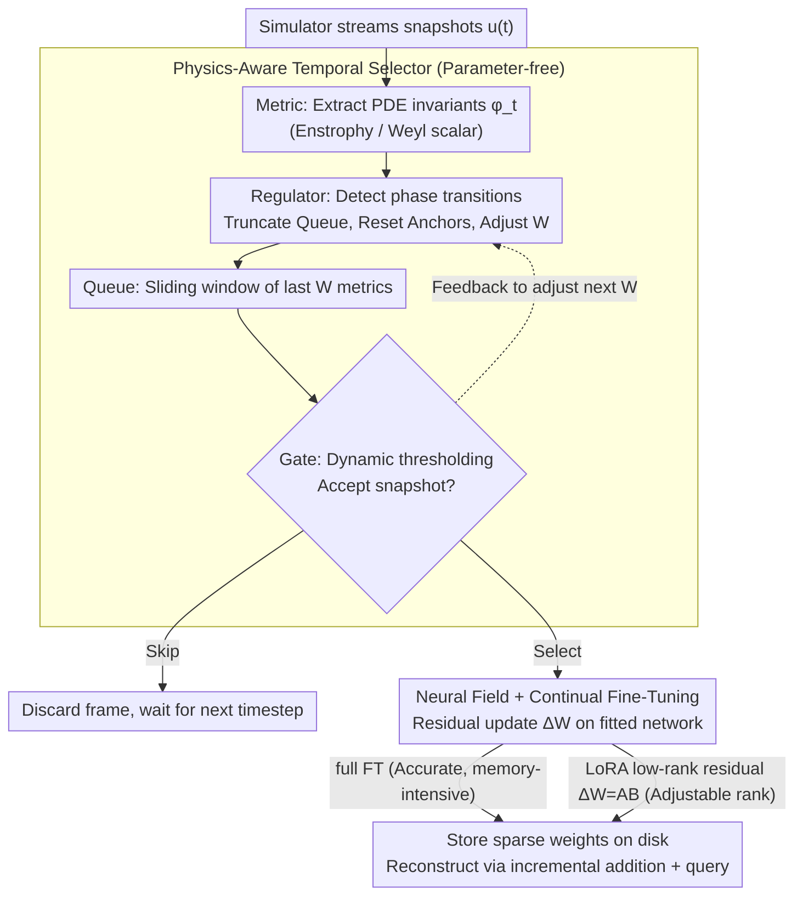

# ANTIC: Adaptive Neural Temporal In-situ Compressor

**Conference**: ICML 2026  
**arXiv**: [2604.09543](https://arxiv.org/abs/2604.09543)  
**Code**: https://github.com/AndreiB137/ANTIC  
**Area**: Scientific Computing / Neural Compression / Neural Fields  
**Keywords**: Online Compression, Neural Fields, Continual Fine-tuning, LoRA, PDE Simulation

## TL;DR
To enable in-situ compression of PB-EB scale PDE simulation data, this paper proposes ANTIC: a framework that utilizes a physics-aware temporal selector to retain only physically significant snapshots, followed by Neural Fields and LoRA-based continual fine-tuning to encode residuals between adjacent snapshots. It achieves 435× compression on 2D Kolmogorov flows and 6807× joint spatiotemporal compression on a 4.2 TiB 3D binary black hole merger simulation.

## Background & Motivation
**Background**: High-resolution transient simulations in fields like CFD, magnetohydrodynamics, plasma physics, and numerical relativity often generate single trajectories ranging from several TB to hundreds of TB. Conventional solutions output raw data for post-hoc compression (e.g., JPEG2000, DWT, FPZIP, ZFP). Both codec-based and low-rank tensor decomposition methods are widely used in the spatial dimension.

**Limitations of Prior Work**: (1) Offline compression is no longer feasible for petascale/exascale simulations as disk space is insufficient for initial storage. (2) Existing in-situ compression either uses uniform temporal sampling (missing transient events or oversampling stable periods) or employs fixed spatial representations (autoencoders lack resolution invariance, while traditional codecs struggle with multiscale correlations). (3) Most methods are "physics-unaware," failing to identify critical snapshots or exploit the continuity between adjacent snapshots.

**Key Challenge**: Stiff/multi-rate PDEs exhibit both temporal multiscale (coexistence of fast and slow phase transitions) and spatial multiscale (nonlinear, non-stationary) characteristics. A single temporal sampling strategy or spatial representation cannot balance storage, accuracy, and throughput simultaneously. This necessitates a physics-aware in-situ framework for joint spatiotemporal optimization.

**Goal**: (1) Design a parameter-free temporal snapshot selector capable of injecting PDE-specific metrics; (2) Use Neural Fields and continual fine-tuning (CFT) to represent spatial residuals between adjacent snapshots; (3) Consolidate these into a single-pass in-situ pipeline that exposes a rate-distortion Pareto front for user-defined selection.

**Key Insight**: The authors observe that solutions to stiff PDEs are "mostly smooth small perturbations" across adjacent timesteps. Compressing snapshot $t+\Delta t$ can be reinterpreted as applying a low-rank residual update to a neural field already fitted to snapshot $t$—a task naturally suited for LoRA. Furthermore, physical quantities (e.g., vorticity, Weyl scalar) serve as cheap saliency indicators to determine whether the system is in a steady state or a phase transition.

**Core Idea**: A combination of a Physics-Aware Temporal Selector (PATS) and Continual Fine-Tuning of Neural Fields (CFT / CFT+LoRA) to perform online spatiotemporal compression while providing a rate-distortion Pareto front.

## Method
ANTIC consists of two asynchronous modules: (i) PATS decides "whether to compress this frame," and (ii) Spatial Neural Compression decides "how to compress it." The entire pipeline operates in a single streaming pass without the need to save raw trajectories to disk.

### Overall Architecture
- **Streaming Input**: The simulator outputs snapshots $u(t)$ step-by-step.
- **PATS Sub-pipeline**: A Metric extracts physics-of-interest $\phi_t$ (e.g., enstrophy of vorticity or Weyl scalar magnitude). A Regulator dynamically adjusts the Queue window size $W$ based on $\phi_t$. A Gate uses the current truncated context and $\phi_t$ to form a dynamic threshold for snapshot acceptance.
- **Spatial Neural Compression**: Selected snapshots update the existing neural field $W_t \to W_t + \Delta W_{\Delta t}$ via Continual Fine-Tuning (CFT). $\Delta W_{\Delta t}$ can be implemented as full fine-tuning (higher accuracy, higher memory) or low-rank $\mathbf{A}^{(\Delta t)}\mathbf{B}^{(\Delta t)}$ (more efficient, slight accuracy loss), allowing users to navigate the Pareto front.
- **Output**: Only the sparse sequence of neural field weights is stored on disk. During decompression, weights are incrementally added back to the base network, and field values at any timestamp are reconstructed via coordinate queries.

### Key Designs

**1. Physics-Aware Temporal Selector (PATS): Using PDE invariants as saliency for selection**

Traditional temporal sampling either uses fixed intervals (missing transients) or pixel-wise differences (physics-unaware). PATS is a parameter-free four-component pipeline: a Metric extracts PDE-specific scalars (e.g., enstrophy $\mathcal{E}(t)=\frac12\int_\Omega\|\omega\|^2 dA$ for turbulence, or Weyl scalar $\Psi_4(t,\mathbf{r})$ for binary black hole mergers); a Queue stores the last $W$ metric values; a Regulator truncates the queue and resets anchors upon detecting a phase transition; and a Gate determines whether to compress the current frame while adjusting the next window size. This mechanism requires no training; its "intelligence" stems from the physical quantities themselves—sampling sparsely during slow evolution and densely during transients. It adapts to stiff/multi-rate systems by simply changing the Metric function.

**2. Neural Fields + Continual Fine-Tuning: Reframing compression as residual updates**

Fitting an independent network for every frame is redundant, while temporal extrapolation from the first frame leads to error accumulation. The authors adopt a middle ground: spatial compression is rewritten as "applying residual updates to a neural field fitted for $u(t)$ to fit $u(t+\Delta t)$." Given the smoothness of stiff PDE solutions, $\Delta u(t) \approx u(t+\Delta t)-u(t)$ is small, allowing convergence with few gradient steps and minimal parameter updates. The neural field uses a $256\times6$ MLP with SiLU activation and Fourier Feature Mapping (embedding dim 256) to mitigate spectral bias. Training utilizes the SOAP second-order preconditioner with cosine annealing, LayerNorm (to prevent activation drift), and weight decay (to bound weight growth). These stablizers are critical; without them, the network diverges after multiple steps.

**3. LoRA Low-Rank Residuals: Parameterizing updates as $\mathbf{A}\mathbf{B}$ for Pareto control**

Full FT updates all parameters, offering no control over storage volume. Users require a "knob" to balance storage and precision. The authors parameterize the residual update as a low-rank decomposition:

$$\Delta W_{\Delta t}=\mathbf{A}^{(\Delta t)}\mathbf{B}^{(\Delta t)},\quad \mathbf{A}\in\mathbb{R}^{n\times r},\ \mathbf{B}\in\mathbb{R}^{r\times k},\ r\ll\min(n,k),$$

Adjusting $r$ moves the system along the accuracy-memory Pareto front. High $r$ approaches full FT, while low $r$ provides extreme compression (e.g., $r=16$ yields 3744× spatial compression on 3D BBH). LoRA uses a learning rate an order of magnitude higher than full FT ($10^{-2}$ vs $10^{-3}$), aligning with recent empirical evidence. This allows ANTIC to adapt to various scenarios from memory-constrained to accuracy-prioritized.

### Loss & Training
The neural field is trained using a standard coordinate-to-value regression loss ($L_2$ on physical values at sampled coordinates). For CFT, the learning rate (LR) is annealed from $10^{-3}$ to $10^{-5}$; the LoRA version starts at $10^{-2}$. Fine-tuning is completed for each snapshot before proceeding to the next.

## Key Experimental Results

### Main Results (2D Kolmogorov + 3D BBH Merger)
PATS-LoRA outperforms traditional compressors and uniform-sampling neural compression across two stress tests. TR=Temporal Retention, SC=Spatial Compression, TC=Total Compression.

| Method | Dataset | TR | PA | SC | TC |
| :--- | :--- | :--- | :--- | :--- | :--- |
| Sparse + ZFP | 2D Kolmogorov | 20% | ✗ | 13× | 65× |
| PATS + ZFP | Same | 37% | ✓ | 13× | 120× |
| Sparse + LoRA(r=32) | Same | 20% | ✗ | 47× | 235× |
| **ANTIC-LoRA (Ours)** | Same | 37% | ✓ | **47×** | **435×** |
| Sparse + FT | 3D BBH (4.2 TiB) | 20% | ✗ | 471× | 2457× |
| Sparse + LoRA(r=16) | Same | 20% | ✗ | 3744× | 18720× |
| Dense + LoRA(r=16) | Same | 100% | ✓ | 3744× | 3744× |
| **ANTIC-LoRA (Ours)** | Same | 55% | ✓ | **3744×** | **6807×** |

### Ablation Study

| Configuration | Key Result | Description |
| :--- | :--- | :--- |
| Dense + ZFP | 13× / 27× | Baseline, ceiling for pure spatial traditional compression |
| Dense + FT | 12× / 471× | Neural fields significantly outperform traditional methods in 3D |
| PATS + ZFP | TC improved to 120× / 52× | Temporal selection significantly extends traditional codecs |
| ANTIC-FT (37% / 55% TR) | 111× / 860× | Joint temporal selection and full-FT neural compression |
| ANTIC-LoRA | 435× / 6807× | LoRA provides an additional order of magnitude gain |

### Key Findings
- Temporal and spatial axes provide multiplicative gains: PATS alone provides 2.5~3× TC gain, while neural fields provide 30~470× SC gain. Together, they achieve 100~1000×.
- On multi-rate systems like 3D BBH, PATS achieves 45% temporal compression without losing critical physical events, proving that the Weyl scalar is a valid saliency metric.
- LoRA rank $r$ provides a smooth Pareto front; $r=16$ is sufficient for 3D simulations. This suggests that rank might correlate with the intrinsic dimension of the PDE.
- LayerNorm and weight decay are essential for CFT stability; without them, weight norms explode, leading to divergence after several fine-tuning steps.

## Highlights & Insights
- **The "Residual as Compression" Perspective**: Converting independent per-frame fitting into LoRA residual updates is a simple yet powerful reframing that turns spatial neural compression into joint spatiotemporal compression while naturally supporting streaming.
- **Parameter-free PATS**: Decisions are based solely on PDE physics and sliding window thresholds. It avoids training costs and hyperparameter tuning, requiring only a metric change for different PDEs.
- **Pareto Front Exposure**: Users can select the LoRA rank based on storage budgets or accuracy needs. This adjustability is vital for scientific computing, where tolerance for precision varies widely.

## Limitations & Future Work
- Metrics are PDE-specific and require expert selection; data-driven saliency learning from trajectories is a future direction.
- LoRA rank is currently manually swept; adaptive rank allocation could further improve compression.
- Experiments are limited to 2D Kolmogorov and 3D BBH; validation across more stiff systems (e.g., magnetohydrodynamics, chemical reactions) is needed.
- Decompression requires sequential weight loading + coordinate querying, which is unfriendly for random temporal access.
- Neural fields may still exhibit oscillations (Gibbs-like) for sharp features or shocks.

## Related Work & Insights
- **vs ZFP / FPZIP / MGARD**: Traditional methods are transform-based and unaware of multiscale PDE structures; Ours (Neural Field + LoRA) is 1-2 orders of magnitude higher in 3D SC.
- **vs MGARD (Adaptive Accuracy)**: MGARD uses feature-aware error bounds but remains temporally uniform; Ours is non-uniform in time and neural in space.
- **vs PINN / Physics-informed Neural Fields (Galletti 2025)**: While some methods achieve 70,000× compression using physical losses, they are offline. Ours is online and does not require explicit loss functions for every PDE.
- **vs Neural Video Compression**: The concept is similar (keyframes + residuals), but while NVC optimizes for perception, Ours optimizes for physics. PATS uses PDE invariants instead of motion/entropy.

## Rating
- Novelty: ⭐⭐⭐⭐ The combination of PATS and LoRA residual neural fields is a clear and effective innovation.
- Experimental Thoroughness: ⭐⭐⭐⭐ Strong results across different scales (2D 16GB / 3D 4TB) and multiple baselines.
- Writing Quality: ⭐⭐⭐⭐ Modular breakdown and complete pseudocode; some physical background may be dense for non-experts.
- Value: ⭐⭐⭐⭐⭐ Directly addresses the storage crisis in the scientific computing community; engineering-ready and open-sourced.

<!-- RELATED:START -->

## Related Papers

- [\[ICML 2026\] A Call to Lagrangian Action: Learning Population Mechanics from Temporal Snapshots](a_call_to_lagrangian_action_learning_population_mechanics_from_temporal_snapshot.md)
- [\[CVPR 2025\] ATP: Adaptive Threshold Pruning for Efficient Data Encoding in Quantum Neural Networks](../../CVPR2025/physics/atp_adaptive_threshold_pruning_for_efficient_data_encoding_in_quantum_neural_net.md)
- [\[ICML 2026\] BALLAST: Bayesian Active Learning with Look-ahead Amendment for Sea-drifter Trajectories under Spatio-Temporal Vector Fields](ballast_bayesian_active_learning_with_look-ahead_amendment_for_sea-drifter_traje.md)
- [\[ICML 2026\] Topology-Preserving Neural Operator Learning via Hodge Decomposition](topology-preserving_neural_operator_learning_via_hodge_decomposition.md)
- [\[ICML 2026\] EqGINO: Equivariant Geometry-Informed Fourier Neural Operators for 3D PDEs](eqgino_equivariant_geometry-informed_fourier_neural_operators_for_3d_pdes.md)

<!-- RELATED:END -->
