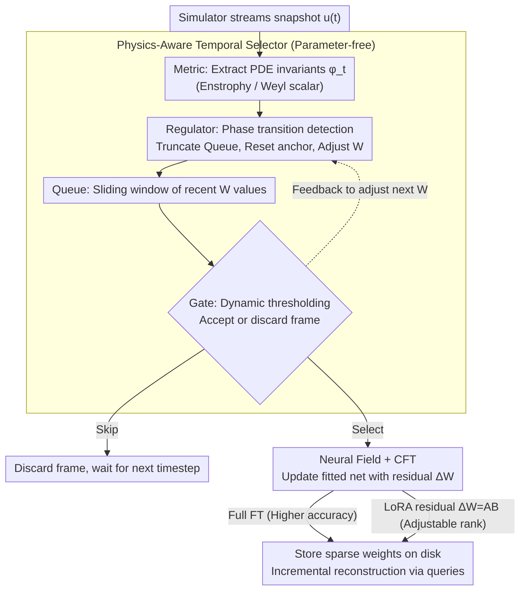

# ANTIC: Adaptive Neural Temporal In-situ Compressor

**Conference**: ICML 2026  
**arXiv**: [2604.09543](https://arxiv.org/abs/2604.09543)  
**Code**: https://github.com/AndreiB137/ANTIC  
**Area**: Scientific Computing / Neural Compression / Neural Fields  
**Keywords**: Online Compression, Neural Fields, Continual Fine-tuning, LoRA, PDE Simulation  

## TL;DR
To compress PB-EB scale PDE simulation data "on-the-fly," this paper proposes ANTIC: it utilizes a physics-aware temporal selector to retain only physically significant snapshots, and employs neural fields with LoRA continual fine-tuning to encode residuals between adjacent snapshots. It achieves $435\times$ compression on 2D Kolmogorov flows and $6807\times$ spatio-temporal joint compression on a 4.2 TiB 3D binary black hole merger simulation.

## Background & Motivation
**Background**: High-resolution transient simulations in CFD, magnetohydrodynamics, plasma physics, and numerical relativity often generate single trajectories ranging from several TB to hundreds of TB. Conventional solutions output raw data for post-hoc compression (e.g., JPEG2000, DWT, FPZIP, ZFP), where codec-based and low-rank tensor decomposition methods compete in the spatial dimension.

**Limitations of Prior Work**: (1) Offline compression is infeasible for petascale/exascale simulations as disk space is insufficient to store raw data initially. (2) Existing in-situ compression either uses fixed-interval temporal sampling (missing transient events or oversampling stable periods) or employs fixed spatial representations (autoencoder latents have fixed resolution, and traditional codecs struggle with multiscale correlations). (3) Most methods lack "physical awareness"—they neither identify critical snapshots nor exploit continuity between adjacent snapshots.

**Key Challenge**: Stiff/multi-rate PDEs exhibit both temporal multiscale (simultaneous fast/slow phase transitions) and spatial multiscale (non-linear, non-stationary) characteristics. A single temporal sampling strategy or spatial representation cannot satisfy requirements across storage, accuracy, and throughput simultaneously; thus, a spatio-temporally joint optimized and physics-aware in-situ framework is needed.

**Goal**: (1) Design a parameter-free temporal snapshot selector capable of injecting PDE-specific metrics; (2) Use neural field representations with continual fine-tuning for residuals between adjacent snapshots; (3) Combine these into a single-pass in-situ streaming pipeline and expose a rate-distortion Pareto front for user customization.

**Key Insight**: The authors observe that solutions to stiff PDEs at adjacent timesteps consist "mostly of smooth, small perturbations." Compressing the $(t+\Delta t)$-th snapshot can be reinterpreted as "updating a neural field already fitted to the $t$-th snapshot with a low-rank residual"—a task naturally suited for LoRA. Meanwhile, physical quantities (vorticity, Weyl scalars) serve as low-cost saliency indicators to determine whether the system is in steady state or phase transition.

**Core Idea**: A combination of a Physics-Aware Temporal Selector (PATS) and Continual Fine-Tuning (CFT / CFT+LoRA) of neural fields to perform simultaneous spatio-temporal compression online, exposing a rate-distortion Pareto front to the user.

## Method
ANTIC consists of two asynchronous modules: (i) PATS decides "whether to compress this frame," and (ii) Spatial Neural Compression decides "how to compress it." The entire pipeline operates in a single streaming pass without the need to save raw trajectories to disk.

### Overall Architecture
- **Streaming Input**: The simulator outputs snapshots $u(t)$ timestep by timestep.
- **PATS Sub-pipeline**: A Metric extracts physics-of-interest $\phi_t$ (e.g., enstrophy of vorticity / Weyl scalar magnitude) from the snapshot. A Regulator adjusts the Queue window size $W$ based on $\phi_t$, and a Gate determines whether to accept the snapshot based on a dynamic threshold derived from the truncated context and $\phi_t$.
- **Spatial Neural Compression**: Selected snapshots update the existing neural field $W_t \to W_t + \Delta W_{\Delta t}$ via Continual Fine-Tuning (CFT). $\Delta W_{\Delta t}$ can be a full fine-tune (higher accuracy, higher memory) or a low-rank update $\mathbf{A}^{(\Delta t)}\mathbf{B}^{(\Delta t)}$ (lower resource usage, slight accuracy loss), allowing users to navigate the Pareto front.
- **Output**: Only the sparse sequence of neural field weights is stored on disk. During decompression, weights are incrementally added back to the base network, and field values are reconstructed at any moment via coordinate queries.

### Key Designs

**1. Physics-Aware Temporal Selector (PATS): Utilizing PDE intrinsic invariants as saliency to decide storage**

Traditional temporal sampling is either fixed-interval (missing fast transients or oversampling slow evolution) or uses generic heuristics like pixel differences that lack physical meaning. PATS is a parameter-free four-component pipeline: the Metric extracts PDE-specific scalars—enstrophy $\mathcal{E}(t)=\frac12\int_\Omega\|\omega\|^2 dA$ for turbulence, or Weyl scalar $\Psi_4(t,\mathbf{r})$ for binary black hole mergers; the Queue is a sliding window of the last $W$ metric values; the Regulator truncates the Queue and resets anchors upon detecting a phase transition; and the Gate forms dynamic thresholds to decide compression and provide feedback to the Regulator. The mechanism requires no training; its intelligence stems from physical quantities—sampling sparsely during slow evolution and densely during transients. It adapts to stiff/multi-rate systems without missing critical events by simply changing the Metric function for different PDEs.

**2. Neural Fields + Continual Fine-Tuning: Reframing "compressing the next frame" as "residual network updates"**

Fitting a separate network for every frame is redundant, while temporal extrapolation from the first frame leads to error accumulation. The authors take a middle ground: spatial compression is rewritten as "fine-tuning a neural field fitted to $u(t)$ to fit $u(t+\Delta t)$." Given the smoothness of stiff PDE solutions $u(t+\Delta t)-u(t)\approx\Delta u(t)$, the residual magnitude is much smaller than the original field, allowing convergence with few gradient steps and minimal parameter updates. The neural field is a $256\times6$ MLP with SiLU and Fourier Feature Mapping (embedding dimension 256 to mitigate spectral bias), trained using the SOAP second-order preconditioner optimizer with cosine annealing. LayerNorm and weight decay are included to stabilize continual fine-tuning—ablations show that without these, weight norms explode and the network diverges after multiple steps. This design reuses temporal correlation as a prior while performing frame-by-frame corrections.

**3. LoRA Low-Rank Residuals: Parameterizing residual updates as $\mathbf{A}\mathbf{B}$ to navigate the Pareto front**

Full fine-tuning (FT) updates all parameters and offers no storage control, whereas downstream applications require a "knob" to balance storage and accuracy. The authors parameterize residual updates as low-rank:

$$\Delta W_{\Delta t}=\mathbf{A}^{(\Delta t)}\mathbf{B}^{(\Delta t)},\quad \mathbf{A}\in\mathbb{R}^{n\times r},\ \mathbf{B}\in\mathbb{R}^{r\times k},\ r\ll\min(n,k),$$

Adjusting $r$ allows movement along an accuracy-memory Pareto front—large $r$ approaches full FT, while small $r$ provides extreme compression (reaching $3744\times$ spatial compression per snapshot for 3D BBH at $r=16$). LoRA initialization uses a learning rate an order of magnitude higher than full FT ($10^{-2}$ vs $10^{-3}$), following recent empirical findings. This translates LLM insights—where low rank approximates full FT—to the task of fitting field timesteps, making ANTIC adaptable from storage-constrained to accuracy-prioritized scenarios.

### Loss & Training
Neural field training: Standard coordinate-to-value regression loss ($L_2$ on physical values at sampled coordinates). During the CFT stage, the learning rate is annealed from $10^{-3}$ to $10^{-5}$; the LoRA version starts at $10^{-2}$. Fine-tuning is completed independently for each snapshot before proceeding to the next; intermediate products (loss curves) are only triggered based on PATS decisions.

## Key Experimental Results

### Main Results (2D Kolmogorov + 3D BBH Merger)
PATS-LoRA outperforms traditional compressors and fixed-interval neural compression across both stress tests. TR=Temporal Retention, SC=Spatial Compression, TC=Total Compression.

| Method | Dataset | TR | PA | SC | TC |
|------|--------|----|----|-----|-----|
| Sparse + ZFP | 2D Kolmogorov | 20% | ✗ | 13× | 65× |
| PATS + ZFP | Same | 37% | ✓ | 13× | 120× |
| Sparse + LoRA(r=32) | Same | 20% | ✗ | 47× | 235× |
| **ANTIC-LoRA (Ours)** | Same | 37% | ✓ | **47×** | **435×** |
| Sparse + FT | 3D BBH (4.2 TiB) | 20% | ✗ | 471× | 2457× |
| Sparse + LoRA(r=16) | Same | 20% | ✗ | 3744× | 18720× |
| Dense + LoRA(r=16) | Same | 100% | ✓ | 3744× | 3744× |
| **ANTIC-LoRA (Ours)** | Same | 55% | ✓ | **3744×** | **6807×** |

### Ablation Study

| Configuration | Key Result | Description |
|------|----------|------|
| Dense + ZFP | 13× / 27× | Baseline; ceiling for pure spatial compression |
| Dense + FT | 12× / 471× | Neural fields significantly outperform traditional methods in 3D |
| PATS + ZFP | TC to 120× / 52× | Temporal selection alone scales traditional codecs |
| ANTIC-FT (37% / 55% TR) | 111× / 860× | Joint temporal selection and full FT neural compression |
| ANTIC-LoRA | 435× / 6807× | LoRA further increases compression by an order of magnitude |

### Key Findings
- Temporal and spatial axes yield multiplicative gains: PATS alone provides $2.5\sim3\times$ TC gain, neural fields provide $30\sim470\times$ SC gain, reaching $100\sim1000\times$ scales combined.
- For 3D BBH multi-rate systems, PATS achieves 45% temporal compression without losing critical events (merger transients), proving Weyl scalars are effective saliency indicators—uniform sampling would miss merger peaks.
- LoRA rank $r$ provides a smooth Pareto front; $r=16$ is sufficient in 3D with diminishing returns for higher ranks. This suggests $r$ may be proportional to the intrinsic dimensionality of the PDE.
- LayerNorm and weight decay are critical for CFT stability; without them, weight norms explode, and the network diverges during multi-step fine-tuning.

## Highlights & Insights
- **Residuals-as-Compression Perspective**: Reframing the task from "fitting independent networks per frame" to "LoRA residual updates on the previous frame's network" effectively transforms spatial neural compression into a spatio-temporal joint neural compression that naturally supports streaming.
- **Paramter-free PATS**: Decisions are based solely on PDE physics and sliding window thresholds, eliminating training costs and hyperparameter tuning. It is highly engineer-friendly as only the Metric needs to change across different PDEs.
- **Exposure of the Pareto Front**: Instead of a single compression ratio, users can select the LoRA rank based on storage budgets or accuracy needs—a flexible design crucial for scientific computing where tolerance levels vary.

## Limitations & Future Work
- Metrics are PDE-specific and require expert selection; learning saliency data-driven from trajectories is a future direction.
- LoRA rank is manually swept; adaptive rank allocation could further improve compression.
- Experiments are limited to 2D Kolmogorov and 3D BBH; validation across more stiff systems (MHD, chemical reactions) is needed.
- Decompression requires incremental weight loading and coordinate queries, which is unfriendly to random temporal access. Streaming decoding is an advantage, but point queries are a disadvantage.
- Neural fields may still exhibit oscillations (Gibbs-like) for sharp features or shocks, which was not discussed in detail.

## Related Work & Insights
- **vs. ZFP / FPZIP / MGARD (Traditional)**: Traditional methods are transform-based and unaware of PDE multiscale structures; the proposed method achieves 1-2 orders of magnitude higher SC in 3D.
- **vs. MGARD (Adaptive Accuracy)**: MGARD uses feature-aware error bounds but remains temporally uniform; ANTIC uses non-uniform temporal and neural spatial compression, which is orthogonal to MGARD.
- **vs. PINNs / Physics-Informed Neural Fields (Galletti 2025)**: Those methods use VQ and physics losses to reach $70000\times$ compression but are offline-only. ANTIC is online and supports any PDE without explicit loss formulation.
- **vs. Neural Video Compression (NVC)**: Similar in concept (keyframes + residuals), but NVC is perceptually optimized, whereas ANTIC is physics-optimized; NVC keyframe selection is based on motion/entropy, while PATS is based on PDE invariants.

## Rating
- Novelty: ⭐⭐⭐⭐ The combination of PATS and LoRA residual neural fields is a clear and effective innovation.
- Experimental Thoroughness: ⭐⭐⭐⭐ Diverse PDE scales (2D 16GB / 3D 4TB) and multiple strong baselines.
- Writing Quality: ⭐⭐⭐⭐ Clear modular breakdown and complete pseudocode; some physics context may be dense for non-experts.
- Value: ⭐⭐⭐⭐⭐ Directly addresses the storage crisis in scientific computing; engineering-ready and open-sourced.  

<!-- RELATED:START -->

## Related Papers

- [\[ICLR 2026\] Adaptive Mamba Neural Operators](../../ICLR2026/physics/adaptive_mamba_neural_operators.md)
- [\[ICML 2026\] A Call to Lagrangian Action: Learning Population Mechanics from Temporal Snapshots](a_call_to_lagrangian_action_learning_population_mechanics_from_temporal_snapshot.md)
- [\[ICML 2026\] Topology-Preserving Neural Operator Learning via Hodge Decomposition](topology-preserving_neural_operator_learning_via_hodge_decomposition.md)
- [\[ICML 2026\] EqGINO: Equivariant Geometry-Informed Fourier Neural Operators for 3D PDEs](eqgino_equivariant_geometry-informed_fourier_neural_operators_for_3d_pdes.md)
- [\[ICML 2026\] BALLAST: Bayesian Active Learning with Look-ahead Amendment for Sea-drifter Trajectories under Spatio-Temporal Vector Fields](ballast_bayesian_active_learning_with_look-ahead_amendment_for_sea-drifter_traje.md)

<!-- RELATED:END -->
