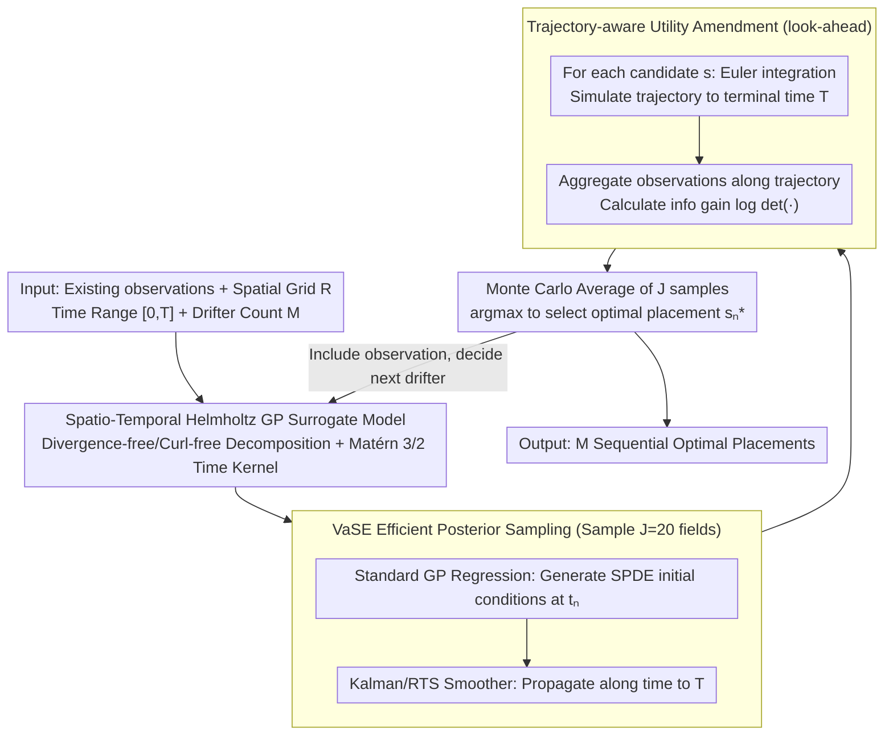

# BALLAST: Bayesian Active Learning with Look-ahead Amendment for Sea-drifter Trajectories under Spatio-Temporal Vector Fields

**Conference**: ICML2026  
**arXiv**: [2509.26005](https://arxiv.org/abs/2509.26005)  
**Code**: https://github.com/ShuSheng3927/BALLAST  
**Area**: Scientific Computing  
**Keywords**: Active Learning, Gaussian Processes, Sea Drifters, Spatio-Temporal Vector Fields, Bayesian Experimental Design  

## TL;DR

Proposes the BALLAST algorithm, which amends active learning utility estimates by sampling vector fields from the GP posterior and simulating the future trajectories of Lagrangian observers. It also develops the VaSE inference method to accelerate GP posterior sampling efficiency by thousands of times, achieving approximately 16%-22% savings in deployment costs on synthetic and high-fidelity ocean flow fields.

## Background & Motivation

**Background**: Understanding and predicting ocean flow fields is crucial for tracking heat, nutrients, and pollutants. Free-floating ocean drifters are widely used for collecting spatio-temporal flow properties. Once deployed, they are advected by the underlying vector field and measure velocity at varying locations and times, acting as Lagrangian observers.

**Limitations of Prior Work**: Current drifter placement strategies either use standard "space-filling" designs (e.g., Sobol sequences) or rely on arbitrary expert opinions. While some works propose manual design criteria based on travel distance and spacing, no formal active learning framework exists for guiding Lagrangian observer deployment.

**Key Challenge**: Standard active learning methods (e.g., Expected Information Gain, EIG) only consider information gain at the initial observation point when estimating utility, completely ignoring subsequent observations collected as the drifter is advected. This leads EIG to favor boundaries—locations with high initial gain but where the observer quickly leaves the study area, resulting in low actual utility. Experiments show EIG consistently performs worse than uniform random strategies.

**Goal**: Design an active learning strategy that correctly evaluates the full-lifetime information gain of Lagrangian observers and addresses the resulting computational bottleneck in GP posterior sampling.

**Key Insight**: Utilize GP posterior sampling to simulate future trajectories in hypothesized vector fields, incorporating the information gain from all subsequent observations along the trajectory into the utility calculation.

**Core Idea**: Amend the utility function (look-ahead amendment) by Monte Carlo sampling the posterior vector field and simulating observer trajectories, and use the VaSE method to bypass computational bottlenecks of SPDE-GP for non-gridded observations.

## Method

### Overall Architecture

BALLAST is a sequential experimental design framework: first, a **spatio-temporal Helmholtz GP surrogate model** characterizes the time-varying vector field; at each decision time $t_n$, given existing observations $\mathcal{D}_n$, the **VaSE** method efficiently samples $J$ vector fields from the GP posterior; for each candidate placement position $\bm{s}$, the full drifter trajectory is simulated using Euler integration until terminal time $T$ under each sampled field; the information gain from all observations along the trajectories is aggregated to score the position (**look-ahead utility amendment**). After Monte Carlo averaging, the optimal placement is selected. The inputs are the spatial grid $R$, time range $[0,T]$, and drifter count $M$; the output is $M$ sequential optimal placement positions.

### Key Designs

**1. Spatio-Temporal Helmholtz GP Surrogate Model: Injecting Fluid Physics Priors**

The surrogate model must respect fluid dynamics constraints and facilitate SPDE propagation. The authors use Helmholtz decomposition to construct a vector output kernel $k_{\text{tHelm}}((\bm{s},t),(\bm{s}',t'))=k_{\text{Helm}}(\bm{s},\bm{s}')\,k_{\text{time}}(t,t')$. The spatial part is based on linear differential operators of potential and stream function kernels (encoding divergence-free/curl-free constraints), while the temporal part uses a Matérn 3/2 kernel (consistent with oceanographic empirical values $\nu\approx2$). The **separable spatio-temporal kernel structure** is the prerequisite for VaSE time-propagation.

**2. Vanilla SPDE Exchange (VaSE): Bypassing GP Posterior Sampling Bottlenecks for Non-gridded Data**

The look-ahead amendment requires repeated sampling from the spatio-temporal GP posterior. Standard GP sampling costs $O(N_{\text{pred,s}}^3 N_{\text{pred,t}}^3)$ are infeasible, and SPDE methods face high costs when observation and prediction locations do not overlap. VaSE combines them: it uses an augmented GP $\bm{f}=[f,\partial_t f]^\top$ to generate SPDE initial conditions at decision time $t_n$ via standard GP regression, then propagates them to $T$ using Kalman filters and RTS smoothers. This reduces the cost to $O(N_{\text{obs}}^3+N_{\text{pred,s}}^2 N_{\text{pred,t}})$, achieving ~70x acceleration (3.8 s vs 4.5 min per sample) and making BALLAST computationally practical.

**3. Trajectory-aware Utility Amendment (BALLAST Amendment): Accounting for Full Drifter Lifespans**

This is the core contribution of BALLAST. Standard EIG estimates utility using only the initial observation, ignoring data collected as the drifter is advected. This causes EIG to prefer boundaries (high initial gain, but drifters quickly exit). BALLAST incorporates the entire future trajectory into the acquisition function using the $J$ sampled fields:

$$\bm{s}_n^*=\arg\max_{\bm{s}\in R}\ \mathbb{E}_{F\sim p(f|\mathcal{D}_n)}\big[\mathbb{E}[U(P_F^T(\bm{s},t_n))]\big],$$

where $P_F^T(\bm{s},t_n)$ is the projected trajectory of the observer from $\bm{s}$ to $T$ under sampled field $F$. The outer expectation is approximated using $J=20$ Monte Carlo samples, with trajectories simulated via Euler integration. This scores candidates by "long-term information contribution" rather than "instantaneous gain."

## Key Experimental Results

### Main Results

Six strategies compared: Uniform Random (UNIF), Sobol Sequence (SOBOL), Distance-Separation Heuristic (DIST-SEP), Expected Information Gain (EIG), BALLAST-opt (optimized hyperparameters), and BALLAST-true (ground truth hyperparameters).

| Experimental Setting | Metric | BALLAST-true | BALLAST-opt | UNIF | EIG | Key Finding |
|----------|---------|-------------|-------------|------|-----|---------|
| Temporal Helmholtz (Synthetic) | Deployment Cost Saving | ~16% | ~16% | baseline | < UNIF | Saves ~3 drifters |
| SUNTANS (High-fidelity Fluid Sim) | Deployment Cost Saving | ~22% | ~22% | baseline | > UNIF | Saves ~2 drifters |

### Computational Efficiency Comparison

| Inference Method | Cost Magnitude | Per-sample Time | Gain |
|----------|---------------------|--------------|--------|
| Standard GP | $10^{17}$ | Infeasible | — |
| SPDE-GP | $10^{11}$ | ~4.5 min | 1× |
| VaSE (Ours) | $10^{8}$ | ~3.8 s | ~70× |

### Ablation Study

| Posterior Sample Count $J$ | 1% Utility Gap Reached | Decision Time ($J=20$) | Note |
|---------------|-----------------|-------------------|------|
| $J < 20$ | ✓ Consistently | < 3 min | Converges before $J=20$ across different $t$ |
| $J = 200$ (Ref) | — | — | Used as approximation of true expected utility |

## Highlights & Insights

- BALLAST is generalizable, applying not only to ocean drifters but also to animal tracking collars, weather balloons, and other Lagrangian sensors.
- The counter-intuitive finding that standard EIG performs worse than uniform random in Lagrangian settings reveals the fundamental flaw of ignoring observer dynamics.
- The VaSE method is independently valuable for any application requiring efficient sampling from spatio-temporal GPs with non-gridded observations.

## Limitations & Future Work

- Current work assumes predefined decision times and does not optimize the timing of deployment.
- GP hyperparameter optimization may be less robust in high-dimensional or highly complex flow fields.
- Amortized acquisition optimization using deep adaptive designs could be considered for faster decision-making.
- Validation was performed on 2D flow fields; 3D ocean dynamics have not yet been tested.

## Related Work & Insights

- Berlinghieri et al. (2023) proposed Helmholtz GP kernels for ocean flow modeling.
- Chen et al. (2024b) proposed manual placement criteria based on Lagrangian data assimilation.
- The SPDE-GP framework by Sarkka et al. (2013) serves as a foundational component for VaSE.
- Predictive Entropy Search by Hernández-Lobato et al. (2014), utilizing mutual information symmetry, inspired the information gain reformulation.

## Rating

- Novelty: ⭐⭐⭐⭐ — First formal introduction of active learning to Lagrangian observer placement; VaSE provides an independent technical contribution.
- Experimental Thoroughness: ⭐⭐⭐⭐ — Dual validation with synthetic and high-fidelity simulations, including ablation and six baseline comparisons.
- Writing Quality: ⭐⭐⭐⭐⭐ — Clear motivation, rigorous theoretical/algorithmic development, and intuitive visualizations.
- Value: ⭐⭐⭐⭐ — Directly applicable to real-world marine deployments and extensible to other Lagrangian scenarios.

<!-- RELATED:START -->

## Related Papers

- [\[ICML 2026\] A Call to Lagrangian Action: Learning Population Mechanics from Temporal Snapshots](a_call_to_lagrangian_action_learning_population_mechanics_from_temporal_snapshot.md)
- [\[ICML 2026\] ANTIC: Adaptive Neural Temporal In-situ Compressor](antic_adaptive_neural_temporal_in-situ_compressor.md)
- [\[ICML 2026\] Distribution Transformers: Fast Approximate Bayesian Inference With On-The-Fly Prior Adaptation](distribution_transformers_fast_approximate_bayesian_inference_with_on-the-fly_pr.md)
- [\[CVPR 2025\] Accurate Differential Operators for Hybrid Neural Fields](../../CVPR2025/physics/accurate_differential_operators_for_hybrid_neural_fields.md)
- [\[NeurIPS 2025\] Vision Transformers for Cosmological Fields: Application to Weak Lensing Mass Maps](../../NeurIPS2025/physics/vision_transformers_for_cosmological_fields_application_to_weak_lensing_mass_map.md)

<!-- RELATED:END -->
