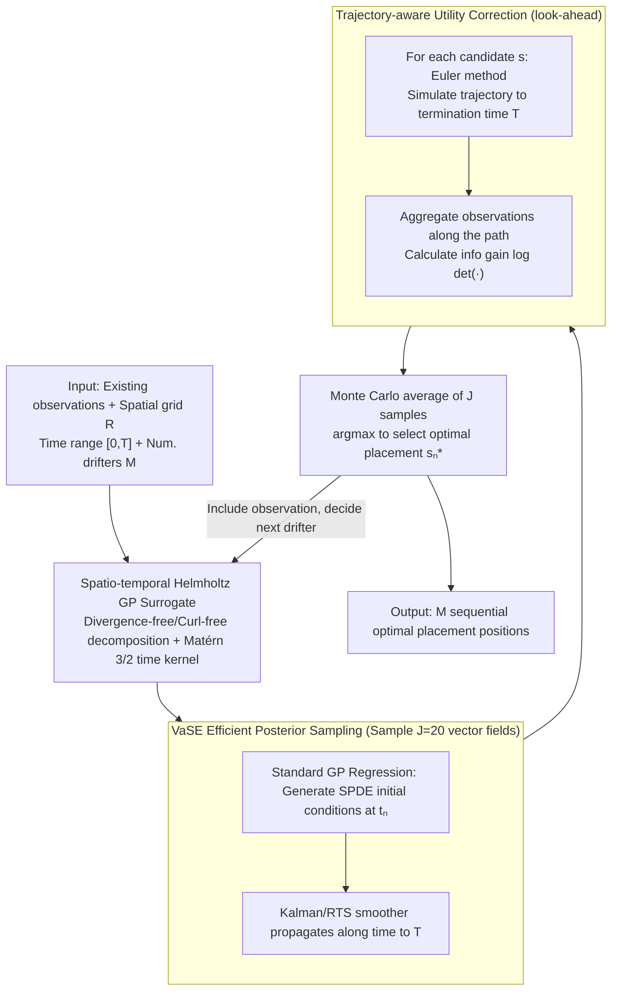

# BALLAST: Bayesian Active Learning with Look-ahead Amendment for Sea-drifter Trajectories under Spatio-Temporal Vector Fields

**Conference**: ICML2026  
**arXiv**: [2509.26005](https://arxiv.org/abs/2509.26005)  
**Code**: https://github.com/ShuSheng3927/BALLAST  
**Area**: Scientific Computing  
**Keywords**: Active Learning, Gaussian Processes, Sea drifters, Spatio-temporal vector fields, Bayesian experimental design  

## TL;DR

The BALLAST algorithm is proposed to correct active learning utility estimates by sampling vector fields from the GP posterior and simulating future trajectories of Lagrangian observers. Additionally, the VaSE inference method is developed to increase GP posterior sampling efficiency by thousands of times, achieving approximately 16%-22% savings in deployment costs on synthetic and high-fidelity ocean flow fields.

## Background & Motivation

**Background**: Understanding and predicting ocean flow fields is crucial for tracking heat, nutrients, and pollutants in the ocean. Free-drifting sea drifters are widely used for their ability to capture spatio-temporal flow field properties simultaneously. Once deployed, drifters are advected by the underlying vector field and obtain velocity measurements at different locations and times, acting as Lagrangian observers.

**Limitations of Prior Work**: Current drifter placement strategies either adopt standard "space-filling" designs (e.g., Sobol sequences) or rely on heuristic expert opinions. While some work has proposed manual design criteria based on travel distance and placement spacing, no formal active learning framework exists to guide the deployment of Lagrangian observers.

**Key Challenge**: Standard active learning methods (e.g., Expected Information Gain, EIG) only consider the information gain at the initial observation location when estimating the utility of a candidate placement. They completely ignore subsequent observations collected as the drifter is continuously advected by the flow field. Consequently, EIG strategies tend to place observers near boundaries—where initial information gain is high, but the observer quickly exits the study area, resulting in low actual utility. Experiments show that EIG consistently performs worse than a uniform random strategy.

**Goal**: To design an active learning strategy that correctly evaluates the full life-cycle information gain of Lagrangian observers and to resolve the computational bottleneck of GP posterior sampling it entails.

**Key Insight**: Utilize GP posterior sampling to simulate future trajectories of drifters within hypothesized vector fields, incorporating the information gain from all subsequent observations along the trajectory into the utility calculation.

**Core Idea**: Utility functions are corrected through Monte Carlo sampling of posterior vector fields and simulation of observer trajectories (look-ahead amendment). Simultaneously, the VaSE method is proposed to bypass the computational bottleneck of SPDE-GP for non-gridded observations.

## Method

### Overall Architecture

BALLAST is a sequential experimental design framework: first, a **spatio-temporal Helmholtz GP surrogate model** characterizes the time-varying vector field. At each decision time $t_n$, given existing observations $\mathcal{D}_n$, the **VaSE** method efficiently samples $J$ vector field realizations from the GP posterior. For each candidate placement position $\bm{s}$, the full trajectory of the drifter is simulated using the Euler method until termination time $T$ under each sampled field. Information gains from all subsequent observations along the trajectory are aggregated to score the location (**look-ahead amendment**). The optimal placement is selected via Monte Carlo averaging. The input consists of the spatial grid $R$, time range $[0,T]$, and number of drifters $M$; the output is $M$ sequential optimal placement positions.

### Key Designs

**1. Spatio-temporal Helmholtz GP Surrogate: Injecting Fluid Physics Priors**

The surrogate model must respect fluid dynamics constraints while maintaining a structure suitable for SPDE propagation in VaSE. A vector-valued kernel is constructed using Helmholtz decomposition $k_{\text{tHelm}}((\bm{s},t),(\bm{s}',t'))=k_{\text{Helm}}(\bm{s},\bm{s}')\,k_{\text{time}}(t,t')$. The spatial part uses linear differential operators on potential and stream function kernels (encoding physical constraints such as divergence-free/curl-free), while the temporal part uses a Matérn 3/2 kernel (consistent with empirical oceanographic $\nu\approx2$). Helmholtz decomposition ensures the sampled fields are physically plausible flow fields rather than arbitrary functions, and the **separable spatio-temporal kernel structure** is a prerequisite for VaSE to perform SPDE propagation over time.

**2. Vanilla SPDE Exchange (VaSE): Bypassing GP Posterior Sampling Bottlenecks for Non-grid Lagrangian Data**

The look-ahead amendment requires repeated sampling of the spatio-temporal GP posterior, where the cost of standard GP sampling $O(N_{\text{pred,s}}^3 N_{\text{pred,t}}^3)$ is prohibitive. SPDE methods also face cost surges when "observation locations (non-gridded Lagrangian data) and prediction locations (regular grids) do not overlap." VaSE combines the two: it uses an augmented GP $\bm{f}=[f,\partial_t f]^\top$ to generate SPDE initial conditions via standard GP regression at decision time $t_n$, then propagates along the time dimension using a Kalman filter/RTS smoother until $T$, reducing the cost to $O(N_{\text{obs}}^3+N_{\text{pred,s}}^2 N_{\text{pred,t}})$. Using standard GP regression for initial conditions bypasses the issues of non-grid observations, resulting in an observed speedup of approximately 70x (4.5 min to 3.8 s per sample), making BALLAST computationally feasible in practice.

**3. Trajectory-aware Utility Correction (BALLAST Amendment): Accounting for Lifetime Observations**

This is the core contribution of BALLAST and the final stage of the pipeline. Standard EIG estimates the utility of a placement by looking only at the initial observation, ignoring subsequent data collected as the drifter is advected. Consequently, it favors placing observers near boundaries (high initial gain but rapid exit), performing worse than uniform random. The BALLAST amendment incorporates the entire future trajectory into the acquisition function using the $J$ vector fields sampled:

$$\bm{s}_n^*=\arg\max_{\bm{s}\in R}\ \mathbb{E}_{F\sim p(f|\mathcal{D}_n)}\big[\mathbb{E}[U(P_F^T(\bm{s},t_n))]\big],$$

where $P_F^T(\bm{s},t_n)$ is the projected trajectory starting from $\bm{s}$ at $t_n$ until $T$ under sampled field $F$. The outer expectation is approximated via Monte Carlo with $J=20$ GP posterior samples, and each trajectory is simulated via Euler integration with step $\delta_t$. Candidates are thus scored based on "long-term information contribution" rather than "instantaneous gain," correcting the boundary bias of EIG.

## Key Experimental Results

### Main Results

Comparison of six strategies: Uniform Random (UNIF), Sobol Sequence (SOBOL), Distance-Separated Heuristic (DIST-SEP), Expected Information Gain (EIG), BALLAST-opt (optimized hyperparameters), BALLAST-true (ground truth hyperparameters).

| Experimental Setting | Metrics | BALLAST-true | BALLAST-opt | UNIF | EIG | Key Conclusion |
|----------|---------|-------------|-------------|------|-----|---------|
| Temporal Helmholtz (Synthetic) | Deployment Cost Saving | ~16% | ~16% | baseline | Worse than UNIF | Saves ~3 drifters |
| SUNTANS (High-fidelity Fluid Sim) | Deployment Cost Saving | ~22% | ~22% | baseline | Better than UNIF | Saves ~2 drifters |

### Efficiency Comparison

| Inference Method | Cost Magnitude (Typical) | Sampling Time per Sample | Speedup |
|----------|---------------------|--------------|--------|
| Standard GP | $10^{17}$ | Infeasible | — |
| SPDE-GP | $10^{11}$ | ~4.5 min | 1× |
| VaSE (Ours) | $10^{8}$ | ~3.8 s | ~70× |

### Ablation Study

| Number of Posterior Samples $J$ | 1% Utility Gap Reached | Decision Latency ($J=20$) | Note |
|---------------|-----------------|-------------------|------|
| $J < 20$ | ✓ Consistently | < 3 min | Converges before $J=20$ across three decision times $t=3,5,7$ |
| $J = 200$ (Reference) | — | — | Used as approximation for true expected utility |

## Highlights & Insights

- The BALLAST method is generalizable, applicable not only to sea drifters but also to other Lagrangian observers like animal tracking collars or weather balloons advected by the environment.
- The "counter-intuitive" finding that standard EIG performs worse than uniform strategies in Lagrangian scenarios reveals fundamental flaws in ignoring observer dynamics.
- The VaSE method is independently significant and can be used in any scenario requiring efficient sampling from a spatio-temporal GP with non-gridded observations.

## Limitations & Future Work

- Currently assumes predefined decision times; deployment timing itself is not optimized.
- Hyperparameter optimization of the GP surrogate may lack robustness in high-dimensional or highly complex flow fields.
- Deep adaptive designs could be considered to amortize acquisition optimization for faster deployment decisions.
- Validation is limited to 2D space; 3D ocean flow fields have not yet been tested.

## Related Work & Insights

- Berlinghieri et al. (2023) proposed Helmholtz GP kernels for ocean flow modeling.
- Chen et al. (2024b) proposed manual placement criteria based on a Lagrangian data assimilation framework.
- The SPDE-GP framework by Sarkka et al. (2013) is a foundational component of VaSE.
- Predictive Entropy Search by Hernández-Lobato et al. (2014) inspired the information gain reformulation using mutual information symmetry.

## Rating

- Novelty: ⭐⭐⭐⭐ — First formal introduction of active learning to Lagrangian observer placement; VaSE provides an independent contribution.
- Experimental Thoroughness: ⭐⭐⭐⭐ — Dual validation on synthetic and high-fidelity simulations with ablation and six baselines.
- Writing Quality: ⭐⭐⭐⭐⭐ — Clear motivation, rigorous theory and algorithm development, intuitive visualizations.
- Value: ⭐⭐⭐⭐ — Direct application value for actual ocean science deployments; generalizable to other Lagrangian scenarios.

## Related Papers

- [\[ICML 2026\] A Call to Lagrangian Action: Learning Population Mechanics from Temporal Snapshots](a_call_to_lagrangian_action_learning_population_mechanics_from_temporal_snapshot.md)
- [\[ICML 2026\] ANTIC: Adaptive Neural Temporal In-situ Compressor](antic_adaptive_neural_temporal_in-situ_compressor.md)
- [\[ICML 2026\] Distribution Transformers: Fast Approximate Bayesian Inference With On-The-Fly Prior Adaptation](distribution_transformers_fast_approximate_bayesian_inference_with_on-the-fly_pr.md)
- [\[CVPR 2025\] Accurate Differential Operators for Hybrid Neural Fields](../../CVPR2025/physics/accurate_differential_operators_for_hybrid_neural_fields.md)
- [\[ICLR 2026\] Bayesian Parameter Shift Rules in Variational Quantum Eigensolvers](../../ICLR2026/physics/bayesian_parameter_shift_rules_in_variational_quantum_eigensolvers.md)

<!-- RELATED:END -->

<!-- RELATED:START -->

## Related Papers

- [\[ICML 2026\] A Call to Lagrangian Action: Learning Population Mechanics from Temporal Snapshots](a_call_to_lagrangian_action_learning_population_mechanics_from_temporal_snapshot.md)
- [\[ICML 2026\] ANTIC: Adaptive Neural Temporal In-situ Compressor](antic_adaptive_neural_temporal_in-situ_compressor.md)
- [\[ICML 2026\] Distribution Transformers: Fast Approximate Bayesian Inference With On-The-Fly Prior Adaptation](distribution_transformers_fast_approximate_bayesian_inference_with_on-the-fly_pr.md)
- [\[ICLR 2026\] Scaling Laws and Symmetry, Evidence from Neural Force Fields](../../ICLR2026/physics/scaling_laws_and_symmetry_evidence_from_neural_force_fields.md)
- [\[ICLR 2026\] Geometric Autoencoder Priors for Bayesian Inversion: Learn First Observe Later](../../ICLR2026/physics/geometric_autoencoder_priors_for_bayesian_inversion_learn_first_observe_later.md)

<!-- RELATED:END -->
