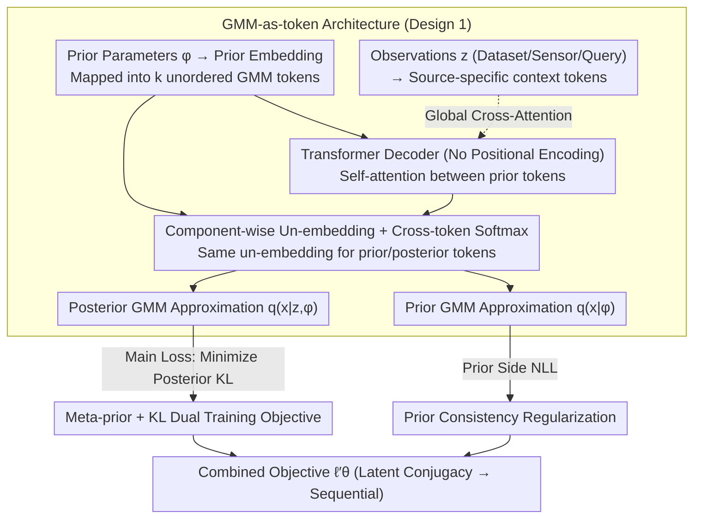

# Distribution Transformers: Fast Approximate Bayesian Inference With On-The-Fly Prior Adaptation

**Conference**: ICML 2026 Spotlight  
**arXiv**: [2502.02463](https://arxiv.org/abs/2502.02463)  
**Code**: https://github.com/GWhittle110/distribution-transformers  
**Area**: Scientific Computing / Bayesian Inference / Transformer Amortized Inference  
**Keywords**: Amortized Bayesian Inference, Prior Adaptation, Gaussian Mixture Models, Sequential Filtering, Transformer  

## TL;DR
The Distribution Transformer (DT) explicitly tokenizes the "prior distribution" into a set of Gaussian Mixture Model (GMM) components and injects "observations" into a decoder via cross-attention. It learns an end-to-end mapping from "prior + data → posterior." By maintaining conjugacy within the same family (GMM → GMM) to support sequential filtering, it compresses inference time from minutes to milliseconds and allows arbitrary prior replacement at test time without retraining.

## Background & Motivation

**Background**: Amortized Bayesian Inference (ABI) pre-trains the expensive process of "solving the posterior for every new dataset." During an offline training phase, the model learns a mapping $z \mapsto q(x|z)$, allowing for a single forward pass online. Transformer-based methods such as PFN, TabPFN, and ACE can produce posteriors in few-shot scenarios with performance approaching SVI or MCMC.

**Limitations of Prior Work**: (1) These ABI models "hard-code" the prior during training—changing the prior requires retraining or regenerating data. (2) Even for the few methods supporting "prior flexibility," the output distribution family (e.g., Riemann bucket distributions in PFN) is inconsistent with the prior family. Consequently, the **output posterior cannot be fed back as the prior for the next round**, making them unsuitable for sequential filtering in Kalman or particle filter scenarios. (3) Classical sequential methods (EKF/PF) are flexible but either rely on strong Gaussian assumptions or suffer from computational explosion as the number of particles increases, and they do not support amortized inference across tasks.

**Key Challenge**: Amortization, prior flexibility, and conjugacy (prior and posterior belonging to the same family) must be satisfied simultaneously for sequential Bayesian filtering. Previous works have failed to satisfy all three.

**Goal**: (i) Single forward pass for posterior estimation (Amortization); (ii) Arbitrary prior replacement at test time without retraining (Prior Amortization); (iii) Prior and posterior both belonging to the GMM family to allow recursive cascading for filtering; (iv) Competitive performance with PFN/TabPFN/ACE on static benchmarks, and matching particle filter performance on sequential tasks while being 10x to 1000x faster.

**Key Insight**: Utilize a "universal density approximator family" and operate on it with a Transformer. The authors select **Gaussian Mixture Models (GMMs)**—any smooth density with compact support can be approximated to arbitrary precision by a $k$-component GMM. Furthermore, the parameters $\{(w_i,\boldsymbol{\mu}_i,\boldsymbol{\Sigma}_i)\}_{i=1}^{k}$ of a GMM naturally form an "unordered token sequence," perfectly matching the permutation invariance assumption of Transformers.

**Core Idea**: Rewrite Bayesian inference as a GMM-sequence to GMM-sequence mapping, implemented by a Transformer decoder. Both priors and observations are embedded as tokens, and the output returns to the GMM family—this conjugacy is the key to sequential filtering.

## Method

### Overall Architecture
Four modules are connected: Prior Embedding → Observation Embedding → Transformer Decoder → GMM Un-embedding. Given prior parameters $\phi$, a learnable embedding network maps them to an unordered sequence of $k$ tokens (GMM representation in latent space). Given observations $z$ (datasets, sensor readings, or query points), a data-source-specific learnable embedding creates another set of context tokens. The Transformer decoder (without positional encodings to preserve permutation equivariance) performs self-attention among prior tokens and global cross-attention with observation tokens to output the posterior token sequence in latent space. Finally, a component-wise learnable un-embedding decodes each token into $(\text{logit}_i, \boldsymbol{\mu}_i, \boldsymbol{\Sigma}_i)$. A cross-token softmax yields weights $w_i$, assembling the GMM posterior $q_\theta(x|z,\phi) = \sum_i w_i \mathcal{N}(x;\boldsymbol{\mu}_i,\boldsymbol{\Sigma}_i)$. The same un-embedding is applied back to the prior tokens to obtain a GMM approximation of the prior $q_\theta(x|\phi)$, ensuring the main loss (posterior side) and prior loss (prior side) share the same decoding and lock the prior/posterior into the same latent space. Optionally, a sample-space transformation $f(\cdot)$ is introduced to modify the support (e.g., log-warp for Inverse-Gamma priors).

### Key Designs

**1. GMM-as-token Representation + Transformer Decoder: Distribution as a Token Sequence**

For sequential filtering, the prior and posterior must belong to the same distribution family, which PFN's Riemann bucket distribution cannot achieve. The authors choose GMMs: any smooth density with compact support can be approximated by a $k$-component GMM. The parameter set $\{(w_i,\boldsymbol{\mu}_i,\boldsymbol{\Sigma}_i)\}$ is naturally unordered, fitting the Transformer's permutation invariance. Prior parameters $\phi$ are embedded into $k$ tokens; observations are embedded into context tokens. The Transformer decoder (without positional encodings to match component permutation invariance) enables interaction between prior tokens and context tokens to output posterior tokens. Component-wise un-embedding then reconstructs the GMM parameters. This conjugacy means the posterior tokens from time $t$ can serve directly as prior tokens for time $t+1$.

**2. Meta-prior + KL Dual Training Objective: Amortizing over Prior Families**

Previous ABI methods fixed the prior during training. DT introduces a "distribution over priors"—a meta-prior $p(\phi)$, resulting in a joint distribution $p(\phi,x,z)=p(\phi)p(x|\phi)p(z|x)$. During training, each batch samples $\phi_i\sim p(\phi)$ before sampling $x_i,z_i$. The main loss is:

$$\ell_\theta=\mathbb{E}_{p(\phi,x,z)}[-\log q_\theta(f(x)|z,\phi)].$$

Prop 3.1 proves this is equivalent to $\mathbb{E}_{p(\phi,z)}[\mathrm{KL}(p(\cdot|z,\phi)\,\|\,q_\theta(\cdot|z,\phi))]$ plus a constant. Thus, this is not an ad-hoc likelihood hack but a direct minimization of the average posterior KL, requiring only samples from $p(\phi,x,z)$ without needing the true posterior density. Elevating the prior from a training constant to a random variable in the joint distribution allows for amortization over the mapping space $\Phi\times\mathcal{Z}\to\mathcal{Q}$.

**3. Prior Consistency Regularization: Locking Latent Space Conjugacy**

Having the same output family is insufficient—if prior tokens and posterior tokens fall into different latent regions, the "posterior as prior" recursion will fail numerically. The authors apply the un-embedding to the prior tokens to get $q_\theta(x|\phi)$ and add a regularization term $\ell_\theta^{\mathrm{prior}}=\mathbb{E}_{p(\phi,x)}[-\log q_\theta(x|\phi)]$, resulting in $\ell_\theta'=\ell_\theta^{\mathrm{prior}}+\ell_\theta$. Prior tokens decoded before the Transformer must approximate the prior, while posterior tokens decoded after the Transformer must approximate the posterior, using the exact same un-embedding. This is essential for sequential cascading.

## Key Experimental Results

### Main Results

Experiment 4.1: Analytic conjugate comparison with Inverse-Gamma prior + Normal variance likelihood, using Narrow/Wide meta-prior settings across 1000 unseen problems.

| Method | Narrow Meta-prior KL | Wide Meta-prior KL | Inference Time (1000 problems, s) |
|------|-------------|-------------|------------------------|
| SVI | 0.0425 ± 0.0003 | 0.0558 ± 0.0016 | 148 |
| PFN-15 | 0.517 ± 1.009* | 331.5 ± 646.6* | 0.003 |
| PFN-5000 | 0.0038 ± 0.0789 | 0.2935 ± 0.0237 | 0.003 |
| TabPFNv2 | 0.0112 ± 0.0013 | 0.1513 ± 0.0168 | 1.52 |
| ACE-5 | 0.0094 ± 0.0000 | 0.0048 ± 0.0014 | 0.037 |
| **DT-2** | 0.0044 ± 0.0001 | 0.0058 ± 0.0002 | 0.014 |
| **DT-5** | **0.0004 ± 0.0000** | **0.0003 ± 0.0000** | 0.016 |

DT-5 achieves nearly an order of magnitude lower posterior KL than PFN-5000 (narrow prior) and 3 orders of magnitude lower for wide priors; inference is $\sim 10^4$ faster than SVI.

Experiment 4.2.1 (5D GP Prediction Posterior + Hyper-posterior): DT outperforms PFN/TabPFNv2/ACE in both PPD NLL (0.81) and Hyper-posterior NLL (0.31), with the fastest time (9.5 s).

Experiment 4.3.1 (4D State-space Bayesian Sensor Fusion):

| Method | Expected NLL | Per-step Time (100 Seq Batch, s) |
|------|---------|---------------------------|
| EKF | 95.9 ± 4.40 | 0.010 |
| Particle Filter | -0.244 ± 0.047 | 0.818 |
| **DT-4** | **-0.197 ± 0.040** | **0.017** |

DT achieves parity with the "gold standard" PF while being $\sim 50\times$ faster per step; EKF fails completely due to linearization assumptions.

### Ablation Study

| Dimension / Method | Key Observation | Implication |
|---|---|---|
| GMM Components $k = 2$ vs $5$ (Sec 4.1) | KL drops from 0.0044 to 0.0004 | Component count is a "knob" for approximation power, decoupled from parameter count. |
| Riemann Output (PFN) vs GMM (DT/ACE) | Riemann KL hits 331 under wide meta-priors | Bucket distribution expressivity is a bottleneck for PFN. |
| With vs Without Prior Loss | Minimal static performance gain | Essential for sequential cascading and latent conjugacy. |
| Sequential Task via PFN (Concat) | Inference time grows linearly/quadratically with $T$ | DT's constant-time recursion is a key engineering advantage. |
| Exp 4.3.2 (10D Stochastic Volatility) | PF requires 3 orders of magnitude more compute to match DT | DT excels in high-dimensional sparse information scenarios. |

### Key Findings
- **Conjugacy is the Key to Sequence**: GMM $\to$ GMM conjugacy allows the previous posterior to be the next prior, decoupling inference time from sequence length $T$. PFN/ACE require concatenating observations, leading to $\mathcal{O}(T)$ or $\mathcal{O}(T^2)$ growth.
- **High Ceiling for GMM Expressivity**: Compared to Riemann bucket distributions, a 5-component GMM is almost indistinguishable from the true posterior in conjugate experiments.
- **Prior Flexibility Value Increases with Meta-prior Width**: PFN-5000 struggles when the prior differs from the training average, whereas DT remains robust.
- **Prior Loss is Functional, not just Performance**: Removing it doesn't hurt static KL much, but breaks latent conjugacy, causing catastrophic failure in sequential filtering tasks.

## Highlights & Insights
- **"Distributions as Inputs" is an Underrated Design Choice**: Traditional amortized inference treats the prior as a hyperparameter or training constant. DT tokenizes prior parameters $\phi$ as inputs, enabling "on-the-fly" adaptation, a concept transferable to Bayesian optimization or ABC.
- **Structural Symmetry ↔ Probabilistic Symmetry**: The Transformer's lack of positional encoding matches GMM component disorder, and cross-attention matches observation independence. These symmetries align the neural architecture with the probabilistic structure.
- **From Learning Posteriors to Learning Operators**: DT learns the operator "prior + data $\to$ posterior" rather than a specific posterior. This pushes amortization from the task level to the meta-prior level.
- **Stackable Real-time Bayesian Filtering**: DT enables non-Gaussian, non-linear SSMs with PF-level accuracy at millisecond throughput, offering direct value to autonomous sensing and industrial control.

## Limitations & Future Work
- **Training Cost Scales with Prior Space**: Covering a wider meta-prior space $\Phi$ increases the required offline training samples and duration.
- **Meta-prior Suitability**: Performance may degrade if the test prior is far outside the meta-prior distribution; while some proof of robustness exists, it is not exhaustive.
- **High-dimensional GMM Bottlenecks**: Component-wise attention is quadratic, and full-covariance decoding scales with the square of the latent dimension. Sparse or low-rank covariances are needed for very high dimensions.
- **Error Accumulation in Long Chains**: Long sequential recursions may lead to drift; while controllable for medium depths, extreme lengths require further validation.

## Related Work & Insights
- **vs PFN / TabPFN / TabPFNv2**: PFNs use fixed priors and Riemann bucket outputs. DT tokenizes priors, outputs GMMs, and supports sequential filtering.
- **vs ACE**: ACE supports prior flexibility and GMM outputs. DT differs with its flexible embedding design and explicit conjugacy guarantee (prior loss), enabling sequential applications.
- **vs EKF / Particle Filter**: EKF fails on non-linearities; PF suffers from the curse of dimensionality. DT fills the gap with non-linear expressivity and amortized constant throughput.
- **vs Variational Inference / Neural Processes**: VI requires per-problem optimization. NPs usually predict data space distributions rather than latent posteriors. DT provides latent posteriors with prior flexibility.

## Rating
- Novelty: ⭐⭐⭐⭐⭐ Tokenizing distributions and pursuing prior-posterior conjugacy for sequential filtering is a qualitative breakthrough in ABI.
- Experimental Thoroughness: ⭐⭐⭐⭐ Broad coverage across GP, Quantum, and SSMs; missing real-world robotics/driving end-to-end demos.
- Writing Quality: ⭐⭐⭐⭐ Clear chain from motivation to theory, though the "functional" role of prior loss is counter-intuitive and could be emphasized more.
- Value: ⭐⭐⭐⭐⭐ Achieving millisecond throughput, prior flexibility, and sequential cascading simultaneously shifts the needle for real-time Bayesian engineering.

<!-- RELATED:START -->

## Related Papers

- [\[AAAI 2026\] Fast 3D Surrogate Modeling for Data Center Thermal Management](../../AAAI2026/physics/fast_3d_surrogate_modeling_for_data_center_thermal_management.md)
- [\[NeurIPS 2025\] Quantum Doubly Stochastic Transformers](../../NeurIPS2025/physics/quantum_doubly_stochastic_transformers.md)
- [\[NeurIPS 2025\] The Primacy of Magnitude in Low-Rank Adaptation](../../NeurIPS2025/physics/the_primacy_of_magnitude_in_low-rank_adaptation.md)
- [\[NeurIPS 2025\] From Simulations to Surveys: Domain Adaptation for Galaxy Observations](../../NeurIPS2025/physics/from_simulations_to_surveys_domain_adaptation_for_galaxy_observations.md)
- [\[NeurIPS 2025\] Vision Transformers for Cosmological Fields: Application to Weak Lensing Mass Maps](../../NeurIPS2025/physics/vision_transformers_for_cosmological_fields_application_to_weak_lensing_mass_map.md)

<!-- RELATED:END -->
