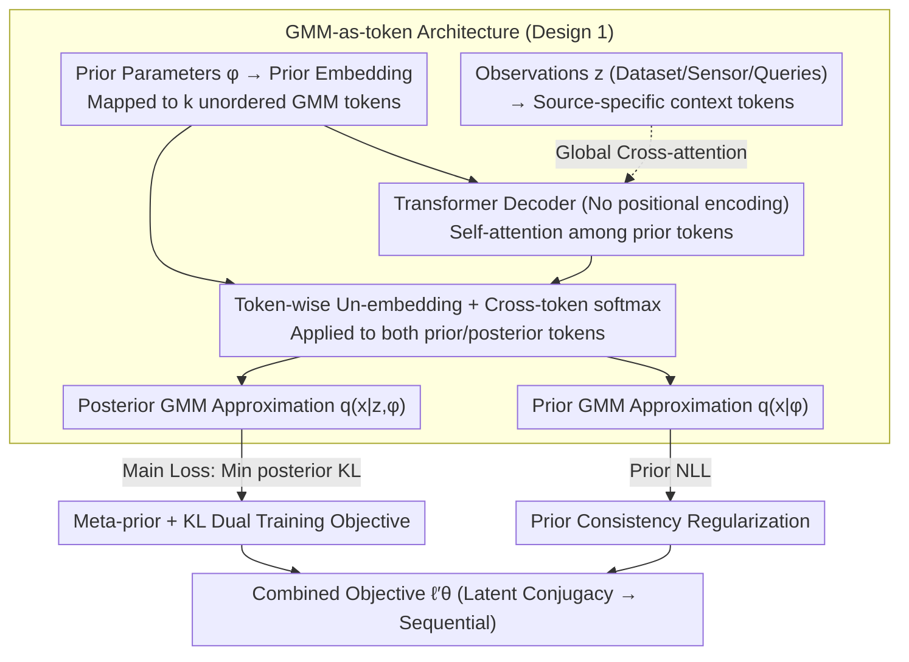

# Distribution Transformers: Fast Approximate Bayesian Inference With On-The-Fly Prior Adaptation

**Conference**: ICML 2026 Spotlight  
**arXiv**: [2502.02463](https://arxiv.org/abs/2502.02463)  
**Code**: https://github.com/GWhittle110/distribution-transformers  
**Area**: Scientific Computing / Bayesian Inference / Transformer Amortized Inference  
**Keywords**: Amortized Bayesian Inference, Prior Adaptation, Gaussian Mixture Models, Sequential Filtering, Transformer  

## TL;DR
Distribution Transformer (DT) explicitly tokenizes the "prior distribution" into a set of Gaussian Mixture Model (GMM) components and injects "observations" into the decoder via cross-attention, learning an end-to-end mapping from "prior + data → posterior." While maintaining conjugacy within the same family (GMM→GMM) to support sequential filtering, it compresses inference time from minutes to milliseconds and allows arbitrary prior replacement at test time without retraining.

## Background & Motivation

**Background**: Amortized Bayesian Inference (ABI) pre-trains the expensive process of "solving the posterior for every new dataset"—learning a mapping $z \mapsto q(x|z)$ during an offline training phase such that only a single forward pass is required online. Representative Transformer-based methods like PFN/TabPFN/ACE have demonstrated single-forward-pass posterior estimation in few-shot scenarios with performance approaching SVI/MCMC.

**Limitations of Prior Work**: (1) These ABI models "hard-wire" the prior during training—swapping the prior requires retraining or regenerating data. (2) Even for the few methods that support "prior flexibility," the output distribution family (e.g., the Riemann bucket distribution in PFN) is inconsistent with the prior family, meaning **the output posterior cannot be fed back as the next-round prior**, making sequential filtering (e.g., Kalman/Particle filtering) impossible. (3) Classical sequential methods (EKF/PF) are flexible but either rely on strong Gaussian assumptions or suffer from computational complexity that explodes with the number of particles, and they do not support amortization across tasks.

**Key Challenge**: Amortization, prior flexibility, and conjugacy (prior and posterior belonging to the same family) must be satisfied simultaneously for sequential Bayesian filtering—previous works have consistently compromised on at least one.

**Goal**: (i) Amortized posterior via a single forward pass; (ii) Arbitrary prior replacement at test time without retraining (prior amortization); (iii) Conjugacy within the GMM family for recursive filtering; (iv) Matching the performance of PFN/TabPFN/ACE on static benchmarks and reaching Particle Filter accuracy on sequential tasks while being tens to thousands of times faster.

**Key Insight**: Identify a "universal approximator distribution family" and operate on this family using a Transformer. The authors select **Gaussian Mixture Models (GMM)**—any compactly supported smooth density can be approximated to arbitrary precision by a $k$-component GMM. Furthermore, GMM parameters $\{(w_i,\boldsymbol{\mu}_i,\boldsymbol{\Sigma}_i)\}_{i=1}^{k}$ serve as natural "unordered token sequences," perfectly matching the permutation invariance assumption of Transformers.

**Core Idea**: Bayesian inference is rewritten as a mapping from a GMM-sequence to a GMM-sequence, implemented by a transformer decoder. Both the prior and observations are embedded as tokens, and the output returns to the GMM family—this conjugacy is the key to sequential filtering.

## Method

### Overall Architecture
Four modules are connected: Prior Embedding → Observation Embedding → Transformer Decoder → GMM Un-embedding. Given prior parameters $\phi$, a learnable embedding network maps them into an unordered sequence of $k$ tokens (the GMM representation in latent space). Given observations $z$ (dataset/sensor readings/query points), they are embedded into another set of tokens using a source-specific learnable encoder. The transformer decoder (without positional encodings to preserve permutation equivariance) performs self-attention among prior tokens and global cross-attention with observation tokens to output the posterior token sequence in latent space. Finally, a component-wise learnable un-embedding decodes each token into (logit, $\boldsymbol{\mu}_i$, $\boldsymbol{\Sigma}_i$), and a cross-token softmax provides weights $w_i$, assembling the GMM posterior $q_\theta(x|z,\phi) = \sum_i w_i \mathcal{N}(x;\boldsymbol{\mu}_i,\boldsymbol{\Sigma}_i)$. The same un-embedding is applied back to the prior tokens to obtain a GMM approximation of the prior $q_\theta(x|\phi)$, ensuring the main loss (posterior side) and the prior loss (prior side) share the same decoding and lock the prior and posterior into the same latent space. Optionally, a sample-space transformation $f(\cdot)$ is introduced to modify the support (e.g., log-warp for Inverse Gamma priors with positive support), allowing the GMM to expand over $\mathbb{R}^n$.

### Key Designs

**1. GMM-as-token Representation + Transformer Decoder: Treating distributions as token sequences for conjugacy**  
For sequential filtering, the prior and posterior must belong to the same family, which PFN's Riemann bucket distribution cannot achieve. The authors choose GMMs: any compactly supported smooth density can be approximated to arbitrary precision by a $k$-component GMM, and the parameter set $\{(w_i,\boldsymbol{\mu}_i,\boldsymbol{\Sigma}_i)\}$ is naturally unordered, fitting Transformer permutation invariance. Prior parameters $\phi$ are embedded into $k$ tokens; observations are embedded as context tokens. The transformer decoder (without positional encoding) enables self-attention among prior tokens and cross-attention with the context, outputting posterior tokens. These are decoded into $(\text{logit},\boldsymbol{\mu}_i,\boldsymbol{\Sigma}_i)$ to re-assemble $q_\theta(x|z,\phi)=\sum_i w_i\mathcal{N}(x;\boldsymbol{\mu}_i,\boldsymbol{\Sigma}_i)$. Identical input/output families mean the posterior tokens from step $t$ can serve directly as prior tokens for step $t+1$—the algebraic prerequisite for sequential filtering.

**2. Meta-prior + KL-form Dual Training Objective: Training on a family of priors for test-time flexibility**  
Standard ABI "hard-wires" the prior during training. DT introduces a "distribution over priors"—a meta-prior $p(\phi)$, with the joint distribution $p(\phi,x,z)=p(\phi)p(x|\phi)p(z|x)$. During training, each batch samples $\phi_i\sim p(\phi)$ followed by $x_i,z_i$. The main loss is:  
$$\ell_\theta=\mathbb{E}_{p(\phi,x,z)}[-\log q_\theta(f(x)|z,\phi)].$$  
Prop 3.1 proves this is equivalent to $\mathbb{E}_{p(\phi,z)}[\mathrm{KL}(p(\cdot|z,\phi)\,\|\,q_\theta(\cdot|z,\phi))]$ plus a constant. This is not an ad-hoc likelihood hack but a direct minimization of the average posterior KL, requiring only samples from $p(\phi,x,z)$ without needing the true posterior density. Elevating the "prior" from a training constant to a random variable in the joint distribution allows amortization over the larger mapping space $\Phi\times\mathcal{Z}\to\mathcal{Q}$, enabling test-time prior swaps by merely changing the $\phi$ token.

**3. Prior Consistency Regularization: Locking prior and posterior into the same latent space**  
Consistent families alone are insufficient—if prior and posterior tokens occupy different latent regions, recursive cascading will fail numerically. The authors apply the un-embedding to the prior token sequence to get a GMM approximation $q_\theta(x|\phi)$, adding the term $\ell_\theta^{\mathrm{prior}}=\mathbb{E}_{p(\phi,x)}[-\log q_\theta(x|\phi)]$ to form $\ell_\theta'=\ell_\theta^{\mathrm{prior}}+\ell_\theta$. This forces the prior tokens to decode into the prior GMM *before* the transformer and the posterior tokens to decode into the posterior GMM *after* the transformer using the same un-embedding. While this provides only a minor boost to static performance, it is the essential condition for sequential cascading.

## Key Experimental Results

### Main Results

Experiment 4.1: Analytic conjugate comparison (Inverse Gamma prior + Normal variance likelihood) across Narrow/Wide meta-prior settings, 1000 unseen problems.

| Method | Narrow Meta-prior KL | Wide Meta-prior KL | Inference Time for 1000 Problems (s) |
|------|-------------|-------------|------------------------|
| SVI | 0.0425 ± 0.0003 | 0.0558 ± 0.0016 | 148 |
| PFN-15 | 0.517 ± 1.009* | 331.5 ± 646.6* | 0.003 |
| PFN-5000 | 0.0038 ± 0.0789 | 0.2935 ± 0.0237 | 0.003 |
| TabPFNv2 | 0.0112 ± 0.0013 | 0.1513 ± 0.0168 | 1.52 |
| ACE-5 | 0.0094 ± 0.0000 | 0.0048 ± 0.0014 | 0.037 |
| **DT-2** | 0.0044 ± 0.0001 | 0.0058 ± 0.0002 | 0.014 |
| **DT-5** | **0.0004 ± 0.0000** | **0.0003 ± 0.0000** | 0.016 |

DT-5 achieves a posterior KL nearly an order of magnitude lower than PFN-5000 under narrow meta-priors and three orders of magnitude lower under wide meta-priors; inference takes 16 ms per 1000 problems, roughly $10^4 \times$ faster than SVI.

Experiment 4.2.1 (5D GP Predictive Posterior + Hyper-posterior): DT outperforms PFN/TabPFNv2/ACE on both PPD NLL (0.81) and Hyper-posterior NLL (0.31), with the fastest time of 9.5 s.

Experiment 4.3.1 (4D State-Space Bayesian Sensor Fusion):

| Method | Expected NLL | Per-step Time for 100 Seq Batch (s) |
|------|---------|---------------------------|
| EKF | 95.9 ± 4.40 | 0.010 |
| Particle Filter | -0.244 ± 0.047 | 0.818 |
| **DT-4** | **-0.197 ± 0.040** | **0.017** |

DT nearly matches the "quasi-ground truth" PF while being ~50× faster per step; EKF fails completely due to linearization assumptions.

### Ablation Study

| Dimension / Method | Key Observation | Implication |
|---|---|---|
| GMM Components $k = 2$ vs $5$ (Sec 4.1) | KL drops from 0.0044 to 0.0004 | Component count acts as a "toggling knob" for approximation capacity, decoupled from parameter count. |
| Riemann Output (PFN) vs GMM (DT/ACE) | Riemann KL spikes to 331 under wide meta-priors | The limited expressivity of bucket distributions is a bottleneck for PFN. |
| w/ vs w/o Prior Loss | Minor performance gain, but **essential for sequential cascading** | Latent space conjugacy is the algebraic prerequisite for sequential capabilities. |
| PFN for sequential (Concatenated obs) | Inference time grows linearly or $\mathcal{O}(T^2)$ with $T$ | DT's constant-time recursion is a critical engineering advantage. |
| Exp 4.3.2 (10D Stochastic Volatility) | PF requires 3 orders of magnitude more compute to match DT | DT excels in high-dimensional sparse information scenarios. |

### Key Findings
- **Conjugacy is the key to sequential capability**: GMM→GMM conjugacy means previous posteriors can serve as current priors, decoupling per-step inference time from sequence length $T$. In contrast, methods like PFN/TabPFN/ACE scale linearly or quadratically with $T$ even if observations are concatenated.
- **GMM expressivity has a high ceiling**: Compared to Riemann bucket distributions, a 5-component GMM is nearly indistinguishable from the true posterior in conjugate experiments. This is why DT/ACE significantly outperform PFN/TabPFNv2.
- **Wider meta-priors increase the value of flexibility**: Under narrow meta-priors, PFN-5000 is functional as the marginal distribution stays close to the prior; under wide meta-priors, PFN fails while DT remains stable.
- **Prior loss utility is functional rather than performance-driven**: Removing it barely affects static KL, but latent conjugacy is lost, causing sequential filtering in Sec 4.3 to fail immediately.

## Highlights & Insights
- **"Distributions as inputs" is an undervalued design degree of freedom**: Traditional ABI treats priors as hyperparameters or training constants. By explicitly tokenizing prior parameters $\phi$ as Transformer tokens, the architecture naturally supports "prior swapping"—a concept transferable to any probabilistic task requiring test-time prior adjustment (BO, ABC, sensor fusion).
- **Architectural Symmetry $\leftrightarrow$ Probabilistic Symmetry**: The Transformer sans positional encoding $\leftrightarrow$ unordered GMM components, and cross-attention $\leftrightarrow$ conditional independence of observations. The architecture is isomorphic to the invariance structure of Bayesian graphical models—a design paradigm worth promoting in scientific machine learning.
- **From "Learning Posteriors" to "Learning Operators"**: DT learns the operator "prior + data → posterior" rather than a specific posterior. This pushes "amortization" from a single layer (across tasks) to a second layer (across tasks + across prior families), significantly elevating the level of abstraction.
- **Stackable Real-time Bayesian Filtering**: Running non-Gaussian, non-linear SSMs with PF-level accuracy at millisecond throughput has direct engineering value for autonomous driving perception, real-time quantum parameter tracking, and industrial control.

## Limitations & Future Work
- **Training cost scales with prior space dimension**: Covering a wider $\Phi$ requires significantly more offline training samples and time (Appendix Table 8).
- **Meta-prior must be "reasonably" specified**: Performance degrades if priors encountered at deployment fall entirely outside the meta-prior; Appendix C.2 provides some robustness evidence, but it is not exhaustive.
- **High-dimensional GMM as a bottleneck**: Self-attention on components is quadratic, and full-covariance decoding within components is quadratic to the latent dimension. Suitable for $<10$D; dozens of dimensions would require sparse/low-rank covariances.
- **Error accumulation in long sequential chains**: Approximations at each step can lead to a slow drift in errors over long chains; verified as controllable for medium depths (Appendix C.5), but not strictly validated for extremely long sequences.
- **Empirical hyperparameter selection**: Component count $k$, embedding dimensions, and attention heads are manually tuned; a systematic automated selection strategy is missing.

## Related Work & Insights
- **vs PFN / TabPFN / TabPFNv2 (Müller 2021, Hollmann 2022/2025)**: PFN series use fixed priors and Riemann bucket outputs. DT tokenizes the prior, outputs GMMs, and enables sequential filtering, representing a qualitative advancement.
- **vs ACE (Chang 2024)**: ACE supports prior flexibility and GMM outputs, making it the closest competitor. DT's key differences lie in more flexible embedding designs and explicit conjugacy guarantees (prior loss), which enable sequential applications.
- **vs Classical Kalman / Particle Filters (Kalman 1960; Doucet 2001)**: EKF assumes linear Gaussians and fails on non-linear observations; PF is asymptotically exact but suffers from the curse of dimensionality. DT addresses both—non-linear expressivity + constant throughput via amortization.
- **vs Variational Inference / Neural Processes (Kingma & Welling 2013; Garnelo 2018)**: Classical VI requires re-optimization per problem; NPs amortize but typically predict data space distributions rather than latent variable posteriors. DT achieves amortization + latent posterior output + prior flexibility.
- **vs Simulation-Based Inference (Cranmer 2020; Wildberger 2023)**: SBI is expressive but usually assumes fixed priors and lacks sequential recursion; DT offers a path for "flexible prior + conjugacy + amortization."

## Rating
- Novelty: ⭐⭐⭐⭐⭐ Tokenizing the distribution and explicitly pursuing prior-posterior conjugacy for sequential filtering is a qualitative breakthrough in amortized Bayesian inference.
- Experimental Thoroughness: ⭐⭐⭐⭐ Broad coverage including analytic conjugates, GP hyper-posteriors, quantum parameters, sensor fusion, and stochastic volatility; lacks end-to-end demos on real robotics/autonomous driving.
- Writing Quality: ⭐⭐⭐⭐ Clear chain from motivation to architecture to training and theory; however, the "non-performance but necessary" role of the prior loss is slightly counter-intuitive and could be further elaborated.
- Value: ⭐⭐⭐⭐⭐ Simultaneously achieving millisecond throughput, arbitrary prior swapping, and sequential cascading is a tangible advancement for real-time industrial Bayesian applications.

<!-- RELATED:START -->

## Related Papers

- [\[ICML 2026\] Interpretable Equivariant Marks for Contrastive Cosmological Inference](interpretable_neural_marked_statistics_for_cosmological_inference.md)
- [\[ICML 2026\] Foundation Inference Models for Ordinary Differential Equations](foundation_inference_models_for_ordinary_differential_equations.md)
- [\[NeurIPS 2025\] The Primacy of Magnitude in Low-Rank Adaptation](../../NeurIPS2025/physics/the_primacy_of_magnitude_in_low-rank_adaptation.md)
- [\[AAAI 2026\] Fast 3D Surrogate Modeling for Data Center Thermal Management](../../AAAI2026/physics/fast_3d_surrogate_modeling_for_data_center_thermal_management.md)
- [\[NeurIPS 2025\] Quantum Doubly Stochastic Transformers](../../NeurIPS2025/physics/quantum_doubly_stochastic_transformers.md)

<!-- RELATED:END -->
