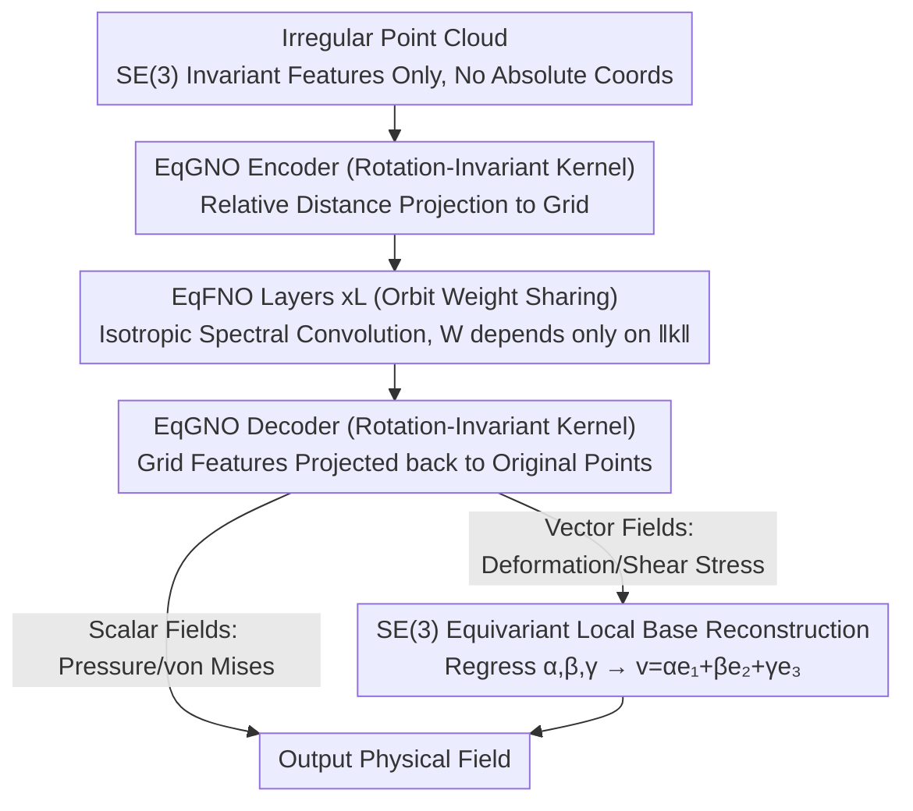

# EqGINO: Equivariant Geometry-Informed Fourier Neural Operators for 3D PDEs

**Conference**: ICML 2026  
**arXiv**: [2606.03260](https://arxiv.org/abs/2606.03260)  
**Code**: The paper mentions it is "available at this URL," but no specific repository is provided.  
**Area**: Scientific Computing / Neural Operators / Equivariant Networks / 3D PDE  
**Keywords**: Fourier Neural Operator, SE(3) Equivariance, Spectral Convolution, Orbit-based Weight Sharing, 3D PDE Surrogate  

## TL;DR
EqGINO transforms GINO's GNO encoder, FNO backbone, and GNO decoder into SE(3) equivariant modules: GNO adopts relative distances as rotation-invariant kernels, and FNO utilizes "orbit-based weight sharing" to enforce isotropy ($W(R\mathbf k)=W(\mathbf k)$) in the frequency domain. This maintains the global receptive field of FNO while ensuring robustness to arbitrary rigid transformations in 3D PDE surrogates and reducing spectral weight complexity from $\mathcal O(K^3)$ to $\mathcal O(K)$.

## Background & Motivation
**Background**: 3D PDE surrogate models (e.g., automotive aerodynamics, structural stress analysis, turbulence simulation) primarily follow two paths: point cloud/mesh-based GNNs (PointNet++, MeshGraphNet, Transolver, GINO) and spectral-based FNO variants. GINO (Li et al., 2023) is a recognized strong baseline as it uses GNO to project irregular point clouds onto regular grids for spectral convolutions via FNO, balancing irregular geometry handling with a global receptive field.

**Limitations of Prior Work**: Physical laws are inherently invariant under coordinate transformations (e.g., Navier–Stokes equations maintain their form under rotation/translation). However, existing SOTA models mostly rely on absolute Cartesian coordinates as input features. This causes models to overfit to the "canonical orientation" seen during training; performance collapses when test samples are rotated by 90°, 180°, or arbitrary angles (Paper Table 1b: GINO's ShapeNetCar pressure RMSE jumps from 0.166 to 0.563; DeepJEB deformation leaps from 0.111 to 2.319).

**Key Challenge**: Achieving both equivariance and a global receptive field simultaneously is difficult. Existing equivariant GNNs (EGNN, EMNN, T-EMNN) ensure SE(3) equivariance through local message passing, but their local receptive fields fail to capture the long-range interactions essential for PDEs. FNO naturally possesses a global receptive field in the frequency domain, but 3D spectral group convolutions (such as 2D extensions of G-FNO) are computationally too expensive for practical use.

**Goal**: (i) Develop a lightweight mechanism to enforce SE(3) equivariance in the 3D frequency domain; (ii) Integrate it seamlessly with a GNO encoder for irregular geometries to create an end-to-end equivariant GINO upgrade; (iii) Handle both scalar fields (e.g., von Mises stress) and vector fields (e.g., deformation $\mathbf u\in\mathbb R^3$).

**Key Insight**: The authors observe that the Fourier transform satisfies $\widehat{\mathcal T_R f}(\mathbf k)=\hat f(R^{-1}\mathbf k)$, meaning spatial rotation corresponds to a synchronized rotation of Fourier modes in the frequency domain (Lemma 4.1). FNO breaks equivariance only because its learnable spectral weights $W(\mathbf k)$ are independent for each $\mathbf k$. By enforcing $W(R\mathbf k)=W(\mathbf k)$, equivariance is restored.

**Core Idea**: Forcing spectral weights to be shared along "equal-norm orbits"—where all frequency modes satisfying $\|\mathbf k\|_2\approx r$ share a single weight $w_r$. This ensures rotation equivariance while slashing parameter complexity from $\mathcal O(K^3)$ to $\mathcal O(K)$.

## Method
EqGINO follows the three-stage architecture of GINO—an EqGNO encoder lifts point clouds to a regular grid; multiple EqFNO layers perform equivariant global convolutions in the frequency domain; and an EqGNO decoder projects grid features back to point clouds for physical quantity prediction—with every stage redesigned for SE(3) equivariance.

### Overall Architecture
- **Input**: Irregular point cloud $\mathcal P=\{y_j\}$ (e.g., CFD mesh or car surface); each point carries sparse physical features but **no** absolute coordinates.
- **EqGNO Encoder** $\mathcal E$: For each grid point $x^{grid}$, a Riemann sum is computed within a local ball of radius $r$: $v_0(x^{grid})\approx\sum_j\kappa(x^{grid},y_j)\mu_j$, where the kernel $\kappa$ only takes relative distances as input.
- **EqFNO Layer $\mathcal K_l$**: $L$ layers of equivariant spectral convolutions: $\mathcal K_l(v_{l-1})=\sigma(S_l v_{l-1}+\mathcal F^{-1}[W(\mathbf k)\cdot\mathcal F v_{l-1}])$, with weights $W$ forced to be isotropic.
- **EqGNO Decoder** $\mathcal D$: For each target point $y^{out}$, kernel integration is performed over neighboring grid points to project the physical quantity $u(y^{out})$.
- **Pipeline**: $G_\theta=\mathcal D\circ \mathcal K_L\circ\cdots\circ\mathcal K_1\circ\mathcal E$.
- **Output**: Physical fields on original points (scalars like pressure/von Mises stress; vectors like wall shear stress/deformation).

### Key Designs

**1. EqGNO Encoder/Decoder with Rotation-Invariant Kernels: Forcing the Network to See Only SE(3) Invariants**

The original GNO feeds absolute coordinates $(x,y)$ into a kernel MLP. If the input is rotated, these values change, causing the model to overfit to the training orientation. EqGNO solves this by using only scalar distances: the encoder kernel $\kappa(x^{grid},y_j)=\phi_\theta(\|x^{grid}-y_j\|,\|x^{grid}-\bar y\|)$, where the second term is the distance to the point cloud center $\bar y$ to inject global radial context. The decoder symmetrically uses $\|y^{out}-x^{grid}_j\|$ and $\|y^{out}-\overline{x^{grid}}\|$. Since these are SE(3) invariant scalars, the kernel values remain identical under any rotation/translation. The simplest implementation of equivariance is only showing the network invariants—but removing coordinates entirely loses global positioning. Thus, "distance to center" acts as a weak positional encoding that preserves equivariance without making all points look identical.

**2. EqFNO: Isotropic Spectral Convolution via Orbit Weight Sharing**

FNO breaks equivariance because the learnable weights $W(\mathbf k)$ are independent for each $\mathbf k$. Given that Fourier transforms satisfy $\widehat{\mathcal T_R f}(\mathbf k)=\hat f(R^{-1}\mathbf k)$, equivariance is restored if $W(R\mathbf k)=W(\mathbf k)$. The authors prove that the necessary and sufficient condition for spectral convolution equivariance in scalar fields is that $W$ depends only on $\|\mathbf k\|_2$. Based on this, they group all frequency modes where $\|\mathbf k\|_2\approx r$ into an orbit $\mathcal O_r$ sharing a single weight $w_r$, reducing spectral parameters from $\mathcal O(K^3)$ to $\mathcal O(K)$ per layer. Two engineering fixes are included: enforcing Full-FFT instead of RFFT (as RFFT's Hermitian symmetry requires "anti-linear" operations under rotation, breaking complex linearity) and adding block-diagonal channel grouping ($G$ groups) to reduce mixing costs to $d_{out}d_{in}N/G$. Specifically, $G=2$ cancels the doubled FLOPs of Full-FFT, while $G>2$ allows those savings to be reinvested into higher spectral resolution $K$.

**3. Vector Field Prediction using SE(3) Equivariant Local Bases: Reducing Vector Tasks to Scalar Tasks**

The orbit-sharing framework is inherently "scalar-friendly," yet targets like deformation $\mathbf{u}$ or shear stress $\boldsymbol{\tau}$ are 3D vectors. Directly outputting three components violates equivariance (rotating input should rotate output, which independent scalar regression cannot guarantee). The geometric re-parameterization involves constructing SE(3) equivariant local bases $\{\mathbf{e}_1, \mathbf{e}_2, \mathbf{e}_3\}$, regressing three projection coefficients $(\alpha, \beta, \gamma)$, and reconstructing the vector via $\mathbf{v}=\alpha\mathbf{e}_1+\beta\mathbf{e}_2+\gamma\mathbf{e}_3$. Since the coefficients are SE(3) invariant scalars, they can be output directly by EqFNO, while the reconstructed vector rotates along with the bases. This reduces vector tasks to scalar tasks, allowing all existing equivariant modules to be reused.

### Loss & Training
The task is regression (Relative $L_2$ error). Two EqGINO configurations are used: EqGINO* ($G=2, K=32$, matching GINO's computational budget) and EqGINO ($G=4, K=40$, same parameters but higher spectral resolution).

## Key Experimental Results

### Main Results: In-Distribution + Zero-shot Discrete Rotation Generalization (Octahedral Group $O$)
3 datasets / 8 physical quantities; relative $L_2$ error (lower is better); "Canonical→Discrete" measures testing on rotations of 90° multiples not seen during training.

| Dataset / Quantity | GINO (Canon.) | Transolver (Canon.) | **EqGINO (Canon.)** | GINO (Rot.) | Transolver (Rot.) | **EqGINO (Rot.)** |
|---|---|---|---|---|---|---|
| AhmedBody / Wall Shear | 0.199 | 0.129 | **0.196** | 0.624 | 0.795 | **0.196** |
| AhmedBody / Pressure | 0.167 | 0.276 | **0.164** | 0.563 | 0.519 | **0.164** |
| ShapeNetCar / Pressure | 0.161 | 0.119 | **0.177** | 1.495 | 1.663 | **0.177** |
| DeepJEB / Deflection | 0.111 | 0.162 | **0.171** | 2.319 | 4.506 (PtNet) | **0.171** |
| DeepJEB / von Mises Stress | 0.403 | 0.374 | **0.385** | 1.127 | 1.042 | **0.385** |

Key Observation: Non-equivariant baselines see errors magnified by 3-20x on rotated test sets, whereas EqGINO's performance remains identical—achieving zero-loss generalization through "by design" equivariance.

### Ablation Study: Continuous Rotation Generalization (Training with continuous $SE(3)$ augmentation)

| Model | AhmedBody Press ↓ | ShapeNetCar Press ↓ | DeepJEB Deflection ↓ | DeepJEB Stress ↓ |
|------|-------------------|---------------------|-----------------------|------------------|
| GINO (Non-Eq) | 0.211 | 0.181 | 0.158 | 0.420 |
| Transolver (Non-Eq) | 0.422 | 0.335 | 0.217 | 0.366 |
| EGNN (Eq GNN) | 0.818 | 0.654 | 0.838 | 0.592 |
| T-EMNN (Eq GNN) | 0.620 | 0.180 | 0.305 | 0.424 |
| Transolver* (No coords) | 0.642 | 0.927 | 0.401 | 0.512 |
| **EqGINO** | **0.185** | **0.156** | **0.162** | **0.367** |

### Key Findings
- "Equivariant by design" far outperforms "Non-equivariant SOTA + Augmentation." Even with continuous rotation augmentation, GINO/Transolver maintain error levels around 0.21/0.42 for AhmedBody Pressure, while EqGINO hits 0.185 without needing any augmentation during training.
- Local message-passing GNNs (EGNN/T-EMNN) still lag behind EqGINO in continuous rotation tasks, confirming that "a global receptive field is a hard requirement for PDEs." Grafting equivariance onto spectral methods is the superior approach.
- Transolver* (the variant without coordinates) degrades significantly, showing that Transformer-based operator learning still relies heavily on coordinate-based features. EqGINO maintains expressivity through weak positional encoding ("distance to center").
- Orbit sharing reduces 3D spectral weights from $\mathcal O(K^3)$ to $\mathcal O(K)$. Combined with block-diagonal grouping, costs match GINO while performance improves, suggesting this structural prior is both efficient and provides a strong inductive bias.

## Highlights & Insights
- **"The minimum cost for equivariance is isotropy"**: The authors simplify SO(3) equivariance constraints to $W(\mathbf k)$ depending only on $\|\mathbf k\|$, bypassing expensive 3D spectral group convolutions. This suggests that complex group convolutions can often be replaced by isotropy in the dual domain at minimal cost.
- **Full-FFT + Channel Grouping balance**: Since RFFT breaks complex linearity under rotation, the authors use Full-FFT and recoup the computational budget via channel blocking. This "correctness first, efficiency second" approach is highly instructive.
- **Vector Field = Scalar Coefficients + Equivariant Bases**: This re-parameterization strategy is highly general and can be migrated to any scenario where a scalar equivariant backbone needs to predict vector outputs.

## Limitations & Future Work
- Strict equivariance is only guaranteed for the Octahedral group $O$ (90° rotations on grids); continuous $SE(3)$ is approximated. While this generalizes well through structural priors, it is not "accurate by design" for all rotations.
- The datasets focus on steady-state predictions (external flow, structural static loads); time-series rollout has not been directly validated.
- Orbit discretization (thresholding $\|\mathbf k\|_2\approx r$) depends on grid resolution $K$. Coarse orbit granularity at low resolutions may limit expressivity.
- Local base construction is manually designed per dataset, lacking a unified geometric principle for automatic adaptation to new tasks.

## Related Work & Insights
- **vs GINO**: Same backbone, but EqGINO makes every module equivariant. Performance is near-identical on canonical tests but superior by orders of magnitude on rotated tests.
- **vs G-FNO (Helwig 2023)**: G-FNO achieves 2D equivariance via spectral group convolutions but scales poorly to 3D. EqGINO makes 3D equivariant FNOs practical through orbit weight sharing.
- **vs EGNN / EMNN**: Those rely on local message passing; EqGINO provides a global field through spectral methods.
- **vs Transolver**: Transolver is strong but coordinate-dependent. Without coordinates, performance collapses, suggesting Transformer routes need better positional encoding for equivariance.
- **vs EGNO (Xu 2024)**: EGNO focuses on temporal equivariance (trajectory prediction); EqGINO focuses on spatial SE(3) equivariance. They are complementary.

<!-- RELATED:START -->

## Related Papers

- [\[ICML 2026\] Generative Neural Operators Through Diffusion Last Layer](generative_neural_operators_through_diffusion_last_layer.md)
- [\[AAAI 2026\] Phys-Liquid: A Physics-Informed Dataset for Estimating 3D Geometry and Volume of Transparent Deformable Liquids](../../AAAI2026/physics/phys-liquid_a_physics-informed_dataset_for_estimating_3d_geometry_and_volume_of_.md)
- [\[NeurIPS 2025\] Physics-Informed Neural Networks with Fourier Features and Attention-Driven Decoding](../../NeurIPS2025/physics/physics-informed_neural_networks_with_fourier_features_and_attention-driven_deco.md)
- [\[ICML 2025\] Maximal Update Parametrization and Zero-Shot Hyperparameter Transfer for Fourier Neural Operators](../../ICML2025/physics/maximal_update_parametrization_and_zero-shot_hyperparameter_transfer_for_fourier.md)
- [\[ICML 2026\] Topology-Preserving Neural Operator Learning via Hodge Decomposition](topology-preserving_neural_operator_learning_via_hodge_decomposition.md)

<!-- RELATED:END -->
