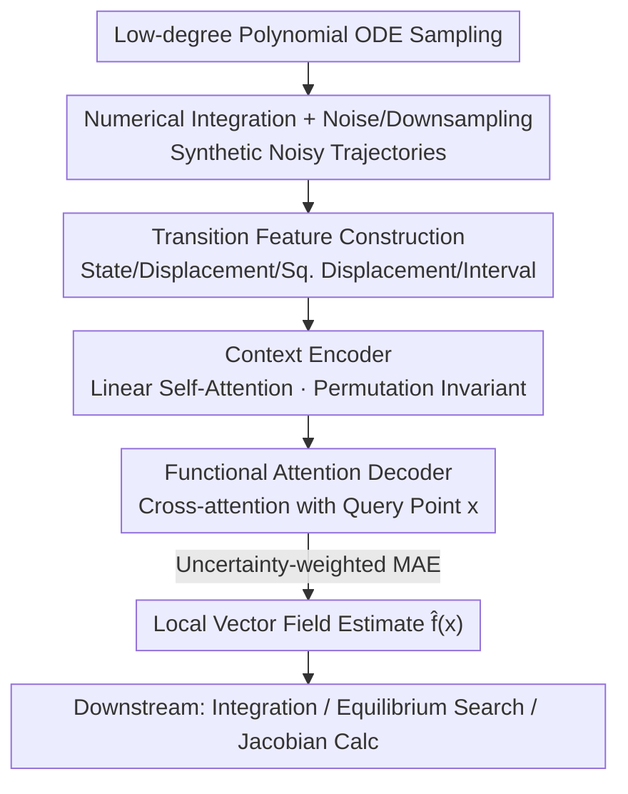

# Foundation Inference Models for Ordinary Differential Equations

**Conference**: ICML2026  
**arXiv**: [2602.08733](https://arxiv.org/abs/2602.08733)  
**Code**: https://fim4science.github.io/OpenFIM/intro.html  
**Area**: Scientific Machine Learning / Dynamical Systems  
**Keywords**: ODE Inference, Foundation Inference Models, Neural Operators, Zero-shot, Vector Fields

## TL;DR
FIM-ODE amortizes the process of "inferring ordinary differential equation vector fields from noisy trajectories" into pre-training. Using an 8M-parameter Transformer neural operator pre-trained solely on low-degree polynomial ODE priors, it performs zero-shot vector field prediction in a single forward pass. It matches or exceeds the symbolic regression baseline ODEFormer on ODEBench with approximately 1/10 the parameters and 1/80 the training data.

## Background & Motivation
**Background**: Ordinary Differential Equations (ODEs) are the universal language for scientific modeling, describing everything from Lorenz chaos to ecological oscillations. However, the inverse problem—"inferring the underlying vector field $\mathbf{f}$ from noisy, sparse trajectory observations"—remains challenging. Mainstream approaches fall into three categories: symbolic regression (e.g., SINDy), Gaussian Process (GP) regression, and Neural ODEs.

**Limitations of Prior Work**: These three approaches follow the classical "one model per dataset" paradigm. Symbolic regression requires estimating time derivatives, making it dependent on clean, densely sampled trajectories and pre-defined basis function libraries. GP regression performance is heavily influenced by the choice of prior kernels. Neural ODEs require backpropagation through numerical solvers or slow adjoint methods, making training expensive and unstable. All share the cost of complex training pipelines and significant ML tuning expertise.

**Key Challenge**: Can the inference cost be shifted from "optimizing every time a new dataset arrives" to "one-time pre-training"? This is the philosophy of amortised inference. ODEFormer took the first step but was pre-trained on a complex prior composed of polynomials, trigonometric, and rational functions (approx. 50 million systems) using an 86M-parameter model, aiming to recover the **global symbolic expression** of the vector field.

**Key Insight**: The authors propose two counter-intuitive bets. First, "simple rules can generate complex patterns"—pre-training on a minimalist prior of **low-degree polynomials** might suffice to generalize to real-world systems. Second, since the vector field is only constrained by data in regions where trajectories pass, representing the vector field **locally** with a neural operator may be more accurate in data-dense regions than pursuing a global symbolic form.

**Core Idea**: Replace "complex priors + global symbolic expressions" with "low-degree polynomial priors + local neural operator representations." This transforms ODE inversion into a single-forward-pass zero-shot inference while retaining the ability to query interpretability features like equilibrium points, Jacobians, and stability.

## Method

### Overall Architecture
FIM-ODE follows the Foundation Inference Model (FIM) framework, consisting of two parts: a **pre-training prior** (determining what types of dynamical systems the model sees) and a **neural inference model** (mapping noisy observations back to the vector field). During pre-training, a vector field $\mathbf{f}$ is sampled from the polynomial prior, trajectories are numerically integrated, and noise/random downsampling are added to simulate real observations. The inference model learns a mapping $\mathbf{\hat{f}}_\theta:\mathbb{R}^d\times\mathcal{C}\to\mathbb{R}^d$. Given a context dataset $\mathcal{D}$ ($K$ noisy trajectories) and any query point $\mathbf{x}$, it directly outputs the estimated vector field at that point. The pipeline is as follows:

### Key Designs

**1. Low-degree Polynomial Pre-training Prior: Covering Complex Dynamics with Minimalist Rules**

While ODEFormer bets on "complex priors for wider coverage," FIM-ODE does the opposite. Each component $f_i:\mathbb{R}^d\to\mathbb{R}$ is sampled as a **sparse multivariate polynomial with a total degree not exceeding 3**. Coefficients are sampled independently from $\mathcal{N}(0,1)$, and random masking of degrees and monomials introduces sparsity and structural diversity ($d\in\{1,2,3\}$). This is based on three considerations: many classic ODEs (Lorenz, biological oscillators) are low-degree polynomial systems; polynomials can generate rich behaviors like fixed points, limit cycles, and chaos; and polynomials are locally Lipschitz, ensuring uniqueness and existence via Picard–Lindelöf. The authors also provide a GP perspective: each $f_i$ with a fixed mask is a finite-dimensional GP, and marginalizing over masks yields a mixture of GPs where variance grows with $\|\mathbf{x}\|$ (non-stationary), explaining why divergent trajectories are discarded. For synthesis: 200 points are sampled in $[0,10]$ ($\Delta t=0.05$), integrated using Euler's method with 20 steps per interval. Systems with magnitudes exceeding $10^2$ are discarded. Multiplicative Gaussian noise $y_i=(1+\epsilon)x_i,\ \epsilon\sim\mathcal{N}(0,\sigma^2),\ \sigma\in[0,0.06]$ and Bernoulli downsampling with probability $\rho\in[0,0.5]$ are applied.

**2. Transition Feature Input: Embedding "Finite Difference as Vector Field" into Representation**

Feeding raw trajectories loses local dynamical information. FIM-ODE constructs a transition tuple for each pair of adjacent observations $(\mathbf{y}_i,\mathbf{y}_{i+1})$, extracting four quantities: current state $\mathbf{y}_i$, displacement $\Delta\mathbf{y}_i=\mathbf{y}_{i+1}-\mathbf{y}_i$, element-wise squared displacement $\Delta\mathbf{y}_i^2$, and interval $\Delta\tau_i$. The motivation comes directly from the ODE structure: the ratio $\Delta\mathbf{y}_i/\Delta\tau_i$ is a finite difference estimate of the vector field at $\mathbf{y}_i$, while the squared displacement provides second-moment information. $K$ trajectories yield $J=\sum_{k=1}^K(L_k-1)$ transition tuples, forming a set independent of trajectory order, naturally suited for permutation-invariant encoding. Combined with "input normalization"—zero-mean unit variance for states and centering $\Delta\tau$—the model remains invariant to the spatiotemporal scales of different ODEs.

**3. Neural Operator Encoder-Decoder: Local Vector Field Estimation at Arbitrary Query Points**

The model is an attention-based neural operator with an encoder-decoder structure. The encoder projects the four feature components to $n/4$ dimensions and concatenates them into $\mathbf{d}_i\in\mathbb{R}^n$, passing through two layers of **linear self-attention** to obtain a permutation-invariant context representation $\mathbf{C}=\Psi_{enc}(\mathbf{D},\mathbf{D},\mathbf{D})$. The decoder is "functional": for a query position $\mathbf{x}$, it is embedded via linear mapping $\phi_\mathbf{x}(\mathbf{x})$ as an initial query, passing through $M$ cross-attention blocks to pull information from $\mathbf{C}$. Finally, an MLP predicts $\mathbf{\hat{f}}_\theta(\mathbf{x}\mid\tilde{\mathcal{D}})\in\mathbb{R}^d$. Crucially, the decoder can be evaluated at **any point** in the state space, not just observed states—this is the vehicle for "local vector field representation." While the architecture is derived from FIM-SDE, ODEs have poorer identifiability: SDE noise provides full support allowing trajectories to explore space, whereas ODE trajectories only constrain the vector field along their paths. Thus, the "shape" of the polynomial prior is particularly critical here.

**4. Uncertainty Weighted Loss: Preventing High-Velocity Regions from Dominating**

Training uses a hybrid sampling strategy for $\mathbf{x}$: half are sampled uniformly within the observation bounds, and half along the ground-truth ODE trajectory. The base loss is the MAE between predicted and ground-truth vector fields. A problem arises because vector field magnitudes vary drastically in state space: $\|\mathbf{f}(\mathbf{x})\|$ might be near 0 at the origin but very large elsewhere. Without correction, optimization biases toward high-magnitude regions. The authors introduce heteroscedastic uncertainty weighting: an auxiliary head predicts $U_\theta(\mathbf{x},\tilde{\mathcal{D}})$ (interpreted as log-variance), and the objective becomes:

$$\mathcal{L}_\theta=\mathbb{E}_{(\mathbf{x},\tilde{\mathcal{D}},\mathbf{f})}\Big[e^{-U_\theta(\mathbf{x},\tilde{\mathcal{D}})}\,\|\mathbf{\hat{f}}_\theta(\mathbf{x}\mid\tilde{\mathcal{D}})-\mathbf{f}(\mathbf{x})\|+U_\theta(\mathbf{x},\tilde{\mathcal{D}})\Big],$$

corresponding to a Laplace likelihood with heteroscedastic scaling. The first term down-weights difficult regions, and the second prevents $U_\theta$ from diverging to infinity.

## Key Experimental Results

### Main Results
A single 13M parameter model was pre-trained (8M for FIM-ODE, 5M for the uncertainty head) on 600,000 polynomial ODE systems. Zero-shot performance was compared against ODEFormer on ODEBench (61 autonomous systems, approx. 1/3 of which are non-polynomial/OOD for FIM-ODE).

**Trajectory Reconstruction** (Metric: % of systems with variance-weighted $R^2 > 0.9$):

| Method | $\rho{=}0,\sigma{=}0$ | $\rho{=}0,\sigma{=}0.05$ | $\rho{=}0.5,\sigma{=}0$ | $\rho{=}0.5,\sigma{=}0.05$ |
|------|------|------|------|------|
| ODEFormer (86M) | 63.1% | 61.5% | 63.9% | 61.5% |
| **FIM-ODE (8M)** | **84.4%** | **75.4%** | **82.8%** | **72.1%** |

FIM-ODE consistently outperformed ODEFormer across all noise/downsampling configurations, despite being ~10x smaller in parameters and ~80x smaller in pre-training data (0.6M vs 50M systems). In trajectory **generalization** (starting from new initial conditions), both were comparable (e.g., at $\rho{=}0,\sigma{=}0.03$: FIM-ODE 32.8% vs ODEFormer 27.9%), with FIM-ODE showing a more significant lead under relaxed thresholds.

### Qualitative System Identification
The authors performed qualitative dynamics analysis on three systems by minimizing $\|\mathbf{\hat{f}}_\theta\|$ to find candidate equilibrium points and calculating Jacobians:

| System | Type | FIM-ODE Performance | ODEFormer Performance |
|------|------|------|------|
| Pendulum (ODE 28) | OOD (contains sin) | Failure: Origin biased to unstable spiral, breaking conservation. | Maintained structure, recovered Center+Saddle. |
| CDIMA Reaction (ODE 42) | OOD (rational) | Strong: Correctly identified unstable spiral near $(1.78, 4.17)$. | Symbolic points found but stability flipped (erroneous stable spiral). |
| Lotka-Volterra (ODE 26) | ID (polynomial) | Partial: Good fit, approximated saddle and stable node. | Boundary structures partially recovered; full coexistence geometry missed. |

### Key Findings
- **Local vs. Global Trade-off**: FIM-ODE only needs to approximate the vector field in regions constrained by data. Thus, even if the global form is OOD (rational/trigonometric), local estimation still transfers. ODEFormer’s global symbolic commitment can impose incorrect structures in data-sparse regions (e.g., flipping stability in CDIMA).
- **Minimalist Priors Work**: FIM-ODE's advantage was not solely driven by ID systems in ODEBench, validating the bet that low-degree polynomial priors can generalize to OOD systems.
- **Low-data OOD is a Weakness**: On extremely short/sparse contexts (VDP, FHN oscillators), both models are weaker zero-shot than classical per-dataset methods, showing high sensitivity to noise realizations. "Large context" settings significantly mitigate this.

## Highlights & Insights
- **"Simple Prior + Local Representation" is a true counter-consensus bet**: While the industry assumes "more complex priors for better coverage" and "symbolic forms for interpretability," this paper uses an 8M model and a minimalist prior to outperform the larger baseline—the "less is more" conclusion is highly informative.
- **Interpretability without Symbolic Expressions**: Usually, symbolic forms are deemed necessary for equilibrium/Jacobian analysis. This work proves neural operator vector fields can be queried similarly and can even be more accurate for qualitative features like stability.
- **Transition Features for Inductive Bias**: Encoding $\Delta\mathbf{y}/\Delta\tau$ as a feature directly embeds the finite-difference vector field estimate, a technique transferable to any amortised inference task involving trajectories.
- **Uncertainty Weighting for Scale Imbalance**: The heteroscedastic Laplace likelihood prevents low-velocity regions from being drowned out by high-velocity regions, providing a general trick for regression where targets vary across magnitudes.

## Limitations & Future Work
- **Dimensionality Limits**: While the architecture is dimension-agnostic, the current data pipeline is limited to $d\le 3$.
- **Undeterminacy is Fundamental**: ODE trajectories only constrain the vector field along their paths. The failure on the frictionless pendulum highlights the cost of local estimation in under-constrained regions.
- **Unreliable Zero-shot in Low-data**: Zero-shot performance is highly sensitive to noise in sparse contexts. Fine-tuning or more context trajectories are required for stability.
- **Non-stationary Prior Side-effects**: Polynomial prior variance grows with $\|\mathbf{x}\|$, requiring the pruning of divergent trajectories to stabilize training.

## Related Work & Insights
- **vs ODEFormer**: Both are amortised ODE inverters. ODEFormer uses complex priors (50M systems) and an 86M model for global symbolic expressions. FIM-ODE uses minimalist polynomial priors (0.6M systems) and an 8M model for local neural operators. FIM-ODE is more efficient and accurate in reconstruction but less stable in low-data zero-shot settings.
- **vs SINDy / Symbolic Regression**: Symbolic regression relies on time-derivative estimation and clean sampling; FIM-ODE shifts the prior into pre-training for single-forward-pass results without per-dataset optimization.
- **vs Neural ODE / GP-ODE**: Neural ODEs are expensive/unstable to train; GP methods depend on kernel choices. FIM-ODE is zero-shot and serves as a better initialization for stable fine-tuning.

## Rating
- Novelty: ⭐⭐⭐⭐⭐ "Minimalist prior + local neural operator" is a dual counter-consensus bet.
- Experimental Thoroughness: ⭐⭐⭐⭐ Solid ODEBench comparisons and qualitative analysis, though high-dim scenarios are missing.
- Writing Quality: ⭐⭐⭐⭐⭐ Clear motivation, deep analysis of trade-offs, and honest about failures.
- Value: ⭐⭐⭐⭐ Provides a robust, efficient paradigm for the "Foundation Inference Model" route in SciML.

<!-- RELATED:START -->

## Related Papers

- [\[AAAI 2026\] Towards a Foundation Model for Partial Differential Equations Across Physics Domains](../../AAAI2026/physics/towards_a_foundation_model_for_partial_differential_equations_across_physics_dom.md)
- [\[ICML 2025\] Finetuning Stellar Spectra Foundation Models with LoRA](../../ICML2025/physics/finetuning_stellar_spectra_foundation_models_with_lora.md)
- [\[ICML 2025\] Closed-form Symbolic Solutions: A New Perspective on Solving Partial Differential Equations](../../ICML2025/physics/closed-form_solutions_a_new_perspective_on_solving_differential_equations.md)
- [\[ICML 2026\] Interpretable Equivariant Marks for Contrastive Cosmological Inference](interpretable_neural_marked_statistics_for_cosmological_inference.md)
- [\[NeurIPS 2025\] The Platonic Universe: Do Foundation Models See the Same Sky?](../../NeurIPS2025/physics/the_platonic_universe_do_foundation_models_see_the_same_sky.md)

<!-- RELATED:END -->
