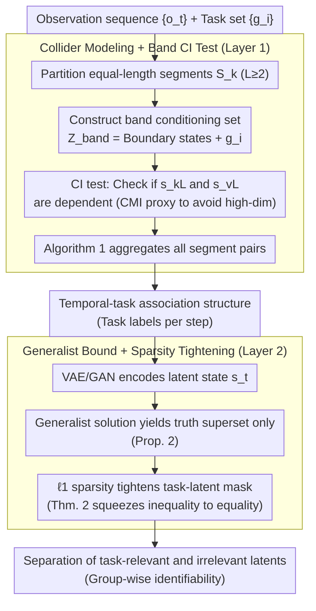

# From Generalist to Specialist Representation

**Conference**: ICML 2026  
**arXiv**: [2605.12733](https://arxiv.org/abs/2605.12733)  
**Code**: None  
**Area**: Representation Learning Theory / Causal Identifiability  
**Keywords**: identifiability, task-relevant representation, nonparametric, sparsity, world model

## TL;DR
This paper provides the first fully nonparametric (no intervention, no functional constraints) proof for two-layer hierarchical identifiability: the temporal-task structure is identifiable via CI tests from a collider perspective, and task-relevant latents can be disentangled from generalist representations through sparsity regularization.

## Background & Motivation

**Background**: Learning latents from high-dimensional observations is central to world models. However, without identifiability guarantees, latent representations may be "observationally equivalent but misaligned" with the ground truth (arbitrary permutations $\hat s = \phi(s)$). Classical linear ICA relies on non-Gaussianity, nonlinear ICA depends on auxiliary variables or functional constraints, and causal representation learning requires intervention/counterfactuals—each path requires specific "additional ingredients."

**Limitations of Prior Work**: (1) Most identifiability results pursue the complete recovery of all latents, whereas downstream tasks often only require a subset; (2) existing task-relevant work (content-style separation, subspace factorization) only supports fixed structures, lacking flexibility in the number of tasks or composition methods; (3) theoretical progress is particularly difficult under i.i.d. settings where temporal signals cannot be utilized.

**Key Challenge**: Achieving a balance between being "fully general" (nonparametric + arbitrary task structure + allowing disconnected sequences) and "provably identifiable" is nearly impossible. The root of the problem is that assuming component-wise recovery of all latents is too strong, whereas identifying only task-relevant subgroups is sufficient and allows for significantly relaxed conditions.

**Goal**: To prove under the most general nonparametric settings that (1) the association structure between time steps and tasks is identifiable; (2) the task-relevant latents within each time step are identifiable.

**Key Insight**: Tasks are modeled as colliders across different time steps ($s_t \to a_t \to g_i$). A confounder or mediator perspective would lead to incorrect conditional independence, whereas only the collider perspective correctly encodes the "multi-step mutual dependence within the same task." On a collider DAG, conditional independence (CI) tests combined with sparsity regularization are sufficient to close the loop.

**Core Idea**: By treating tasks as colliders, a band conditioning set is used for CI tests to recover the temporal-task graph. Then, $\ell_1$ regularization is employed to tighten the oversized generalist representation into the minimal task-relevant subset. This entire theory requires neither interventions nor functional constraints.

## Method

### Overall Architecture
A two-layer hierarchical pipeline: The first layer (Section 3) starts from observation sequences $\{o_t\}$ and a task set $\{g_i\}$, using Algorithm 1 to recover the global temporal-task association structure via CI tests on segment pairs. The second layer (Section 4) uses a VAE with sparsity regularization within each time step to disentangle the subset of the latent state $s_t$ that is truly relevant to each task. The interface between these layers is "task labels per step." The third key design is not a new stage but a "theory-to-practice bridge" spanning both layers—using CMI as a proxy for CI tests in the observation space and VAE/GAN for latent estimation, transforming asymptotic nonparametric proofs into executable standard estimators.

### Key Designs

**1. Collider Modeling + Band CI Test: Treating "tasks" as colliders to recognize task structures in interleaved sequences.**

The pain point of the first layer is that in real-world sequences, tasks are interleaved, repeated, and disconnected; one cannot assume neat partitions like "first 10 steps are Task A, next 10 are Task B." This work partitions the sequence into equal-length segments $S_k$ of length $L \ge 2$, and constructs a band conditioning set around the representative state of each segment: $Z_{\text{band}}(k,v,i) = \{s_{kL-1}, s_{kL+1}, s_{vL-1}, s_{vL+1}\} \cup \{g_i\}$. Theorem 1 proves that under Markov + Faithfulness assumptions, task $g_i$ is related to both $S_k$ and $S_v$ if and only if $s_{kL}$ and $s_{vL}$ are dependent conditioned on $Z_{\text{band}}$. Thus, a set of CI tests can extract "which time steps belong to the same task." Corollary 1 further shows that representative states can be freely substituted. This proof holds specifically by modeling the task as a collider ($s_t \to a_t \to g_i$): conditioning on boundary states blocks temporal channels, while other tasks as closed colliders are automatically blocked, leaving only the $g_i$ dependency path exposed. This explains why confounder or mediator perspectives fail—they would lead to the counter-intuitive conclusion of "conditional independence between two steps of the same task," whereas the collider preserves the true semantics of "mutual dependence across multiple steps within a coordinated plan."

**2. Generalist Bound + Sparsity Tightening: Proving "large models alone are insufficient" then "adding one $\ell_1$ term is just enough."**

The second layer addresses whether task-relevant latents can be separated from generalist representations. The paper pinches the answer in two steps. Proposition 2 proves under sufficient nonlinearity that $\|\mathcal{I}((J_{\hat u})_{i,\cdot})\| \ge \|\mathcal{I}((J_u)_{i,\cdot})\|$, meaning a generalist model pursuing only reconstruction can at best guarantee that the estimated task-relevant latents are a **superset** of the truth—it will mix in irrelevant dimensions. Theorem 2 then introduces a sparsity constraint $\|\mathcal{I}(J_{\hat u})\| \le \|\mathcal{I}(J_u)\|$ to turn this inequality into an equality. Through column permutation $\pi$, it concludes $\hat s_{t, \pi(I_k)} = h_k(s_{t, I_K})$ (each task subgroup corresponds to an invertible function), achieving disentanglement of task-relevant and irrelevant latents. This two-stage logic is rigorous: it elevates sparsity from a heuristic trick to a theoretical necessity, yielding group-wise identifiability even in i.i.d. settings without functional constraints.

**3. Bridge from Theory to Practice: Implementing asymptotic proofs as standard estimators for real video and images.**

Identifiability is an asymptotic property. To make it applicable, the paper provides practical proxies for each theoretical step: CI tests are performed directly in the observation space using conditional mutual information (CMI) to avoid high-dimensional statistical issues; when tasks are unknown, task representations are learned as additional latents; latent estimation uses a standard VAE with $\ell_1$ regularization; for image generation, a GAN is used with task-specific masks to manipulate latents. This combination of "CMI proxy + standard VAE/GAN" allows any ML researcher to reproduce the work without building specialized tools.

### Loss & Training
No new losses are introduced. For the task structure discovery stage, Fisher's z-test (linear Gaussian) or CMI (deep models) is used for CI testing with a threshold of $p=0.05$. For the representation learning stage, a standard VAE reconstruction loss is used with $\ell_1$ regularization $\lambda \|M\|_1$ on the task-latent mask. CMI is estimated using MINE.

## Key Experimental Results

### Main Results (Synthetic + Real)
Synthetic data generated via collider DAG with 10k samples and 10 random runs.

| Setting | Metric | CCA | Group Lasso | SelTask | **Ours** |
|------|------|-----|-------------|---------|---------|
| $T \in [8,20], M=T/5$ | Accuracy | Low | Med | Good | **Highest** |
| $T=20, M \in [2,10]$ | MCC | Low | Med | Good | **Highest** |

SportsHHI Video (Multi-person, multi-task interleaving, mAP):

| Method | mAP |
|------|-----|
| Alg.1 on observed $o$ | Low |
| LEAP | Med |
| **Ours (CI on latent $s$)** | **Highest** |

### Ablation Study
Task-relevant identifiability (Synthetic nonlinear MLP data, $R^2$):

| Configuration | $R^2$ relevant ↑ | $R^2$ irrelevant ↓ | Description |
|------|------------------|---------------------|------|
| VAE without $\ell_1$ | High | High | Information kept but entangled |
| VAE + $\ell_1$ on task-latent mask | **High** | **Low** | Both kept and separated |

Flux Cat images + GAN (Tasks: "wear glasses / hat / tie"):

| Configuration | Visual Results |
|------|---------|
| with sparsity | Editing only affects target attributes |
| without sparsity | Irrelevant factors (e.g., color) are entangled/changed |

### Key Findings
- $\ell_1$ regularization is the "minimal sufficient gain" to convert a generalist to a specialist: removing it lead to immediate entanglement; adding it achieves disentanglement.
- The performance degradation slope as the number of tasks $M$ increases is significantly flatter than baselines, demonstrating the advantage of the collider + band CI approach in complex structures.
- On real videos, the gap is largest when "performing CI on latents rather than observations," validating the intuition that identifiability requires a correct latent space first.

## Highlights & Insights
- "Task as a collider" is a non-trivial modeling choice—using it to derive CI conditions to encode the precise semantics of "same-task dependency" is the starting point for the entire theory.
- Presenting the "generalist insufficiency $\to$ sparsity tightening" argument in two stages elevates the necessity of sparsity from an empirical hack to a theoretical requirement.
- No interventions, no functional classes, and allowed i.i.d. settings—releasing these three constraints simultaneously while maintaining identifiability is a rare "broadening" achievement in this field.

## Limitations & Future Work
- Identifiability is an asymptotic property; the paper does not analyze finite-sample errors, offering no guarantees for data-scarce scenarios.
- Sparsity uses an $\ell_1$ convex proxy; there is a gap between this and true $\ell_0$. The theoretical assumption of reaching minimal support requires careful tuning in practice.
- The latent space depends on VAE reconstruction being sufficiently information-preserving; the theoretical assumption of "sufficient nonlinearity" is difficult to verify directly on real data.
- The authors mention "Identifiability-inspired architecture" as future work; currently, it is a standard estimator + regularization, one step away from architectural innovation.

## Related Work & Insights
- **vs Nonlinear ICA (Hyvärinen et al.)**: They rely on temporal contrastive learning or auxiliary variables; ours allows disconnected sequences and i.i.d. settings.
- **vs Causal Representation Learning (von Kügelgen et al.)**: They require interventions; ours is fully observational.
- **vs Subspace Factorization (content-style)**: Their structures are fixed; ours allows for unknown task counts, structures, and assignments.
- **vs SelTask / LEAP**: These are the strongest empirical baselines, but they guarantee only latent identifiability, not structural; ours provides both.

## Rating
- Novelty: ⭐⭐⭐⭐⭐ First fully nonparametric task-relevant identifiability proof; high originality in collider perspective.
- Experimental Thoroughness: ⭐⭐⭐ Primarily a theoretical paper; experiments serve as validation rather than exhaustive comparison; real data scale is limited.
- Writing Quality: ⭐⭐⭐⭐ Clear two-layer framework with rigorous layout of theorems, corollaries, and lemmas.
- Value: ⭐⭐⭐⭐ Provides a formal foundation for "generalist $\to$ specialist fine-tuning" and serves as a theoretical backbone for future work.

<!-- RELATED:START -->

## Related Papers

- [\[CVPR 2025\] Improve Representation for Imbalanced Regression through Geometric Constraints](../../CVPR2025/physics/improve_representation_for_imbalanced_regression_through_geometric_constraints.md)
- [\[NeurIPS 2025\] Latent Representation Learning in Heavy-Ion Collisions with MaskPoint Transformer](../../NeurIPS2025/physics/latent_representation_learning_in_heavy-ion_collisions_with_maskpoint_transforme.md)
- [\[NeurIPS 2025\] POLARIS: A High-contrast Polarimetric Imaging Benchmark Dataset for Exoplanetary Disk Representation Learning](../../NeurIPS2025/physics/polaris_a_high-contrast_polarimetric_imaging_benchmark_dataset_for_exoplanetary_.md)
- [\[ICML 2026\] EqGINO: Equivariant Geometry-Informed Fourier Neural Operators for 3D PDEs](eqgino_equivariant_geometry-informed_fourier_neural_operators_for_3d_pdes.md)
- [\[ICML 2026\] Softplus Attention with Re-weighting Boosts Length Extrapolation in Large Language Models](softplus_attention_with_re-weighting_boosts_length_extrapolation_in_large_langua.md)

<!-- RELATED:END -->
